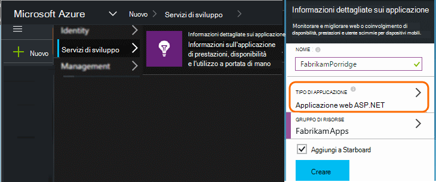
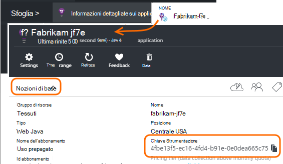

<properties 
    pageTitle="Separare le risorse applicazione approfondimenti per sviluppo, test e produzione" 
    description="Monitorare le prestazioni e l'uso dell'applicazione nelle varie fasi di sviluppo" 
    services="application-insights" 
    documentationCenter=""
    authors="alancameronwills" 
    manager="douge"/>

<tags 
    ms.service="application-insights" 
    ms.workload="tbd" 
    ms.tgt_pltfrm="ibiza" 
    ms.devlang="na" 
    ms.topic="article" 
    ms.date="05/04/2016" 
    ms.author="awills"/>

# Separare le risorse applicazione approfondimenti

Telemetria da diversi componenti e versioni precedenti delle applicazioni da inviato a diverse risorse applicazione approfondimenti o combinato? In questo articolo vengono illustrate le procedure consigliate e le procedure necessarie.

Prima di tutto, si comprendere la domanda. I dati ricevuti dall'applicazione in uso sono archiviati ed elaborati dal approfondimenti applicazione una *risorsa*di Microsoft Azure. Ogni risorsa è identificato da un *tasto strumentazione* (iKey). Nell'app, la chiave viene fornita a SDK approfondimenti applicazione in modo che è possibile inviare i dati che raccolti per la risorsa appropriata. Il tasto può essere fornito nel codice o in ApplicationInsights.config. Se si modifica la chiave in SDK, è possibile comunicare dati a diverse risorse. 

In un caso semplice, quando si crea il codice per una nuova applicazione, è inoltre creare una nuova risorsa approfondimenti applicazione. In Visual Studio, la finestra di dialogo *Nuovo progetto* responsabile dell'utente.

Se si tratta di un sito Web di volumi elevati, potrebbe essere distribuito in più istanze di server.

In scenari più complessi, si dispone di un sistema è costituito da più componenti - ad esempio un sito web e un processore back-end. 

## Quando utilizzare iKeys separata

Ecco alcune linee guida generali:

* Nel punto in cui si dispone di un'unità di applicazione in modo indipendente da distribuire che viene eseguita su un set di server istanze che possono essere ridimensionate crescenti/decrescenti indipendente altri componenti, quindi in genere mappare che a una singola risorsa, vale a dire avrà una chiave singola strumentazione (iKey).
* Se invece motivi per utilizzare iKeys separata includono:
 - Leggere facilmente metriche separate da componenti separati.
 - Separare telemetria volume inferiore di volumi elevati, in modo che la limitazione, le quote, campioni in un flusso non influenzata dalle e l'altro.
 - Avvisi separati, esportazione e le configurazioni di elementi di lavoro.
 - Allontanare [limiti](app-insights-pricing.md#limits-summary) come quota di telemetria limitazione e web test conteggio.
 - Codice in fase di sviluppo e test per l'invio di un iKey separata rispetto l'indicatore di produzione.  

Molte esperienze portale applicazione approfondimenti sono progettate con queste linee guida presente. Ad esempio, il server consente di visualizzare segmenti nell'istanza di server, effettuare sul presupposto che telemetria su un componente logico può provenire da diverse istanze di server.

## IKey singola

Nel punto in cui si invia telemetria da più componenti a un singolo iKey:

* Aggiungere una proprietà a tutti di telemetria che consente di segmento e filtro sull'identità del componente. L'ID di ruolo viene aggiunto automaticamente telemetria da istanze del ruolo di server, ma in altri casi che è possibile utilizzare un [inizializzatore di telemetria](app-insights-api-filtering-sampling.md#add-properties) per aggiungere la proprietà.
* Aggiornare gli SDK approfondimenti applicazione in diversi componenti nello stesso momento. Telemetria per uno iKey deve avere origine con la stessa versione di SDK.

## IKeys separata

Nel punto in cui si dispone di più iKeys per componenti diversi dell'applicazione:

* Creare un [dashboard](app-insights-dashboards.md) per una visualizzazione di telemetria chiave dall'applicazione logico, combinato da componenti diversi dell'applicazione. Dashboard possono essere condiviso, in modo che una visualizzazione unica sistema logico può essere usata dal team diversi.
* Organizzare [i gruppi di risorse](app-insights-resources-roles-access-control.md) al livello del team. Le autorizzazioni di accesso vengono assegnate dal gruppo di risorse e sono incluse le autorizzazioni per impostare gli avvisi. 
* Utilizzare [i modelli di gestione risorse di Azure e Powershell](app-insights-powershell.md) per gestire gli elementi, ad esempio le regole di avviso e test web.

## IKeys separata per sviluppo/Test e di produzione

Per rendere più semplice modificare la chiave automaticamente quando si rilascia l'app, impostare il iKey nel codice, anziché in ApplicationInsights.config.

### Chiave strumentazione dinamico

Impostare la chiave in un metodo di inizializzazione, ad esempio global.aspx.cs in un servizio ASP.NET:

*C#*

    protected void Application_Start()
    {
      Microsoft.ApplicationInsights.Extensibility.
        TelemetryConfiguration.Active.InstrumentationKey = 
          // - for example -
          WebConfigurationManager.AppSettings["ikey"];
      ...

In questo esempio vengono inseriti ikeys per le risorse diverse nelle diverse versioni di file di configurazione web. Scambio di file di configurazione web, che è possibile eseguire come parte dello script di rilascio - verrà sostituire la risorsa di destinazione.

### Pagine Web

Il iKey viene usato anche in [script ottenuto dal e introduttive](app-insights-javascript.md)pagine web dell'applicazione. Anziché la codifica in forma letterale nello script generato automaticamente lo stato del server. Ad esempio, in un'app ASP.NET:

*JavaScript in Razor*

    <script type="text/javascript">
    // Standard Application Insights web page script:
    var appInsights = window.appInsights || function(config){ ...
    // Modify this part:
    }({instrumentationKey:  
      // Generate from server property:
      "@Microsoft.ApplicationInsights.Extensibility.
         TelemetryConfiguration.Active.InstrumentationKey"
    }) // ...

## Creazione di una risorsa applicazione approfondimenti aggiuntiva
  
Se si decide di separare telemetria per componenti diversi dell'applicazione o per diversi indicatori (dev/test/produzione) dello stesso componente, sarà necessario creare una nuova risorsa approfondimenti applicazione.

In [portal.azure.com](https://portal.azure.com), aggiungere una risorsa approfondimenti applicazione:

* **Tipo di applicazione** viene applicata a visualizzare e il panoramica e le proprietà disponibili in [Esplora metrica](app-insights-metrics-explorer.md). Se il tipo di app non è visibile, scegliere uno dei tipi di web per le pagine web.
* **Gruppo di risorse** è utile per la gestione delle proprietà, ad esempio [il controllo di accesso](app-insights-resources-roles-access-control.md). È possibile utilizzare i gruppi di risorse separati per lo sviluppo, test e produzione.
* **Sottoscrizione** è un account di pagamento in Azure.
* Deve **trovarsi** nel punto in cui è mantenere i dati. Attualmente non può essere modificato. 
* **Aggiungi a dashboard** inserisce un riquadro di accesso rapido per la risorsa nella pagina Home Azure. 

La creazione della risorsa richiede alcuni secondi. Al termine, verrà visualizzato un avviso.

(È possibile scrivere uno [script di PowerShell](app-insights-powershell-script-create-resource.md) per creare una risorsa in modo automatico).

## Ottenere la chiave Strumentazione

Il tasto strumentazione identifica la risorsa che è stato creato. 

È necessario i tasti di strumentazione di tutte le risorse a cui l'app invierà dati.

 
