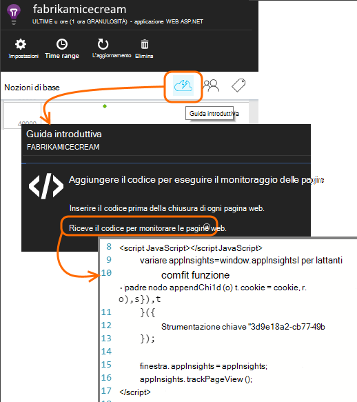
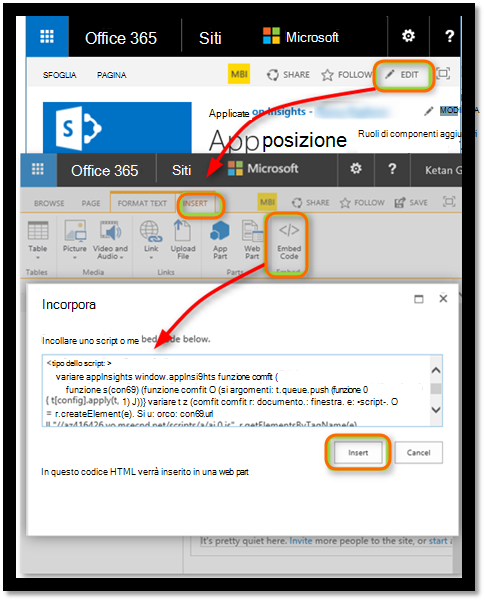

<properties 
    pageTitle="Monitor di un sito di SharePoint con informazioni dettagliate sui applicazione" 
    description="Avviare il monitoraggio di una nuova applicazione con una nuova chiave Strumentazione" 
    services="application-insights" 
    documentationCenter=""
    authors="alancameronwills" 
    manager="douge"/>

<tags 
    ms.service="application-insights" 
    ms.workload="tbd" 
    ms.tgt_pltfrm="ibiza" 
    ms.devlang="na" 
    ms.topic="article" 
    ms.date="03/24/2016" 
    ms.author="awills"/>

# <a name="monitor-a-sharepoint-site-with-application-insights"></a>Monitor di un sito di SharePoint con informazioni dettagliate sui applicazione


Visual Studio applicazione approfondimenti controlla la disponibilità, prestazioni e l'uso delle applicazioni. Di seguito verrà come impostare per un sito di SharePoint.


## <a name="create-an-application-insights-resource"></a>Creazione di una risorsa applicazione approfondimenti


Nel [portale di Azure](https://portal.azure.com), creare una nuova risorsa approfondimenti applicazione. Scegliere ASP.NET come tipo di applicazione.


E il che consente di aprire è il luogo in cui verrà visualizzato dati sulle prestazioni e l'uso sull'app. Per tornare al successivo che accesso a Azure, disponibili un riquadro per renderla nella schermata start. In alternativa, fare clic su Sfoglia per individuarlo.
    


## <a name="add-our-script-to-your-web-pages"></a>Aggiungere lo script nelle pagine web

In Guida introduttiva visualizzato lo script per le pagine web:



Inserire lo script immediatamente prima di &lt;/sede&gt; tag di ogni pagina che si desidera tenere traccia. Se il sito Web disponga di una pagina master, è possibile inserire lo script non esiste. Ad esempio, in un progetto MVC ASP.NET, inserire il in View\Shared\_Layout.cshtml

Lo script contiene la chiave strumentazione che indirizza telemetria per la risorsa approfondimenti applicazione.

### <a name="add-the-code-to-your-site-pages"></a>Aggiungere il codice in pagine del sito

#### <a name="on-the-master-page"></a>Nella pagina master

Se è possibile modificare una pagina master del sito, che fornisce il monitoraggio per ogni pagina del sito.

Visitare la pagina master e modificarlo utilizzando SharePoint Designer o un altro editor.


Aggiungere il codice appena prima di </head> tag. 


#### <a name="or-on-individual-pages"></a>O in singole pagine

Per controllare un numero limitato di pagine, aggiungere lo script separatamente per ogni pagina. 

Inserire una web part e il frammento di codice di incorporamento al suo interno.





## <a name="view-data-about-your-app"></a>Visualizzare i dati sull'app

Ridistribuire l'app.

Tornare al blade applicazione nel [portale di Azure](https://portal.azure.com).

I primi eventi verranno visualizzati nella ricerca. 


Se si aspetta altri dati, fare clic su Aggiorna dopo alcuni secondi.

Fare clic su **analitica l'uso** per visualizzare i grafici di utenti, sessioni e visualizzazioni di pagina e il Panoramica:


Fare clic su uno di essi per vedere altri dettagli, ad esempio le visualizzazioni di pagina:


O più utenti:


## <a name="capturing-user-id"></a>Acquisizione di Id utente


Il frammento di codice di pagina web standard non acquisisce l'id utente di SharePoint, ma è possibile farlo con una piccola modifica.


1. Copiare Essentials menu a discesa applicazione approfondimenti chiave strumentazione dell'applicazione. 


    

2. Sostituire la chiave strumentazione "XXXX" nel frammento riportato di seguito. 
3. Incorporare lo script nell'app SharePoint anziché il frammento di codice che viene visualizzato dal portale.


```


<SharePoint:ScriptLink ID="ScriptLink1" name="SP.js" runat="server" localizable="false" loadafterui="true" /> 
<SharePoint:ScriptLink ID="ScriptLink2" name="SP.UserProfiles.js" runat="server" localizable="false" loadafterui="true" /> 
  
<script type="text/javascript"> 
var personProperties; 
  
// Ensure that the SP.UserProfiles.js file is loaded before the custom code runs. 
SP.SOD.executeOrDelayUntilScriptLoaded(getUserProperties, 'SP.UserProfiles.js'); 
  
function getUserProperties() { 
    // Get the current client context and PeopleManager instance. 
    var clientContext = new SP.ClientContext.get_current(); 
    var peopleManager = new SP.UserProfiles.PeopleManager(clientContext); 
     
    // Get user properties for the target user. 
    // To get the PersonProperties object for the current user, use the 
    // getMyProperties method. 
    
    personProperties = peopleManager.getMyProperties(); 
  
    // Load the PersonProperties object and send the request. 
    clientContext.load(personProperties); 
    clientContext.executeQueryAsync(onRequestSuccess, onRequestFail); 
} 
     
// This function runs if the executeQueryAsync call succeeds. 
function onRequestSuccess() { 
var appInsights=window.appInsights||function(config){
function s(config){t[config]=function(){var i=arguments;t.queue.push(function(){t[config].apply(t,i)})}}var t={config:config},r=document,f=window,e="script",o=r.createElement(e),i,u;for(o.src=config.url||"//az416426.vo.msecnd.net/scripts/a/ai.0.js",r.getElementsByTagName(e)[0].parentNode.appendChild(o),t.cookie=r.cookie,t.queue=[],i=["Event","Exception","Metric","PageView","Trace"];i.length;)s("track"+i.pop());return config.disableExceptionTracking||(i="onerror",s("_"+i),u=f[i],f[i]=function(config,r,f,e,o){var s=u&&u(config,r,f,e,o);return s!==!0&&t["_"+i](config,r,f,e,o),s}),t
    }({
        instrumentationKey:"XXXX"
    });
    window.appInsights=appInsights;
    appInsights.trackPageView(document.title,window.location.href, {User: personProperties.get_displayName()});
} 
  
// This function runs if the executeQueryAsync call fails. 
function onRequestFail(sender, args) { 
} 
</script> 


```


## <a name="next-steps"></a>Passaggi successivi

* [Test web](app-insights-monitor-web-app-availability.md) per controllare la disponibilità del sito.

* [Applicazione approfondimenti](app-insights-overview.md) per altri tipi di app.


<!--Link references-->


 