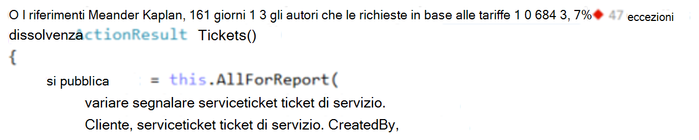
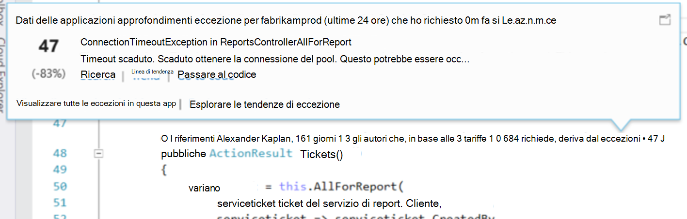
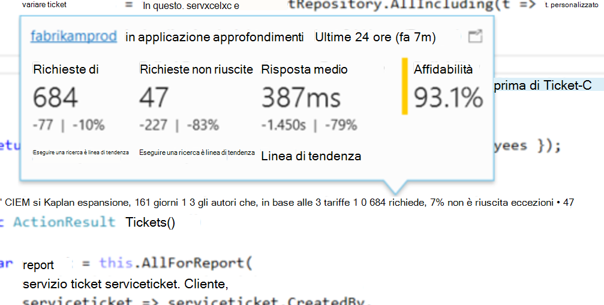
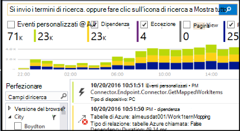

<properties 
    pageTitle="Telemetria approfondimenti applicazione in Visual Studio CodeLens | Microsoft Azure" 
    description="Consente di accedere rapidamente al telemetria approfondimenti applicazione richiesta e l'eccezione con CodeLens in Visual Studio." 
    services="application-insights" 
    documentationCenter=".net"
    authors="numberbycolors" 
    manager="douge"/>

<tags 
    ms.service="application-insights" 
    ms.workload="tbd" 
    ms.tgt_pltfrm="ibiza" 
    ms.devlang="na" 
    ms.topic="get-started-article" 
    ms.date="08/30/2016" 
    ms.author="daviste"/>
    
# Telemetria approfondimenti applicazione in Visual Studio CodeLens

Metodi nel codice dell'applicazione web possono essere dotati di telemetria relative alle eccezioni in fase di esecuzione e richiedere i tempi di risposta. Se si installa [Visual Studio applicazione approfondimenti](app-insights-overview.md) nell'applicazione, di telemetria viene visualizzata in Visual Studio [CodeLens](https://msdn.microsoft.com/library/dn269218.aspx) - le note nella parte superiore di ogni funzione nel punto in cui stesse informazioni utili ad esempio il numero di cifre la funzione viene fatto riferimento o l'ultima persona che ha modificato.

> [AZURE.NOTE] Applicazione approfondimenti in CodeLens è disponibile in Visual Studio 2015 aggiornamento 3 e versioni successive o con l'ultima versione di [estensione degli strumenti di sviluppo Analitica](https://visualstudiogallery.msdn.microsoft.com/82367b81-3f97-4de1-bbf1-eaf52ddc635a). CodeLens è disponibile nelle edizioni Enterprise e Professional di Visual Studio.

## Dove trovare applicazione informazioni dettagliate sui dati

Cercare telemetria applicazione approfondimenti negli indicatori di CodeLens dei metodi richiesta pubblico dell'applicazione web. Indicatori di CodeLens sono mostrati sopra metodo e le altre dichiarazioni nel codice c# e Visual Basic. Se sono disponibili per un metodo di applicazione informazioni dettagliate sui dati, si noterà indicatori per le richieste e le eccezioni, ad esempio "100 richiede, non è riuscita 1%" o "10 eccezioni". Fare clic su un indicatore di CodeLens per altri dettagli. 

> [AZURE.TIP] Richiedere l'applicazione approfondimenti e indicatori eccezione potrebbero essere necessari alcuni secondi aggiuntivi per caricare una volta visualizzati altri indicatori CodeLens.

## Eccezioni in CodeLens

L'indicatore di CodeLens eccezione Mostra il numero di eccezioni che si sono verificati nelle ultime 24 ore da 15 più di frequente che si verificano eccezioni nell'applicazione durante il periodo di durante l'elaborazione della richiesta per il metodo.

Per visualizzare altri dettagli, fare clic sull'indicatore di CodeLens eccezioni:

* La percentuale di modifica numero di eccezioni da ultime 24 ore rispetto precedente 24 ore
* Scegliere **Vai al codice** per passare al codice sorgente per la funzione le eccezioni
* Scegliere **ricerca** eseguire query su tutte le istanze di questa eccezione si sono verificati nelle ultime 24 ore
* Scegliere **tendenza** per visualizzare una visualizzazione di tendenza le occorrenze di questa eccezione nelle ultime 24 ore
* Scegliere **Visualizza tutte le eccezioni in questa app** eseguire query su tutte le eccezioni che si sono verificati nelle ultime 24 ore
* Scegliere **le tendenze eccezione di esplorazione** per visualizzare una visualizzazione di tendenza per tutte le eccezioni che si sono verificati nelle ultime 24 ore. 

> [AZURE.TIP] Se viene visualizzato "0 eccezioni" in CodeLens ma si conosce dovrebbe essere presente eccezioni, verificare che sia selezionata la risorsa applicazione approfondimenti destra in CodeLens. Per selezionare un'altra risorsa, fare clic su un progetto in Esplora soluzioni e scegliere **applicazione approfondimenti > Scegli telemetria origine**. CodeLens viene visualizzato solo per i 15 la maggior parte delle eccezioni ricorrente nell'applicazione nelle ultime 24 ore, in caso di un'eccezione del 16 più di frequente o meno, verrà visualizzato "0 eccezioni". Eccezioni di visualizzazioni ASP.NET non possono essere visualizzati sui metodi controller che ha generato tali visualizzazioni.

> [AZURE.TIP] Se viene visualizzato "? le eccezioni"in CodeLens, è necessario associare account Azure con Visual Studio o le credenziali dell'account Azure sia scaduto. In entrambi i casi, fare clic su "? eccezioni"e scegliere **Aggiungi un account …** per immettere le credenziali.

## Richieste di CodeLens

Richiesta CodeLens indicatore mostra il numero di richieste HTTP stato gestito da un metodo nelle ultime 24 ore, oltre alla percentuale di quelle richieste che non è riuscita.

Per visualizzare altri dettagli, fare clic su richieste CodeLens indicatore:

* Le modifiche assoluto e la percentuale in numero di richieste, richieste non riuscite e i tempi di risposta medio nelle ultime 24 ore rispetto a 24 ore precedente
* L'affidabilità del metodo, calcolata come percentuale di richieste che ha avuto esito positivo nelle ultime 24 ore
* Scegliere **ricerca** per richieste o non riuscito eseguire query su tutte le richieste (non riuscite) che si sono verificati nelle ultime 24 ore
* Scegliere **tendenza** per visualizzare una visualizzazione di tendenza per richieste, richieste non riuscite o tempi di risposta medio nelle ultime 24 ore.
* Scegliere il nome della risorsa applicazione approfondimenti nell'angolo superiore sinistro della visualizzazione dettagli CodeLens per modificare la risorsa che rappresenta l'origine dati CodeLens.

## Passaggi successivi

||
|---|---
|**[Utilizzo di applicazione approfondimenti in Visual Studio](app-insights-visual-studio.md)** Ricerca di telemetria, vedere i dati di CodeLens e configurare approfondimenti applicazione. In Visual Studio. |
|**[Aggiungere altri dati](app-insights-asp-net-more.md)** Monitorare l'utilizzo, disponibilità, dipendenze, eccezioni. Integrare tracce da Framework di registrazione. Scrivere telemetria personalizzato. | 
|**[Utilizzo del portale approfondimenti applicazione del](app-insights-dashboards.md)** È possibile esportare i dashboard, potenti strumenti di diagnostici e analitici, avvisi, una mappa dinamica dipendenza dell'applicazione e telemetria. |
