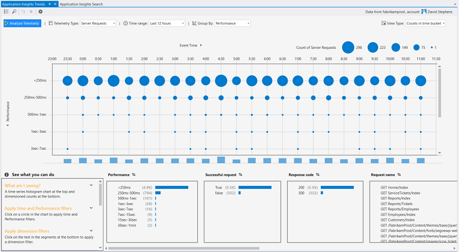

<properties 
    pageTitle="Analizzare le tendenze in Visual Studio | Microsoft Azure" 
    description="Analizzare, visualizzare e analizzare le tendenze nei telemetria applicazione approfondimenti in Visual Studio." 
    services="application-insights" 
    documentationCenter=".net"
    authors="numberbycolors" 
    manager="douge"/>

<tags 
    ms.service="application-insights" 
    ms.workload="tbd" 
    ms.tgt_pltfrm="ibiza" 
    ms.devlang="na" 
    ms.topic="get-started-article" 
    ms.date="10/25/2016" 
    ms.author="daviste"/>
    
# Analizzare le tendenze in Visual Studio

Lo strumento di applicazione approfondimenti tendenze vengono visualizzati come gli eventi di telemetria importanti dell'applicazione cambiano nel tempo, consentono di individuare velocemente i problemi e alterazioni. Per collegare informazioni di diagnostica più dettagliate, le tendenze consentono di migliorare le prestazioni dell'app, esaminare le cause di eccezioni e scoprire informazioni approfondite dagli eventi personalizzati.

> [AZURE.NOTE] Applicazione approfondimenti tendenze è disponibile in Visual Studio 2015 aggiornamento 3 e versioni successive o con la versione di [estensione degli strumenti di sviluppo Analitica](https://visualstudiogallery.msdn.microsoft.com/82367b81-3f97-4de1-bbf1-eaf52ddc635a) 5.209 e versioni successiva.

## Tendenze approfondimenti applicazione aperta

Per aprire la finestra le tendenze dei dati dell'applicazione:

* Dal pulsante della barra degli strumenti applicazione approfondimenti, scegliere **Esplorare le tendenze di telemetria**o
* Scegliere dal menu di scelta rapida progetto **applicazione approfondimenti > esplorare le tendenze di telemetria**, o
* Nella barra dei menu Visual Studio, scegliere **Visualizza > altre finestre > tendenze approfondimenti applicazione**.

Potrebbe essere visualizzato un messaggio per selezionare una risorsa. Fare clic su **Selezionare una risorsa**, accedere con un abbonamento Azure, quindi scegliere una risorsa applicazione approfondimenti dall'elenco per cui si desidera analizzare le tendenze di telemetria.

## Scegliere un'analisi delle tendenze

Per iniziare scegliendo una delle cinque analisi tendenza comuni, ogni analisi dati da ultime 24 ore:

* **Problemi di prestazioni analizza le richieste di server** - richieste al servizio, raggruppati per i tempi di risposta
* **Analizza gli errori nelle convocazioni server** - richieste al servizio, raggruppati per codice di risposta HTTP
* **Esaminare le eccezioni nell'applicazione** - eccezioni dal servizio, raggruppati in base al tipo di eccezione
* **Controllare le prestazioni di dipendenze dell'applicazione** - servizi chiamati tramite il servizio, raggruppati per i tempi di risposta
* **Controllare gli eventi personalizzati** - eventi personalizzati è stato configurato per il servizio, raggruppati in base al tipo di evento.

Queste analisi predefinite sono disponibili in un secondo momento dal pulsante **tipi comuni di visualizzazione di analisi di telemetria** nell'angolo superiore sinistro della finestra tendenze.

## Visualizzare le tendenze dell'applicazione

Applicazione approfondimenti tendenze crea una visualizzazione per periodi serie di telemetria dell'applicazione. Visualizzazione di serie ogni ora consente di visualizzare un tipo di telemetria, raggruppato per una proprietà di tale telemetria in un intervallo di tempo. È consigliabile, ad esempio, visualizzare le richieste di server, raggruppate per paese da cui sono stati generati, su ultime 24 ore. In questo esempio, ogni bolla nella visualizzazione rappresenta un conteggio delle richieste server per alcuni paese/area geografica durante un'ora.

Utilizzare i controlli nella parte superiore della finestra per modificare i tipi di telemetria visualizzare. Prima di tutto, scegliere i tipi di telemetria in cui si è interessati:

* **Tipo di telemetria** - richieste Server, eccezioni, depdendencies o eventi personalizzati
* **Intervallo di tempo** - ovunque gli ultimi 30 minuti per ultimi 3 giorni
* **Raggruppa per** - eccezione tipo, ID problema, paese/area geografica e altro ancora.

Scegliere quindi **Analizzare telemetria** per eseguire la query.

Per spostarsi tra le bolle nella visualizzazione:

* Fare clic per selezionare una bolla, che consente di aggiornare i filtri nella parte inferiore della finestra, i riepiloghi solo gli eventi che si sono verificati durante un periodo specifico
* Fare doppio clic su una bolla per passare allo strumento di ricerca e visualizzare tutti gli eventi di telemetria singoli che si sono verificati durante il periodo di tempo
* CTRL + clic una bolla per deselezionarlo nella visualizzazione.

> [AZURE.TIP] Le tendenze e ricerca tools contribuiscono a consentono di individuare le cause dei problemi del servizio tra migliaia di eventi di telemetria. Ad esempio, se un pomeriggio i clienti si noti l'app viene tempi, iniziare con le tendenze. Analizzare richieste al servizio nelle ultime ore diverse, raggruppati per il tempo di risposta. Controllare se è presente un particolarmente grande cluster richieste lente. Quindi fare doppio clic tale a bolle per accedere allo strumento ricerche, filtrato per gli eventi di richiesta. Dalla ricerca, è possibile esplorare il contenuto di tali richieste e passare al codice correlate risolvere il problema.

## Filtro

Individuare le tendenze più specifiche con i controlli di filtro nella parte inferiore della finestra. Per applicare un filtro, fare clic sul relativo nome. È possibile spostarsi rapidamente tra diversi filtri per individuare le tendenze che possono nascondere in una determinata dimensione il telemetria. Se si applica un filtro in una dimensione, ad esempio tipo di eccezione, i filtri in altre dimensioni rimangono selezionabili anche se sono presenti inattivo. Per annullare-applicare un filtro, fare di nuovo clic. CTRL + clic per selezionare più filtri nella stessa dimensione.

Cosa fare se si desidera applicare più filtri? 

1. Applicare il filtro prima. 
2. Fare clic sul pulsante **Applica filtri selezionati e query** in base al nome della dimensione del primo filtro. Questo richiederà nuovamente il telemetria per solo gli eventi che corrispondono al primo filtro. 
3. Applicare un filtro secondo. 
4. Ripetere la procedura per individuare le tendenze in sottoinsiemi del telemetria specifici. Ad esempio, le richieste di server denominata "Home GET/indice" _e_ che è stata recuperata dalla Germania _e_ che ha ricevuto un codice di 500 risposta. 

Per annullare-applicare uno di questi filtri, fare clic sul pulsante **Rimuovi selezionati filtri e query** per la dimensione.

## Trovare alterazioni

Lo strumento tendenze possibile evidenziare le bolle di anomala confrontate con quelle di altri bolle nella stessa serie temporale eventi. Nell'elenco a discesa tipo di visualizzazione, scegliere **conteggi in definire l'intervallo (evidenziazione alterazioni)** o **percentuali in ora intervallo (evidenziazione alterazioni)**. Fumetti rossi sono anomale. Alterazioni sono definiti come fumetti con conteggi le percentuali superiori ai 2.1 volte la deviazione standard di conteggi/percentuali che si sono verificati in passato due periodi (48 ore se si visualizzano le ultime 24 ore, ecc.).

> [AZURE.TIP] Evidenziazione alterazioni è particolarmente utile per trovare valori erratici nella serie temporale di bolle piccole che in caso contrario potrebbero avere un aspetto di dimensioni simili.  

## Passaggi successivi

||
|---|---
|**[Utilizzo di applicazione approfondimenti in Visual Studio](app-insights-visual-studio.md)** Ricerca di telemetria, vedere i dati di CodeLens e configurare approfondimenti applicazione. In Visual Studio. |
|**[Aggiungere altri dati](app-insights-asp-net-more.md)** Monitorare l'utilizzo, disponibilità, dipendenze, eccezioni. Integrare tracce da Framework di registrazione. Scrivere telemetria personalizzato. | 
|**[Utilizzo del portale approfondimenti applicazione del](app-insights-dashboards.md)** È possibile esportare i dashboard, potenti strumenti di diagnostici e analitici, avvisi, una mappa dinamica dipendenza dell'applicazione e telemetria. |
