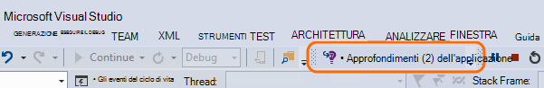
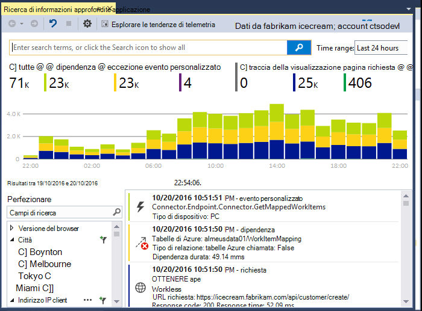
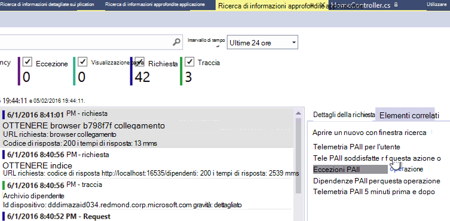
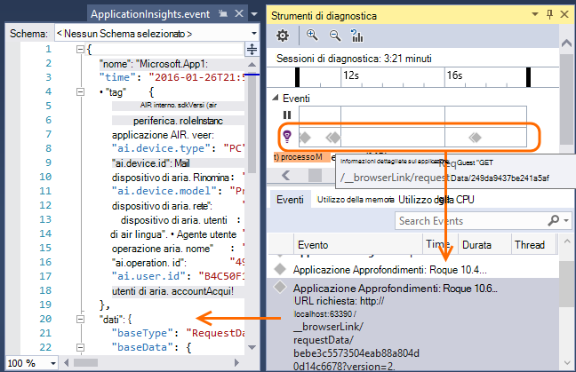
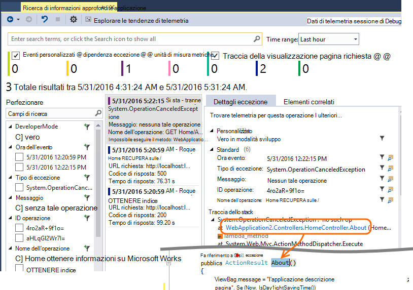
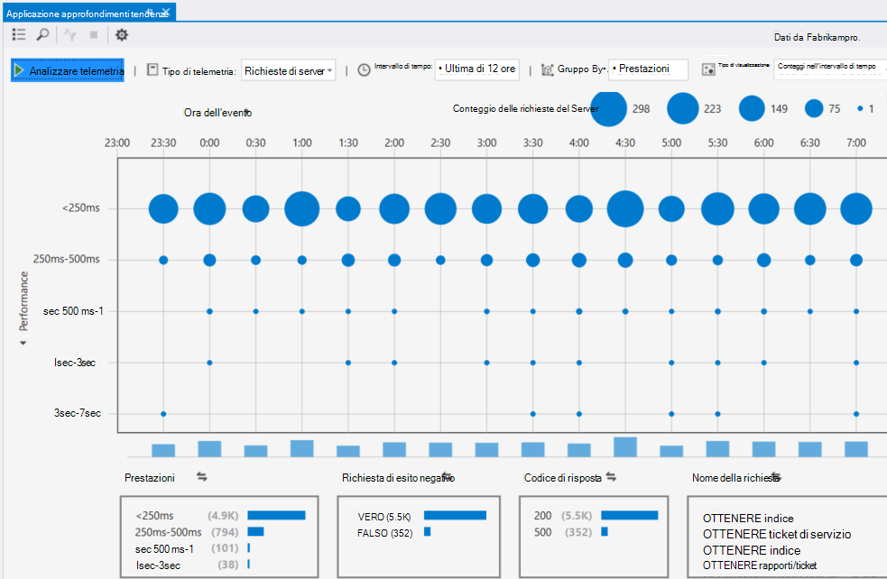

<properties 
    pageTitle="Utilizzo di applicazione approfondimenti in Visual Studio" 
    description="Analisi delle prestazioni e diagnostica durante il debug e di produzione." 
    services="application-insights" 
    documentationCenter=".net"
    authors="alancameronwills" 
    manager="douge"/>

<tags 
    ms.service="application-insights" 
    ms.workload="tbd" 
    ms.tgt_pltfrm="ibiza" 
    ms.devlang="na" 
    ms.topic="get-started-article" 
    ms.date="06/21/2016" 
    ms.author="awills"/>

# Utilizzo di applicazione approfondimenti in Visual Studio

In Visual Studio (2015 e versioni successive), è possibile analizzare le prestazioni e diagnosticare i problemi di debug e di produzione, utilizzando telemetria da [Visual Studio applicazione approfondimenti](app-insights-overview.md).

Se non è ancora [Installato approfondimenti applicazione nell'app](app-insights-asp-net.md), che ora eseguire.

## Il debug del progetto

Eseguire l'applicazione con F5 e provare: aprire pagine diverse per generare alcuni telemetria.

In Visual Studio, verrà visualizzato un numero di eventi che è stato eseguito.

Fare clic su questo pulsante per aprire ricerca diagnostica. 

## Ricerca di diagnostica

Finestra di ricerca Mostra gli eventi che sono stati eseguiti. (Se connesso al Azure quando si configura applicazione approfondimenti, sarà possibile eseguire la ricerca gli stessi eventi nel portale.)

La ricerca di testo libero funziona in tutti i campi in eventi. Ad esempio, cercare parte dell'URL di una pagina. o il valore di una proprietà, ad esempio città client; o parole specifiche in un file di log di analisi.

Fare clic su un evento per visualizzare le proprietà dettagliate.

È anche possibile aprire la scheda elementi correlati per diagnosticare più facilmente le richieste non riuscite o eccezioni.

## Hub di diagnostica

Hub diagnostica, in Visual Studio 2015 o in un secondo momento, Mostra telemetria di server approfondimenti applicazione viene generato. Questo metodo funziona anche se si è scelto solo per installare SDK, senza la connessione a una risorsa nel portale di Azure.

## Eccezioni

Se sono stati [configurati eccezione monitoraggio](app-insights-asp-net-exceptions.md), eccezione report verrà visualizzato nella finestra di ricerca. 

Fare clic su un'eccezione per ottenere una traccia dello stack. Se il codice dell'applicazione non è aperto in Visual Studio, è possibile fare clic su tramite dalla traccia dello stack alla riga pertinenti del codice.

Nella riga di codice Lens sopra ogni metodo, inoltre, verrà visualizzato un conteggio delle eccezioni eseguito l'accesso per informazioni dettagliate sui applicazione ultime 24 ore.

## Monitoraggio locale

(Da Visual Studio 2015 Update 2) Se non è stato configurato SDK per l'invio di telemetria al portale di applicazione approfondimenti (in modo che non esiste nessuna chiave strumentazione in ApplicationInsights.config) nella finestra di diagnostica verrà visualizzato telemetria dalla sessione di debug più recenti. 

Questo è utile se è già stato pubblicato una versione precedente dell'app. Non si desidera di telemetria dalle sessioni di debug per combinare con telemetria nel portale di applicazione approfondimenti dall'app pubblicato.

È inoltre utile se si dispone di alcuni [telemetria personalizzato](app-insights-api-custom-events-metrics.md) che si desidera eseguire il debug prima dell'invio di telemetria al portale.

* *Inizialmente configurato completamente approfondimenti applicazione per l'invio di telemetria al portale. Ma ora vogliono vedere telemetria solo in Visual Studio.*

 * Nella sezione Impostazioni della finestra di ricerca, esiste un'opzione per la ricerca di diagnostica locale anche se l'app invia telemetria al portale.
 * Per smettere di telemetria inviato al portale, commento la riga `<instrumentationkey>...` da ApplicationInsights.config. Quando si è pronti a inviare telemetria al portale di nuovo, rimuovere il commento.

## Tendenze

Tendenze è uno strumento per la visualizzazione comportamento l'app nel tempo. 

Scegliere **Le tendenze di telemetria esplorare** la finestra di ricerca di informazioni approfondite applicazione o un pulsante Approfondimenti applicazione. Scegliere una delle cinque query comuni per iniziare. È possibile analizzare diversi set di dati in base a tipi di telemetria, gli intervalli di tempo e altre proprietà. 

Per trovare alterazioni dei dati, scegliere una delle opzioni anomalia sotto l'elenco a discesa "Tipo visualizzazione". Le opzioni di filtro nella parte inferiore della finestra rendono più semplice concentrarsi su sottoinsiemi del telemetria specifici.

[Altre informazioni, vedere le tendenze](app-insights-visual-studio-trends.md).

## Che cos'è successiva?

||
|---|---
|**[Aggiungere altri dati](app-insights-asp-net-more.md)** Monitorare l'utilizzo, disponibilità, dipendenze, eccezioni. Integrare tracce da Framework di registrazione. Scrivere telemetria personalizzato. | 
|**[Utilizzo del portale approfondimenti applicazione del](app-insights-dashboards.md)** È possibile esportare i dashboard, potenti strumenti di diagnostici e analitici, avvisi, una mappa dinamica dipendenza dell'applicazione e telemetria. |

 
