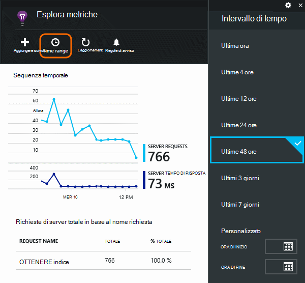
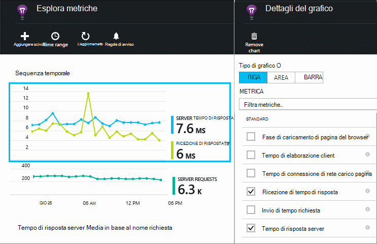
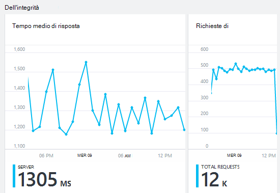
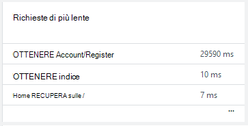
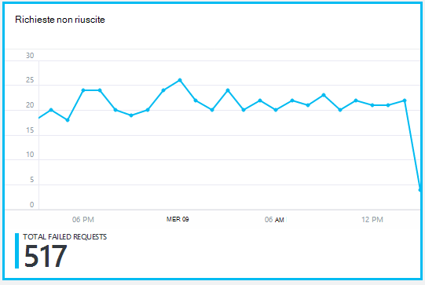
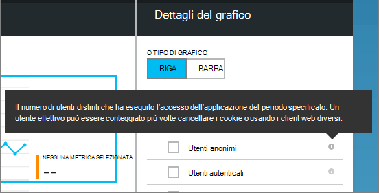
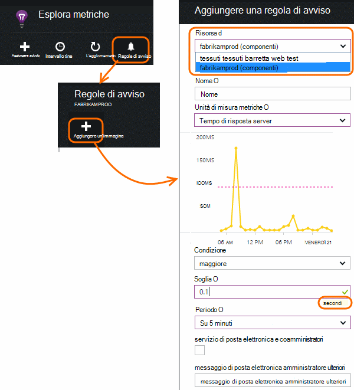

<properties 
    pageTitle="Eseguire il monitoraggio dell'integrità e l'uso con informazioni dettagliate sui applicazione l'app" 
    description="Guida introduttiva a informazioni dettagliate sui applicazione. Analizzare l'utilizzo, la disponibilità e le prestazioni delle applicazioni di Microsoft Azure o locale." 
    services="application-insights" 
    documentationCenter=""
    authors="alancameronwills" 
    manager="douge"/>

<tags 
    ms.service="application-insights" 
    ms.workload="tbd" 
    ms.tgt_pltfrm="ibiza" 
    ms.devlang="na" 
    ms.topic="article" 
    ms.date="11/25/2015" 
    ms.author="awills"/>
 
# Monitoraggio delle prestazioni nelle applicazioni web

*Informazioni dettagliate sui applicazione è in anteprima.*

Verificare che l'applicazione è soddisfacenti per scoprire rapidamente relative agli errori. [Informazioni dettagliate sui applicazione] [ start] proposito di eventuali problemi di prestazioni ed eccezioni e consentono di individuare e diagnosticare le cause principali.

Informazioni dettagliate sui applicazione monitorare le applicazioni web Java e ASP.NET e servizi, servizi WCF. Possono essere ospitati in locale, su macchine virtuali o come siti Web di Microsoft Azure. 

Sul lato client approfondimenti applicazione può richiedere telemetria di pagine web e una vasta gamma di dispositivi, tra cui iOS, Android e Windows Store app.

## Configurare il monitoraggio delle prestazioni

Se è stato ancora aggiunto approfondimenti applicazione al progetto (se non è necessario ApplicationInsights.config), scegliere uno dei metodi seguenti per iniziare:

* [Applicazioni web ASP.NET](app-insights-asp-net.md)
 * [Aggiungi eccezione monitoraggio](app-insights-asp-net-exceptions.md)
 * [Aggiungere il monitoraggio della dipendenza](app-insights-monitor-performance-live-website-now.md)
* [J2EE web App](app-insights-java-get-started.md)
 * [Aggiungere il monitoraggio della dipendenza](app-insights-java-agent.md)

## Esplorare i dati sulle prestazioni

Nel [portale di Azure](https://portal.azure.com), passare alla risorsa approfondimenti applicazione che è configurato per l'applicazione. E il Panoramica Mostra dati sulle prestazioni di base:

Fare clic su uno di essi per visualizzare ulteriori dettagli e per visualizzare i risultati per un periodo più lungo. Ad esempio, fare clic sul riquadro richieste e quindi selezionare un intervallo di tempo:

Fare clic su un grafico per scegliere quali metriche viene visualizzato, o aggiungere un nuovo grafico e selezionare i parametri di valutazione:

> [AZURE.NOTE] **Deselezionare tutte le metriche** per visualizzare la selezione completa è disponibile. Le metriche possono essere suddivise in gruppi. Quando si seleziona qualsiasi membro di un gruppo, vengono visualizzati solo gli altri membri del gruppo.

## Che cosa significa essa tutti? I riquadri delle prestazioni e report

Esiste una varietà di misurazione delle prestazioni, che è possibile ottenere. Iniziamo con quelli visualizzati per impostazione predefinita nei e applicazione.

### Richieste di

Il numero di richieste HTTP ricevute in un periodo specificato. Confrontare questo passaggio con i risultati su altri report per vedere come l'app si comporta come il carico varia.

Richieste HTTP includono tutte le richieste GET o POST di pagine, dati e immagini.

Fare clic sul riquadro per ottenere conteggi per URL specifici.

### Tempo medio di risposta

Misura il tempo tra una richiesta web in ingresso dell'applicazione e la risposta da restituire.

I punti di mostrano Media mobile. Se sono presenti molte richieste, potrebbero essere presenti alcune rispetto alla media senza un picco più evidente o solo il grafico.

Cercare picchi insoliti. In generale, si aspettano tempi di risposta ad aumentare con un aumento delle richieste. Se il luogo sproporzionata, l'app potrebbe raggiungere un limite di risorse, ad esempio CPU o la capacità di un servizio che viene utilizzato.

Fare clic sul riquadro per ottenere volte per URL specifici.

### Richieste di più lente

Mostra le richieste potrebbe essere necessario ottimizzazione delle prestazioni.

### Richieste non riuscite

Numero di richieste che ha generato eccezioni non rilevate.

Fare clic sul riquadro per visualizzare i dettagli degli errori specifici e selezionare una singola richiesta per visualizzare i dettagli. 

Solo un campione representative di errori viene mantenuto per ispezione singola.

### Altre metriche

Per vedere cosa impostare altre metriche è possibile visualizzare, fare clic su un grafico e quindi deselezionare tutte le metriche per visualizzare la versione completa di disponibile. Fare clic su (i) per vedere la definizione di ogni metrica.

Selezionare le unità di misura metriche verrà disabilitata altri utenti che non vengono visualizzati nello stesso grafico.

## Impostare avvisi

Per ricevere una notifica tramite posta elettronica di insolito valori di qualsiasi metrica, aggiungere un avviso. È possibile scegliere l'opzione per inviare il messaggio di posta elettronica per gli amministratori di account o gli indirizzi di posta elettronica specifico.

Impostare la risorsa prima di altre proprietà. Non selezionare le risorse webtest se si vuole impostare gli avvisi sui dati statistici relativi alle prestazioni o l'uso.

Assicurarsi di prendere nota delle unità in cui viene richiesto di immettere il valore di soglia.

*Non è visualizzato il pulsante Aggiungi avviso.* -È un gruppo di account a cui si ha accesso in sola lettura? Contattare l'amministratore dell'account.

## Diagnosticare i problemi

Ecco alcuni suggerimenti per la ricerca e la diagnosi problemi di prestazioni:

* Impostare i [test web] [ availability] per essere informati se il sito web non è raggiungibile o risponde in modo non corretto o non funziona correttamente. 
* Confrontare il conteggio di convocazione con altre metriche per vedere se gli errori o risposta lenta è correlata a caricare.
* [Inserire e cercare le istruzioni di analisi] [ diagnostic] nel codice per individuare con precisione problemi.

## Passaggi successivi

[Test Web] [ availability] -sono richieste web inviate all'applicazione a intervalli regolari da tutto il mondo.

[Acquisire e cercare le tracce diagnostiche] [ diagnostic] - inserire chiamate di analisi ed esplorare i risultati per individuare i problemi.

[L'uso di verifica] [ usage] -scoprire la modalità di utilizzo dell'applicazione.

[Risoluzione dei problemi] [ qna] - e domande e risposte

## Video

[AZURE.VIDEO performance-monitoring-application-insights]

<!--Link references-->

[availability]: app-insights-monitor-web-app-availability.md
[diagnostic]: app-insights-diagnostic-search.md
[greenbrown]: app-insights-asp-net.md
[qna]: app-insights-troubleshoot-faq.md
[redfield]: app-insights-monitor-performance-live-website-now.md
[start]: app-insights-overview.md
[usage]: app-insights-web-track-usage.md

 
