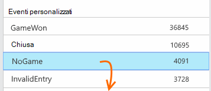

<properties 
    pageTitle="Analisi di utilizzo per le applicazioni web con informazioni dettagliate sui applicazione" 
    description="Panoramica delle analitica di utilizzo per le applicazioni web con informazioni dettagliate sui applicazione" 
    services="application-insights" 
    documentationCenter=""
    authors="alancameronwills" 
    manager="douge"/>

<tags 
    ms.service="application-insights" 
    ms.workload="tbd" 
    ms.tgt_pltfrm="ibiza" 
    ms.devlang="na" 
    ms.topic="article" 
    ms.date="06/12/2016" 
    ms.author="awills"/>
 
# <a name="usage-analysis-for-web-applications-with-application-insights"></a>Analisi di utilizzo per le applicazioni web con informazioni dettagliate sui applicazione

Conoscere la modalità di utilizzo dell'applicazione consente di focalizzare l'attenzione dell'ufficio di sviluppo sugli scenari che più importante e ottenere informazioni approfondite negli obiettivi che si trova più facile o più difficile da eseguire. 

Visual Studio applicazione approfondimenti sono disponibili due livelli di utilizzo di verifica:

* **Utente, una sessione e una pagina consente di visualizzare dati** - fornito all'esterno della casella.  
* **Telemetria personalizzata** - è [scrivere codice] [ api] per tracciare agli utenti tramite esperienza utente dell'applicazione. 

## <a name="setting-up"></a>La configurazione

Aprire una risorsa applicazione approfondimenti nel [Portale di Azure](https://portal.azure.com), fare clic sul grafico di caricamento pagina Browser vuoto e seguire le istruzioni di configurazione.

[Ulteriori informazioni](app-insights-javascript.md) 


## <a name="how-popular-is-my-web-application"></a>Il successo è un'applicazione web?

Accedere al [portale di Azure][portal], passare alla risorsa di applicazione e fare clic su uso:


* **Utenti:** Numero di utenti attivi distinti in intervallo di tempo del grafico. 
* **Sessioni:** Il numero di sessioni attive
* **Visualizzazioni di una pagina** Conta il numero di chiamate a trackPageView(), in genere chiamato una volta in ogni pagina web.

Fare clic su uno dei grafici per visualizzare più dettagli. Si noti che è possibile modificare l'intervallo di tempo dei grafici.

### <a name="where-do-my-users-live"></a>Nel punto in cui gli utenti live?

Da e il uso, fare clic sul grafico gli utenti per visualizzare i dettagli:


 
### <a name="what-browsers-or-operating-systems-do-they-use"></a>Qual è il browser o sistemi operativi si usa?

Raggruppare (segmento) i dati da una proprietà come Browser, sistema operativo o città:


## <a name="sessions"></a>Sessioni

Sessione è un concetto fondamentale nell'applicazione approfondimenti, che si impegna costantemente per associare ogni evento di telemetria - ad esempio richieste, visualizzazioni, eccezioni, o eventi personalizzati il codice personalmente - a una sessione di utenti specifici. 

Informazioni sul contesto RTF vengono raccolte informazioni su ogni sessione, ad esempio caratteristiche del dispositivo, posizione geografico, sistema operativo e così via.

Se è dotare client e server ([ASP.NET] [ greenbrown] o [J2EE][java]), il SDK verranno propagate l'id di sessione tra client e server, in modo da poter correlare eventi su entrambi i lati.

Quando [la diagnosi problemi][diagnostic], è possibile trovare tutti i telemetria correlata alla sessione in cui si verificato un problema, incluse le eccezioni di tutte le richieste e tutti gli eventi, o tracce registrati.

Sessioni offrono un ottimo indice della popolarità dei contesti, ad esempio dispositivi, sistema operativo o posizione. Mostrando il conteggio delle sessioni raggruppati per dispositivo, ad esempio, ottenere il conteggio più accurato dei con quale frequenza tale dispositivo usato con l'app più contando visualizzazioni di una pagina. Questo è un input utile per valutare di qualsiasi problema specifico di dispositivo.


#### <a name="whats-a-session"></a>Che cos'è una sessione?

Una sessione rappresenta un singolo incontro tra l'utente e l'app. Nella forma più semplice sessione inizia con un utente che esegue l'app e termina quando l'utente lascia l'app. Per le applicazioni web, per impostazione predefinita, la sessione termina dopo 30 minuti di inattività o dopo 24 ore di attività. 

Se si modifica il frammento di codice, è possibile modificare queste impostazioni predefinite:

    <script type="text/javascript">
        var appInsights= ... { ... }({
            instrumentationKey: "...",
            sessionRenewalMs: 3600000,
            sessionExpirationMs: 172800000
        });

* `sessionRenewalMs`: Il tempo in millisecondi per scadere la sessione a causa di inattività dell'utente. Predefinito: 30 minuti.
* `sessionExpirationMs`: La lunghezza massima della sessione in millisecondi. Se l'utente rimane attivo dopo questa volta, viene conteggiata un'altra sessione. Predefinito: 24 ore.

**Durata sessione** è una [metrica] [ metrics] che registra l'intervallo di tempo tra gli elementi di telemetria nome e il cognome della sessione. (Non include il periodo di timeout).

**Numero di sessioni** in un determinato intervallo è definito come il numero di sessioni univoche con alcune attività durante questo intervallo. Quando si cercano in un intervallo di tempo, ad esempio numero di sessioni giornaliera nell'ultima settimana, è in genere equivalente per il numero totale di sessioni. 

Tuttavia, quando si Esplora gli intervalli di tempo più brevi, ad esempio granulosità oraria, una sessione di tempo che interessano più ore verrà contata per ogni ora in cui era attiva la sessione. 

## <a name="users-and-user-counts"></a>Gli utenti e i conteggi utente


Ogni sessione utente è associato un id utente univoco. 

Per impostazione predefinita, l'utente è identificato inserendo un cookie. Un utente che utilizza più browser o dispositivi verrà contato più volte. (Vedere però [gli utenti autenticati](#authenticated-users))


Metrica **numero di utenti** in un determinato intervallo è definita come il numero di utenti univoci con attività registrate durante questo intervallo. Di conseguenza, gli utenti con le sessioni lunghe possono prendere in considerazione più volte, quando si imposta un intervallo di tempo in modo che il livello meno di un'ora o, in modo.

**Nuovi utenti** Conta gli utenti cui prime sessioni con l'app durante questo intervallo. Se viene utilizzato il metodo predefinito di conteggio dagli utenti per i cookie, questo verrà inclusi anche gli utenti che hanno eliminato i cookie o che utilizzano un nuovo dispositivo o browser per accedere a un'applicazione per la prima volta.


### <a name="authenticated-users"></a>Utenti autenticati

Se un'app web consente agli utenti l'accesso, è possibile ottenere un conteggio più accurato, fornendo informazioni dettagliate sui applicazione con un ID utente univoco. Non è necessario essere il nome della persona o lo stesso id utilizzate nell'app. Non appena l'app è stato individuato l'utente, utilizzare questo codice:


*JavaScript client*

      appInsights.setAuthenticatedUserContext(userId);

Se l'app di gruppi di utenti in account, è anche possibile passare un identificatore per l'account. 

      appInsights.setAuthenticatedUserContext(userId, accountId);

ID utente e account non può contenere spazi né i caratteri`,;=|`


In [Esplora risorse metriche](app-insights-metrics-explorer.md), è possibile creare un grafico degli **account**e **Gli utenti autenticati** . 

## <a name="synthetic-traffic"></a>Traffico sintetico

Il traffico sintetico include le richieste di test di carico e la disponibilità, crawler motore di ricerca e altri agenti. 

Applicazione tentativi approfondimenti si impegna costantemente per determinare e classificare il traffico sintetico automaticamente evento, impostarlo in modo appropriato. Nella maggior parte dei casi, il traffico sintetico non richiama SDK JavaScript in modo che questa attività è esclusi dall'utente e il conteggio di sessione. 

Tuttavia, per informazioni dettagliate sui applicazione [web test][availability], l'id utente viene impostata automaticamente in base posizione POP e id sessione viene impostato in base id di esecuzione di test. Predefiniti i report, il traffico sintetico viene filtrato per impostazione predefinita, questo verrà escluso questi utenti e sessioni. Tuttavia, quando il traffico sintetico è incluso, è possibile che un piccolo aumento in tutti gli utenti e i conteggi sessione.
 
## <a name="page-usage"></a>Utilizzo delle pagine

Fare clic su tramite la pagina visualizzazioni grafico per ottenere una versione più ingranditi aggiuntivo insieme a una suddivisione delle pagine più diffusi:


 
L'esempio precedente è stata inviata da un sito Web giochi. Del file è possibile vedere immediatamente:

* L'uso non è stato migliorato nell'ultima settimana. Forse bisogna considerare ottimizzazione del motore di ricerca?
* Molte persone meno individuare le pagine giochi rispetto alla Home page. Perché non Home page accattivante giocare?
* 'Crossword' è il gioco più popolari. Abbiamo bisogna assegnare priorità a nuove idee e sono descritti i miglioramenti.

## <a name="custom-tracking"></a>Rilevamento personalizzato

Si supponga che anziché l'implementazione di ogni gioco in una pagina web separato, si decide di Effettua refactoring tutti nella stessa applicazione di una pagina, con la maggior parte delle funzionalità codificato come Javascript nella pagina web. In questo modo all'utente di spostarsi rapidamente tra un gioco e un altro o avere giochi diverse in un'unica pagina. 

Ma si preferisce comunque approfondimenti applicazione per registrare il numero di volte in cui ogni gioco viene aperto, in esattamente come quando si trattasse di pagine web separato. È facile: inserire solo una chiamata al modulo di telemetria in JavaScript in cui si vuole record in cui è aperta una nuova 'pagina':

    appInsights.trackPageView(game.Name);

## <a name="custom-events"></a>Eventi personalizzati

Scrivere telemetria personalizzata per registrare gli eventi specifici. In particolare in un'applicazione di una pagina, è necessario sapere con quale frequenza l'utente esegue determinate azioni o raggiunge determinati obiettivi: 

    appInsights.trackEvent("GameEnd");

Ad esempio, per accedere facendo clic su un collegamento:

    <a href="target.htm" onclick="appInsights.trackEvent('linkClick');return true;">my link</a>


## <a name="view-counts-of-custom-events"></a>Conteggi di visualizzazione degli eventi personalizzati

Aprire Esplora metriche e aggiungere un grafico per visualizzare gli eventi. Segmento in base al nome:


## <a name="drill-into-specific-events"></a>Drill-down eventi specifici

Per ottenere maggiori informazioni sui come una tipica sessione passa, è consigliabile per concentrarsi su una sessione di utenti specifici che contiene un determinato tipo di evento. 

In questo esempio abbiamo codificati un evento personalizzato "NoGame" chiamata se l'utente si disconnette senza effettivamente avviare un gioco. Perché un utente farebbe che? Forse si drill-down alcune occorrenze specifiche, si ottiene un'indicazione. 

Eventi personalizzati ricevuti dall'app sono elencati in base al nome in e il Panoramica:



 
Fare clic su tramite l'evento di interesse e selezionare un'occorrenza specifica recente:


 
Diamo un'occhiata tutti di telemetria per la sessione in cui si è verificato l'evento NoGame specifico. 


 
Si sono verificati senza eccezioni, in modo che l'utente non è stato impedito la riproduzione di un errore.
 
È possibile filtrare tutti i tipi di telemetria ad eccezione delle visualizzazioni di una pagina per questa sessione:


 
E a questo punto è possibile vedere che l'utente eseguito l'accesso è sufficiente per controllare i punteggi più recente. Forse si bisogna valutare la possibilità di sviluppo di una storia utente che rendono più semplice per farlo. (E abbiamo bisogna implementare un evento personalizzato al report quando si verifica questa storia specifica).

## <a name="filter-search-and-segment-your-data-with-properties"></a>Filtrare, eseguire una ricerca e segmento i dati con il comando proprietà
È possibile allegare tag non autorizzato e valori numerici per gli eventi.
 

*JavaScript client*

```JavaScript

    appInsights.trackEvent("WinGame",
        // String properties:
        {Game: currentGame.name, Difficulty: currentGame.difficulty},
        // Numeric measurements:
        {Score: currentGame.score, Opponents: currentGame.opponentCount}
    );
```

*C# nel server*

```C#

    // Set up some properties:
    var properties = new Dictionary <string, string> 
        {{"game", currentGame.Name}, {"difficulty", currentGame.Difficulty}};
    var measurements = new Dictionary <string, double>
        {{"Score", currentGame.Score}, {"Opponents", currentGame.OpponentCount}};

    // Send the event:
    telemetry.TrackEvent("WinGame", properties, measurements);
```

*Aggiornare l'album nel server*

```VB

    ' Set up some properties:
    Dim properties = New Dictionary (Of String, String)
    properties.Add("game", currentGame.Name)
    properties.Add("difficulty", currentGame.Difficulty)

    Dim measurements = New Dictionary (Of String, Double)
    measurements.Add("Score", currentGame.Score)
    measurements.Add("Opponents", currentGame.OpponentCount)

    ' Send the event:
    telemetry.TrackEvent("WinGame", properties, measurements)
```

Allegare proprietà alle visualizzazioni di pagina nello stesso modo:

*JavaScript client*

```JS

    appInsights.trackPageView("Win", 
        url,
        {Game: currentGame.Name}, 
        {Score: currentGame.Score});
```

Nella ricerca diagnostica, visualizzare le proprietà, fare clic su tramite una singola occorrenza di un evento.


 
Utilizzare il campo di ricerca per visualizzare le occorrenze di evento con un valore specifico della proprietà.


## <a name="a--b-testing"></a>RISPOSTE | Test B

Se non si conosce variante di una caratteristica sarà maggiori possibilità di successo, rilasciare entrambi gli elementi, effettuare ogni accessibili per diversi utenti. Valutare il successo di ogni e quindi passare a una versione unificata.

Per questa tecnica, si allega tag distinti a tutti di telemetria inviato da ogni versione dell'app. È possibile farlo mediante la definizione di proprietà in TelemetryContext attivo. Queste proprietà predefinite vengono aggiunti a ogni messaggio telemetria che l'applicazione invia - non solo ai messaggi personalizzati, ma anche di telemetria standard. 

Nel portale approfondimenti applicazione, quindi sarà possibile per filtrare e raggruppare (segmento) i dati sui tag, in modo da confrontare le diverse versioni.

*C# nel server*

```C#

    using Microsoft.ApplicationInsights.DataContracts;

    var context = new TelemetryContext();
    context.Properties["Game"] = currentGame.Name;
    var telemetry = new TelemetryClient(context);
    // Now all telemetry will automatically be sent with the context property:
    telemetry.TrackEvent("WinGame");
```

*Aggiornare l'album nel server*

```VB

    Dim context = New TelemetryContext
    context.Properties("Game") = currentGame.Name
    Dim telemetry = New TelemetryClient(context)
    ' Now all telemetry will automatically be sent with the context property:
    telemetry.TrackEvent("WinGame")
```

Singoli telemetria possibile ignorare i valori predefiniti.

È possibile impostare un inizializzatore universale in modo che tutti i nuovi TelemetryClients usare automaticamente il contesto.

```C#


    // Telemetry initializer class
    public class MyTelemetryInitializer : ITelemetryInitializer
    {
        public void Initialize (ITelemetry telemetry)
        {
            telemetry.Properties["AppVersion"] = "v2.1";
        }
    }
```

Nell'inizializzatore di app, ad esempio Global.asax.cs:

```C#

    protected void Application_Start()
    {
        // ...
        TelemetryConfiguration.Active.TelemetryInitializers
        .Add(new MyTelemetryInitializer());
    }
```


## <a name="build---measure---learn"></a>Compilazione - misura - informazioni

Quando si utilizza analitica, diventa una parte integrante del ciclo di sviluppo, non appena destinati si ritiene che per risolvere problemi. Ecco alcuni suggerimenti:

* Determinare l'unità di misura metriche chiave dell'applicazione. Si desidera tutti gli utenti possibili o è preferibile un piccolo gruppo di utenti molto soddisfatti? Si desidera ingrandire visite o vendita?
* Piano per misurare ogni brano. Quando si schizzi una storia utente nuovo o caratteristica o piano per aggiornare uno esistente, sempre considerare come verrà misurato il successo della modifica. Prima di codifica avvii, chiedere "Qual è l'effetto delle prestazioni sulla nostro metriche se funziona? Bisogna è tenere traccia di tutti i nuovi eventi?"
E naturalmente, quando la caratteristica è attivo, accertarsi di esaminare l'analitica e agire sui risultati. 
* Le relazioni tra e altre metriche l'unità di misura metriche chiave. Ad esempio, se si aggiunge la funzionalità "Preferiti", si vuole sapere con quale frequenza gli utenti aggiungono a Preferiti. Ma è probabilmente più interessante sapere con quale frequenza vengono tornare a Preferiti. E, soprattutto, i clienti che utilizzano Preferiti infine acquistare più del prodotto?
* Canarie test. Impostare un'opzione di funzionalità che consente di impostare una nuova caratteristica visibile solo per alcuni utenti. Consente di vedere se la nuova caratteristica viene utilizzata in modo che previste approfondimenti applicazione. Apportare modifiche, quindi rilasciare a un pubblico più ampio.
* Comunicare con gli utenti. Analitica non è sufficiente autonomamente, ma complementare per conservare una relazione clienti.


## <a name="references"></a>Riferimenti

* [Tramite l'API - Panoramica][api]
* [Riferimento API JavaScript](https://github.com/Microsoft/ApplicationInsights-JS/blob/master/API-reference.md)

## <a name="video"></a>Video

> [AZURE.VIDEO usage-monitoring-application-insights]


<!--Link references-->

[api]: app-insights-api-custom-events-metrics.md
[availability]: app-insights-monitor-web-app-availability.md
[client]: app-insights-javascript.md
[diagnostic]: app-insights-diagnostic-search.md
[greenbrown]: app-insights-asp-net.md
[java]: app-insights-java-get-started.md
[metrics]: app-insights-metrics-explorer.md
[portal]: http://portal.azure.com/
[windows]: app-insights-windows-get-started.md

 
