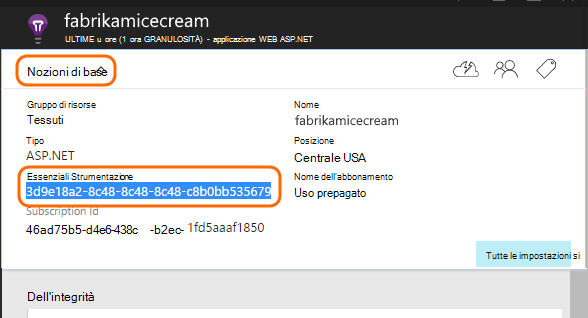

<properties
    pageTitle="Servizi dell'applicazione approfondimenti per Windows tramite ruoli e lavoro | Microsoft Azure"
    description="Aggiungere manualmente il SDK approfondimenti applicazione all'applicazione ASP.NET per l'analisi di utilizzo, la disponibilità e le prestazioni."
    services="application-insights"
    documentationCenter=".net"
    authors="alancameronwills"
    manager="douge"/>

<tags
    ms.service="application-insights"
    ms.workload="tbd"
    ms.tgt_pltfrm="ibiza"
    ms.devlang="na"
    ms.topic="get-started-article"
    ms.date="08/30/2016"
    ms.author="awills"/>

# Configura manualmente le informazioni dettagliate sui applicazione per le applicazioni ASP.NET 4

*Informazioni dettagliate sui applicazione è in anteprima.*

[AZURE.INCLUDE [app-insights-selector-get-started](../../includes/app-insights-selector-get-started.md)]

È possibile configurare manualmente [Visual Studio applicazione approfondimenti](app-insights-overview.md) per monitorare i servizi, ruoli di lavoro e altre applicazioni di Windows. Per le applicazioni web, la configurazione manuale costituisce un'alternativa alla [configurazione automatica](app-insights-asp-net.md) offerti da Visual Studio.

Informazioni dettagliate sui applicazione consente di diagnosticare problemi e monitorare le prestazioni e l'uso dell'applicazione live.

#### Prima di iniziare

Hai bisogno:

* Una sottoscrizione a [Microsoft Azure](http://azure.com). Se il team o l'organizzazione ha un abbonamento a Azure, il proprietario possibile aggiungervi si, con il proprio [account Microsoft](http://live.com).
* Visual Studio 2013 o versione successiva.

## 1. creare una risorsa applicazione approfondimenti

Accedere al [portale di Azure](https://portal.azure.com/)e creare una nuova risorsa approfondimenti applicazione. Scegliere ASP.NET come tipo di applicazione.

Una [risorsa](app-insights-resources-roles-access-control.md) in Azure è un'istanza di un servizio. Questa risorsa è nel punto in cui verrà analizzato e visualizzato in telemetria dell'app.

La scelta del tipo di applicazione imposta il contenuto predefinito del pale delle risorse e le proprietà visualizzato in [Esplora risorse metriche](app-insights-metrics-explorer.md).

#### Copiare la chiave Strumentazione

Il tasto identifica la risorsa e si verrà installarlo breve in SDK per inviare i dati alla risorsa.

La procedura che appena effettuate per creare una nuova risorsa è un'ottima soluzione per avviare il monitoraggio delle applicazioni. A questo punto è possibile inviare dati a esso.

## 2. installare SDK nell'applicazione

Installazione e configurazione di SDK approfondimenti applicazione varia a seconda della piattaforma che sta lavorando. Per le applicazioni ASP.NET, è facile.

1. In Visual Studio, modificare i pacchetti NuGet del progetto web app.

    

2. Installare l'applicazione approfondimenti SDK per le applicazioni Web.

    

    *È possibile usare altri pacchetti?*

    Sì. Scegliere l'API di base (Microsoft.ApplicationInsights) se si desidera utilizzare l'API per inviare il proprio telemetria. Il pacchetto di Windows Server include automaticamente l'API di base e un numero di altri pacchetti, ad esempio la raccolta contatore prestazioni e il monitoraggio della dipendenza. 

#### Eseguire l'aggiornamento a versioni future SDK

Abbiamo rilasciare una nuova versione di SDK di tanto in tanto.

Per eseguire l'aggiornamento a una [nuova versione di SDK](https://github.com/Microsoft/ApplicationInsights-dotnet-server/releases/), aprire Gestione pacchetti NuGet nuovamente e filtrare pacchetti installati. Selezionare **Microsoft.ApplicationInsights.Web** e scegliere **l'aggiornamento**.

Se è stata ApplicationInsights.config tutte le personalizzazioni, salvare una copia prima di eseguire l'aggiornamento e successivamente unire le modifiche nella nuova versione.

## 3. inviare telemetria

**Se è stato installato il pacchetto di API principale:**

* Impostare la chiave strumentazione nel codice, ad esempio `main()`: 

    `TelemetryConfiguration.Active.InstrumentationKey = "`*il tasto*`";` 

* [Scrivere il proprio telemetria tramite l'API](app-insights-api-custom-events-metrics.md#ikey).

**Se è stato installato altri pacchetti approfondimenti applicazione,** è possibile, se si preferisce, è possibile utilizzare il file config per impostare la chiave strumentazione:

* Modificare ApplicationInsights.config (che è stata aggiunta per l'installazione di NuGet). Inserire prima del tag di chiusura:

    `<InstrumentationKey>`*il tasto strumentazione che sono stati copiati*`</InstrumentationKey>`

* Assicurarsi che siano impostate le proprietà di ApplicationInsights.config in Esplora soluzioni **Build Action = contenuto, copia nella Directory di Output = copia**.

## Eseguire il progetto

Premere **F5** per eseguire l'applicazione e provare: aprire pagine diverse per generare alcuni telemetria.

In Visual Studio, verrà visualizzato un numero di eventi che sono stati inviati.

## Visualizzare il telemetria

Per tornare al [portale di Azure](https://portal.azure.com/) e individuare la risorsa approfondimenti applicazione.

Cercare dati nei grafici Panoramica. Prima, verrà visualizzato uno o due punti. Per esempio:

Fare clic sui grafici per visualizzare informazioni più dettagliate la metrica. [Ulteriori informazioni sulle metriche.](app-insights-web-monitor-performance.md)

#### Nessun dato?

* Usare l'applicazione, apertura di pagine differenti in modo che generi alcuni telemetria.
* Aprire il riquadro di [ricerca](app-insights-diagnostic-search.md) , per visualizzare i singoli eventi. A volte è necessario eseguire eventi leggermente mentre più tempo per ottenere attraverso la pipeline di metriche.
* Attendere alcuni secondi e fare clic su **Aggiorna**. Grafici a se stessi aggiornare periodicamente, ma è possibile aggiornare manualmente se si sta attendendo per alcuni dati per la visualizzazione.
* Vedere [risoluzione dei problemi](app-insights-troubleshoot-faq.md).

## Pubblicare l'app

Ora distribuire l'applicazione al server o in Azure e controllare i dati si accumulano.

Quando si esegue in modalità di debug, telemetria viene avviata attraverso la pipeline, in modo che verrà visualizzato dati visualizzati in pochi secondi. Quando si distribuisce l'app nella configurazione rilascio, i dati sono indicati più lentamente.

#### Nessun dato dopo la pubblicazione nel server?

Aprire le porte per il traffico in uscita nel firewall del server:

+ `dc.services.visualstudio.com:443`
+ `f5.services.visualstudio.com:443`

#### Problemi nel server di compilazione?

Vedere [questo elemento di risoluzione dei problemi](app-insights-asp-net-troubleshoot-no-data.md#NuGetBuild).

> [AZURE.NOTE]Se l'app genera molte telemetria (e si sta usando la 2.0.0-beta3 di versione di ASP.NET SDK o versioni successive), il modulo di esempio adattata ridurrà automaticamente il volume viene inviato al portale di inviando solo una frazione rappresentanza degli eventi. Tuttavia, gli eventi correlati alla stessa richiesta verranno selezionati o deselezionati a livello di gruppo, in modo che è possibile spostarsi tra gli eventi correlati. 
> [Informazioni sui campioni](app-insights-sampling.md).

## Passaggi successivi

* [Aggiungere ulteriori telemetria](app-insights-asp-net-more.md) per ottenere la visualizzazione di 360 gradi dell'applicazione.

