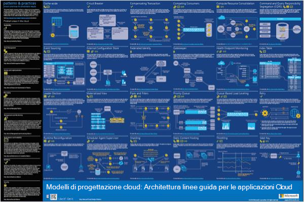
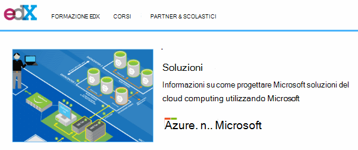
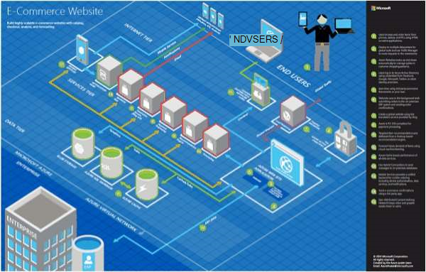
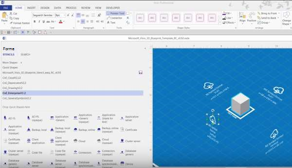
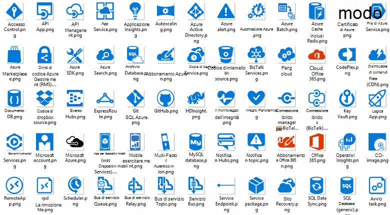
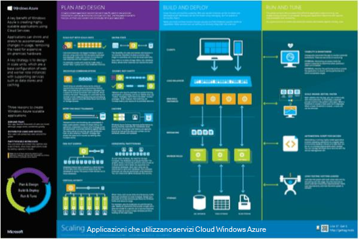

<properties 
    pageTitle="Architettura delle applicazioni in Microsoft Azure | Microsoft Azure" 
    description="Cenni preliminari sull'architettura che copra i modelli di progettazione comuni" 
    services="" 
    documentationCenter="" 
    authors="Rboucher" 
    manager="jwhit" 
    editor="mattshel"/>

<tags 
    ms.service="multiple" 
    ms.workload="na" 
    ms.tgt_pltfrm="na" 
    ms.devlang="na" 
    ms.topic="article" 
    ms.date="09/13/2016" 
    ms.author="robb"/>

#Architettura delle applicazioni in Microsoft Azure
Risorse per la creazione di applicazioni che utilizzano Microsoft Azure. Sono inclusi gli strumenti che consentono di creare diagrammi per descrivere visivamente sistemi software. 

##Poster di modelli di progettazione

Procedure consigliate e modelli di Microsoft ha pubblicato libro [Modelli di progettazione Cloud](http://msdn.microsoft.com/library/dn568099.aspx) è disponibile su MSDN e download di file PDF. È inoltre disponibile di poster di grande formato in cui sono elencati tutti i modelli. 

##Corso di certificazione Microsoft architettura

Microsoft ha creato un corso di architettura di supporto Microsoft esame di certificazione 70-534. È [disponibile gratuitamente su EDX.ORG](https://www.edx.org/course/architecting-microsoft-azure-solutions-microsoft-dev205x).  Viene utilizzato il [Modello di Visio progetto 3D](#3d-blueprint-visio-template). 

##Soluzioni Microsoft

Microsoft pubblica un set di alto livello [architetture delle soluzioni](http://aka.ms/azblueprints) che mostra come creare tipi specifici di sistemi che utilizzano i prodotti Microsoft. 

Microsoft pubblicato in precedenza, una serie con architetture di esempio. Quelli sono state sostituite da architetture soluzione detto in precedenza e il collegamento di progetto è stato reindirizzato per farvi riferimento. Se è necessario accedere ai materiali piantine precedente per qualche motivo, e-mail [CnESymbols@microsoft.com](mailto:CnESymbols@microsoft.com) con la richiesta.   

I piani di costruzione e diagrammi di architetture soluzione utilizzano parti del [Cloud e impostare simbolo dell'organizzazione](#Drawing-symbol-and-icon-sets).   

##Modello di Visio progetto 3D

Le versioni 3D di ora inattivo [Linee guida per architettura di Microsoft](http://aka.ms/azblueprints) sono state create personalmente in uno strumento non Microsoft. Un modello di Visio 2013 (e versioni successivo) fornito in 5 agosto 2015 come parte di un [corso di certificazione Microsoft architettura distribuito su EDX.ORG](#microsoft-architecture-certification-course).

Il modello è disponibile di fuori del corso. 

- [Visualizza la formazione video](http://aka.ms/3dBlueprintTemplateVideo) prima per sapere cosa può fare   
- Scaricare il [Microsoft 3d modello di Visio progetto](http://aka.ms/3DBlueprintTemplate)
- Scaricare il [Cloud e simboli Enterprise](#drawing-symbol-and-icon-sets) da utilizzare con il modello 3D. 

Inviare tramite posta elettronica al [CnESymbols@microsoft.com](mailto:CnESymbols@microsoft.com) per domande specifiche non ha ricevuto risposte per il materiale di formazione o per inviare commenti e suggerimenti. Il modello non è più in fase di sviluppo attivo, ma è comunque utile e pertinenti in quanto è possibile utilizzare qualsiasi PNG o i [simboli dell'organizzazione e Cloud](#drawing-symbol-and-icon-sets), vengono aggiornati.  

##Set di simboli e icona disegno 

[Visualizzare i simboli video di formazione e Visio](http://aka.ms/CnESymbolsVideo) e quindi [scaricare il Cloud e set di simboli Enterprise](http://aka.ms/CnESymbols) consentono di creare materiali tecnici descrivere Azure, Windows Server, SQL Server e altro ancora. Se la Rubrica training agli utenti di utilizzare i prodotti Microsoft, è possibile utilizzare i simboli nei diagrammi di architetture, materiale per la formazione, presentazioni, fogli dati, infographics, white paper e anche 3 ° documentazione di terze parti. Tuttavia, non sono utilizzati per l'utilizzo in interfacce utente.

I simboli di CnE sono in formato di Visio, SVG e PNG. Ulteriori istruzioni su come utilizzare facilmente usare i simboli di PowerPoint sono incluse nel set. 

Il set di simboli incluso trimestrale e verrà aggiornato non sono disponibili nuovi servizi. 

Simboli aggiuntivi per Microsoft Office e le tecnologie correlate sono disponibili in [Microsoft Office Visio stencil](http://www.microsoft.com/en-us/download/details.aspx?id=35772), anche se non è ottimizzati per diagrammi di architettura, ad esempio il set di CnE.   

**Commenti e suggerimenti:** Se sono state usate i simboli di CnE, compilare breve 5 domanda [sondaggio](http://aka.ms/azuresymbolssurveyv2) o inviare tramite posta elettronica al [CnESymbols@microsoft.com](mailto:CnESymbols@microsoft.com) per problemi e domande specifiche. Si desidera suggerimenti, inclusi commenti e suggerimenti positivi in modo da sapere per continuare a investire tempo nella loro. 

##Architettura Infographics

Microsoft pubblica architettura diverse correlati poster/infographics. Includono [Creazione di applicazioni Cloud reali](https://azure.microsoft.com/documentation/infographics/building-real-world-cloud-apps/) e [scalabilità ai servizi Cloud](https://azure.microsoft.com/documentation/infographics/cloud-services/) . 

