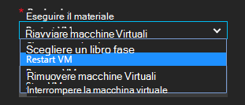

<properties
    pageTitle=" Correggere gli avvisi di Azure macchine Virtuali con automazione runbook | Microsoft Azure"
    description="In questo articolo viene illustrato come integrare avvisi macchina virtuale Azure con Azure automazione runbook e risoluzione automatica di problemi"
    services="automation"
    documentationCenter=""
    authors="mgoedtel"
    manager="jwhit"
    editor="tysonn" />    
<tags
    ms.service="automation"
    ms.devlang="na"
    ms.topic="article"
    ms.tgt_pltfrm="na"
    ms.workload="infrastructure-services"
    ms.date="06/14/2016"
    ms.author="csand;magoedte" />

# <a name="azure-automation-scenario---remediate-azure-vm-alerts"></a>Scenario di automazione di Azure - correggere gli avvisi di macchine Virtuali di Azure

Azure automazione e macchine virtuali di Azure hanno rilasciato una nuova caratteristica che consente di configurare avvisi virtuale macchina per eseguire l'automazione runbook. La nuova funzionalità consente di eseguire automaticamente rimedi standard in risposta agli avvisi macchine Virtuali, ad esempio riavviare o arrestare la macchina virtuale.

In precedenza, durante la creazione della regola di avviso macchine Virtuali è stato possibile [specificare un webhook di automazione](https://azure.microsoft.com/blog/using-azure-automation-to-take-actions-on-azure-alerts/) a un runbook per eseguire dal runbook ogni volta che lo ha attivato l'avviso. Tuttavia, richiesto di eseguire le operazioni di creazione dal runbook, creazione webhook per runbook, quindi copiare e incollare la webhook durante la creazione della regola di avviso. Con questa nuova versione, il processo è molto più facile perché è possibile scegliere un runbook direttamente da un elenco durante la creazione della regola di avviso e sarà possibile scegliere un account di automazione che verrà eseguita dal runbook o consente di creare facilmente un account.

In questo articolo si illustra quanto sia semplice per impostare un avviso di macchine Virtuali di Azure e configurare un runbook automazione eseguita ogni volta che l'avviso attiva. Scenari di esempio includono riavviare una macchina virtuale quando l'utilizzo della memoria supera alcune soglia a causa di un'applicazione in macchine Virtuali con una perdita di memoria o arrestare una macchina virtuale quando l'utilizzo della CPU è rimasto 1% per ultima ora e non è in uso. Verrà spiegato come la creazione automatica di un servizio dell'entità nell'account automazione semplifica l'utilizzo di runbook in Azure monitoraggio degli avvisi.

## <a name="create-an-alert-on-a-vm"></a>Creare un avviso per una macchina virtuale

Per configurare un avviso per avviare un runbook quando la soglia è stata soddisfatta, procedere come segue.

>[AZURE.NOTE] Con questa versione, è necessario supportare solo macchine virtuali V2 e supporto tecnico per classica che presto verranno aggiunti macchine virtuali.  

1. Accedere al portale di Azure e fare clic su **macchine virtuali**.  
2. Selezionare una delle macchine virtuali.  Verrà visualizzato e il dashboard macchina virtuale ed e **l'Impostazioni** alla sua destra.  
3. Nella sezione monitoraggio e **l'Impostazioni** , selezionare **le regole di avviso**.
4. Scegliere **Aggiungi avviso**e il **regole di avviso** .

Verrà aperta la **aggiungere una regola di avviso** e il, in cui è possibile configurare le condizioni per l'avviso e scegliere tra una o tutte queste opzioni: inviare un messaggio di posta elettronica a qualcuno, usare un webhook per inoltrare l'avviso verso un altro sistema e/o eseguire un runbook automazione nel tentativo di risposta di risolvere il problema.

## <a name="configure-a-runbook"></a>Configurare un runbook

Per configurare un runbook da eseguire quando viene soddisfatta la soglia di avviso macchine Virtuali, selezionare **Runbook di automazione**. In e il **runbook Configura** , è possibile selezionare dal runbook per l'esecuzione e l'account di automazione eseguire dal runbook in.


>[AZURE.NOTE] In questa versione è possibile scegliere tra tre runbook che fornisce il servizio: riavviare macchine Virtuali, macchine Virtuali interrompere o rimuovere macchine Virtuali (Elimina).  La possibilità di selezionare altri runbook oppure uno dei propri runbook saranno disponibile nelle versioni future.



Dopo aver selezionato una i tre runbook disponibile, viene visualizzato l'elenco a discesa **account automazione** ed è possibile selezionare un account di automazione che dal runbook verrà eseguito come. Runbook necessario eseguire nel contesto di un [account di automazione](automation-security-overview.md) nell'abbonamento Azure. È possibile selezionare un account di automazione che è già stato creato o avere un nuovo account di automazione creato.

Eseguire l'autenticazione runbook forniti in Azure con un'identità di servizio. Se si sceglie di eseguire dal runbook in uno degli account di automazione esistente, si crea automaticamente il servizio principale dell'utente. Se si sceglie di creare un nuovo account di automazione, quindi verrà automaticamente creato l'account e principale del servizio. In entrambi i casi, le attività verranno anche create in conto automazione: una risorsa di certificato denominato **AzureRunAsCertificate** e una risorsa di connessione denominata **AzureRunAsConnection**. I runbook utilizzerà **AzureRunAsConnection** per eseguire l'autenticazione con Azure per eseguire l'azione di gestione rispetto alla macchina virtuale.

>[AZURE.NOTE] Capitale servizio creato nell'ambito di abbonamento e viene assegnato il ruolo di collaboratore. Questo ruolo è necessario per l'account di disporre dell'autorizzazione per l'esecuzione di automazione runbook per gestire macchine virtuali di Azure.  La creazione di un account Automaton e/o servizio principale è un evento singolo. Dopo la creazione, è possibile utilizzare tale account eseguire runbook per gli altri avvisi macchine Virtuali di Azure.

Quando si fa clic su **OK** viene configurato l'avviso e se è stata selezionata l'opzione per creare un nuovo account di automazione, viene creato insieme al servizio principale.  Possono essere necessari alcuni secondi per il completamento.  


Al termine della configurazione sarà indicato il nome dal runbook in e **l'aggiungere una regola di avviso** .


Fare clic su **OK** **aggiungere una regola di avviso** blade e la regola di avviso verrà creati e attivare se la macchina virtuale è in esecuzione.

### <a name="enable-or-disable-a-runbook"></a>Attivare o disattivare un runbook

Se si dispone di un runbook configurato per ricevere un avviso, è possibile disattivare senza rimozione della configurazione runbook. In questo modo è possibile mantenere l'avviso in esecuzione e provare ad esempio le regole di avviso e in un secondo momento riattivare dal runbook.

## <a name="create-a-runbook-that-works-with-an-azure-alert"></a>Creare un runbook che funziona con un avviso di Azure

Quando si sceglie un runbook come parte di una regola di avviso Azure, dal runbook deve avere logica al suo interno per gestire i dati degli avvisi passati alla funzione.  Quando un runbook è configurato in una regola di avviso, viene creato un webhook runbook; tale webhook quindi viene utilizzato per avviare dal runbook ogni volta che l'avviso attiva.  La chiamata effettiva a iniziare dal runbook è una richiesta HTTP POST all'URL webhook. Corpo della convocazione POST contiene un oggetto JSON errato che contiene utili proprietà relative all'avviso.  Come si può vedere di seguito, i dati degli avvisi contengano dettagli come subscriptionID, resourceGroupName, resourceName e del tipo di risorsa.

### <a name="example-of-alert-data"></a>Esempio di dati di avviso
```
{
    "WebhookName": "AzureAlertTest",
    "RequestBody": "{
    \"status\":\"Activated\",
    \"context\": {
        \"id\":\"/subscriptions/<subscriptionId>/resourceGroups/MyResourceGroup/providers/microsoft.insights/alertrules/AlertTest\",
        \"name\":\"AlertTest\",
        \"description\":\"\",
        \"condition\": {
            \"metricName\":\"CPU percentage guest OS\",
            \"metricUnit\":\"Percent\",
            \"metricValue\":\"4.26337916666667\",
            \"threshold\":\"1\",
            \"windowSize\":\"60\",
            \"timeAggregation\":\"Average\",
            \"operator\":\"GreaterThan\"},
        \"subscriptionId\":\<subscriptionID> \",
        \"resourceGroupName\":\"TestResourceGroup\",
        \"timestamp\":\"2016-04-24T23:19:50.1440170Z\",
        \"resourceName\":\"TestVM\",
        \"resourceType\":\"microsoft.compute/virtualmachines\",
        \"resourceRegion\":\"westus\",
        \"resourceId\":\"/subscriptions/<subscriptionId>/resourceGroups/TestResourceGroup/providers/Microsoft.Compute/virtualMachines/TestVM\",
        \"portalLink\":\"https://portal.azure.com/#resource/subscriptions/<subscriptionId>/resourceGroups/TestResourceGroup/providers/Microsoft.Compute/virtualMachines/TestVM\"
        },
    \"properties\":{}
    }",
    "RequestHeader": {
        "Connection": "Keep-Alive",
        "Host": "<webhookURL>"
    }
}
```

Quando il servizio di webhook automazione riceve HTTP POST estrae i dati di avviso e passa alla runbook nel parametro di input runbook WebhookData.  Di seguito è riportato un esempio di runbook che illustra come utilizzare il parametro WebhookData ed estrarre i dati degli avvisi e usarlo per gestire la risorsa Azure che lo ha attivato l'avviso.

### <a name="example-runbook"></a>Esempio runbook

```
#  This runbook will restart an ARM (V2) VM in response to an Azure VM alert.

[OutputType("PSAzureOperationResponse")]

param ( [object] $WebhookData )

if ($WebhookData)
{
    # Get the data object from WebhookData
    $WebhookBody = (ConvertFrom-Json -InputObject $WebhookData.RequestBody)

    # Assure that the alert status is 'Activated' (alert condition went from false to true)
    # and not 'Resolved' (alert condition went from true to false)
    if ($WebhookBody.status -eq "Activated")
    {
        # Get the info needed to identify the VM
        $AlertContext = [object] $WebhookBody.context
        $ResourceName = $AlertContext.resourceName
        $ResourceType = $AlertContext.resourceType
        $ResourceGroupName = $AlertContext.resourceGroupName
        $SubId = $AlertContext.subscriptionId

        # Assure that this is the expected resource type
        Write-Verbose "ResourceType: $ResourceType"
        if ($ResourceType -eq "microsoft.compute/virtualmachines")
        {
            # This is an ARM (V2) VM

            # Authenticate to Azure with service principal and certificate
            $ConnectionAssetName = "AzureRunAsConnection"
            $Conn = Get-AutomationConnection -Name $ConnectionAssetName
            if ($Conn -eq $null) {
                throw "Could not retrieve connection asset: $ConnectionAssetName. Check that this asset exists in the Automation account."
            }
            Add-AzureRMAccount -ServicePrincipal -Tenant $Conn.TenantID -ApplicationId $Conn.ApplicationID -CertificateThumbprint $Conn.CertificateThumbprint | Write-Verbose
            Set-AzureRmContext -SubscriptionId $SubId -ErrorAction Stop | Write-Verbose

            # Restart the VM
            Restart-AzureRmVM -Name $ResourceName -ResourceGroupName $ResourceGroupName
        } else {
            Write-Error "$ResourceType is not a supported resource type for this runbook."
        }
    } else {
        # The alert status was not 'Activated' so no action taken
        Write-Verbose ("No action taken. Alert status: " + $WebhookBody.status)
    }
} else {
    Write-Error "This runbook is meant to be started from an Azure alert only."
}
```

## <a name="summary"></a>Riepilogo

Quando si configura un avviso in una macchina virtuale Azure, è ora possibile la possibilità di configurare facilmente un runbook automazione per eseguire automaticamente azioni di monitoraggio e aggiornamento quando si attiva l'avviso. In questa versione, è possibile scegliere dal runbook per riavviare, interrompere o eliminare una macchina virtuale in base al proprio scenario degli avvisi. Questo è solo l'inizio di abilitazione di scenari in cui è possibile controllare le azioni (notifica, risoluzione dei problemi, monitoraggio) che verranno eseguite automaticamente quando si attiva un avviso.

## <a name="next-steps"></a>Passaggi successivi

- Per iniziare a utilizzare runbook grafici, vedere [il primo runbook grafica](automation-first-runbook-graphical.md)
- Per iniziare a utilizzare runbook del flusso di lavoro di PowerShell, vedere [il primo runbook del flusso di lavoro PowerShell](automation-first-runbook-textual.md)
- Per ulteriori informazioni sulle limitazioni, i vantaggi e i tipi di runbook, vedere [tipi di runbook automazione di Azure](automation-runbook-types.md)
