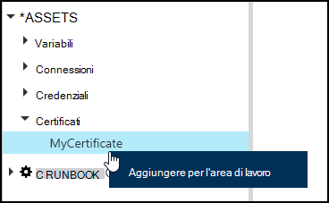
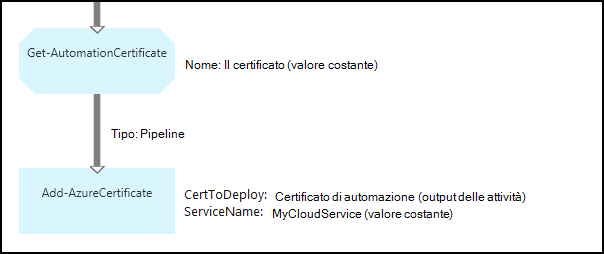

<properties 
   pageTitle="Certificato di risorse in Azure automazione | Microsoft Azure"
   description="I certificati possono essere creati in modo sicuro in Azure automazione in modo che sia possibile accedervi dal runbook o configurazioni DSC per l'autenticazione Azure e risorse di terze parti.  In questo articolo vengono illustrati i dettagli dei certificati e come utilizzarli nella modalità di modifica di testo e grafica."
   services="automation"
   documentationCenter=""
   authors="mgoedtel"
   manager="stevenka"
   editor="tysonn" />
<tags 
   ms.service="automation"
   ms.devlang="na"
   ms.topic="article"
   ms.tgt_pltfrm="na"
   ms.workload="infrastructure-services"
   ms.date="02/23/2016"
   ms.author="magoedte;bwren" />

# Risorse del certificato di automazione di Azure

I certificati possono essere creati in modo sicuro in Azure automazione in modo che è possibile accedervi dal runbook o configurazioni DSC utilizzando l'attività **Get-AutomationCertificate** . Questo consente di creare configurazioni DSC che utilizzano i certificati per l'autenticazione e runbook o aggiunte alle risorse di Azure o di terze parti.

>[AZURE.NOTE] Risorse sicure in Azure automazione sono le credenziali, i certificati, connessioni e variabili crittografate. Queste risorse vengono crittografate e archiviate in automazione Azure utilizzando una chiave univoca generati per ogni account di automazione. Questo tasto è crittografato tramite un certificato principale e archiviato in Azure automazione. Prima di archiviare una risorsa sicura, la chiave per l'account di automazione decrittografia utilizzando il certificato master e quindi utilizzata per crittografare le risorse.

## Cmdlet di Windows PowerShell

I cmdlet descritti nella tabella seguente vengono utilizzati per creare e gestire le risorse del certificato automazione con Windows PowerShell. Vengono forniti come parte del [modulo PowerShell per Azure](../powershell-install-configure.md) è disponibile per l'utilizzo in runbook di automazione e configurazioni DSC.

|Cmdlet|Descrizione|
|:---|:---|
|[Get-AzureAutomationCertificate](http://msdn.microsoft.com/library/dn913765.aspx)|Recupera informazioni su un certificato. È possibile recuperare il certificato stesso solo da Get-AutomationCertificate attività.|
|[Nuovo AzureAutomationCertificate](http://msdn.microsoft.com/library/dn913764.aspx)|Importa un nuovo certificato in Azure automazione.|
|[Rimuovi - AzureAutomationCertificate](http://msdn.microsoft.com/library/dn913773.aspx)|Rimuove un certificato da Azure automazione.|
|[Set - AzureAutomationCertificate](http://msdn.microsoft.com/library/dn913763.aspx)|Imposta le proprietà per un certificato esistente durante il caricamento di file di certificato e impostare la password per un file pfx.|

## Attività di accedere ai certificati

Le attività nella tabella seguente vengono utilizzate per accedere a certificati in una configurazione di DSC o runbook.

|Attività|Descrizione|
|:---|:---|
|Get-AutomationCertificate|Ottiene un certificato da utilizzare in una configurazione di DSC o runbook.|

>[AZURE.NOTE] È consigliabile evitare di utilizzare variabili nel nome parametro – di Get-AutomationCertificate poiché questa rendere più complessa esecuzione individuazione dipendenze tra runbook o DSC configurazioni e certificato risorse in fase di progettazione.

## Creazione di un nuovo certificato

Quando si crea un nuovo certificato, viene caricato un file CER o pfx in Azure automazione. Se si seleziona il certificato come esportabile, è possibile trasferire il dall'archivio certificati di automazione di Azure. Se non è esportabile, quindi può solo essere utilizzato per l'accesso all'interno della runbook o configurazione DSC.

### Per creare un nuovo certificato con il portale classico Azure

1. Dal proprio account di automazione, fare clic su **risorse** nella parte superiore della finestra.
1. Nella parte inferiore della finestra, fare clic su **Aggiungi impostazione**.
1. Fare clic su **Aggiungi credenziali**.
2. Nell'elenco a discesa **Tipo di credenziali** , selezionare **certificato**.
3. Digitare un nome per il certificato nella casella **nome** e fare clic sulla freccia a destra.
4. Selezionare un file CER o pfx.  Se si seleziona un file. pfx, specificare se deve essere consentito da esportare e una password.
1. Fare clic sul segno di spunta per caricare il file di certificato e salvare il nuovo bene certificato.

### Per creare un nuovo certificato con il portale di Azure

1. Dal proprio account di automazione, fare clic sulla parte di **risorse** per aprire e il **risorse** .
1. Fare clic sulla parte di **certificati** per aprire e il **certificati** .
1. Fare clic su **Aggiungi un certificato** nella parte superiore e il.
2. Digitare un nome per il certificato nella casella **nome** .
2. Fare clic su **Seleziona un file** in **caricare un file di certificato** per cercare un file CER o pfx.  Se si seleziona un file. pfx, specificare se deve essere consentito da esportare e una password.
1. Fare clic su **Crea** per salvare il nuovo bene certificato.

### Per creare un nuovo certificato con Windows PowerShell

I comandi di esempio seguente viene illustrato come creare un nuovo certificato di automazione e contrassegna esportabile. Consente di importare un file pfx esistente.

    $certName = 'MyCertificate'
    $certPath = '.\MyCert.pfx'
    $certPwd = ConvertTo-SecureString -String 'P@$$w0rd' -AsPlainText -Force
    
    New-AzureAutomationCertificate -AutomationAccountName "MyAutomationAccount" -Name $certName -Path $certPath –Password $certPwd -Exportable

## Utilizzo di un certificato

È necessario utilizzare l'attività **Get-AutomationCertificate** per usare un certificato. È possibile utilizzare il cmdlet [Get-AzureAutomationCertificate](http://msdn.microsoft.com/library/dn913765.aspx) dal momento che restituisce informazioni sulla bene certificato ma non il certificato stesso.

### Esempio di runbook testuale

Il codice di esempio seguente viene illustrato come aggiungere un certificato in un servizio cloud in un runbook. In questo esempio, la password verrà recuperata una variabile di automazione crittografato.

    $serviceName = 'MyCloudService'
    $cert = Get-AutomationCertificate -Name 'MyCertificate'
    $certPwd = Get-AutomationVariable –Name 'MyCertPassword'
    Add-AzureCertificate -ServiceName $serviceName -CertToDeploy $cert

### Esempio di runbook grafica

Aggiungere un **Get-AutomationCertificate** un runbook grafica destro del mouse sul certificato nel riquadro raccolta dell'editor di grafica e selezionando **Aggiungi all'area di lavoro**.

Nella figura seguente mostra un esempio dell'uso di un certificato in un grafico runbook.  Questo è lo stesso esempio sopra per l'aggiunta di un certificato in un servizio cloud da un runbook testuale.  

In questo esempio viene utilizzato il parametro **UseConnectionObject** impostato per l'attività **Invia TwilioSMS** che utilizza un oggetto di connessione per l'autenticazione al servizio.  Poiché un collegamento sequenza restituirebbe una raccolta che contiene un oggetto singolo che non è previsto il parametro di connessione, è necessario utilizzare un [collegamento pipeline](automation-graphical-authoring-intro.md#links-and-workflow) di seguito.

## Vedere anche

- [Collegamenti nei grafici per la modifica](automation-graphical-authoring-intro.md#links-and-workflow) 
