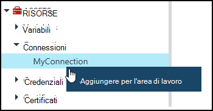
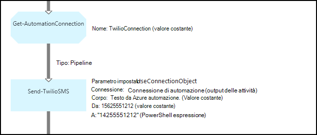
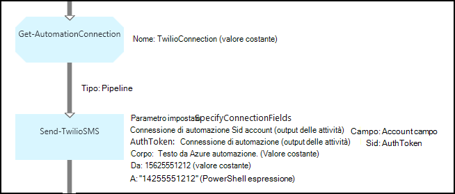

<properties 
   pageTitle="Risorse di connessione in Azure automazione | Microsoft Azure"
   description="Risorse di connessione in Azure automazione contengono le informazioni necessarie per connettersi a un servizio esterno o applicazione da una configurazione di DSC o runbook. In questo articolo vengono illustrati i dettagli delle connessioni e come utilizzarli nella modalità di modifica di testo e grafica."
   services="automation"
   documentationCenter=""
   authors="bwren"
   manager="stevenka"
   editor="tysonn" />
<tags 
   ms.service="automation"
   ms.devlang="na"
   ms.topic="article"
   ms.tgt_pltfrm="na"
   ms.workload="infrastructure-services"
   ms.date="01/27/2016"
   ms.author="bwren" />

# Risorse di connessione di automazione di Azure

Una risorsa di connessione di automazione contiene le informazioni necessarie per connettersi a un servizio esterno o applicazione da una configurazione di DSC o runbook. Questo può includere le informazioni necessarie per l'autenticazione, ad esempio un nome utente e password oltre a informazioni di connessione, ad esempio un URL o una porta. Il valore di una connessione è memorizzare tutte le proprietà per la connessione a una specifica applicazione di una risorsa rispetto alla creazione di più variabili. L'utente può modificare i valori per una connessione in un'unica posizione ed è possibile passare il nome di una connessione a un runbook o configurazione DSC in un singolo parametro. Le proprietà per una connessione accessibili la configurazione di DSC all'attività **Get-AutomationConnection** o runbook.

Quando si crea una connessione, è necessario specificare un *tipo di connessione*. Il tipo di connessione è un modello che definisce un insieme di proprietà. La connessione definisce i valori per ogni proprietà definita nel tipo di connessione. Tipi di connessione vengono aggiunti Azure automazione nei moduli di integrazione o creati con l' [API di automazione Azure](http://msdn.microsoft.com/library/azure/mt163818.aspx). I tipi di connessione solo sono disponibili quando si crea una connessione sono installate nell'account di automazione.

>[AZURE.NOTE] Risorse sicure in Azure automazione sono le credenziali, i certificati, connessioni e variabili crittografate. Queste risorse vengono crittografate e archiviate in automazione Azure utilizzando una chiave univoca generati per ogni account di automazione. Questo tasto è crittografato tramite un certificato principale e archiviato in Azure automazione. Prima di archiviare una risorsa sicura, la chiave per l'account di automazione decrittografia utilizzando il certificato master e quindi utilizzata per crittografare le risorse.

## Cmdlet di Windows PowerShell

I cmdlet descritti nella tabella seguente vengono utilizzati per creare e gestire le connessioni di automazione con Windows PowerShell. Vengono forniti come parte del [modulo PowerShell per Azure](../powershell-install-configure.md) è disponibile per l'utilizzo in runbook di automazione e configurazioni DSC.

|Cmdlet|Descrizione|
|:---|:---|
|[Get-AzureAutomationConnection](http://msdn.microsoft.com/library/dn921828.aspx)|Recupera una connessione. Include una tabella hash con i valori dei campi della connessione.|
|[Nuovo AzureAutomationConnection](http://msdn.microsoft.com/library/dn921825.aspx)|Crea una nuova connessione.|
|[Rimuovi AzureAutomationConnection](http://msdn.microsoft.com/library/dn921827.aspx)|Rimuovere una connessione esistente.|
|[Set AzureAutomationConnectionFieldValue](http://msdn.microsoft.com/library/dn921826.aspx)|Imposta il valore di un determinato campo di una connessione esistente.|

## Attività

Le attività nella tabella seguente vengono utilizzate per accedere alle connessioni in una configurazione di DSC o runbook.

|Attività|Descrizione|
|---|---|
|Get-AutomationConnection|Ottiene la connessione da utilizzare. Restituisce una tabella hash con le proprietà della connessione.|

>[AZURE.NOTE] È consigliabile evitare di utilizzare variabili nel nome parametro – di **Get-AutomationConnection** poiché si possono rendere più complessa esecuzione individuazione dipendenze tra runbook o DSC configurazioni e risorse di connessione in fase di progettazione.

## Creare una nuova connessione

### Per creare una nuova connessione con il portale classico Azure

1. Dal proprio account di automazione, fare clic su **risorse** nella parte superiore della finestra.
1. Nella parte inferiore della finestra, fare clic su **Aggiungi impostazione**.
1. Fare clic su **Aggiungi connessione**.
2. Nell'elenco a discesa **Tipo di connessione** , selezionare il tipo di connessione che si desidera creare.  La procedura guidata presenterà le proprietà per quel particolare tipo.
1. Completare la procedura guidata fare clic sulla casella di controllo per salvare la nuova connessione.

### Per creare una nuova connessione con il portale di Azure

1. Dal proprio account di automazione, fare clic sulla parte di **risorse** per aprire e il **risorse** .
1. Fare clic sulla parte di **connessioni** per aprire e il **connessioni** .
1. Fare clic su **Aggiungi una connessione** nella parte superiore e il.
2. Nell'elenco a discesa **tipo** , selezionare il tipo di connessione che si desidera creare. Il modulo presenterà le proprietà per quel particolare tipo.
1. Compilare il modulo e fare clic su **Crea** per salvare la nuova connessione.

### Per creare una nuova connessione con Windows PowerShell

Creare una nuova connessione con Windows PowerShell utilizzando il cmdlet [New-AzureAutomationConnection](http://msdn.microsoft.com/library/dn921825.aspx) . Questo cmdlet include un parametro denominato **ConnectionFieldValues** che prevede una [tabella hash](http://technet.microsoft.com/library/hh847780.aspx) che definisce i valori per ognuna delle proprietà definite per il tipo di connessione.

I comandi di esempio seguenti creano una nuova connessione per [Twilio](http://www.twilio.com) è un servizio di telefonia che consente di inviare e ricevere messaggi di testo.  Un modulo di integrazione di esempio che include un tipo di connessione Twilio è disponibile [nell'Interfaccia di Script](http://gallery.technet.microsoft.com/scriptcenter/Twilio-PowerShell-Module-8a8bfef8).  Questo tipo di connessione definisce proprietà per SID Account e Token autorizzazioni necessarie per convalidare l'account quando ci si connette a Twilio.  È necessario [scaricare questo modulo](http://gallery.technet.microsoft.com/scriptcenter/Twilio-PowerShell-Module-8a8bfef8) e installarlo nel proprio account di automazione per questo codice di esempio per l'uso.

    $AccountSid = "DAf5fed830c6f8fac3235c5b9d58ed7ac5"
    $AuthToken  = "17d4dadfce74153d5853725143c52fd1"
    $FieldValues = @{"AccountSid" = $AccountSid;"AuthToken"=$AuthToken}

    New-AzureAutomationConnection -AutomationAccountName "MyAutomationAccount" -Name "TwilioConnection" -ConnectionTypeName "Twilio" -ConnectionFieldValues $FieldValues

## Si usa una connessione in una configurazione di DSC o runbook

Per recuperare una connessione in una configurazione di DSC con il cmdlet **Get-AutomationConnection** o runbook.  Questa attività recupera i valori dei campi diversi la connessione e li restituisce come una [tabella hash](http://go.microsoft.com/fwlink/?LinkID=324844) utilizzabile con i comandi appropriati la configurazione di DSC o runbook.

### Esempio di runbook testuale
I comandi di esempio seguente viene illustrato come utilizzare la connessione Twilio dell'esempio precedente per inviare un messaggio di testo da un runbook.  L'attività Invia TwilioSMS utilizzato qui prevede due set di parametro ogni utilizzare un altro metodo per l'autenticazione per il servizio di Twilio.  Una viene utilizzato un oggetto di connessione e un'altra utilizza singoli parametri per l'Account SID e Token di autorizzazione.  In questo esempio vengono visualizzati entrambi i metodi.

    $Con = Get-AutomationConnection -Name "TwilioConnection"
    $NumTo = "14255551212"
    $NumFrom = "15625551212"
    $Body = "Text from Azure Automation."

    #Send text with connection object.
    Send-TwilioSMS -Connection $Con -From $NumFrom -To $NumTo -Body $Body

    #Send text with connection properties.
    Send-TwilioSMS -AccountSid $Con.AccountSid -AuthToken $Con.AuthToken -From $NumFrom -To $NumTo -Body $Body

### Esempi di runbook grafica

Aggiungere un'attività **Get-AutomationConnection** un runbook grafica destro del mouse sulla connessione nel riquadro raccolta dell'editor di grafica e selezionando **Aggiungi all'area di lavoro**.

Nella figura seguente mostra un esempio dell'uso di una connessione in un grafico runbook.  Questo è lo stesso esempio sopra per l'invio di un messaggio di testo usando Twilio da un runbook testuale.  In questo esempio viene utilizzato il parametro **UseConnectionObject** impostato per l'attività **Invia TwilioSMS** che utilizza un oggetto di connessione per l'autenticazione al servizio.  Un [collegamento pipeline](automation-graphical-authoring-intro.md#links-and-workflow) viene utilizzata qui poiché il parametro di connessione prevede un singolo oggetto.

Il motivo per cui un PowerShell espressione viene utilizzata per il valore di parametro **a** anziché un valore costante è che questo parametro prevede un tipo di valore stringa in forma di matrice, in modo che sia possibile inviare a più numeri.  Un'espressione di PowerShell consente di specificare un singolo valore o una matrice.

Nell'immagine seguente mostra la stessa esempio come in precedenza ma utilizza il parametro **SpecifyConnectionFields** impostato che prevede i parametri AccountSid e AuthToken per specificare singolarmente anziché utilizzando un oggetto di connessione per l'autenticazione.  In questo caso, i campi della connessione vengono specificati anziché l'oggetto stesso.  

## Articoli correlati

- [Collegamenti nei grafici per la modifica](automation-graphical-authoring-intro.md#links-and-workflow)
 
