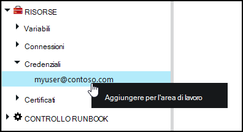
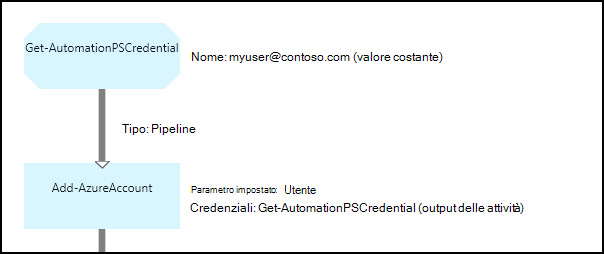

<properties 
   pageTitle="Credenziali beni nel modello di automazione Azure | Microsoft Azure"
   description="Risorse di credenziali in Azure automazione contengono le credenziali di sicurezza che possono essere utilizzate per eseguire l'autenticazione alle risorse accessibili dal runbook o configurazione DSC. In questo articolo viene descritto come creare credenziali beni e utilizzarli in una configurazione di DSC o runbook."
   services="automation"
   documentationCenter=""
   authors="mgoedtel"
   manager="jwhit"
   editor="tysonn" />
<tags 
   ms.service="automation"
   ms.devlang="na"
   ms.topic="article"
   ms.tgt_pltfrm="na"
   ms.workload="infrastructure-services"
   ms.date="06/09/2016"
   ms.author="bwren" />

# Credenziali beni nel modello di automazione Azure

Una risorsa di credenziali di automazione contiene un oggetto [PSCredential](http://msdn.microsoft.com/library/system.management.automation.pscredential) che contiene le credenziali di sicurezza, ad esempio un nome utente e password. Configurazioni runbook e DSC possono utilizzare i cmdlet che accettano un oggetto PSCredential per l'autenticazione o può estrarre il nome utente e la password dell'oggetto PSCredential per fornire a un'applicazione o un servizio che richiede l'autenticazione. Le proprietà per credenziali archiviate in Azure automazione ed è possibile accedervi la configurazione di DSC all'attività [Get-AutomationPSCredential](http://msdn.microsoft.com/library/system.management.automation.pscredential.aspx) o runbook.

>[AZURE.NOTE] Risorse sicure in Azure automazione sono le credenziali, i certificati, connessioni e variabili crittografate. Queste risorse vengono crittografate e archiviate in automazione Azure utilizzando una chiave univoca generati per ogni account di automazione. Questo tasto è crittografato tramite un certificato principale e archiviato in Azure automazione. Prima di archiviare una risorsa sicura, la chiave per l'account di automazione decrittografia utilizzando il certificato master e quindi utilizzata per crittografare le risorse. 

## Cmdlet di Windows PowerShell

I cmdlet descritti nella tabella seguente vengono utilizzati per creare e gestire l'automazione credenziali beni con Windows PowerShell.  Vengono forniti come parte del [modulo PowerShell per Azure](../powershell-install-configure.md) è disponibile per l'utilizzo in runbook di automazione e configurazioni DSC.

|Cmdlet|Descrizione|
|:---|:---|
|[Get-AzureAutomationCredential](http://msdn.microsoft.com/library/dn913781.aspx)|Recupera informazioni su una risorsa di credenziali. È possibile recuperare le credenziali stesso solo da **Get-AutomationPSCredential** attività.|
|[Nuovo AzureAutomationCredential](http://msdn.microsoft.com/library/azure/jj554330.aspx)|Crea una nuova credenziale di automazione.|
|[Rimuovi - AzureAutomationCredential](http://msdn.microsoft.com/library/azure/jj554330.aspx)|Rimuove una credenziale di automazione.|
|[Set - AzureAutomationCredential](http://msdn.microsoft.com/library/azure/jj554330.aspx)|Imposta le proprietà per una credenziale automazione esistente.|

## Attività runbook

Le attività nella tabella seguente vengono utilizzate per accedere alle credenziali in un runbook e configurazioni DSC.

|Attività|Descrizione|
|:---|:---|
|Get-AutomationPSCredential|Ottiene credenziali da utilizzare in una configurazione di DSC o runbook. Restituisce un oggetto [System.Management.Automation.PSCredential](http://msdn.microsoft.com/library/system.management.automation.pscredential) .|

>[AZURE.NOTE] È consigliabile evitare di utilizzare variabili nel nome parametro – di Get-AutomationPSCredential poiché questa rendere più complessa esecuzione individuazione dipendenze tra runbook o DSC configurazioni e credenziali risorse in fase di progettazione.

## Creazione di un nuovo bene credenziali

### Per creare un nuovo bene credenziali con il portale classico Azure

1. Dal proprio account di automazione, fare clic su **risorse** nella parte superiore della finestra.
1. Nella parte inferiore della finestra, fare clic su **Aggiungi impostazione**.
1. Fare clic su **Aggiungi credenziali**.
2. Nell'elenco a discesa **Tipo di credenziali** , selezionare **PowerShell credenziali**.
1. Completare la procedura guidata fare clic sulla casella di controllo per salvare le nuove credenziali.

### Per creare un nuovo bene credenziali con il portale di Azure

1. Dal proprio account di automazione, fare clic sulla parte di **risorse** per aprire e il **risorse** .
1. Fare clic sulla parte di **credenziali** per aprire e il **credenziali** .
1. Fare clic su **Aggiungi credenziali** nella parte superiore e il.
1. Compilare il modulo e fare clic su **Crea** per salvare le nuove credenziali.

### Per creare un nuovo bene credenziali con Windows PowerShell

I comandi di esempio seguente viene illustrato come creare nuove credenziali di automazione. Un oggetto PSCredential viene creato con il nome e la password e quindi utilizzato per creare la risorsa credenziali. In alternativa, è possibile utilizzare il cmdlet **Get-Credential** verrà chiesto di digitare un nome e la password.

    $user = "MyDomain\MyUser"
    $pw = ConvertTo-SecureString "PassWord!" -AsPlainText -Force
    $cred = New-Object –TypeName System.Management.Automation.PSCredential –ArgumentList $user, $pw
    New-AzureAutomationCredential -AutomationAccountName "MyAutomationAccount" -Name "MyCredential" -Value $cred

## Usando le credenziali PowerShell

Per recuperare una risorsa di credenziali in una configurazione di DSC all'attività **Get-AutomationPSCredential** o runbook. Restituisce un [oggetto PSCredential](http://msdn.microsoft.com/library/system.management.automation.pscredential.aspx) che è possibile usare con un'attività o un cmdlet che richiede un parametro PSCredential. È inoltre possibile recuperare le proprietà dell'oggetto credenziali da utilizzare singolarmente. L'oggetto è una proprietà per il nome utente e la password di protezione oppure è possibile utilizzare il metodo **GetNetworkCredential** per restituire un oggetto [NetworkCredential](http://msdn.microsoft.com/library/system.net.networkcredential.aspx) che costituirà una versione non protetta della password.

### Esempio di runbook testuale

I comandi di esempio seguente viene illustrato come utilizzare credenziali PowerShell in una runbook. In questo esempio viene recuperata le credenziali e il nome utente e la password assegnata a variabili.

    $myCredential = Get-AutomationPSCredential -Name 'MyCredential'
    $userName = $myCredential.UserName
    $securePassword = $myCredential.Password
    $password = $myCredential.GetNetworkCredential().Password

### Esempio di runbook grafica

Aggiungere un'attività **Get-AutomationPSCredential** un runbook grafica facendo alla credenziale nel riquadro raccolta dell'editor di grafica e selezionando **Aggiungi all'area di lavoro**.

Nella figura seguente mostra un esempio dell'uso di credenziali in un grafico runbook.  In questo caso è che viene usata per l'autenticazione per runbook alle risorse di Azure, come descritto in [Autenticare runbook con account utente di Azure Active Directory](automation-sec-configure-aduser-account.md).  La prima attività recupera le credenziali che ha accesso all'abbonamento Azure.  L'attività **Aggiungi AzureAccount** utilizza quindi questo credenziali per l'autenticazione per tutte le attività che si seguono.  Un [collegamento pipeline](automation-graphical-authoring-intro.md#links-and-workflow) è tornato poiché **Get-AutomationPSCredential** è previsto un singolo oggetto.  

## Utilizzo di credenziali PowerShell in DSC
Mentre le configurazioni DSC in Azure automazione possono fare riferimento beni credenziali tramite **Get-AutomationPSCredential**, credenziali risorse è anche possibile passare tramite i parametri, se lo si desidera. Per ulteriori informazioni, vedere [configurazioni di compilazione di Azure automazione DSC](automation-dsc-compile.md#credential-assets).

## Passaggi successivi

- Per ulteriori informazioni sui collegamenti nei grafici per la modifica, vedere [collegamenti nei grafici per la modifica](automation-graphical-authoring-intro.md#links-and-workflow)
- Per comprendere i diversi metodi di autenticazione con l'automazione, vedere [Sicurezza automazione di Windows Azure](automation-security-overview.md)
- Per iniziare a utilizzare runbook grafici, vedere [il primo runbook grafica](automation-first-runbook-graphical.md)
- Per iniziare a utilizzare runbook del flusso di lavoro di PowerShell, vedere [il primo runbook del flusso di lavoro PowerShell](automation-first-runbook-textual.md) 

 
