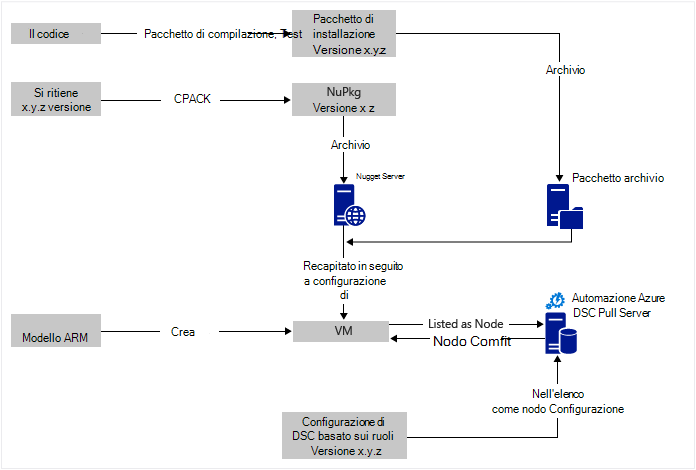
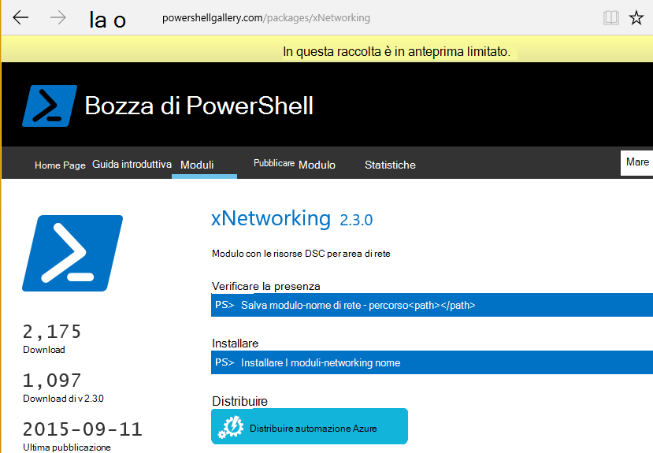

<properties
   pageTitle="Automazione Azure DSC distribuzione continuo con Chocolatey | Microsoft Azure"
   description="Distribuzione di continuo attrezzi utilizzando Azure automazione DSC e gestione pacchetti Chocolatey.  Esempio di modello ARM JSON completo e la fonte di PowerShell."
   services="automation"
   documentationCenter=""
   authors="sebastus"
   manager="stevenka"
   editor=""/>

<tags
   ms.service="automation"
   ms.devlang="na"
   ms.topic="article"
   ms.tgt_pltfrm="vm-windows"
   ms.workload="na"
   ms.date="08/08/2016"
   ms.author="golive"/>

# Esempio di utilizzo: Distribuzione continua a macchine virtuali utilizzando DSC di automazione e Chocolatey

In un mondo attrezzi sono disponibili numerosi strumenti che faciliteranno con punti di varie pipeline integrazione continua.  Configurazione di stato desiderato automazione Azure (DSC) è un nuovo miglioramento le opzioni in grado di utilizzare attrezzi team.  In questo articolo viene illustrato come impostare la distribuzione continua (CD) per un computer Windows.  È possibile estendere facilmente tecnica per includere un numero di computer Windows in base alle esigenze del ruolo (ad esempio un sito web) e da tale posizione per anche ruoli aggiuntivi.

## Alto livello

Esiste un gran parte qui il problema, ma per fortuna può essere suddiviso in due processi principali: 

  - Scrivere codice e verifica, la creazione e pubblicazione di pacchetti di installazione di versioni principali e secondarie del sistema. 
  - Creare e gestire macchine virtuali che verranno installare ed eseguire il codice nei pacchetti.  

Una volta entrambi i processi principali, è un passaggio breve per aggiornare automaticamente il pacchetto in esecuzione su qualsiasi macchine Virtuali specifico come nuove versioni vengono create e distribuite.

## Cenni preliminari sul componente

Pacchetto Manager, ad esempio [apt get](https://en.wikipedia.org/wiki/Advanced_Packaging_Tool) sono molto noti nel mondo Linux, ma non tanto al mondo di Windows.  [Chocolatey](https://chocolatey.org/) è ad esempio una cosa di Scott Hanselman [blog](http://www.hanselman.com/blog/IsTheWindowsUserReadyForAptget.aspx) sull'argomento è un ottimo intro.  In breve, Chocolatey consente di installare pacchetti da un archivio centrale di pacchetti in un sistema di Windows dalla riga di comando.  È possibile creare e gestire il proprio repository e Chocolatey possono installare pacchetti da qualsiasi numero di archivi che è possibile designare.

Configurazione stato desiderata (DSC) ([Panoramica](https://technet.microsoft.com/library/dn249912.aspx)) è uno strumento di PowerShell che consente di dichiarare la configurazione desiderata per un computer.  Ad esempio, si può ad esempio, "Desidero Chocolatey installato, desidero installato IIS, desidero porta 80 aperta, desidero versione 1.0.0 del proprio sito Web installato."  DSC locale configurazione Manager (MCM) implementata la configurazione. Un Server di estrarre DSC contiene un archivio di configurazioni per il computer. MCM in ogni computer verifica periodicamente per verificare se la configurazione corrisponde alla configurazione archiviata. Può inviare una segnalazione dello stato o provare a ripristinare la macchina in allineamento con la configurazione archiviata. È possibile modificare la configurazione archiviata nel server pull cause un computer o un insieme di macchine ad entrare in allineamento con la configurazione modificata.

Automazione Azure è un servizio gestito in Microsoft Azure che consente di automatizzare alcune attività tramite runbook, nodi, le credenziali, risorse e risorse, ad esempio le pianificazioni e variabili globali. DSC automazione Azure estende questa funzionalità di automazione che include strumenti DSC PowerShell.  Ecco una [Panoramica](automation-dsc-overview.md).

Una risorsa DSC è un modulo di codice che ha caratteristiche specifiche, ad esempio la gestione di rete, Active Directory o SQL Server.  La risorsa DSC Chocolatey sia in grado di accedere a un NuGet Server (tra gli altri), scaricare i pacchetti, installare pacchetti e così via.  Sono disponibili molte altre risorse DSC nella [Raccolta di PowerShell](http://www.powershellgallery.com/packages?q=dsc+resources&prerelease=&sortOrder=package-title).  I moduli vengono installati nel Server Pull di Azure automazione DSC (dall'utente) in modo che possono essere utilizzati per le configurazioni.

Modelli di ARM consentono di generazione dell'infrastruttura - elementi quali reti, subnet, la sicurezza della rete in modo dichiarativo e routing, caricano bilanciamento del carico, NIC, macchine virtuali e così via.  Ecco un [articolo](../resource-manager-deployment-model.md) che contiene un confronto il modello di distribuzione ARM (dichiarativo), con la gestione del servizio di Azure (ASM o classica) il modello di distribuzione (imperativo).  E un altro [articolo](../virtual-machines/virtual-machines-windows-compare-deployment-models.md) sui provider di risorse di base, di calcolo, di spazio di archiviazione e di rete.

Una caratteristica di un modello di ARM è la possibilità di installare un'estensione macchine Virtuali in macchina virtuale come è stato effettuato il provisioning.  Estensione di macchine Virtuali ha caratteristiche specifiche, ad esempio l'esecuzione di script personalizzati, installare il software antivirus o esecuzione di uno script di configurazione DSC.  Sono disponibili molti altri tipi di estensioni macchine Virtuali.

## Rapida visita intorno al diagramma

A partire dalla parte superiore, scrivere il codice, creare e verificare e quindi creare un pacchetto di installazione.  Chocolatey può gestire diversi tipi di pacchetti di installazione, ad esempio MSI, autonomi Microsoft Update, CAP.  E si dispone di tutta la potenza di PowerShell per eseguire l'installazione effettiva se non si trovano funzionalità native del Chocolatey molto su di esso.  Inserire il pacchetto in un punto raggiungibile – un archivio di pacchetto.  In questo esempio viene utilizzato una cartella pubblica in un account di archiviazione blob Azure, ma può essere in un punto qualsiasi.  Chocolatey funziona a livello nativo con NuGet server e alcuni altri utenti per la gestione dei metadati del pacchetto.  [In questo articolo](https://github.com/chocolatey/choco/wiki/How-To-Host-Feed) vengono descritte le opzioni.  In questo esempio viene utilizzato NuGet.  Un Nuspec è metadati relativi i pacchetti.  Il Nuspec "compilato" del NuPkg e archiviati in un server NuGet.  Quando la configurazione richiede un pacchetto in base al nome e fa riferimento a un server NuGet, la risorsa DSC Chocolatey (ora in macchine Virtuali) acquisisce il pacchetto e installa automaticamente.  È anche possibile richiedere una versione specifica di un pacchetto.

Nella parte inferiore sinistra dell'immagine, è un modello di Azure risorsa Manager (ARM).  In questo esempio di utilizzo, l'estensione macchine Virtuali registra la macchina virtuale con il Server di Azure automazione DSC Pull (ovvero, un server di pull) come un nodo.  La configurazione è archiviata nel server di pull.  In realtà, questa viene archiviata due volte: una volta come testo normale e una volta compilato come file MOF (per coloro che conoscere fattori.)  Nel portale di Operations Framework è una configurazione"nodo" (anziché semplicemente "configurazione").  È l'elemento è associata a un nodo in modo che il nodo saprà la configurazione.  Dettagli riportati di seguito viene illustrato come assegnare la configurazione di nodo al livello di nodo.

Probabilmente si sta già eseguendo bit nella parte superiore o la maggior parte di esso.  Creazione di nuspec, compilazione e archiviare i dati in un server NuGet è una piccola cosa.  E si gestiscono già macchine virtuali.  Il passaggio successivo alla distribuzione continua richiede la configurazione del server di pull (una sola volta), la registrazione dei nodi con esso () e creazione e l'archiviazione di configurazione di (inizialmente).  Quindi pacchetti vengono aggiornati e distribuiti all'archivio, è possibile aggiornare la configurazione e la configurazione di nodo nel server di pull (ripetizione in base alle esigenze).

Se sta non inizia con un modello di ARM, significa che anche OK.  Sono disponibili i cmdlet di PowerShell che consentono di registrare le macchine virtuali con il server di recuperare e tutti gli altri. Per ulteriori informazioni, vedere l'articolo: [Onboarding macchine per la gestione da Azure automazione DSC](automation-dsc-onboarding.md)

## Passaggio 1: Configurare l'account di server e automazione pull

In una riga di comando di PowerShell (Aggiungi AzureRmAccount) autenticata: (può richiedere alcuni minuti mentre il server di recuperare sia configurato)

    New-AzureRmResourceGroup –Name MY-AUTOMATION-RG –Location MY-RG-LOCATION-IN-QUOTES
    New-AzureRmAutomationAccount –ResourceGroupName MY-AUTOMATION-RG –Location MY-RG-LOCATION-IN-QUOTES –Name MY-AUTOMATION-ACCOUNT 

È possibile inserire l'account di automazione in una delle regioni seguente (o posizione): Stati Uniti orientali 2, Sud Central US, Virginia Contattaci Gov, ovest Europa, Sudest asiatico, Giappone Oriente, India centrale e Australia sudest.

## Passaggio 2: Modifiche di estensione macchine Virtuali al modello ARM

Informazioni dettagliate per la registrazione macchine Virtuali (con estensione macchine Virtuali DSC PowerShell) fornite in questo [Modello di Guida introduttiva di Azure](https://github.com/Azure/azure-quickstart-templates/tree/master/dsc-extension-azure-automation-pullserver).  Questo passaggio registra la nuova macchina virtuale con il server di recuperare nell'elenco dei nodi DSC.  Parte di questa registrazione è che specifica la configurazione di nodo da applicare al livello di nodo.  Non è disponibile questa configurazione nodo esiste ancora nel server pull in modo che è consentito il passaggio 4 è in tal caso per la prima volta.  Ma qui nel passaggio 2 è necessario avere scelto il nome del nodo e il nome della configurazione.  In questo esempio di utilizzo, il nodo è 'isvbox' e la configurazione è 'ISVBoxConfig'.  In modo che il nome di configurazione del nodo (per specificare in DeploymentTemplate.json) è 'ISVBoxConfig.isvbox'.  

## Passaggio 3: Aggiunta di risorse necessarie DSC al server pull

La raccolta di PowerShell strumentazione per installare DSC risorse nel proprio account Azure automazione.  Passare alla risorsa desiderata e fare clic sul pulsante "Distribuzione di Azure automazione".

Un'altra tecnica sono state recentemente aggiunta al portale di Azure consente di inserire i nuovi moduli o aggiornare i moduli esistenti. Fare clic su tramite la risorsa automazione Account, il riquadro attività e infine sul riquadro moduli.  Icona Sfoglia raccolta consente di visualizzare l'elenco dei moduli nella raccolta, drill-down dei dettagli e infine importare nel proprio Account di automazione. Questa è un'ottima soluzione per mantenere aggiornati i moduli di tanto in tanto. E la funzionalità di importazione verifica le dipendenze con altri moduli per assicurarsi che non vengono sincronizzati.

In alternativa, esiste un approccio manuale.  La struttura delle cartelle di un modulo di integrazione di PowerShell per un computer Windows è leggermente diversa dalla struttura della cartella prevista dall'automazione Azure.  È necessario un po' di modifiche da parte dell'utente.  Ma non è difficile e viene eseguita solo una volta per ogni risorsa (a meno che non si desidera aggiornare in futuro.)  Per ulteriori informazioni sulla creazione di moduli di integrazione di PowerShell, vedere l'articolo: [Creazione di moduli di integrazione per l'automazione di Azure](https://azure.microsoft.com/blog/authoring-integration-modules-for-azure-automation/)

-   Installare il modulo che è necessario workstation, come indicato di seguito:
    -   Installare [Windows Management Framework, v5](http://aka.ms/wmf5latest) (non è necessario per Windows 10)
    -   `Install-Module –Name MODULE-NAME`<: acquisisce il modulo nella raccolta di PowerShell 
-   Copiare la cartella di modulo da `c:\Program Files\WindowsPowerShell\Modules\MODULE-NAME` in una cartella temp 
-   Eliminare gli esempi e documentazione dalla cartella principale 
-   Comprimere la cartella principale, assegnare un nome file ZIP esattamente come la cartella 
-   Inserire il file ZIP in una posizione HTTP raggiungibile, ad esempio archiviazione blob in un Account di archiviazione Azure.
-   Eseguire questo PowerShell:

        New-AzureRmAutomationModule `
            -ResourceGroupName MY-AUTOMATION-RG -AutomationAccountName MY-AUTOMATION-ACCOUNT `
            -Name MODULE-NAME –ContentLink "https://STORAGE-URI/CONTAINERNAME/MODULE-NAME.zip"
        

Nell'esempio incluso esegue le operazioni seguenti per cChoco e xNetworking. Vedere le [note](#notes) per gestione speciale per cChoco.

## Passaggio 4: Aggiunta della configurazione del nodo al server di pull

Non esiste nessuna particolare caratteristica la prima volta che si importa la configurazione nel pull server compilazione.  Tutte le successive importazione/Compila della stessa configurazione esattamente lo stesso aspetto.  Ogni volta che il pacchetto di aggiornamento e inserirlo in produzione è necessario eseguire questo passaggio dopo aver verificato che il file di configurazione sia corretto-tra cui la nuova versione del pacchetto.  Ecco i file di configurazione e PowerShell:

ISVBoxConfig.ps1:

    Configuration ISVBoxConfig 
    { 
        Import-DscResource -ModuleName cChoco 
        Import-DscResource -ModuleName xNetworking
    
        Node "isvbox" {   
    
            cChocoInstaller installChoco 
            { 
                InstallDir = "C:\choco" 
            }
    
            WindowsFeature installIIS 
            { 
                Ensure="Present" 
                Name="Web-Server" 
            }
    
            xFirewall WebFirewallRule 
            { 
                Direction = "Inbound" 
                Name = "Web-Server-TCP-In" 
                DisplayName = "Web Server (TCP-In)" 
                Description = "IIS allow incoming web site traffic." 
                DisplayGroup = "IIS Incoming Traffic" 
                State = "Enabled" 
                Access = "Allow" 
                Protocol = "TCP" 
                LocalPort = "80" 
                Ensure = "Present" 
            }
    
            cChocoPackageInstaller trivialWeb 
            {            
                Name = "trivialweb" 
                Version = "1.0.0" 
                Source = “MY-NUGET-V2-SERVER-ADDRESS” 
                DependsOn = "[cChocoInstaller]installChoco", 
                "[WindowsFeature]installIIS" 
            } 
        }    
    }

New-ConfigurationScript.ps1:

    Import-AzureRmAutomationDscConfiguration ` 
        -ResourceGroupName MY-AUTOMATION-RG –AutomationAccountName MY-AUTOMATION-ACCOUNT ` 
        -SourcePath C:\temp\AzureAutomationDsc\ISVBoxConfig.ps1 ` 
        -Published –Force
    
    $jobData = Start-AzureRmAutomationDscCompilationJob ` 
        -ResourceGroupName MY-AUTOMATION-RG –AutomationAccountName MY-AUTOMATION-ACCOUNT ` 
        -ConfigurationName ISVBoxConfig 
    
    $compilationJobId = $jobData.Id
    
    Get-AzureRmAutomationDscCompilationJob ` 
        -ResourceGroupName MY-AUTOMATION-RG –AutomationAccountName MY-AUTOMATION-ACCOUNT ` 
        -Id $compilationJobId

Risultato questi passaggi in una nuova configurazione nodo denominato "ISVBoxConfig.isvbox" viene inserito nel server pull.  Il nome della configurazione nodo basato su "configurationName.nodeName".

## Passaggio 5: Creare e gestire metadati del pacchetto

Per ogni pacchetto posizionare repository pacchetto, è necessario un nuspec che descriva.  Tale nuspec deve essere compilato e archiviate nel server NuGet. Questo processo viene descritto [di seguito](http://docs.nuget.org/create/creating-and-publishing-a-package).  È possibile utilizzare MyGet.org come server NuGet.  Vendere questo servizio, ma hanno un starter SKU è gratuita.  In NuGet.org sono disponibili istruzioni sull'installazione server NuGet per i pacchetti privati.

## Passaggio 6: Riepilogo

Ogni volta che una versione passa domande e risposte e approvazione per la distribuzione, che viene creato il pacchetto, nuspec e nupkg aggiornati e distribuiti nel server di NuGet.  Inoltre, è necessario aggiornare la configurazione (passaggio 4 sopra) per accettare il nuovo numero di versione.  Inviato al server pull e compilato.  Da quel momento in poi dipende da macchine virtuali che dipendono da tale configurazione per estrarre l'aggiornamento e installarlo.  Ognuno degli aggiornamenti è semplice - solo una riga o due di PowerShell.  In caso di Visual Studio Team Services, alcuni di essi vengono inclusi nei genera attività che possono essere concatenate in una compilazione.  In questo [articolo](https://www.visualstudio.com/en-us/docs/alm-devops-feature-index#continuous-delivery) vengono fornite informazioni dettagliate.  Questo [GitHub repo](https://github.com/Microsoft/vso-agent-tasks) dettagli le varie operazioni di compilazione disponibile.

## Note

In questo esempio l'uso inizia con una macchina virtuale da un'immagine di Windows Server 2012 R2 generica dalla raccolta di Azure.  È possibile iniziare da qualsiasi immagine archiviata e quindi apportare leggere modifiche da tale posizione con la configurazione di DSC.  Tuttavia, la modifica di configurazione è baked in un'immagine è molto più difficile rispetto all'aggiornamento in modo dinamico la configurazione con DSC.

Non è necessario usare un modello ARM e l'estensione macchine Virtuali per utilizzare questa tecnica con le macchine virtuali.  E nelle macchine virtuali non devono essere in Azure sia in Gestione CD.  Tutto ciò che è necessario è che Chocolatey sia installato e configurato la MCM nella macchina virtuale in modo in cui il server di pull è.  

Naturalmente, quando si aggiorna un pacchetto su una macchina virtuale in produzione, è necessario eseguire tale macchina virtuale dalla rotazione durante l'installazione dell'aggiornamento.  Come si esegue questa operazione varia notevolmente.  Ad esempio, con una macchina virtuale dietro a un servizio di bilanciamento del carico di Azure, è possibile aggiungere una presenza personalizzata.  Durante l'aggiornamento della macchina virtuale, con l'endpoint di verifica restituiti un 400.  Tweak necessari affinché la modifica possono essere all'interno della configurazione, che può tweak per tornare a restituisca un 200 una volta completato l'aggiornamento.

Codice sorgente completo per questo esempio di utilizzo è nel [progetto di Visual Studio](https://github.com/sebastus/ARM/tree/master/CDIaaSVM) su GitHub.

##Articoli correlati##

- [Automazione azure DSC Panoramica] (automazione-dsc-overview.md)
- [Azure automazione DSC cmdlet] (https://msdn.microsoft.com/library/mt244122.aspx)
- [Macchine Onboarding per la gestione da Azure automazione DSC] (automazione-dsc-onboarding.md)
