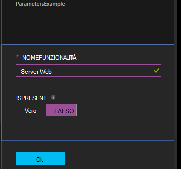

<properties 
   pageTitle="La compilazione di configurazioni di Azure automazione DSC | Microsoft Azure" 
   description="Panoramica dei due modi per la compilazione configurazioni bene accolta stato configurazione (DSC): nel portale di Azure e con Windows PowerShell. " 
   services="automation" 
   documentationCenter="na" 
   authors="coreyp-at-msft" 
   manager="stevenka" 
   editor="tysonn"/>

<tags
   ms.service="automation"
   ms.devlang="na"
   ms.topic="article"
   ms.tgt_pltfrm="powershell"
   ms.workload="na" 
   ms.date="01/25/2016"
   ms.author="coreyp"/>
   
#La compilazione di configurazioni di Azure automazione DSC#

È possibile compilare le configurazioni bene accolta stato configurazione (DSC) in due modi con Azure automazione: nel portale di Azure e con Windows PowerShell. Nella tabella seguente consente di determinare quando utilizzare il metodo in base alle caratteristiche di ogni: 

###Portale preview Azure###
- Metodo più semplice con interfaccia utente interattivi
- Modulo per fornire i valori dei parametri semplice
- Tenere traccia facilmente dello stato di processo
- Accesso autenticato con accesso Azure

###Windows PowerShell###
- Chiamare dalla riga di comando i cmdlet di Windows PowerShell
- Può essere incluso in soluzione automatica con più passaggi
- Fornire i valori di parametro semplici e complessi
- Tenere traccia dello stato di processo
- Client necessari per supportare i cmdlet di PowerShell
- Passare ConfigurationData
- Compilare le configurazioni che utilizzano le credenziali

Dopo aver scelto un metodo di compilazione, è possibile eseguire le rispettive procedure riportate di seguito per avviare la compilazione.

##La compilazione di una configurazione DSC con il portale di Azure##

1.  Dal proprio account di automazione, fare clic su **configurazioni**.
2.  Fare clic su una configurazione per aprire il relativo blade.
3.  Fare clic su **Compila**.
4.  Se la configurazione non ha parametri, verrà richiesto di confermare se si desidera compilarlo. Se la configurazione include parametri, e il **Compilare configurazione** verrà aperta in modo che è possibile fornire i valori dei parametri. Vedere la sezione <a href="#basic-parameters">**Parametri di base**</a> sotto per ulteriori informazioni sui parametri.
5.  E il **Processo di compilazione** viene aperto in modo che è possibile tenere traccia dello stato del processo di compilazione e le configurazioni di nodo (documenti configurazione MOF) causati collocare il server Azure automazione DSC estrarre.

##La compilazione di una configurazione DSC con Windows PowerShell##

È possibile utilizzare [`Start-AzureRmAutomationDscCompilationJob`](https://msdn.microsoft.com/library/mt244118.aspx) per avviare la compilazione con Windows PowerShell. Il codice di esempio seguente viene avviata la compilazione di una configurazione DSC denominata **SampleConfig**.

    Start-AzureRmAutomationDscCompilationJob -ResourceGroupName "MyResourceGroup" -AutomationAccountName "MyAutomationAccount" -ConfigurationName "SampleConfig" 
 
`Start-AzureRmAutomationDscCompilationJob`Restituisce un oggetto di processo di compilazione che è possibile utilizzare per verificare il relativo stato. È quindi possibile utilizzare l'oggetto del processo di compilazione con [`Get-AzureRmAutomationDscCompilationJob`](https://msdn.microsoft.com/library/mt244120.aspx) per determinare lo stato del processo di compilazione e [`Get-AzureRmAutomationDscCompilationJobOutput`](https://msdn.microsoft.com/library/mt244103.aspx) per la visualizzazione dei flussi di (output). Il codice di esempio seguente viene avviata la compilazione della configurazione **SampleConfig** , atteso è stata completata e quindi Visualizza dei flussi di.
    
    $CompilationJob = Start-AzureRmAutomationDscCompilationJob -ResourceGroupName "MyResourceGroup" -AutomationAccountName "MyAutomationAccount" -ConfigurationName "SampleConfig"
    
    while($CompilationJob.EndTime –eq $null -and $CompilationJob.Exception –eq $null)           
    {
        $CompilationJob = $CompilationJob | Get-AzureRmAutomationDscCompilationJob
        Start-Sleep -Seconds 3
    }
    
    $CompilationJob | Get-AzureRmAutomationDscCompilationJobOutput –Stream Any 

##Parametri di base##

Dichiarazione di parametro in configurazioni DSC, inclusi i tipi di parametro e proprietà funziona gli stessi visualizzati nei runbook automazione Azure. Vedere [avvio runbook di automazione di Azure](automation-starting-a-runbook.md) per ulteriori informazioni sui parametri runbook.

Nell'esempio seguente usa due parametri denominati **NomeFunzionalità** e **IsPresent**per determinare i valori di proprietà nella configurazione nodo **ParametersExample.sample** generati durante la compilazione.

    Configuration ParametersExample
    {
        param(
            [Parameter(Mandatory=$true)]
    
            [string] $FeatureName,
    
            [Parameter(Mandatory=$true)]
            [boolean] $IsPresent
        )
    
        $EnsureString = "Present"
        if($IsPresent -eq $false)
        {
            $EnsureString = "Absent"
        }
    
        Node "sample"
        {
            WindowsFeature ($FeatureName + "Feature")
            {
                Ensure = $EnsureString
                Name = $FeatureName
            }
        }
    }

È possibile compilare le configurazioni DSC che utilizzano parametri di base nel portale di Azure automazione DSC o con Azure PowerShell:

###Portale###

Nel portale, è possibile immettere i valori dei parametri dopo aver selezionato **la compilazione**.

###PowerShell###

PowerShell richiede parametri in una [hashtable](http://technet.microsoft.com/library/hh847780.aspx) in cui il tasto corrisponda al nome parametro e il valore è uguale al valore del parametro.

    $Parameters = @{
            "FeatureName" = "Web-Server"
            "IsPresent" = $False
    }
    
    
    Start-AzureRmAutomationDscCompilationJob -ResourceGroupName "MyResourceGroup" -AutomationAccountName "MyAutomationAccount" -ConfigurationName "ParametersExample" -Parameters $Parameters 
    

Per informazioni sul passaggio PSCredentials come parametri, vedere <a href="#credential-assets">**Risorse di credenziali**</a> .

##ConfigurationData##

**ConfigurationData** consente di separare configurazione strutturale da qualsiasi una configurazione durante l'uso di PowerShell DSC ambiente specifica. Vedere [separare "Cosa" da "In" in DSC PowerShell](http://blogs.msdn.com/b/powershell/archive/2014/01/09/continuous-deployment-using-dsc-with-minimal-change.aspx) per altre informazioni sul **ConfigurationData**.

>[AZURE.NOTE] È possibile utilizzare **ConfigurationData** durante la compilazione in Azure automazione DSC tramite PowerShell di Azure, ma non nel portale di Azure.

La configurazione di DSC di esempio seguente usa **ConfigurationData** tramite le parole chiave **$ConfigurationData** e **$AllNodes** . In questo esempio, sarà necessario anche [ **xWebAdministration** modulo](https://www.powershellgallery.com/packages/xWebAdministration/) :

     Configuration ConfigurationDataSample
     {
        Import-DscResource -ModuleName xWebAdministration -Name MSFT_xWebsite
    
        Write-Verbose $ConfigurationData.NonNodeData.SomeMessage 
    
        Node $AllNodes.Where{$_.Role -eq "WebServer"}.NodeName
        {
            xWebsite Site
            {
                Name = $Node.SiteName
                PhysicalPath = $Node.SiteContents
                Ensure   = "Present"
            }
        }
    }

È possibile compilare la configurazione di DSC sopra con PowerShell. Di seguito PowerShell aggiunge due configurazioni nodo del Azure Server di automazione DSC estrarre: **ConfigurationDataSample.MyVM1** e **ConfigurationDataSample.MyVM3**:

    $ConfigData = @{
        AllNodes = @(
            @{
                NodeName = "MyVM1"
                Role = "WebServer"
            },
            @{
                NodeName = "MyVM2"
                Role = "SQLServer"
            },
            @{
                NodeName = "MyVM3"
                Role = "WebServer"
    
            }
    
        )
    
        NonNodeData = @{
            SomeMessage = "I love Azure Automation DSC!"
    
        }
    
    } 
    
    Start-AzureRmAutomationDscCompilationJob -ResourceGroupName "MyResourceGroup" -AutomationAccountName "MyAutomationAccount" -ConfigurationName "ConfigurationDataSample" -ConfigurationData $ConfigData

##Risorse##

I riferimenti di risorse sono gli stessi in Azure automazione DSC configurazioni e runbook. Per ulteriori informazioni, vedere:

- [Certificati](automation-certificates.md)
- [Connessioni](automation-connections.md)
- [Credenziali](automation-credentials.md)
- [Variabili](automation-variables.md)

###Credenziali beni###
Mentre le configurazioni DSC in Azure automazione possono fare riferimento beni credenziali tramite **Get-AzureRmAutomationCredential**, credenziali risorse è anche possibile passare tramite i parametri, se lo si desidera. Se una configurazione accetta un parametro di tipo **PSCredential** , è necessario passare il nome della stringa di un bene credenziali Azure automazione come valore del parametro, anziché un oggetto PSCredential. Dietro le quinte, asset credenziali automazione Azure con lo stesso nome verranno recuperati e passare alla configurazione.

Mantenere le credenziali sicura in configurazioni nodi (documenti configurazione MOF) richiede la crittografia delle credenziali nel file MOF nodo configurazione. Automazione Azure accetta un passo ulteriormente e crittografa l'intero file MOF. Tuttavia, attualmente è necessario indicare PowerShell DSC che è corretto delle credenziali per l'output in formato testo normale durante la generazione di nodo configurazione MOF, poiché PowerShell DSC non sa che l'automazione Azure verrà crittografare l'intero file MOF dopo la generazione tramite un processo di compilazione.

È possibile identificarlo DSC PowerShell che sia delle credenziali per l'output in formato testo normale nella configurazione del nodo generato MOF utilizzando <a href="#configurationdata">**ConfigurationData**</a>. È necessario passare `PSDscAllowPlainTextPassword = $true` tramite **ConfigurationData** per il nome del blocco ogni nodo visualizzato nella configurazione DSC che usa le credenziali.

Nell'esempio seguente mostra una configurazione DSC che utilizza una risorsa di credenziali di automazione.

    Configuration CredentialSample
    {
       $Cred = Get-AzureRmAutomationCredential -Name "SomeCredentialAsset"
    
        Node $AllNodes.NodeName
        { 
            File ExampleFile
            { 
                SourcePath = "\\Server\share\path\file.ext" 
                DestinationPath = "C:\destinationPath" 
                Credential = $Cred 
            }
        }
    }

È possibile compilare la configurazione di DSC sopra con PowerShell. Di seguito PowerShell aggiunge due configurazioni nodo del Azure Server di automazione DSC estrarre: **CredentialSample.MyVM1** e **CredentialSample.MyVM2**.

    $ConfigData = @{
        AllNodes = @(
            @{
                NodeName = "*"
                PSDscAllowPlainTextPassword = $True
            },
            @{
                NodeName = "MyVM1"
            },
            @{
                NodeName = "MyVM2"
            }
        )
    }
    
    Start-AzureRmAutomationDscCompilationJob -ResourceGroupName "MyResourceGroup" -AutomationAccountName "MyAutomationAccount" -ConfigurationName "CredentialSample" -ConfigurationData $ConfigData
