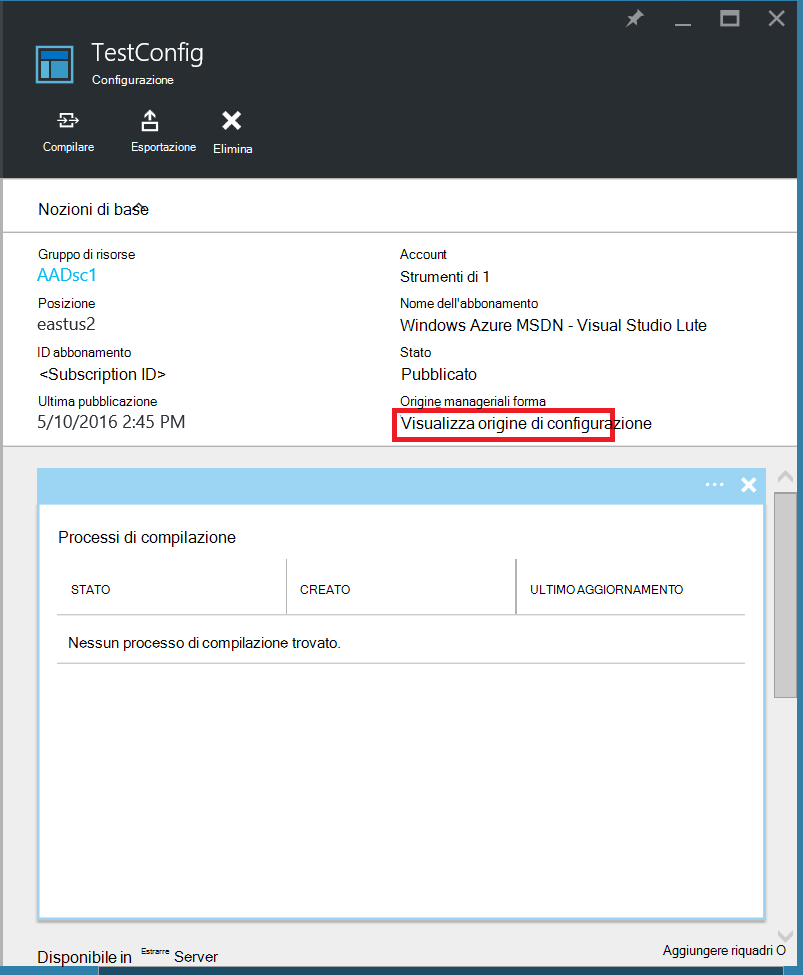

<properties
   pageTitle="Guida introduttiva di Azure automazione DSC"
   description="Descrizione e alcuni esempi di attività più comuni in Azure automazione bene accolta stato configurazione (DSC)"
   services="automation" 
   documentationCenter="na" 
   authors="eslesar" 
   manager="dongill" 
   editor="tysonn"/>

<tags
   ms.service="automation"
   ms.devlang="na"
   ms.topic="article"
   ms.tgt_pltfrm="powershell"
   ms.workload="na" 
   ms.date="06/06/2016"
   ms.author="magoedte;eslesar"/>
   

# <a name="getting-started-with-azure-automation-dsc"></a>Guida introduttiva di Azure automazione DSC

In questo argomento viene illustrato come eseguire le attività più comuni con Azure automazione bene accolta stato configurazione (DSC), ad esempio creazione, importazione e la compilazione di configurazioni, macchine onboarding da gestire e la visualizzazione dei report. Per una panoramica delle funzionalità di Azure automazione DSC, vedere [Panoramica di Azure automazione DSC](automation-dsc-overview.md). Per la documentazione DSC, vedere [Panoramica configurazione di Windows PowerShell bene accolta stato](https://msdn.microsoft.com/PowerShell/dsc/overview).

In questo argomento fornisce una Guida dettagliata all'utilizzo di Azure automazione DSC. Se si desidera un ambiente di esempio che è già impostato senza seguendo la procedura descritta in questo argomento, è possibile utilizzare [il modello ARM seguente](https://github.com/azureautomation/automation-packs/tree/master/102-sample-automation-setup). Questo modello consente di configurare un ambiente di Azure automazione DSC completato, tra cui una macchina virtuale Azure gestito da Azure automazione DSC.
 
## <a name="prerequisites"></a>Prerequisiti

Per completare gli esempi riportati in questo argomento, di seguito sono necessari:

- Un account Azure automazione. Per istruzioni sulla creazione di un account Azure ai automazione Esegui come, vedere [Esecuzione come Account Azure](automation-sec-configure-azure-runas-account.md).
- VM un Manager delle risorse Azure (non classica) che eseguono Windows Server 2008 R2 o versione successiva. Per istruzioni sulla creazione di una macchina virtuale, vedere [creare la prima macchina virtuale di Windows nel portale di Azure](../virtual-machines/virtual-machines-windows-hero-tutorial.md)

## <a name="creating-a-dsc-configuration"></a>Creazione di una configurazione DSC

Verrà creata una semplice [configurazione DSC](https://msdn.microsoft.com/powershell/dsc/configurations) che assicura la presenza o assenza di **Server Web** Windows caratteristica (IIS), a seconda di come assegnare nodi.

1. Avviare Windows PowerShell ISE (o qualsiasi editor di testo).

2. Digitare il testo seguente:

    ```powershell
    configuration TestConfig
    {
        Node WebServer
        {
            WindowsFeature IIS
            {
                Ensure               = 'Present'
                Name                 = 'Web-Server'
                IncludeAllSubFeature = $true

            }
        }

        Node NotWebServer
        {
            WindowsFeature IIS
            {
                Ensure               = 'Absent'
                Name                 = 'Web-Server'

            }
        }
        }
    ```
3. Salvare il file come `TestConfig.ps1`.

Questa configurazione chiama una risorsa in ogni blocco nodo [WindowsFeature risorsa](https://msdn.microsoft.com/powershell/dsc/windowsfeatureresource), che assicura la presenza o meno la caratteristica di **Server Web** .

## <a name="importing-a-configuration-into-azure-automation"></a>Importare una configurazione automazione Azure

Successivamente, è necessario importare la configurazione nell'account di automazione.

1. Accedere al [portale di Azure](https://portal.azure.com).

2. Nel menu Hub fare clic su **tutte le risorse** e quindi il nome del proprio account di automazione.

3. Scegliere **Le configurazioni DSC**e il **conto di automazione** .

4. Scegliere **Aggiungi una configurazione**e il **Configurazioni DSC** .

5. In e il **Configurazione dell'importazione** , individuare il `TestConfig.ps1` file nel computer in uso.
    
    
    

6. Fare clic su **OK**.

## <a name="viewing-a-configuration-in-azure-automation"></a>Visualizzazione di una configurazione in automazione Azure

Dopo avere importato una configurazione, è possibile visualizzare nel portale di Azure.

1. Accedere al [portale di Azure](https://portal.azure.com).

2. Nel menu Hub fare clic su **tutte le risorse** e quindi il nome del proprio account di automazione.

3. Scegliere **Le configurazioni DSC** e il **conto di automazione**

4. Scegliere **TestConfig** (è il nome della configurazione importati nella procedura precedente) e il **Configurazioni DSC** .

5. Scegliere **Visualizza origine di configurazione**e il **TestConfig configurazione** .

    
    
    Viene visualizzata una pala **TestConfig configurazione origine** il codice di PowerShell per la configurazione.
    
## <a name="compiling-a-configuration-in-azure-automation"></a>La compilazione di una configurazione di automazione di Azure

Prima di applicare uno stato desiderato a un nodo, una configurazione DSC definendone che lo stato deve essere compilata in una o più configurazioni di nodo (documento MOF) e archiviata il Server di automazione DSC estrarre. Per una descrizione dettagliata di compilazione configurazioni di Azure automazione DSC, vedere [la compilazione di configurazioni di Azure automazione DSC](automation-dsc-compile.md). Per ulteriori informazioni sulle configurazioni di compilazione, vedere [Configurazioni DSC](https://msdn.microsoft.com/PowerShell/DSC/configurations).

1. Accedere al [portale di Azure](https://portal.azure.com).

2. Nel menu Hub fare clic su **tutte le risorse** e quindi il nome del proprio account di automazione.

3. Scegliere **Le configurazioni DSC** e il **conto di automazione**

4. Scegliere **TestConfig** (il nome della configurazione importato in precedenza) e il **Configurazioni DSC** .

5. Scegliere e il **TestConfig configurazione** , fare clic su **Compila**e quindi fare clic su **Sì**. Verrà avviato un processo di compilazione.
    
    
    
> [AZURE.NOTE] Quando si compila una configurazione di automazione di Azure, automaticamente tutte le configurazioni nodo creato MOF lo distribuisce al server di pull.

## <a name="viewing-a-compilation-job"></a>Visualizzazione di un processo di compilazione

Dopo l'avvio di una raccolta, è possibile visualizzare nel riquadro **processi di compilazione** di e il **configurazione** . Il riquadro di **processi di compilazione** Mostra attualmente in esecuzione, completato e non è riuscita processi. Quando si apre una pala di processo di compilazione, che mostra informazioni inclusi eventuali errori o avvisi, utilizzare i parametri di input in configurazione e la compilazione dei log.

1. Accedere al [portale di Azure](https://portal.azure.com).

2. Nel menu Hub fare clic su **tutte le risorse** e quindi il nome del proprio account di automazione.

3. Scegliere **Le configurazioni DSC**e il **conto di automazione** .

4. Scegliere **TestConfig** (il nome della configurazione importato in precedenza) e il **Configurazioni DSC** .

5. Nel riquadro di **processi di compilazione** della stessa e **Configurazione di TestConfig** , fare clic su uno dei processi elencati. Verrà visualizzata una pala **Processo compilazione** etichettata con la data in cui è stato avviato il processo di compilazione.

    
  
6. Fare clic su qualsiasi scaricato un file e il **Processo di compilazione** per visualizzare ulteriori dettagli relativi al processo.

## <a name="viewing-node-configurations"></a>Configurazioni nodi di visualizzazione

Completamento di un processo di compilazione crea una o più configurazioni nodo nuovo. Configurazione di un nodo è un documento MOF distribuito al server di recuperare e pronto per essere inseriti e uno o più nodi in tal. È possibile visualizzare le configurazioni nodo nell'account automazione in e il **DSC nodo configurazioni** . Una configurazione nodo ha un nome con il modulo *ConfigurationName*. *NodeName*.

1. Accedere al [portale di Azure](https://portal.azure.com).

2. Nel menu Hub fare clic su **tutte le risorse** e quindi il nome del proprio account di automazione.

3. Scegliere **Le configurazioni nodo DSC**e il **conto di automazione** .

    
    
## <a name="onboarding-an-azure-vm-for-management-with-azure-automation-dsc"></a>Onboarding una macchina virtuale Azure per la gestione con Azure automazione DSC

È possibile utilizzare Azure automazione DSC per gestire macchine virtuali di Azure (classica e Manager delle risorse), macchine virtuali locale, computer Linux, macchine virtuali AWS e computer locale. In questo argomento viene descritto come incorporata macchine virtuali di gestione risorse Azure solo. Per informazioni su onboarding altri tipi di computer, vedere [macchine Onboarding per la gestione da Azure automazione DSC](automation-dsc-onboarding.md).

### <a name="to-onboard-an-azure-resource-manager-vm-for-management-by-azure-automation-dsc"></a>Incorporata a un VM Manager delle risorse Azure per la gestione da Azure automazione DSC

1. Accedere al [portale di Azure](https://portal.azure.com).

2. Nel menu Hub fare clic su **tutte le risorse** e quindi il nome del proprio account di automazione.

3. Scegliere **DSC nodi**e il **conto di automazione** .

4. In e il **DSC nodi** , fare clic su **Aggiungi macchine Virtuali di Azure**.

    

5. In e **l'Aggiungere macchine virtuali di Azure** , fare clic su **Seleziona macchine virtuali incorporata**.

6. In e il **Selezionare macchine virtuali** , selezionare la macchina virtuale che si desidera incorporata e fare clic su **OK**.

    >[AZURE.IMPORTANT] Deve trattarsi di un VM Manager delle risorse Azure che eseguono Windows Server 2008 R2 o versione successiva.
    
7. In e **l'Aggiungere macchine virtuali di Azure** , fare clic su **Configura registrazione dati**.

8. In e il **registrazione** , immettere il nome della configurazione del nodo da applicare a macchine Virtuali nella casella **Nome configurazione nodo** . Questo deve corrispondere esattamente al nome di una configurazione nodi nella finestra account di automazione. Fornire un nome a questo punto è facoltativo. È possibile modificare la configurazione di nodo assegnato dopo la valutazione il nodo.
Controllare **Nodo riavviare se necessario**e quindi fare clic su **OK**.
    
    
    
    La configurazione di nodo specificato verrà applicata alla macchina virtuale a intervalli specificati per la **Configurazione della modalità di frequenza**e la macchina virtuale controllerà per gli aggiornamenti per la configurazione di nodo a intervalli specificati per la **Frequenza di aggiornamento**. Per ulteriori informazioni sull'utilizzo di questi valori, vedere [configurazione locale Configuration Manager](https://msdn.microsoft.com/PowerShell/DSC/metaConfig).
    
9. In e **l'Aggiungere macchine virtuali di Azure** , fare clic su **Crea**.

Azure verrà avviato il processo di onboarding macchina virtuale. Al termine, la macchina virtuale verrà visualizzato in e il **DSC nodi** nella finestra account di automazione.

## <a name="viewing-the-list-of-dsc-nodes"></a>Visualizzare l'elenco dei nodi DSC

È possibile visualizzare l'elenco di tutti i computer che sono stati onboarded per la gestione del proprio account di automazione in e il **Nodi DSC** .

1. Accedere al [portale di Azure](https://portal.azure.com).

2. Nel menu Hub fare clic su **tutte le risorse** e quindi il nome del proprio account di automazione.

3. Scegliere **DSC nodi**e il **conto di automazione** .

## <a name="viewing-reports-for-dsc-nodes"></a>La visualizzazione dei report per i nodi DSC

Ogni volta che Azure automazione DSC coerenza su un nodo gestito, il nodo invia una relazione sullo stato al server pull. È possibile visualizzare questi report nella e relativo a tale nodo.

1. Accedere al [portale di Azure](https://portal.azure.com).

2. Nel menu Hub fare clic su **tutte le risorse** e quindi il nome del proprio account di automazione.

3. Scegliere **DSC nodi**e il **conto di automazione** .

4. Nel riquadro **report** fare clic su uno dei report nell'elenco.

    

In blade per un singolo report, è possibile visualizzare le seguenti informazioni di stato per la verifica coerenza corrispondente:

- Lo stato del report, ovvero se il nodo è "Conforme", "Non riuscita", la configurazione o il nodo "Non compatibile" (quando il nodo è in modalità **applyandmonitor** e il computer non è nello stato desiderato).
- Ora di inizio per la verifica coerenza.
- Il runtime totale per la verifica coerenza.
- Il tipo di coerenza.
- Eventuali errori, inclusi il messaggio di errore e il codice di errore. 
- Tutte le risorse DSC utilizzate per la configurazione e dello stato di ogni risorsa (se il nodo è nello stato desiderato per la risorsa), è possibile fare clic su ogni risorsa per ottenere informazioni più dettagliate per la risorsa.
- Nome, indirizzo IP e modalità di configurazione del nodo.

È anche possibile fare clic su **Visualizza report non elaborati** per visualizzare i dati effettivi che il nodo invia al server. Per ulteriori informazioni sull'utilizzo di tali dati, vedere [utilizzo di un server di report DSC](https://msdn.microsoft.com/powershell/dsc/reportserver).

È possibile richiedere del tempo dopo un nodo onboarded prima che il primo report è disponibile. Potrebbe essere necessario attendere fino a 30 minuti per il primo rapporto dopo aver integrata un nodo.

## <a name="reassigning-a-node-to-a-different-node-configuration"></a>Riassegnare un nodo per una configurazione nodo diverso

È possibile assegnare un nodo per utilizzare una configurazione nodo diverso da quello che inizialmente assegnate.

1. Accedere al [portale di Azure](https://portal.azure.com).

2. Nel menu Hub fare clic su **tutte le risorse** e quindi il nome del proprio account di automazione.

3. Scegliere **DSC nodi**e il **conto di automazione** .

4. Scegliere il nome del nodo che si desidera riassegnare e il **Nodi DSC** .

5. In blade per tale nodo, fare clic su **Assegna nodo**.

    

6. Scegliere e **l'Assegnare nodo Configurazione** , selezionare la configurazione di nodo a cui si desidera assegnare il nodo e quindi fare clic su **OK**.

    
    
## <a name="unregistering-a-node"></a>Annullamento della registrazione di un nodo

Se non si desidera più un nodo per essere gestito da Azure automazione DSC, è possibile annullarne la registrazione.

1. Accedere al [portale di Azure](https://portal.azure.com).

2. Nel menu Hub fare clic su **tutte le risorse** e quindi il nome del proprio account di automazione.

3. Scegliere **DSC nodi**e il **conto di automazione** .

4. Scegliere il nome del nodo che si desidera annullare la registrazione e il **Nodi DSC** .

5. In blade per tale nodo, fare clic su **Annulla registrazione**.

    

## <a name="related-articles"></a>Articoli correlati
* [Panoramica di automazione DSC Azure](automation-dsc-overview.md)
* [Computer Onboarding per la gestione da Azure automazione DSC](automation-dsc-onboarding.md)
* [Cenni preliminari sulla configurazione dello stato bene accolta di Windows PowerShell](https://msdn.microsoft.com/powershell/dsc/overview)
* [Cmdlet di automazione DSC Azure](https://msdn.microsoft.com/library/mt244122.aspx)
* [Prezzi automazione DSC Azure](https://azure.microsoft.com/pricing/details/automation/)

