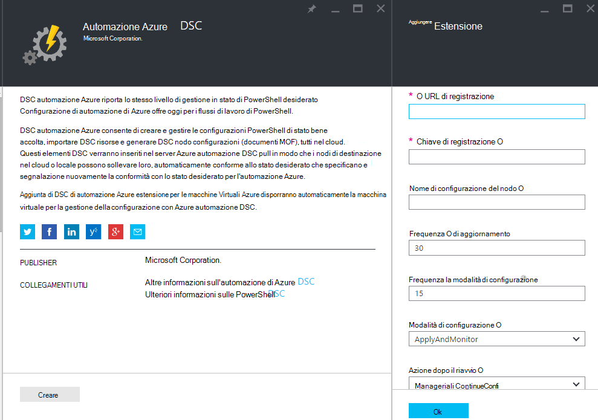
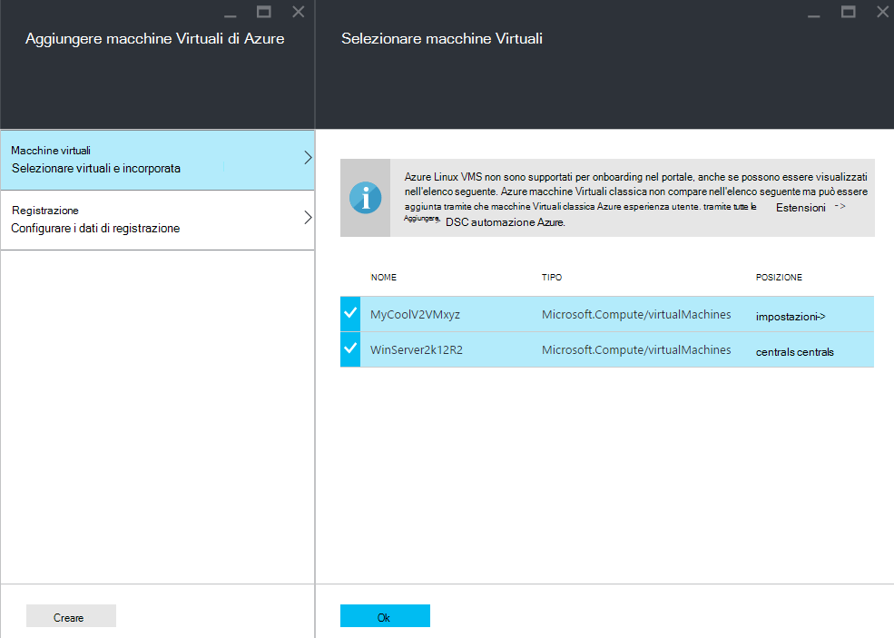
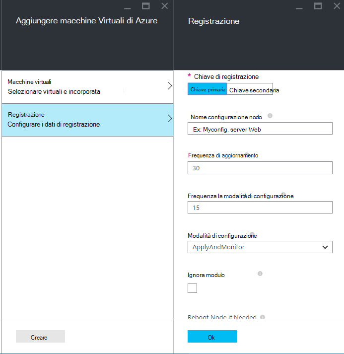
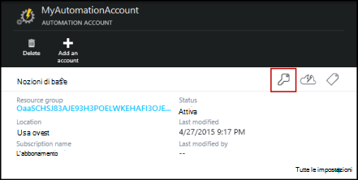
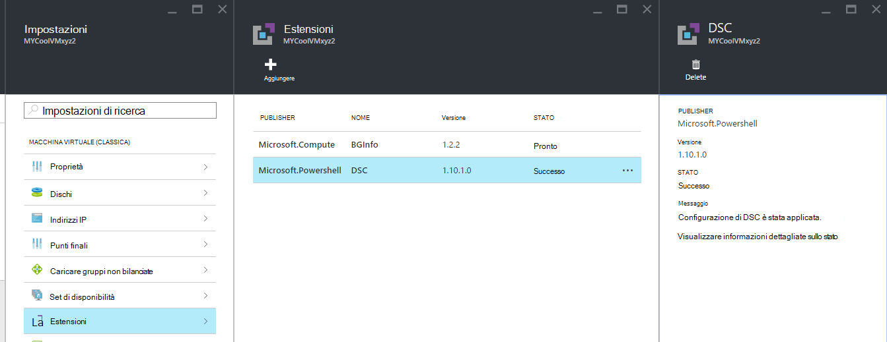

<properties 
   pageTitle="Onboarding fisiche e sulle macchine virtuali per la gestione da Azure automazione DSC | Microsoft Azure" 
   description="Come configurare i computer per la gestione con Azure automazione DSC" 
   services="automation" 
   documentationCenter="dev-center-name" 
   authors="coreyp-at-msft" 
   manager="stevenka" 
   editor="tysonn"/>

<tags
   ms.service="automation"
   ms.devlang="NA"
   ms.topic="article"
   ms.tgt_pltfrm="powershell"
   ms.workload="TBD" 
   ms.date="04/22/2016"
   ms.author="coreyp"/>

# Computer Onboarding per la gestione da Azure automazione DSC

## Perché gestire macchine con Azure automazione DSC?

Ad esempio [Configurazione dello stato bene accolta PowerShell](https://technet.microsoft.com/library/dn249912.aspx), configurazione dello stato bene accolta di Azure automazione è un servizio di Gestione configurazione di semplice ma funzionale, per i nodi DSC (fisici e virtuali) in qualsiasi data center cloud o locale. Consente la scalabilità attraverso migliaia di computer in modo semplice e rapido da una posizione centralizzata e protetta. È possibile facilmente incorporate macchine, assegnare loro configurazioni dichiarative e visualizzare i report con ogni computer di conformità allo stato desiderato specificato. Il livello di gestione di Azure automazione DSC consiste nel DSC che cos'è il livello di gestione di automazione di Azure per gli script di PowerShell. In altre parole, nello stesso modo in cui l'automazione Azure consente di gestire gli script di PowerShell, anche consente di gestire le configurazioni DSC. Per ulteriori informazioni sui vantaggi dell'utilizzo di Azure automazione DSC, vedere [Panoramica di Azure automazione DSC](automation-dsc-overview.md). 

Azure DSC automazione può essere utilizzato per gestire un'ampia gamma di computer:

*    Azure macchine virtuali (classica)
*    Macchine virtuali di Azure
*    Macchine virtuali di Amazon Web Services (AWS)
*    Windows fisica/virtuale computer locale, o in un'area diversa da quella Azure/AWS
*    Linux fisica/virtuale computer locale, in Azure o in un'area diversa da Azure

Inoltre, se non si è pronti per la gestione configurazione del computer dal cloud, Azure automazione DSC utilizzabile anche come endpoint solo report. In questo modo è possibile impostare configurazione desiderata (push) tramite DSC locale e visualizzare i dettagli dei report RTF di conformità nodo con lo stato desiderato in Azure automazione.

Nelle sezioni seguenti viene illustrato come bordo ogni tipo di computer per Azure automazione DSC.

## Azure macchine virtuali (classica)

Con DSC automazione Azure, è possibile facilmente incorporata Azure macchine virtuali di (classico) per la gestione della configurazione utilizzando il portale di Azure o PowerShell. Dietro le quinte e senza un amministratore dover remote in macchina virtuale, l'estensione di configurazione dello stato bene accolta macchine Virtuali di Azure registra la macchina virtuale con Azure automazione DSC. Poiché l'estensione di configurazione dello stato bene accolta macchine Virtuali di Azure viene eseguita in modo asincrono, passaggi per tenere traccia dello stato di avanzamento o risolvere i problemi vengono fornite nella sezione [**risoluzione dei problemi di Azure macchina virtuale onboarding**](#troubleshooting-azure-virtual-machine-onboarding) .

### Portale di Azure

Nel [portale di Azure](http://portal.azure.com/), fare clic su **Sfoglia** -> **macchine virtuali (classica)**. Selezionare la macchina virtuale di Windows che si desidera incorporata. In blade dashboard della macchina virtuale, fare clic su **tutte le impostazioni** -> **estensioni** -> **Aggiungi** -> **Azure automazione DSC** -> **Crea**. Immettere i [valori di PowerShell DSC locale Configuration Manager](https://msdn.microsoft.com/powershell/dsc/metaconfig4) necessarie per il caso di utilizzo, chiave di registrazione dell'account di automazione e URL di registrazione e facoltativamente una configurazione nodi di assegnare la macchina virtuale.

Per trovare la registrazione URL e come chiave per l'automazione account integrata il computer per vedere la sezione [**protetta registrazione**](#secure-registration) .

### PowerShell

    # log in to both Azure Service Management and Azure Resource Manager
    Add-AzureAccount
    Add-AzureRmAccount
    
    # fill in correct values for your VM/Automation account here
    $VMName = ""
    $ServiceName = ""
    $AutomationAccountName = ""
    $AutomationAccountResourceGroup = ""

    # fill in the name of a Node Configuration in Azure Automation DSC, for this VM to conform to
    $NodeConfigName = ""

    # get Azure Automation DSC registration info
    $Account = Get-AzureRmAutomationAccount -ResourceGroupName $AutomationAccountResourceGroup -Name $AutomationAccountName
    $RegistrationInfo = $Account | Get-AzureRmAutomationRegistrationInfo

    # use the DSC extension to onboard the VM for management with Azure Automation DSC
    $VM = Get-AzureVM -Name $VMName -ServiceName $ServiceName
    
    $PublicConfiguration = ConvertTo-Json -Depth 8 @{
      SasToken = ""
      ModulesUrl = "https://eus2oaasibizamarketprod1.blob.core.windows.net/automationdscpreview/RegistrationMetaConfigV2.zip"
      ConfigurationFunction = "RegistrationMetaConfigV2.ps1\RegistrationMetaConfigV2"

    # update these PowerShell DSC Local Configuration Manager defaults if they do not match your use case.
    # See https://technet.microsoft.com/library/dn249922.aspx?f=255&MSPPError=-2147217396 for more details
     Properties = @{
        RegistrationKey = @{
          UserName = 'notused'
          Password = 'PrivateSettingsRef:RegistrationKey'
        }
        RegistrationUrl = $RegistrationInfo.Endpoint
        NodeConfigurationName = $NodeConfigName
        ConfigurationMode = "ApplyAndMonitor"
        ConfigurationModeFrequencyMins = 15
        RefreshFrequencyMins = 30
        RebootNodeIfNeeded = $False
        ActionAfterReboot = "ContinueConfiguration"
        AllowModuleOverwrite = $False
      }
    }

    $PrivateConfiguration = ConvertTo-Json -Depth 8 @{
      Items = @{
         RegistrationKey = $RegistrationInfo.PrimaryKey
      }
    }
    
    $VM = Set-AzureVMExtension `
     -VM $vm `
     -Publisher Microsoft.Powershell `
     -ExtensionName DSC `
     -Version 2.19 `
     -PublicConfiguration $PublicConfiguration `
     -PrivateConfiguration $PrivateConfiguration `
     -ForceUpdate

    $VM | Update-AzureVM

## Macchine virtuali di Azure

DSC automazione Azure consente facilmente incorporata Azure macchine virtuali di gestione della configurazione, usando portale Azure, modelli di gestione di risorse Azure o PowerShell. Dietro le quinte e senza un amministratore dover remote in macchina virtuale, l'estensione di configurazione dello stato bene accolta macchine Virtuali di Azure registra la macchina virtuale con Azure automazione DSC. Poiché l'estensione di configurazione dello stato bene accolta macchine Virtuali di Azure viene eseguita in modo asincrono, passaggi per tenere traccia dello stato di avanzamento o risolvere i problemi vengono fornite nella sezione [**risoluzione dei problemi di Azure macchina virtuale onboarding**](#troubleshooting-azure-virtual-machine-onboarding) .

### Portale di Azure

Nel [portale di Azure](https://portal.azure.com/), passare all'account Azure automazione in cui si vuole macchine virtuali incorporate. Nel dashboard di account di automazione, fare clic su **Nodi DSC** -> **Aggiungere macchine Virtuali di Azure**.

In **Selezionare macchine virtuali a incorporata**, selezionare uno o più macchine virtuali Azure a incorporata.

In **Configura dati di registrazione**, immettere i [valori di PowerShell DSC locale Configuration Manager](https://msdn.microsoft.com/powershell/dsc/metaconfig4) necessari per il caso di utilizzo e, facoltativamente, una configurazione nodi di assegnare la macchina virtuale.

 
### Modelli di Azure Manager delle risorse

È possibile distribuire macchine virtuali di Azure e onboarded a Azure automazione DSC tramite Gestione risorse Azure modelli. Vedere [configurare una macchina virtuale tramite estensione DSC e Azure automazione DSC](https://azure.microsoft.com/documentation/templates/dsc-extension-azure-automation-pullserver/) per un modello di esempio che onboards una macchina virtuale esistente per Azure automazione DSC. Per trovare il codice di registrazione e l'URL di registrazione prese come input di questo modello, vedere la sezione [**protetta registrazione**](#secure-registration) .

### PowerShell

Il cmdlet [Registro AzureRmAutomationDscNode](https://msdn.microsoft.com/library/mt603833.aspx) è utilizzabile per incorporata macchine virtuali nel portale di Azure tramite PowerShell.

## Macchine virtuali di Amazon Web Services (AWS)

È possibile facilmente incorporate macchine virtuali di servizi Web di Amazon per la gestione della configurazione da Azure automazione DSC utilizzando il Toolkit di DSC AWS. È possibile acquisire familiarità con il toolkit [di seguito](https://blogs.msdn.microsoft.com/powershell/2016/04/20/aws-dsc-toolkit/).

## Windows fisica/virtuale computer locale, o in un'area diversa da quella Azure/AWS

Computer Windows locale e i computer Windows Azure non cloud (ad esempio servizi Web di Amazon) possono essere anche onboarded a DSC automazione Azure, purché hanno accesso in uscita a internet, tramite pochi semplici passaggi:

1. Assicurarsi che la versione più recente di [5 WMF](http://aka.ms/wmf5latest) è installata nel computer che si desidera incorporata Azure automazione DSC.
2. Seguire le istruzioni nella sezione [**generazione DSC metaconfigurations**](#generating-dsc-metaconfigurations) riportata di seguito per generare una cartella contenente il metaconfigurations DSC necessari.
3. Quando in modalità remota applicare metaconfiguration PowerShell DSC ai computer che si desidera incorporata. **Il computer da che viene eseguito il comando deve avere l'ultima versione di [5 WMF](http://aka.ms/wmf5latest) installato**:

    `Set-DscLocalConfigurationManager -Path C:\Users\joe\Desktop\DscMetaConfigs -ComputerName MyServer1, MyServer2`

4. Se non è possibile applicare metaconfigurations PowerShell DSC quando in modalità remota, copiare la cartella metaconfigurations dal passaggio 2 in ogni computer incorporata. Chiamare quindi **DscLocalConfigurationManager Set** in locale in ogni computer per incorporata.
5. Tramite il portale di Azure e i cmdlet, verificare che il computer per incorporata ora visualizzati come nodi DSC registrati nell'account Azure automazione.

## Linux fisica/virtuale computer locale, in Azure o in un'area diversa da Azure

Computer Linux locale, computer Linux in Azure e computer Linux in aree non Azure possono anche essere onboarded a DSC automazione Azure, come hanno accesso in uscita a internet, tramite pochi semplici passaggi:

1. Assicurarsi che la versione più recente dell' [agente DSC Linux](http://www.microsoft.com/download/details.aspx?id=49150) è installata nel computer che si desidera incorporata Azure automazione DSC.

2. Se le [impostazioni predefinite di PowerShell DSC locale Configuration Manager](https://msdn.microsoft.com/powershell/dsc/metaconfig4) corrispondono il caso di utilizzo e si desidera incorporata a computer ad che **tutto sia report a Azure automazione DSC** :

    *    In ogni computer Linux per incorporata Azure automazione DSC, consente di Register.py integrata con i valori predefiniti in Gestione configurazione di PowerShell DSC locale:

        `/opt/microsoft/dsc/Scripts/Register.py <Automation account registration key> <Automation account registration URL>`

    *    Per trovare il codice di registrazione e l'URL di registrazione per l'account di automazione, vedere la sezione [**protetta registrazione**](#secure-registration) .

    Se il responsabile della configurazione locale DSC PowerShell **eseguire** **corrispondono il caso di utilizzo o si desidera a computer integrato in modo che solo a cui fanno riferimento Azure automazione DSC** impostazioni predefinite eseguire ma non configurazione pull o PowerShell moduli da essa, seguire i passaggi da 3 a 6. In caso contrario, andare direttamente al passaggio 6.

3.  Seguire le istruzioni nella sezione [**generazione DSC metaconfigurations**](#generating-dsc-metaconfigurations) per generare una cartella contenente il metaconfigurations DSC necessari.
4.  Quando in modalità remota applicare metaconfiguration PowerShell DSC ai computer che si desidera incorporata:
        
        $SecurePass = ConvertTo-SecureString -String "<root password>" -AsPlainText -Force
        $Cred = New-Object System.Management.Automation.PSCredential "root", $SecurePass
        $Opt = New-CimSessionOption -UseSsl -SkipCACheck -SkipCNCheck -SkipRevocationCheck

        # need a CimSession for each Linux machine to onboard
        
        $Session = New-CimSession -Credential $Cred -ComputerName <your Linux machine> -Port 5986 -Authentication basic -SessionOption $Opt
        
        Set-DscLocalConfigurationManager -CimSession $Session –Path C:\Users\joe\Desktop\DscMetaConfigs
    
Il computer da che viene eseguito il comando deve avere l'ultima versione di [5 WMF](http://aka.ms/wmf5latest) installato.

5.  Se non è possibile applicare metaconfigurations DSC PowerShell in modalità remota, per ogni computer Linux bordo, copiare metaconfiguration corrispondente a tale computer dalla cartella nel passaggio 5 al computer Linux. Quindi chiama `SetDscLocalConfigurationManager.py` in locale in ogni computer Linux desiderata a incorporata per Azure automazione DSC:

    `/opt/microsoft/dsc/Scripts/SetDscLocalConfigurationManager.py –configurationmof <path to metaconfiguration file>`

6.  Tramite il portale di Azure e i cmdlet, verificare che il computer per incorporata ora visualizzati come nodi DSC registrati nell'account Azure automazione.

##Generazione DSC metaconfigurations
Per generico incorporata può essere qualsiasi computer a DSC automazione Azure, un metaconfiguration DSC generato che, quando applicata, indica l'agente DSC del computer per effettuare il pull da e/o report a Azure automazione DSC. DSC metaconfigurations per Azure automazione DSC può essere generato utilizzando una configurazione DSC PowerShell o i cmdlet di PowerShell di automazione Azure.

**Nota:** DSC metaconfigurations contengono le informazioni riservate necessarie per incorporata un computer a un automazione account per la gestione. Assicurarsi di proteggere correttamente qualsiasi metaconfigurations DSC che si crea o eliminarli dopo l'utilizzo.

###Utilizzando una configurazione DSC
1.  Aprire PowerShell ISE come amministratore in un computer nell'ambiente locale. Il computer deve avere l'ultima versione di [5 WMF](http://aka.ms/wmf5latest) installato.

2.  Copiare il seguente script in locale. Questo script contiene una configurazione DSC PowerShell per la creazione di metaconfigurations e un comando per avviare la creazione di metaconfiguration.
    
        # The DSC configuration that will generate metaconfigurations
        [DscLocalConfigurationManager()]
        Configuration DscMetaConfigs 
        { 
            param 
            ( 
                [Parameter(Mandatory=$True)] 
                [String]$RegistrationUrl,
         
                [Parameter(Mandatory=$True)] 
                [String]$RegistrationKey,

                [Parameter(Mandatory=$True)] 
                [String[]]$ComputerName,

                [Int]$RefreshFrequencyMins = 30, 
            
                [Int]$ConfigurationModeFrequencyMins = 15, 
            
                [String]$ConfigurationMode = "ApplyAndMonitor", 
            
                [String]$NodeConfigurationName,

                [Boolean]$RebootNodeIfNeeded= $False,

                [String]$ActionAfterReboot = "ContinueConfiguration",

                [Boolean]$AllowModuleOverwrite = $False,

                [Boolean]$ReportOnly
            )

    
            if(!$NodeConfigurationName -or $NodeConfigurationName -eq "") 
            { 
                $ConfigurationNames = $null 
            } 
            else 
            { 
                $ConfigurationNames = @($NodeConfigurationName) 
            }

            if($ReportOnly)
            {
               $RefreshMode = "PUSH"
            }
            else
            {
               $RefreshMode = "PULL"
            }

            Node $ComputerName
            {

                Settings 
                { 
                    RefreshFrequencyMins = $RefreshFrequencyMins 
                    RefreshMode = $RefreshMode 
                    ConfigurationMode = $ConfigurationMode 
                    AllowModuleOverwrite = $AllowModuleOverwrite 
                    RebootNodeIfNeeded = $RebootNodeIfNeeded 
                    ActionAfterReboot = $ActionAfterReboot 
                    ConfigurationModeFrequencyMins = $ConfigurationModeFrequencyMins 
                }

                if(!$ReportOnly)
                {
                   ConfigurationRepositoryWeb AzureAutomationDSC 
                    { 
                        ServerUrl = $RegistrationUrl 
                        RegistrationKey = $RegistrationKey 
                        ConfigurationNames = $ConfigurationNames 
                    }

                    ResourceRepositoryWeb AzureAutomationDSC 
                    { 
                       ServerUrl = $RegistrationUrl 
                       RegistrationKey = $RegistrationKey 
                    }
                }

                ReportServerWeb AzureAutomationDSC 
                { 
                    ServerUrl = $RegistrationUrl 
                    RegistrationKey = $RegistrationKey 
                }
            } 
        }
        
        # Create the metaconfigurations
        # TODO: edit the below as needed for your use case
        $Params = @{
             RegistrationUrl = '<fill me in>';
             RegistrationKey = '<fill me in>';
             ComputerName = @('<some VM to onboard>', '<some other VM to onboard>');
             NodeConfigurationName = 'SimpleConfig.webserver';
             RefreshFrequencyMins = 30;
             ConfigurationModeFrequencyMins = 15;
             RebootNodeIfNeeded = $False;
             AllowModuleOverwrite = $False;
             ConfigurationMode = 'ApplyAndMonitor';
             ActionAfterReboot = 'ContinueConfiguration';
             ReportOnly = $False;  # Set to $True to have machines only report to AA DSC but not pull from it
        }
        
        # Use PowerShell splatting to pass parameters to the DSC configuration being invoked
        # For more info about splatting, run: Get-Help -Name about_Splatting
        DscMetaConfigs @Params

3.  Immettere il codice di registrazione e l'URL per l'account di automazione, nonché i nomi dei computer di incorporata. Tutti gli altri parametri sono facoltativi. Per trovare il codice di registrazione e l'URL di registrazione per l'account di automazione, vedere la sezione [**protetta registrazione**](#secure-registration) .

4.  Se si vuole macchine di report con informazioni di stato DSC a Azure automazione DSC, ma non estrarre PowerShell moduli o configurazione, impostare il parametro **ReportOnly** su true.

5.  Eseguire lo script. A questo punto è una cartella denominata **DscMetaConfigs** nella directory di lavoro contenente metaconfigurations DSC PowerShell per i computer a incorporata.

###Utilizzare i cmdlet di automazione di Azure
Se i valori predefiniti in Gestione configurazione di PowerShell DSC locali corrispondono il caso di utilizzo e si desidera computer integrato quale effettuare il pull da e inviare una segnalazione per Azure automazione DSC, i cmdlet di automazione di Azure specificare un metodo semplificato di generazione metaconfigurations DSC necessari:

1.  Aprire la console di PowerShell o PowerShell ISE come amministratore in un computer nell'ambiente locale.

2.  Connettersi a gestione di risorse di Azure utilizzando **Aggiungi AzureRmAccount**

3.  Scaricare metaconfigurations DSC PowerShell per i computer in cui che si desidera incorporata dall'account automazione a cui desidera nodi incorporati:

        # Define the parameters for Get-AzureRmAutomationDscOnboardingMetaconfig using PowerShell Splatting
        $Params = @{
            ResourceGroupName = 'ContosoResources'; # The name of the ARM Resource Group that contains your Azure Automation Account
            AutomationAccountName = 'ContosoAutomation'; # The name of the Azure Automation Account where you want a node on-boarded to
            ComputerName = @('web01', 'web02', 'sql01'); # The names of the computers that the meta configuration will be generated for
            OutputFolder = "$env:UserProfile\Desktop\";
        }
        
        # Use PowerShell splatting to pass parameters to the Azure Automation cmdlet being invoked
        # For more info about splatting, run: Get-Help -Name about_Splatting
        Get-AzureRmAutomationDscOnboardingMetaconfig @Params

È ora una cartella denominata ***DscMetaConfigs***, contenente metaconfigurations DSC PowerShell per i computer a incorporata.

##Registrazione protetto

Computer possono sicuro bordo a un account Azure automazione tramite il protocollo di registrazione WMF 5 DSC, che consente a un nodo DSC eseguire l'autenticazione a un server di PowerShell DSC V2 estrarre o Reporting (inclusi Azure automazione DSC). Il nodo registra nel server in corrispondenza dell' **URL di registrazione**, autenticazione utilizzando una **chiave di registrazione**. Durante la registrazione, il nodo DSC e DSC Pull/Reporting server, è possibile negoziare un certificato univoco per il nodo da utilizzare per l'autenticazione per la post-registrazione di server. Questo processo impedisce nodi onboarded da rappresentare una che altra, ad esempio se un nodo compromesso e si comporta da utenti malintenzionati. Dopo la registrazione, la chiave di registrazione non viene usata per l'autenticazione nuovamente e viene eliminata dal nodo.

È possibile ottenere le informazioni necessarie per il protocollo di registrazione DSC da e il **Gestione delle chiavi** nel portale di Azure anteprima. Aprire questo blade facendo clic sull'icona chiave nel riquadro **Nozioni di base** per l'account di automazione.

*    URL di registrazione è nel campo URL e il gestione delle chiavi.
*    Chiave di registrazione è la chiave primaria di Access o secondario tasto di scelta rapida in e il gestione delle chiavi. Uno dei due chiave può essere utilizzata.

Per una maggiore protezione, è possono rigenerare i tasti principali e secondarie di un account di automazione in qualsiasi momento (in e il **Gestione delle chiavi** ) per evitare che le registrazioni future nodo utilizzando chiavi precedenti.

##Risoluzione dei problemi di valutazione di Azure macchina virtuale

DSC automazione Azure consente facilmente incorporata macchine virtuali di Windows Azure per la gestione della configurazione. Dietro le quinte, l'estensione di configurazione dello stato bene accolta macchine Virtuali di Azure viene utilizzato per registrare la macchina virtuale con Azure automazione DSC. Poiché l'estensione di configurazione dello stato bene accolta macchine Virtuali di Azure viene eseguita in modo asincrono, verifica dello stato di avanzamento e risoluzione dei problemi di esecuzione può essere importante. 

>[AZURE.NOTE] Qualsiasi altro metodo di onboarding una macchina virtuale Windows Azure a DSC automazione Azure che utilizza l'estensione di configurazione dello stato bene accolta macchine Virtuali di Azure potrebbe richiedere fino a un'ora per il nodo mostrare massimo registrato in Azure automazione. Ciò è dovuto l'installazione di Windows Management Framework 5.0 in macchine Virtuali dall'estensione DSC macchine Virtuali di Azure, che deve essere integrato macchine Virtuali di Azure automazione DSC.

Per risolvere i problemi o visualizzare lo stato dell'estensione configurazione dello stato bene accolta macchine Virtuali di Azure, nell'Azure portale passare a macchine Virtuali vengano onboarded, quindi fare clic su -> **tutte le impostazioni** -> **estensioni** -> **DSC**. Per ulteriori informazioni, è possibile scegliere di **visualizzare informazioni dettagliate sullo stato**.

## Scadenza certificato e operazione

Dopo avere effettuato la registrazione di un computer come nodo DSC Azure automazione DSC, esistono diversi motivi per cui potrebbe essere necessario registrare nuovamente il nodo in futuro:

* Dopo aver registrato, ogni nodo negozia automaticamente un certificato univoco per l'autenticazione che scade dopo un anno. Attualmente, il protocollo di registrazione di PowerShell DSC non verrà rinnovata automaticamente i certificati sono prossimo alla scadenza, pertanto è necessario registrare nuovamente i nodi è prevista dell'anno. Prima di registrare di nuovo, verificare che ogni nodo sia in esecuzione Windows Management Framework 5.0 RTM. Se il certificato di autenticazione del nodo scade e il nodo non nuovamente registrato, il nodo non sarà in grado di comunicare con l'automazione Azure e verrà contrassegnato 'Unresponsive'. Eseguita l'operazione 90 giorni o minore dall'ora di scadenza certificato o in qualsiasi momento dopo la scadenza certificato, verrà generato un nuovo certificato generata e utilizzato.

* Per modificare i [valori di PowerShell DSC locale Configuration Manager](https://msdn.microsoft.com/powershell/dsc/metaconfig4) che sono stati impostati durante la registrazione iniziale del nodo, ad esempio ConfigurationMode. Attualmente, questi valori agente DSC possono essere modificati solo tramite operazione. L'unica eccezione è la configurazione di nodo assegnato al livello di nodo: questa operazione può essere modificata direttamente in Azure automazione DSC.

Operazione può essere eseguita nello stesso modo che è stato registrato il nodo inizialmente, utilizzare uno dei metodi onboarding descritti in questo documento. Non è necessario annullare la registrazione di un nodo da Azure automazione DSC prima di registrare di nuovo il.

## Articoli correlati
* [Panoramica di automazione DSC Azure](automation-dsc-overview.md)
* [Cmdlet di automazione DSC Azure](https://msdn.microsoft.com/library/mt244122.aspx)
* [Prezzi automazione DSC Azure](https://azure.microsoft.com/pricing/details/automation/)

