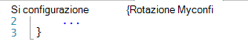
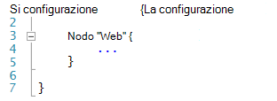
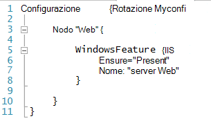
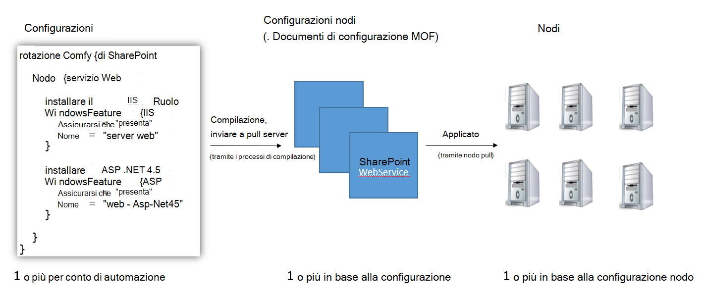
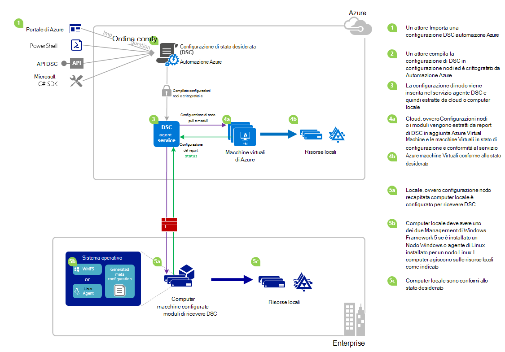

<properties 
   pageTitle="Panoramica di automazione Azure DSC | Microsoft Azure" 
   description="Una panoramica di Azure automazione bene accolta stato configurazione (DSC), i termini e problemi noti" 
   services="automation" 
   documentationCenter="dev-center-name" 
   authors="coreyp-at-msft" 
   manager="stevenka" 
   editor="tysonn"
   keywords="PowerShell dsc, configurazione di stato desiderato, azure dsc powershell"/>

<tags
   ms.service="automation"
   ms.devlang="NA"
   ms.topic="article"
   ms.tgt_pltfrm="powershell"
   ms.workload="TBD" 
   ms.date="05/10/2016"
   ms.author="magoedte;coreyp"/>

# Panoramica di DSC automazione Azure #

##Che cos'è Azure automazione DSC?##
Distribuire e gestire lo stato desiderato dei server e le risorse dell'applicazione può risultare difficile e soggetto a errori. Con Azure automazione desiderato stato configurazione (DSC), è possibile distribuire in modo coerente, in modo affidabile monitorare e aggiornare automaticamente lo stato di tutte le risorse IT, in scala dal cloud desiderato. Basato su PowerShell DSC, automazione DSC può essere allineato configurazione del computer con uno stato specifico tra fisici e macchine (), tramite Windows o Linux e nel cloud o locale. È possibile abilitare continuo recapito servizi IT con controllo coerente e gestire i cambiamenti rapido tra l'ambiente IT distribuzione ibrida eterogeneo con facilità.

DSC automazione Azure basato sulle nozioni fondamentali introdotti DSC PowerShell per fornire un ambiente di Gestione configurazione ancora più semplice. DSC automazione Azure riporta lo stesso livello di gestione in [Configurazione dello stato bene accolta PowerShell](https://msdn.microsoft.com/powershell/dsc/overview) durante l'automazione di Azure offre per lo script di PowerShell oggi.

DSC automazione Azure consente di [creare e gestire le configurazioni PowerShell di stato bene accolta](https://technet.microsoft.com/library/dn249918.aspx), importare [DSC risorse](https://technet.microsoft.com/library/dn282125.aspx)e generare DSC nodo configurazioni (documenti MOF), tutti nel cloud. Questi elementi DSC verranno inseriti in Azure automazione [DSC estrarre server](https://technet.microsoft.com/library/dn249913.aspx) in modo che i nodi di destinazione (ad esempio fisici e virtuali) nel cloud o locale possono sollevare loro, automaticamente conforme allo stato desiderato che specificano e segnalazione nuovamente la conformità con lo stato desiderato per l'automazione Azure.

Si preferisce spettatori lettura? Osservare la sotto video dal maggio 2015, prima di tutto annunciata quando Azure automazione DSC. **Nota:** Mentre i concetti e ciclo di vita descritte in questo video sono corrette, Azure automazione DSC avanzamento molto poiché è stato registrato in questo video. È ora disponibile in genere, ha un'interfaccia utente molto più completa nel portale di Azure e supporta molte altre funzionalità.

> [AZURE.VIDEO microsoft-ignite-2015-heterogeneous-configuration-management-using-microsoft-azure-automation]

## Condizioni per l'automazione Azure DSC ##
### Configurazione ###
DSC PowerShell introdotto il concetto di nuovo le configurazioni. Configurazioni consentono di definire tramite PowerShell sintassi, lo stato dell'ambiente desiderato. Per utilizzare DSC per configurare l'ambiente, definire un blocco di script Windows PowerShell utilizzando la parola chiave di configurazione, quindi procedere con un identificatore, quindi con parentesi graffe ({}) per delimitare il blocco.

All'interno del blocco di configurazione è possibile definire blocchi di configurazione nodo che specificano la configurazione desiderata per un set di nodi (computer), nell'ambiente che deve essere configurata la stessa. In questo modo, una configurazione nodo rappresenta un "ruolo" per uno o più nodi di assumere. Un blocco di configurazione nodo inizia con la parola chiave nodo. Seguire la parola chiave con il nome del ruolo, che può essere una variabile o espressione. Dopo il nome del ruolo, utilizzare parentesi graffe {} per delimitare il blocco di configurazione del nodo.

 
All'interno del blocco di configurazione del nodo, è possibile definire blocchi di risorse per configurare risorse DSC specifiche. Un blocco di risorse inizia con il nome della risorsa, seguita dall'identificatore si desidera specificare per tale intervallo, quindi le parentesi graffe {} per delimitare il blocco.

Per ulteriori informazioni sulla parola chiave di configurazione, vedere: [Informazioni sulle parole chiave di configurazione in bene accolta configurazione dello stato](http://blogs.msdn.com/b/powershell/archive/2013/11/05/understanding-configuration-keyword-in-desired-state-configuration.aspx "Informazioni sulle parole chiave di configurazione in bene accolta configurazione dello stato")

In esecuzione (compilare) una configurazione DSC produrranno uno o più DSC nodo configurazioni (documenti MOF), ovvero quali nodi DSC applicano a rispettare stato desiderato.

DSC automazione Azure consente di importare, autore, e compilazione DSC configurazioni di automazione di Azure, simile a come è possibile importare runbook, creato e avviato in Azure automazione.

>[AZURE.IMPORTANT] Una configurazione deve contenere un solo blocco di configurazione, con lo stesso nome di configurazione, in Azure automazione DSC. 

###Configurazione di un nodo###

Quando viene compilata una configurazione DSC, una o più configurazioni di nodo vengono prodotti a seconda blocchi nodo nella configurazione. Una configurazione nodi è lo stesso come "MOF" o "documento configurazione" (se si ha familiarità con i termini DSC PS) e rappresenta un "ruolo", ad esempio server Web o worker che lo si desidera stato devono presuppongono o verificare la presenza di conformità rispetto a uno o più nodi. Nomi di nodo configurazioni in Azure automazione DSC sotto forma di "Configurazione Name.NodeConfigurationBlockName".

PS i nodi DSC accorge delle configurazioni nodo che dovrebbe mettere tramite push DSC o pull metodi. Azure DSC automazione si basa sul metodo pull DSC, nel punto in cui le configurazioni nodo richiesta nodi che dovrebbero essere applicati da DSC di automazione Azure estrarre server. Poiché i nodi effettuare la richiesta di Azure automazione DSC, può essere nodi di un firewall, sono tutte porte sottotitoli e così via in ingresso. Necessaria solo in uscita accesso a Internet (direttamente o tramite un proxy).

###Nodo###

Un nodo DSC è qualsiasi computer dotato di configurazione gestita da DSC. Trattarsi di Windows o macchine Virtuali di Azure Linux, macchine Virtuali locale / fisica host o computer in un altro cloud pubblico. Nodi mettere configurazioni nodi per diventare e mantenere la conformità con lo stato desiderato che definiscono e anche possono report a un server di report in stato di configurazione e conformità e lo stato desiderato.

DSC automazione Azure semplifica l'integrazione dei nodi per la gestione da Azure automazione DSC e consente la modifica della configurazione del nodo assegnata a ogni nodo sul lato server, in modo successivo che un nodo Cerca nel server di istruzioni verrà presuppongono un ruolo diverso e cambiare modalità di configurazione e lo stato di complaince e segnalare contro in modo che corrispondano.

###Risorsa###
DSC risorse sono blocchi predefiniti che è possibile utilizzare per definire una configurazione di Windows PowerShell bene accolta stato configurazione DSC (). DSC viene fornito con un set di risorse predefiniti, ad esempio quelle per file e cartelle, caratteristiche server e ruoli, impostazioni del Registro di sistema, variabili di ambiente e i servizi e processi. Per conoscere l'elenco completo delle risorse DSC predefinite e sul loro utilizzo, vedere [Incorporato Windows PowerShell bene accolta stato configurazione risorse](https://technet.microsoft.com/library/dn249921.aspx).

Inoltre, è possibile importare le risorse di DSC come parte dei moduli di PowerShell per estendere il set di risorse DSC incorporate. Risorse predefinite non vengono spostate verso il basso dai nodi DSC dal server di pull DSC se una configurazione nodo che il nodo è utilizzato per mettere contiene riferimenti alle risorse. Per informazioni su come creare risorse personalizzate, vedere [Creazione di Windows PowerShell bene accolta stato configurazione risorse personalizzate](https://technet.microsoft.com/library/dn249927.aspx).

DSC automazione Azure viene fornito con le stesse predefinite risorse DSC come PS DSC. Risorse aggiuntive possono aggiunti a Azure automazione DSC importando i moduli di PowerShell contenente le risorse in Azure automazione.

###Processo di compilazione###
Un processo di compilazione in Azure automazione DSC è un'istanza di compilazione di una configurazione per creare una o più configurazioni di nodo. Sono simili ai processi runbook Azure automazione, ad eccezione del fatto che tutte le attività ad eccezione di to creare configurazioni di nodo non viene effettivamente eseguita. Tutte le configurazioni nodo create da un processo di compilazione vengono inserite automaticamente nel server di pull Azure automazione DSC e sovrascrivano le versioni precedenti di configurazioni nodo, se erano disponibili per la configurazione. Il nome di una configurazione nodi prodotto da un processo di compilazione assume la forma di "ConfigurationName.NodeConfigurationBlockName". Ad esempio, la compilazione di sotto configurazione produrrà una configurazione di un singolo nodo denominata "MyConfiguration.webserver"

>[AZURE.NOTE] Come runbook, configurazioni possono essere pubblicate. Non è correlata a inserire elementi DSC in server di pull Azure automazione DSC. I processi di compilazione causano elementi DSC collocare il server di pull Azure automazione DSC. Per ulteriori informazioni sulla "pubblicazione" in Azure automazione, vedere [pubblicazione un Runbook](https://msdn.microsoft.com/library/dn903765.aspx).

##Ciclo di vita DSC automazione Azure##
Passare da un account di automazione vuota a un insieme di gestito dei nodi configurati correttamente comporta una serie di processi per definire le configurazioni, queste configurazioni in nodo configurazioni e nodi di onboarding di Azure automazione DSC e a tali configurazioni nodo l'attivazione. Il diagramma seguente illustra il ciclo di vita di Azure automazione DSC:

Nella figura seguente illustra dettagliate dettagliate nel ciclo di vita di DSC. Include diversi modi importata e applicata ai nodi in Azure automazione, componenti necessari per un computer locale per il supporto DSC e interazioni tra i diversi componenti di una configurazione. 

     

##Trucchi / problemi noti:##

- Durante l'aggiornamento a WMF RTM 5, se il computer è già registrato come nodo Azure automazione DSC, annullarne da Azure automazione DSC e ripetere la registrazione dopo l'aggiornamento al 5 WMF RTM.

- DSC automazione Azure non supporta le configurazioni DSC parziali o composte al momento. Tuttavia, le risorse composte DSC possono essere importate e usate in Azure automazione DSC configurazioni come in locale PowerShell, riutilizzo della configurazione per consentire.

- Per l'agente di PowerShell DSC per Windows la possibilità di comunicare con l'automazione di Azure, è necessario installare la versione più recente di 5 WMF. Per Linux la possibilità di comunicare con l'automazione di Azure, è necessario installare la versione più recente dell'agente di PowerShell DSC per Linux.

- Server di pull PowerShell DSC tradizionale prevede modulo passa per collocare il server pull nel formato **ModuleName_Version.zip "**. Automazione Azure prevede PowerShell moduli da importare con nomi in forma di **ModuleName.zip**. Vedere [questo post di blog](https://azure.microsoft.com/blog/2014/12/15/authoring-integration-modules-for-azure-automation/) per altre informazioni sul formato del modulo Integration necessario per importare il modulo di Azure automazione. 

- Moduli di PowerShell importati automazione Azure non possono contenere i file con estensione doc o. docx. Alcuni moduli di PowerShell contenente le risorse DSC contengono questi file, ai fini della Guida. Questi file devono essere rimossi da moduli, prima di importare in automazione Azure.

- Quando un nodo prima di tutto è registrato con un account Azure automazione o il nodo viene modificato per eseguire il mapping a un altro nodo configurazione lato server, lo stato sarà 'Conforme', anche se lo stato del nodo non è effettivamente compatibile con la configurazione di nodo a che ora è associato. Dopo il nodo esegue il pull prima e invia rapporto prima, dopo la registrazione o una modifica di mapping nodo della configurazione, lo stato del nodo può essere attendibile.

- Quando onboarding una macchina virtuale Windows Azure per la gestione da Azure automazione DSC utilizzando uno dei metodi il nostro onboarding diretta, potrebbe necessaria fino a un'ora per la macchina virtuale per la visualizzazione come nodo DSC automazione Azure. Ciò è dovuto l'installazione di Windows Management Framework 5.0 in macchine Virtuali dall'estensione DSC macchine Virtuali di Azure, che deve essere integrato macchine Virtuali di Azure automazione DSC.

- Dopo aver registrato, ogni nodo negozia automaticamente un certificato univoco per l'autenticazione che scade dopo un anno. Al momento il protocollo di registrazione di PowerShell DSC non verrà rinnovata automaticamente i certificati sono prossimo alla scadenza, pertanto è necessario registrare nuovamente i nodi è prevista dell'anno. Prima di registrare di nuovo, verificare che ogni nodo sia in esecuzione Windows Management Framework 5.0 RTM. Se il certificato di autenticazione del nodo scade e il nodo non nuovamente registrato, il nodo non sarà in grado di comunicare con l'automazione Azure e verrà contrassegnato 'Unresponsive'. Operazione viene eseguita nello stesso modo che è stato registrato il nodo inizialmente. Eseguita l'operazione 90 giorni o minore dall'ora di scadenza certificato o in qualsiasi momento dopo la scadenza certificato, verrà generato un nuovo certificato generata e utilizzato.

- Durante l'aggiornamento a WMF RTM 5, se il computer è già registrato come nodo Azure automazione DSC, annullarne da Azure automazione DSC e ripetere la registrazione dopo l'aggiornamento al 5 WMF RTM. Prima di registrare di nuovo, eliminare il file $env:windir\system32\configuration\DSCEngineCache.mof.

- Cmdlet di PowerShell DSC potrebbe non funzionare se WMF 5 RTM è installato in anteprima di produzione WMF 5. Per risolvere il problema, eseguire il comando seguente in una sessione di PowerShell con privilegi elevata (eseguita come amministratore):`mofcomp $env:windir\system32\wbem\DscCoreConfProv.mof`
 

##Articoli correlati##

- [Macchine Onboarding per la gestione da Azure automazione DSC] (.. /Automation/Automation-DSC-onboarding.MD)
- [La compilazione di configurazioni di Azure automazione DSC] (.. /Automation/Automation-DSC-Compile.MD)
- [Azure automazione DSC cmdlet] (https://msdn.microsoft.com/library/mt244122.aspx)
- [Prezzi di azure DSC automazione] (https://azure.microsoft.com/pricing/details/automation/)
- [Distribuzione continua a macchine virtuali IaaS utilizzando l'automazione Azure DSC e Chocolatey] (automazione dsc-cd chocolatey.md)
