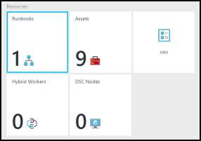
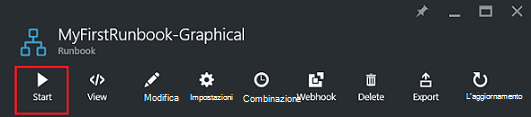
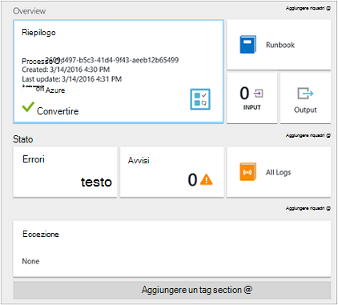
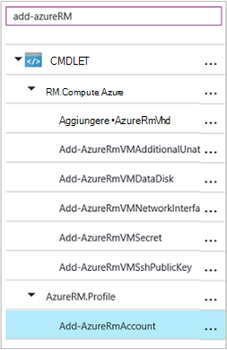

<properties
    pageTitle="La prima runbook grafica in Azure automazione | Microsoft Azure"
    description="Esercitazione che illustra la creazione, test e pubblicazione di un semplice runbook grafica."
    services="automation"
    documentationCenter=""
    authors="mgoedtel"
    manager="jwhit"
    editor=""
    keywords="runbook, modello runbook, automazione runbook, runbook azure"/>
<tags
    ms.service="automation"
    ms.workload="tbd"
    ms.tgt_pltfrm="na"
    ms.devlang="na"
    ms.topic="get-started-article"
    ms.date="07/06/2016"
    ms.author="magoedte;bwren"/>

# <a name="my-first-graphical-runbook"></a>Il primo runbook grafica

> [AZURE.SELECTOR] - [Grafica](automation-first-runbook-graphical.md) - [PowerShell](automation-first-runbook-textual-PowerShell.md) - [PowerShell del flusso di lavoro](automation-first-runbook-textual.md)

In questa esercitazione si tramite la creazione di un [grafico runbook](automation-runbook-types.md#graphical-runbooks) automazione Azure.  Iniziamo con un semplice runbook che è necessario verificare e pubblicare mentre viene illustrato come tenere traccia dello stato del processo di runbook.  Quindi verrà modificata dal runbook per gestire le risorse Azure, in questo caso partire una macchina virtuale Azure.  Verrà quindi effettuata dal runbook sia più efficace mediante l'aggiunta di parametri runbook e collegamenti condizionale.

## <a name="prerequisites"></a>Prerequisiti

Per completare questa esercitazione, è necessario quanto segue.

-   Azure abbonamento.  Se non è una ancora disponibile, è possibile [attivare i vantaggi dell'abbonato MSDN](https://azure.microsoft.com/pricing/member-offers/msdn-benefits-details/) o <a href="/pricing/free-account/" target="_blank"> [iscriversi a un account gratuito](https://azure.microsoft.com/free/).
-   [Esecuzione come Account azure](automation-sec-configure-azure-runas-account.md) per tenere dal runbook e autenticato per risorse Azure.  Questo account deve disporre dell'autorizzazione per avviare e arrestare la macchina virtuale.
-   Una macchina virtuale Azure.  Si interrompe e avviare il computer in modo che non deve essere produzione.


## <a name="step-1---create-new-runbook"></a>Passaggio 1 - creare nuovo runbook

Iniziamo creando un semplice runbook che genera il testo *Hello World*.

1.  Nel portale di Azure, aprire l'account di automazione.  
    La pagina dell'account automazione offre una breve descrizione delle risorse di questo account.  Sono presenti alcuni beni.  La maggior parte delle persone sono i moduli che vengono automaticamente inclusi in un nuovo account di automazione.  È inoltre asset credenziali menzionato nei [Prerequisiti](#prerequisites).
2.  Fare clic sul riquadro **runbook** per aprire l'elenco di runbook.<br> 
3.  Creare un nuovo runbook facendo clic sul pulsante **Aggiungi un runbook** e quindi **Crea un nuovo runbook**.
4.  Denominare dal runbook *MyFirstRunbook grafica*.
5.  In questo caso, verranno creare un [grafico runbook](automation-graphical-authoring-intro.md) pertanto selezionare **grafiche** per **tipo di Runbook**.<br> <br>
6.  Fare clic su **Crea** per creare dal runbook e aprire l'editor di grafica.

## <a name="step-2---add-activities-to-the-runbook"></a>Passaggio 2: aggiungere attività dal runbook

Controllo raccolta sul lato sinistro dell'editor consente di selezionare le attività per aggiungere i runbook.  Verranno per aggiungere un cmdlet di **Output di scrittura** per generare l'output dal runbook del testo.

1.  In controllo raccolta, fare clic nella casella di testo di ricerca e digitare **Output di scrittura**.  Verranno visualizzati i risultati della ricerca sotto. <br> 
2.  Scorrere fino alla fine dell'elenco.  È possibile fare clic con il pulsante destro **Output di scrittura** e selezionare **Aggiungi per l'area di lavoro** o fare clic sull'ellisse accanto al cmdlet e quindi selezionare **Aggiungi per l'area di lavoro**.
3.  Fare clic su attività **Scrittura Output** nell'area di lavoro.  Verrà aperta e il controllo configurazione che consente di configurare l'attività.
4.  L' **etichetta** predefinita per il nome del cmdlet, ma è possibile modificare in modo più semplice. Impostarlo su *Scrivere Hello World per generare l'output*.
5.  Fare clic su **parametri** per fornire i valori per i parametri del cmdlet.  
    Alcuni cmdlet dispone di più serie di parametri ed è necessario selezionare che verrà utilizzato. In questo caso, **Scrittura Output** sono un solo set di parametro, pertanto non è necessario selezionare una. <br> 
6.  Selezionare il parametro **InputObject** .  Si tratta del parametro in cui si specifica il testo da inviare al flusso di output.
7.  Nell'elenco a discesa **origine dati** selezionare **PowerShell espressione**.  L'elenco a discesa **origine dati** sono disponibili diverse origini che consente di inserire un valore di parametro.  
    È possibile utilizzare output da tali origini, ad esempio un'altra attività, una risorsa di automazione o un'espressione di PowerShell.  In questo caso, si vuole semplicemente generare l'output il testo *Hello World*. È possibile utilizzare un'espressione di PowerShell e specificare una stringa.
8.  Nella casella **espressione** digitare *"Hello World"* e quindi fare clic su **OK** due volte per tornare all'area di lavoro.<br> 
9.  Salvare dal runbook facendo clic su **Salva**.<br> 

## <a name="step-3---test-the-runbook"></a>Passaggio 3 - verificare dal runbook

Pubblicato dal runbook per renderlo disponibile nell'ambiente di produzione, si desidera eseguire il test per verificare il corretto funzionamento.  Quando si verifica un runbook, eseguire la versione **bozza** e visualizzarne l'output in modo interattivo.

1.  Fare clic su **riquadro Test** per aprire e il Test.<br> 
2.  Fare clic su **Avvia** per avviare il test.  Deve essere l'unica opzione disponibile abilitato.
3.  Viene creato un [processo runbook](automation-runbook-execution.md) e il relativo stato visualizzato nel riquadro.  
    Lo stato del processo verrà avviato come *in coda* che indica che è in attesa di un lavoro runbook nel cloud diventi disponibile.  Oggetto si sposterà a *partire da* quando un lavoro le del processo, quindi *in esecuzione* quando dal runbook effettivamente avviato.  
4.  Al termine del processo di runbook, viene visualizzato l'output. In questo caso, bisogna vediamo *Hello World*.<br> 
5.  Chiudere e il Test per tornare all'area di lavoro.

## <a name="step-4---publish-and-start-the-runbook"></a>Passaggio 4 - pubblicare e iniziare dal runbook

Dal runbook appena creato è ancora in modalità bozza. È necessario pubblicarlo prima non è possibile eseguire in produzione.  Quando si pubblica una runbook, si sovrascrivere la versione pubblicata esistente con la versione bozza.  In questo caso, non è una versione pubblicata ancora perché dal runbook appena creato.

1.  Fare clic su **pubblica** per pubblicare dal runbook e quindi su **Sì** quando richiesto.<br> 
2.  Se si passa a sinistra per visualizzare dal runbook e il **runbook** , verrà visualizzato un **Authoring stato** **pubblicato**.
3.  Scorrere verso destra per visualizzare e il per **MyFirstRunbook**.  
    Le opzioni nella parte superiore consentono di iniziare dal runbook, pianificare in modo che inizi da un determinato momento in futuro o creare un [webhook](automation-webhooks.md) in modo che può essere avviato tramite una chiamata HTTP.
4.  Si desidera iniziare dal runbook pertanto fare clic su **Start** e quindi su **Sì** quando richiesto.<br> 
5.  Blade processo viene aperta per il processo di runbook appena creata.  È possibile chiudere questo blade, ma in questo caso è possibile lasciarla aperta in modo che è possibile controllare l'avanzamento del processo.
6.  Lo stato del processo illustrato nella **Riepilogo** e trova le corrispondenze stati che visto quando sono stati testati dal runbook.<br> 
7.  Una volta *completato*viene visualizzato lo stato di runbook, fare clic su **Output**. È possibile vedere *Hello World* nel riquadro e il **risultato** è aperto.<br>   
8.  Chiudere e il risultato.
9.  Fare clic su **Tutti i registri** per aprire e il flussi per il processo di runbook.  Bisogna solo vediamo *Hello World* nel flusso di output, ma è possibile indicare i flussi di un processo runbook, ad esempio dettagliato ed errore se dal runbook scrive ad essi.<br> 
10. Chiudere e il tutti i log ed e il processo per tornare alla e MyFirstRunbook.
11. Fare clic su **processi** in modo da aprire e il processi per questo runbook.  Elenca tutti i processi creati da questo runbook. Vediamo bisogna solo un processo elencato in quanto è solo esecuzione del processo una sola volta.<br> 
12. È possibile fare clic su questo processo per aprire il riquadro processo stesso sono visibili quando si è avviata dal runbook.  In questo modo è possibile tornare indietro nel tempo e visualizzare i dettagli di un processo che è stato creato per una particolare runbook.

## <a name="step-5---create-variable-assets"></a>Passaggio 5 - Creazione risorse variabile

Abbiamo testati e pubblicato il nostro runbook ma finora non esegue operazioni utili. Vogliamo gestire le risorse di Azure.  Prima che viene configurato dal runbook per eseguire l'autenticazione, verrà creata una variabile per tenere premuto l'ID di abbonamento e farvi riferimento dopo che si configura l'attività per l'autenticazione nel passaggio 6 riportata di seguito.  Aggiunta di un riferimento al contesto dell'abbonamento consente di lavorare facilmente tra più abbonamenti.  Prima di continuare, copiare il proprio ID abbonamento l'opzione abbonamenti dal riquadro di spostamento.  

1. In e l'automazione account, fare clic sul riquadro **attività** e viene aperto e il **risorse** .
2. In e il risorse, fare clic sul riquadro **variabili** .
3. Scegliere **Aggiungi una variabile di tipo**e il variabili.<br>
4. Nella nuova variabile pala, nella casella **nome** immettere **AzureSubscriptionId** e nella casella **valore** immettere il proprio ID abbonamento.  Mantenere *stringa* per il **tipo** e il valore predefinito per **la crittografia**.  
5. Fare clic su **Crea** per creare la variabile.  


## <a name="step-6---add-authentication-to-manage-azure-resources"></a>Passaggio 6: aggiunta di autenticazione per gestire le risorse Azure

Ora che è stata creata una variabile per contenere il nostro ID abbonamento, possiamo configurare il nostro runbook per eseguire l'autenticazione con le credenziali Esegui come indicate nei [Prerequisiti](#prerequisites).  Facciamo aggiungendo il Azure Esegui come connessione **entrate** e **Aggiungere AzureRMAccount** cmdlet all'area di lavoro.  

1.  Aprire l'editor di grafica facendo clic su **Modifica** nella e MyFirstRunbook.<br> 
2.  Non occorre **Scrivere Hello World per generare l'output** più, pertanto destra fare clic su esso e scegliere **Elimina**.
3.  In controllo raccolta espandere **connessioni** e aggiungere **AzureRunAsConnection** all'area di lavoro, scegliere **Aggiungi all'area di lavoro**.
4.  Nell'area di lavoro, selezionare **AzureRunAsConnection** e nel riquadro di controllo configurazione digitare **Ottenere eseguire come connessione** nella casella di testo **etichetta** .  Si tratta della connessione 
5.  In controllo raccolta digitare **AzureRmAccount Aggiungi** nella casella di testo di ricerca.
6.  Aggiungere **AzureRmAccount Aggiungi** all'area di lavoro.<br> 
7.  Posizionare il puntatore **Visualizzato eseguire come connessione** finché non viene visualizzato un cerchio nella parte inferiore della forma. Fare clic sul cerchio e trascinare la freccia a **AzureRmAccount Aggiungi**.  Freccia che appena creato è un *collegamento*.  Dal runbook verrà avviato con **Ottenere eseguire come connessione** ed eseguire **AzureRmAccount Aggiungi**.<br> 
8.  Nell'area di lavoro, selezionare **Aggiungi AzureRmAccount** e nella configurazione di controllare il tipo di riquadro **Login to Azure** nella casella di testo **etichetta** .
9.  Fare clic su **parametri** e la configurazione di parametro attività blade visualizzato. 
10.  **Aggiungi AzureRmAccount** sono più set di parametro, pertanto è necessario selezionare una prima di poter fornire i valori dei parametri.  Fare clic su **Imposta parametro** e quindi selezionare il set di parametro **ServicePrincipalCertificate** . 
11.  Dopo aver selezionato il parametro impostato, vengono visualizzati i parametri in e il configurazione parametro attività.  Fare clic su **ID applicazione**.<br> 
12.  In e il valore del parametro, selezionare **attività output** per l' **origine dati** e selezionare **Ottenere eseguire come connessione** dall'elenco nel tipo di casella di testo **ID applicazione**di **percorso di campo** e quindi fare clic su **OK**.  È in corso specificando il nome della proprietà per il percorso del campo poiché l'attività restituisce un oggetto con più proprietà.
13.  Fare clic su **CERTIFICATETHUMBPRINT**e nella finestra e valore del parametro, selezionare **attività output** per l' **origine dati**.  Selezionare **Ottenere eseguire come connessione** dall'elenco, nella finestra **CertificateThumbprint**di tipo casella di testo **percorso di campo** e quindi fare clic su **OK**. 
14.  Fare clic su **SERVICEPRINCIPAL**e in e il valore del parametro, selezionare **ConstantValue** per l' **origine dati**, fare clic sull'opzione **True**e quindi fare clic su **OK**.
15.  Fare clic su **TENANTID**e nella finestra e valore del parametro, selezionare **attività output** per l' **origine dati**.  Selezionare **Ottenere eseguire come connessione** dall'elenco, nella finestra **TenantId**di tipo casella di testo **percorso di campo** e quindi fare clic su **OK** .  
16.  In controllo raccolta digitare **Set AzureRmContext** nella casella di testo di ricerca.
17.  Aggiungere **Set AzureRmContext** all'area di lavoro.
18.  Nell'area di lavoro, selezionare **Imposta AzureRmContext** e nella configurazione controllare il tipo di pane **Id abbonamento specificare** nella casella di testo **etichetta** .
19.  Fare clic su **parametri** e la configurazione di parametro attività blade visualizzato. 
20. **Set AzureRmContext** sono più set di parametro, pertanto è necessario selezionare una prima di poter fornire i valori dei parametri.  Fare clic su **Imposta parametro** e quindi selezionare il set di parametro **SubscriptionId** .  
21.  Dopo aver selezionato il parametro impostato, vengono visualizzati i parametri in e il configurazione parametro attività.  Fare clic su **SubscriptionID**
22.  In e il valore del parametro, selezionare **Risorse variabili** per l' **origine dati** e selezionare **AzureSubscriptionId** dall'elenco e quindi fare clic su **OK** due volte.   
23.  Posizionare il puntatore **Login to Azure** finché non viene visualizzato un cerchio nella parte inferiore della forma. Fare clic sul cerchio e trascinare la freccia per **Specificare Id abbonamento**.


I runbook avrà un aspetto simile al seguente a questo punto: <br>

## <a name="step-7---add-activity-to-start-a-virtual-machine"></a>Passaggio 7: aggiunta di attività per avviare una macchina virtuale

Ora verranno aggiunte un'attività **AzureRmVM inizio** per avviare una macchina virtuale.  È possibile selezionare qualsiasi macchina virtuale nell'abbonamento Azure e per ora si farà hardcoded assegnare un nome nel cmdlet.

1. In controllo raccolta digitare **Start AzureRm** nella casella di testo di ricerca.
2. Aggiungere **Inizio AzureRmVM** all'area di lavoro e quindi fare clic su e trascinarlo sotto **Specificare Id abbonamento**.
3. Posizionare il puntatore **Specificare Id abbonamento** fino a quando non viene visualizzato un cerchio nella parte inferiore della forma.  Fare clic sul cerchio e trascinare la freccia a **Start AzureRmVM**. 
4.  Selezionare **Start AzureRmVM**.  Fare clic su **parametri** e quindi **Parametro impostato** per visualizzare i set di **AzureRmVM Start**.  Selezionare il set di parametro **ResourceGroupNameParameterSetName** . Si noti che **ResourceGroupName** e il **nome** essere punti esclamativi Avanti loro.  Questo indica che sono necessari parametri.  Si noti inoltre che entrambe si aspettano valori stringa.
5.  Selezionare il **nome**.  Selezionare **PowerShell espressione** **dell'origine dati** e digitare il nome del computer virtuale racchiuso tra virgolette doppie che Iniziamo con questo runbook.  Fare clic su **OK**.<br>
6.  Selezionare **ResourceGroupName**. Utilizzare **PowerShell espressione** **dell'origine dati** e digitare il nome del gruppo di risorse racchiuso tra virgolette doppie.  Fare clic su **OK**.<br> 
8.  Fare clic su riquadro Test in modo che è possibile verificare dal runbook.
9.  Fare clic su **Avvia** per avviare il test.  Dopo essere stato completato, verificare che la macchina virtuale è stata avviata.

I runbook avrà un aspetto simile al seguente a questo punto: <br>

## <a name="step-8---add-additional-input-parameters-to-the-runbook"></a>Passaggio 8 - aggiungere altri parametri di input dal runbook

Il nostro runbook attualmente avvia la macchina virtuale nel gruppo di risorse specificato nel cmdlet **Start AzureRmVM** , ma il nostro runbook può risultare più utile se è possibile specificare entrambe quando viene avviato dal runbook.  Si aggiungerà parametri di input a runbook per fornire tale funzionalità.

1. Aprire l'editor di grafica facendo clic su **Modifica** nel riquadro **MyFirstRunbook** .
2. Fare clic su **Input e output** e quindi **aggiungere input** per aprire il riquadro Runbook parametro di Input.<br> 
3. Specificare il **nome** *VMName* .  Mantenere *stringa* per il **tipo**, ma modificare **obbligatorio** su *Sì*.  Fare clic su **OK**.
4. Creare un secondo parametro di input obbligatorio denominato *ResourceGroupName* e quindi fare clic su **OK** per chiudere il riquadro di **Input e Output** .<br> 
5. Selezionare l'attività **AzureRmVM Start** e quindi fare clic su **parametri**.
6. Modificare l' **origine dati** per **nome** **all'input Runbook** e quindi selezionare **VMName**.<br>
7. Modificare l' **origine dati** per **ResourceGroupName** a **Runbook input** e quindi selezionare **ResourceGroupName**.<br> 
8. Salvare dal runbook e aprire il riquadro di Test.  Si noti che a questo punto è possibile specificare i valori per due variabili di input che verranno utilizzate il test.
9. Chiudere il riquadro di Test.
10. Fare clic su **pubblica** per pubblicare la nuova versione dal runbook.
11. Interrompere la macchina virtuale che si è avviata nel passaggio precedente.
12. Fare clic su **Avvia** per avviare dal runbook.  Digitare nella casella **VMName** e **ResourceGroupName** per la macchina virtuale che si desidera avviare.<br> 
13. Dopo avere completato dal runbook, verificare che la macchina virtuale è stata avviata.

## <a name="step-9---create-a-conditional-link"></a>Passaggio 9 - creare un collegamento condizionale

È ora modificherà dal runbook in modo che solo tenterà di avviare la macchina virtuale se non è già stata avviata.  È possibile farlo mediante l'aggiunta di un cmdlet **Get-AzureRmVM** runbook che verrà visualizzato lo stato del livello di istanza della macchina virtuale. Quindi verrà aggiunto un modulo di codice del flusso di lavoro di PowerShell denominato **Stato visualizzato** con un frammento di codice di PowerShell per determinare se lo stato macchina virtuale è in esecuzione o meno.  Un collegamento condizionale dal modulo di **Ottenere lo stato** eseguito **Start AzureRmVM** solo se lo stato attivo corrente viene interrotto.  Infine, si verrà visualizzato un messaggio che informa se la macchina virtuale è stata avviata correttamente o non si usa il cmdlet di Output di scrittura PowerShell.

1. Aprire **MyFirstRunbook** nell'editor grafico.
2. Rimuovere il collegamento tra **Specificare Id di abbonamento** e **Start AzureRmVM** facendo clic su di esso e quindi premere *CANC* .
3. In controllo raccolta digitare **Get-AzureRm** nella casella di testo di ricerca.
4. Aggiungere **Recupera AzureRmVM** all'area di lavoro.
5. Selezionare **Carica AzureRmVM** e quindi **Parametro impostato** per visualizzare i set di **Get-AzureRmVM**.  Selezionare il set di parametro **GetVirtualMachineInResourceGroupNameParamSet** .  Si noti che **ResourceGroupName** e il **nome** essere punti esclamativi Avanti loro.  Questo indica che sono necessari parametri.  Si noti inoltre che entrambe si aspettano valori stringa.
6. In **origine dati** per **nome**, selezionare **Runbook input** e quindi selezionare **VMName**.  Fare clic su **OK**.
7. In **origine dati** per **ResourceGroupName**, selezionare **Runbook input** e quindi selezionare **ResourceGroupName**.  Fare clic su **OK**.
8. In **origine dati** per **stato**, selezionare **valore costante** e quindi fare clic su **True**.  Fare clic su **OK**.  
9. Creare un collegamento dalla **Specificare Id di abbonamento** a **Get-AzureRmVM**.
10. In controllo raccolta espandere **Controllo Runbook** e aggiungere **codice** nell'area di lavoro.  
11. Creare un collegamento dalla **Get-AzureRmVM** al **codice**.  
12. Fare clic su **codice** e nel riquadro di configurazione, modificare l'etichetta per **Ottenere lo stato**.
13. Parametro di **codice di** selezione ed e il **Codice Editor** verrà visualizzato.  
14. Nell'editor di codice, incollare il frammento di codice seguente:

     ```
     $StatusesJson = $ActivityOutput['Get-AzureRmVM'].StatusesText 
     $Statuses = ConvertFrom-Json $StatusesJson 
     $StatusOut ="" 
     foreach ($Status in $Statuses){ 
     if($Status.Code -eq "Powerstate/running"){$StatusOut = "running"} 
     elseif ($Status.Code -eq "Powerstate/deallocated") {$StatusOut = "stopped"} 
     } 
     $StatusOut 
     ```

15. Creare un collegamento dalla **Stato visualizzato** a **Start AzureRmVM**.<br>   
16. Selezionare il collegamento e nel riquadro di configurazione, modificare **Applica condizione** su **Sì**.   Nota il collegamento si trasforma in una linea tratteggiata che indica che l'attività verrà eseguita solo se la condizione restituisce true.  
17. Per l' **espressione condizione**, digitare *$ActivityOutput [' ottenere lo stato '] - eq "Arrestato"*.  **Inizio AzureRmVM** verrà eseguito solo se la macchina virtuale viene interrotto.
18. In controllo raccolta, espandere **i cmdlet** e quindi **Microsoft.PowerShell.Utility**.
19. Aggiungere due volte **Scrittura Output** all'area di lavoro.<br> 
20. Nel primo controllo **Output di scrittura** , fare clic su **parametri** e impostare il valore di **etichetta** per *Una notifica a macchine Virtuali*.
21. Per **InputObject**, Cambia **origine dati** per **l'espressione di PowerShell** e digitare l' espressione *"$VMName avviato correttamente."*.
22. Il secondo controllo **Output di scrittura** , fare clic su **parametri** e impostare il valore di **etichetta** per *Una notifica macchine Virtuali avviare riuscito*
23. Per **InputObject**, Cambia **origine dati** per **l'espressione di PowerShell** e digitare l'espressione *"$VMName Impossibile avviare."*.
24. Creare un collegamento da **Inizio AzureRmVM** da **una notifica macchine Virtuali** e **Una notifica macchine Virtuali avviare riuscito**.
25. Selezionare il collegamento per **Una notifica a macchine Virtuali** e le **Applica condizione** **vera**.
26. Per l' **espressione condizione**, digitare *$ActivityOutput ['Start-AzureRmVM']. IsSuccessStatusCode - eq $true*.  Questo controllo scrittura Output verrà eseguito solo se la macchina virtuale è stata avviata correttamente.
27. Selezionare il collegamento a **Una notifica avviare riuscito macchine Virtuali** e le **Applica condizione** **vera**.
28. Per l' **espressione condizione**, digitare *$ActivityOutput ['Start-AzureRmVM']. IsSuccessStatusCode - ne $true*.  Questo controllo scrittura Output verrà eseguito solo se la macchina virtuale non viene avviata correttamente.
29. Salvare dal runbook e aprire il riquadro di Test.
30. Avviare dal runbook con la macchina virtuale arrestata e il nome dovrebbe iniziare.

## <a name="next-steps"></a>Passaggi successivi

-   Per ulteriori informazioni sulla creazione di grafici, vedere [grafiche creazione condivisa in automazione Azure](automation-graphical-authoring-intro.md)
-   Per iniziare a utilizzare runbook PowerShell, vedere [il primo runbook PowerShell](automation-first-runbook-textual-powershell.md)
-   Per iniziare a utilizzare runbook del flusso di lavoro di PowerShell, vedere [il primo runbook del flusso di lavoro PowerShell](automation-first-runbook-textual.md)
