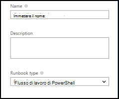
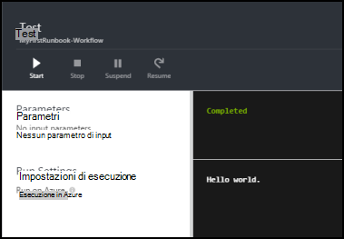
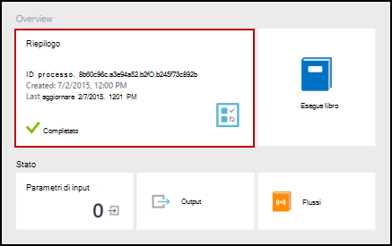
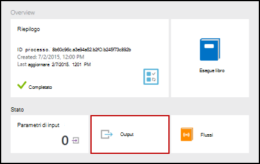
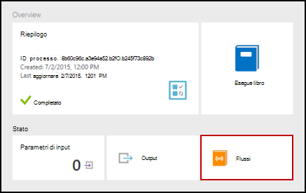
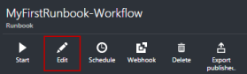
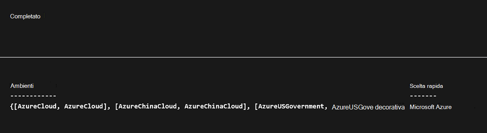
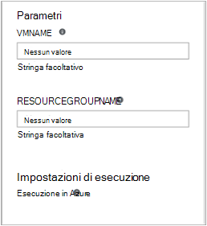

<properties
    pageTitle="La prima runbook del flusso di lavoro di PowerShell automazione Azure | Microsoft Azure"
    description="Esercitazione che illustra la creazione, test e pubblicazione di un runbook di testo semplice tramite PowerShell del flusso di lavoro."
    services="automation"
    documentationCenter=""
    authors="mgoedtel"
    manager="jwhit"
    editor=""
    keywords="flusso di lavoro PowerShell, esempi di flusso di lavoro di powershell, powershell del flusso di lavoro"/>
<tags
    ms.service="automation"
    ms.workload="tbd"
    ms.tgt_pltfrm="na"
    ms.devlang="na"
    ms.topic="get-started-article"
    ms.date="07/19/2016"
    ms.author="magoedte;bwren"/>

# <a name="my-first-powershell-workflow-runbook"></a>Il primo runbook PowerShell del flusso di lavoro

> [AZURE.SELECTOR] - [Grafica](automation-first-runbook-graphical.md) - [PowerShell](automation-first-runbook-textual-PowerShell.md) - [PowerShell del flusso di lavoro](automation-first-runbook-textual.md)

In questa esercitazione si tramite la creazione di un [flusso di lavoro di PowerShell runbook](automation-runbook-types.md#powerShell-workflow-runbooks) di automazione Azure. Iniziamo con un semplice runbook che è necessario verificare e pubblicare mentre viene illustrato come tenere traccia dello stato del processo di runbook. Quindi verrà modificata dal runbook per gestire le risorse Azure, in questo caso partire una macchina virtuale Azure. È necessario apportare dal runbook sia più efficace mediante l'aggiunta di parametri runbook.

## <a name="prerequisites"></a>Prerequisiti

Per completare questa esercitazione, è necessario quanto segue.

-   Azure abbonamento. Se non è una ancora disponibile, è possibile [attivare i vantaggi dell'abbonato MSDN](https://azure.microsoft.com/pricing/member-offers/msdn-benefits-details/) o <a href="/pricing/free-account/" target="_blank"> [iscriversi a un account gratuito](https://azure.microsoft.com/free/).
-   [Account di automazione](automation-security-overview.md) per tenere dal runbook e autenticato per risorse Azure.  Questo account deve disporre dell'autorizzazione per avviare e arrestare la macchina virtuale.
-   Una macchina virtuale Azure. Si interrompe e avviare il computer in modo che non deve essere produzione.

## <a name="step-1---create-new-runbook"></a>Passaggio 1 - creare nuovo runbook

Iniziamo creando un semplice runbook che genera il testo *Hello World*.

1.  Nel portale di Azure, aprire l'account di automazione.  
    La pagina dell'account automazione offre una breve descrizione delle risorse di questo account. Sono presenti alcuni beni. La maggior parte delle persone sono i moduli che vengono automaticamente inclusi in un nuovo account di automazione. È inoltre asset credenziali menzionato nei [Prerequisiti](#prerequisites).
2.  Fare clic sul riquadro **runbook** per aprire l'elenco di runbook.<br> 
3.  Creare un nuovo runbook facendo clic sul pulsante **Aggiungi un runbook** e quindi **Crea un nuovo runbook**.
4.  Denominare dal runbook *MyFirstRunbook flusso di lavoro*.
5.  In questo caso, verranno creare un [flusso di lavoro di PowerShell runbook](automation-runbook-types.md#powerShell-workflow-runbooks) pertanto selezionare **Flusso di lavoro di Powershell** per **tipo di Runbook**.<br> 
6.  Fare clic su **Crea** per creare dal runbook e aprire l'editor di testo.

## <a name="step-2---add-code-to-the-runbook"></a>Passaggio 2: aggiungere il codice dal runbook

È possibile scrivere codice tipo direttamente in dal runbook oppure è possibile selezionare i cmdlet, runbook e risorse dal controllo raccolta e aggiungerle runbook a tutti i parametri correlati. Per questa procedura dettagliata, è necessario digitare direttamente dal runbook.

1.  Il nostro runbook è attualmente vuoto con solo la parola chiave necessari *flusso di lavoro* , il nome del nostro runbook e le parentesi graffe che verranno encase il flusso di lavoro intera. 

    ```
    Workflow MyFirstRunbook-Workflow
    {
    }
    ```

2.  Tipo di *Output di scrittura "Hello World".* tra parentesi graffe. 
   
    ```
    Workflow MyFirstRunbook-Workflow
    {
      Write-Output "Hello World"
    }
    ```

3.  Salvare dal runbook facendo clic su **Salva**.<br> 

## <a name="step-3---test-the-runbook"></a>Passaggio 3 - verificare dal runbook

Pubblicato dal runbook per renderlo disponibile nell'ambiente di produzione, si desidera eseguire il test per verificare il corretto funzionamento. Quando si verifica un runbook, eseguire la versione **bozza** e visualizzarne l'output in modo interattivo.

1.  Fare clic su **riquadro Test** per aprire il riquadro di Test.<br> 
2.  Fare clic su **Avvia** per avviare il test. Deve essere l'unica opzione disponibile abilitato.
3.  Viene creato un [processo runbook](automation-runbook-execution.md) e il relativo stato visualizzato.  
    Lo stato del processo verrà avviato come *in coda* che indica che è in attesa per un lavoro runbook nel cloud in arrivo disponibile. Oggetto si sposterà a *partire da* quando un lavoro le del processo, quindi *in esecuzione* quando dal runbook effettivamente avviato.  
4.  Al termine del processo di runbook, viene visualizzato l'output. In questo caso, bisogna vediamo *Hello World*.<br> 
5.  Chiudere il riquadro di Test per tornare all'area di lavoro.

## <a name="step-4---publish-and-start-the-runbook"></a>Passaggio 4 - pubblicare e iniziare dal runbook

Dal runbook appena creato è ancora in modalità bozza. È necessario pubblicarlo prima non è possibile eseguire in produzione. Quando si pubblica una runbook, si sovrascrivere la versione pubblicata esistente con la versione bozza. In questo caso, non è una versione pubblicata ancora perché dal runbook appena creato.

1.  Fare clic su **pubblica** per pubblicare dal runbook e quindi su **Sì** quando richiesto.<br> 
2.  Se si scorre a sinistra per visualizzare dal runbook nel riquadro **runbook** a questo punto, verrà visualizzato un **Authoring stato** **pubblicato**.
3.  Scorrere verso destra per visualizzare il riquadro per **MyFirstRunbook flusso di lavoro**.  
    Le opzioni nella parte superiore consentono di iniziare dal runbook, pianificare in modo che inizi da un determinato momento in futuro o creare un [webhook](automation-webhooks.md) in modo che può essere avviato tramite una chiamata HTTP.
4.  Si desidera iniziare dal runbook pertanto fare clic su **Start** e quindi su **Sì** quando richiesto.<br> 
5.  Viene aperto il riquadro di un processo per il processo di runbook appena creata. È possibile chiudere il riquadro, ma in questo caso è possibile lasciarla aperta in modo che è possibile controllare l'avanzamento del processo.
6.  Lo stato del processo illustrato nella **Riepilogo** e trova le corrispondenze stati che visto quando sono stati testati dal runbook.<br> 
7.  Una volta *completato*viene visualizzato lo stato di runbook, fare clic su **Output**. Aprire il riquadro di Output è ed è possibile visualizzare *Hello World*.<br>   
8.  Chiudere il riquadro di Output.
9.  Fare clic su **flussi** per aprire il riquadro flussi per il processo di runbook. Bisogna solo vediamo *Hello World* nel flusso di output, ma è possibile indicare i flussi di un processo runbook, ad esempio dettagliato ed errore se dal runbook scrive ad essi.<br> 
10. Chiudere il riquadro flussi e il riquadro di processo per tornare al riquadro MyFirstRunbook.
11. Fare clic su **processi** per aprire il riquadro processi per questo runbook. Elenca tutti i processi creati da questo runbook. Vediamo bisogna solo un processo elencato in quanto è solo esecuzione del processo una sola volta.<br> 
12. È possibile fare clic su questo processo per aprire il riquadro processo stesso sono visibili quando si è avviata dal runbook. In questo modo è possibile tornare indietro nel tempo e visualizzare i dettagli di un processo che è stato creato per una particolare runbook.

## <a name="step-5---add-authentication-to-manage-azure-resources"></a>Passaggio 5: aggiunta di autenticazione per gestire le risorse Azure

Abbiamo testati e pubblicato il nostro runbook ma finora non esegue operazioni utili. Vogliamo gestire le risorse di Azure. Non sarà possibile farlo anche se a meno che non si dispone di autenticazione utilizzando le credenziali sono indicate nella finestra i [Prerequisiti](#prerequisites). Facciamo con il cmdlet **AzureRMAccount Aggiungi** .

1.  Aprire l'editor di testo facendo clic su **Modifica** nel riquadro MyFirstRunbook flusso di lavoro.<br> 
2.  Abbiamo non più necessarie nella riga di **Output di scrittura** , quindi procedere ed eliminarlo.
3.  Posizionare il cursore su una riga vuota tra le parentesi graffe.
4.  Digitare oppure copiare e incollare il codice seguente che consente di gestire l'autenticazione con l'account di automazione Esegui come:

    ```
    $Conn = Get-AutomationConnection -Name AzureRunAsConnection 
    Add-AzureRMAccount -ServicePrincipal -Tenant $Conn.TenantID `
    -ApplicationId $Conn.ApplicationID -CertificateThumbprint $Conn.CertificateThumbprint
    ```

5.  Fare clic su **Test riquadro** in modo che è possibile verificare dal runbook.
6.  Fare clic su **Avvia** per avviare il test. Dopo essere stato completato, verrà visualizzato output simile alle informazioni di base seguenti, la visualizzazione dall'account. Ciò significa che le credenziali sono valide.<br> 

## <a name="step-6---add-code-to-start-a-virtual-machine"></a>Passaggio 6: aggiungere il codice per avviare una macchina virtuale

Ora che il nostro runbook autentica la sottoscrizione di Azure, è possibile gestire le risorse. È necessario aggiungere un comando per avviare una macchina virtuale. È possibile selezionare qualsiasi macchina virtuale nell'abbonamento Azure e per ora si farà hardcoded assegnare un nome nel cmdlet.

1.  Dopo aver *AzureRmAccount Aggiungi*, digitare *Start AzureRmVM-nome 'VMName' - ResourceGroupName 'NameofResourceGroup'* fornire il nome e il nome del gruppo di risorse del computer virtuale per iniziare.  

    ```
    workflow MyFirstRunbook-Workflow
    {
      $Conn = Get-AutomationConnection -Name AzureRunAsConnection
      Add-AzureRMAccount -ServicePrincipal -Tenant $Conn.TenantID -ApplicationId $Conn.ApplicationID -CertificateThumbprint $Conn.CertificateThumbprint
      Start-AzureRmVM -Name 'VMName' -ResourceGroupName 'ResourceGroupName'
    }
    ``` 

2.  Salvare dal runbook e quindi fare clic su **Test riquadro** in modo che è possibile verificare.
3.  Fare clic su **Avvia** per avviare il test. Dopo essere stato completato, verificare che la macchina virtuale è stata avviata.

## <a name="step-7---add-an-input-parameter-to-the-runbook"></a>Passaggio 7: aggiungere un parametro di input dal runbook

Il nostro runbook attualmente verrà avviata la macchina virtuale che hardcoded dal runbook, ma potrebbe essere più utile se è possibile specificare la macchina virtuale quando viene avviato dal runbook. Si aggiungerà parametri di input a runbook per fornire tale funzionalità.

1.  Aggiungere parametri per *VMName* e *ResourceGroupName* dal runbook e utilizzare queste variabili con il cmdlet **Start AzureRmVM** come illustrato nell'esempio seguente. 

    ```
    workflow MyFirstRunbook-Workflow
    {
       Param(
        [string]$VMName,
        [string]$ResourceGroupName
       )  
     $Conn = Get-AutomationConnection -Name AzureRunAsConnection 
     Add-AzureRMAccount -ServicePrincipal -Tenant $Conn.TenantID -ApplicationId $Conn.ApplicationID -CertificateThumbprint $Conn.CertificateThumbprint
     Start-AzureRmVM -Name $VMName -ResourceGroupName $ResourceGroupName
    }
    ```

2.  Salvare dal runbook e aprire il riquadro di Test. Si noti che a questo punto è possibile specificare i valori per due variabili di input che verranno utilizzate il test.
3.  Chiudere il riquadro di Test.
4.  Fare clic su **pubblica** per pubblicare la nuova versione dal runbook.
5.  Interrompere la macchina virtuale che si è avviata nel passaggio precedente.
6.  Fare clic su **Avvia** per avviare dal runbook. Digitare nella casella **VMName** e **ResourceGroupName** per la macchina virtuale che si desidera avviare.<br> 

7.  Dopo avere completato dal runbook, verificare che la macchina virtuale è stata avviata.

## <a name="next-steps"></a>Passaggi successivi

-  Per iniziare a utilizzare runbook grafici, vedere [il primo runbook grafica](automation-first-runbook-graphical.md)
-  Per iniziare a utilizzare runbook PowerShell, vedere [il primo runbook PowerShell](automation-first-runbook-textual-powershell.md)
-  Per ulteriori informazioni sulle limitazioni, i vantaggi e i tipi di runbook, vedere [tipi di runbook automazione di Azure](automation-runbook-types.md)
-  Per ulteriori informazioni sullo script di PowerShell supportano funzionalità, vedere [script di PowerShell nativi supporta l'automazione Azure](https://azure.microsoft.com/blog/announcing-powershell-script-support-azure-automation-2/)