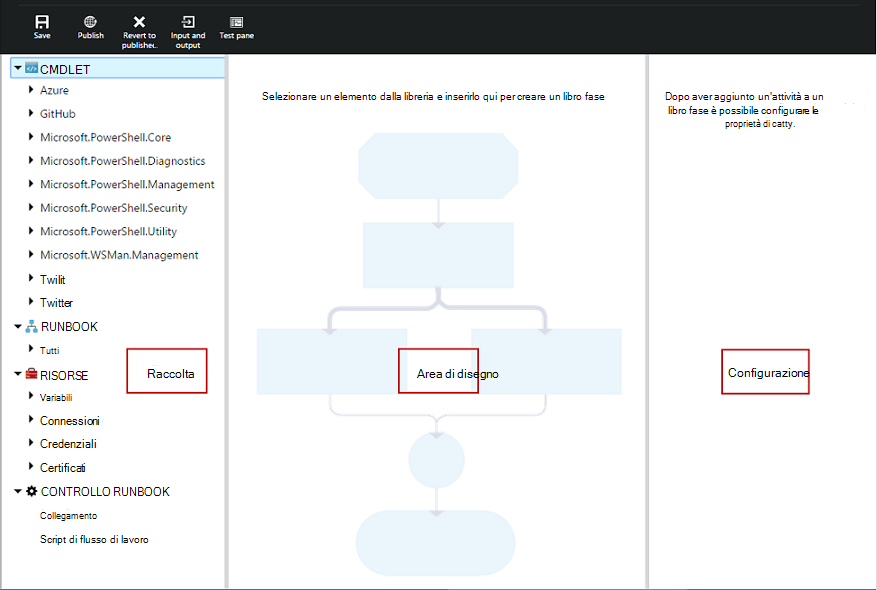
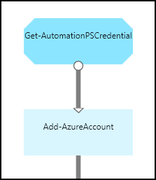

<properties 
    pageTitle="Grafici per la modifica di automazione Azure | Microsoft Azure"
    description="Grafici per la modifica consente di creare runbook per automazione Azure senza utilizzo del codice. In questo articolo fornisce un'introduzione alla creazione di grafica e tutti i dettagli necessari per iniziare a creare un grafico runbook."
    services="automation"   
    documentationCenter=""
    authors="mgoedtel"
    manager="jwhit"
    editor="tysonn" />
<tags 
    ms.service="automation"
    ms.devlang="na"
    ms.topic="article"
    ms.tgt_pltfrm="na"
    ms.workload="infrastructure-services"
    ms.date="06/03/2016"
    ms.author="magoedte;bwren" />

# Creazione condivisa in Azure automazione con interfaccia grafica

## Introduzione

Creazione di grafica consente di creare runbook per l'automazione di Azure senza le complessità del codice di Windows PowerShell o del flusso di lavoro di PowerShell sottostante. Aggiungere le attività nell'area di lavoro da una raccolta di cmdlet e runbook, collegarle e configurare per formare un flusso di lavoro.  Se si è mai usato con System Center Orchestrator o servizio di Gestione automazione (SMA), quindi l'aspetto familiare all'utente.   

In questo articolo fornisce un'introduzione alla creazione di grafici e i concetti che necessari per iniziare a utilizzare la creazione di un grafico runbook.

## Runbook grafica

Runbook tutti Azure automazione sono i flussi di lavoro di Windows PowerShell.  Runbook grafiche e del flusso di lavoro con interfaccia grafica di PowerShell generare il codice di PowerShell che viene eseguito da colleghi automazione, ma non è possibile visualizzarlo o modificarlo direttamente.  Un grafico runbook può essere convertito in un grafico del flusso di lavoro di PowerShell runbook e viceversa, ma non può essere convertiti in un runbook testuale. Un runbook testuale esistenti non possono essere importati editor grafico.  

## Panoramica dell'editor di grafica

È possibile aprire l'editor di grafica nel portale di Azure mediante la creazione o modifica di un grafico runbook.

Le sezioni seguenti descrivono i controlli disponibili nell'editor di immagini.

### Area di disegno
Nell'area di lavoro è nel punto in cui si progettano le runbook.  Aggiungere le attività dei nodi di controllo raccolta dal runbook e connetterle con collegamenti per definire la logica dal runbook.

È possibile utilizzare i controlli nella parte inferiore dell'area di lavoro per eseguire lo zoom avanti o indietro.

### Controllo di una raccolta

Il controllo di una raccolta in è possibile selezionare [le attività](#activities) per aggiungere i runbook.  Aggiungerli all'area di lavoro in cui si connette ad altre attività.  Include quattro sezioni descritte nella tabella seguente.

| Sezione | Descrizione |
|:---|:---|
| Cmdlet | Include tutti i cmdlet che possono essere usati nel runbook.  I cmdlet sono organizzati per modulo.  Tutti i moduli installato al proprio account di automazione sarà disponibili.  |
| Runbook |  Include i runbook nell'account di automazione. Questi runbook possono essere aggiunti all'area di lavoro da utilizzare come runbook figlio. Vengono visualizzati solo runbook dello stesso tipo di base dal runbook in fase di modifica; per grafiche runbook solo in base PowerShell runbook sono visualizzati, mentre per grafica del flusso di lavoro di PowerShell runbook vengono visualizzati solo PowerShell del flusso di lavoro basate su runbook.
| Risorse | Include i [beni di automazione](http://msdn.microsoft.com/library/dn939988.aspx) nell'account di automazione che possono essere usate nel runbook.  Quando si aggiunge un bene per un runbook, verrà aggiunta di un'attività del flusso di lavoro che ottiene la risorsa selezionata.  Nel caso dei beni variabili, è possibile selezionare se si desidera aggiungere un'attività per ottenere la variabile o impostare la variabile.
| Controllo runbook | Include attività di controllo runbook che possono essere usate nel runbook corrente. Un *collegamento* accetta più input e che venga fino a quando non sono stati completati tutti prima di continuare il flusso di lavoro. Un'attività di *codice* viene eseguita una o più righe di codice PowerShell o del flusso di lavoro di PowerShell a seconda del tipo di grafico runbook.  È possibile utilizzare questa attività del codice personalizzato o per le funzionalità che sono difficile ottenere con altre attività.|

### Controllo della configurazione

Il controllo di configurazione è nel punto in cui è fornire dettagli per un oggetto selezionato nell'area di lavoro. Le proprietà disponibili in questo controllo dipende dal tipo di oggetto selezionato.  Quando si seleziona un'opzione nel controllo di configurazione, si aprirà pale aggiuntive per fornire informazioni aggiuntive.

### Controllo di test

Il controllo di Test non viene visualizzato all'avvio di editor grafico. Viene aperto quando è in modo interattivo [testare un runbook grafica](#graphical-runbook-procedures).  

## Procedure runbook grafica 

### Esportazione e importazione di un grafico runbook

È possibile esportare solo la versione pubblicata di un grafico runbook.  Se non è ancora stato pubblicato dal runbook, sarà disabilitato pulsante **Esporta pubblicato** .  Quando si fa clic sul pulsante **Esporta pubblicati** , dal runbook viene scaricato nel computer locale.  Il nome del file corrisponda al nome del runbook con estensione *graphrunbook* .

È possibile importare un file di runbook grafiche o del flusso di lavoro con interfaccia grafica di PowerShell selezionando l'opzione **Importa** quando si aggiunge un runbook.   Quando si seleziona il file da importare, è possibile mantenere lo stesso **nome** o fornire uno nuovo.  Il campo tipo Runbook verrà visualizzato il tipo di runbook dopo che consente di valutare il file selezionato e se si tenta di selezionare un tipo diverso che non è corretto, verrà visualizzato un messaggio notare esistono potenziali conflitti e durante la conversione, potrebbe essere errori di sintassi.  

### Verifica di un grafico runbook

È possibile verificare la versione bozza di un runbook nel portale di Azure mentre la versione pubblicata dal runbook lasciando invariata oppure è possibile verificare una nuova runbook prima è stato pubblicato. In questo modo è possibile verificare il corretto funzionamento dal runbook prima di sostituire la versione pubblicata. Quando si verifica un runbook, viene eseguito dal runbook bozza e le azioni eseguite vengono completate. Non verrà creata alcuna cronologia dei processi, ma output viene visualizzato nel riquadro di Output di Test. 

Aprire il controllo di Test per una runbook aprendo dal runbook per la modifica e quindi fare clic sul pulsante **riquadro Test** .

Il controllo di Test chiederà di qualsiasi parametro di input, ed è possibile iniziare dal runbook facendo clic sul pulsante **Start** .

### Pubblicazione di un grafico runbook

Ogni runbook Azure automazione una bozza e una versione pubblicata. Solo la versione pubblicata è disponibile per l'esecuzione e può essere modificata solo la versione bozza. La versione pubblicata non viene influenzata dalle modifiche alla versione bozza. Quando la versione bozza è pronta per essere disponibili, quindi è pubblicarlo che sovrascrivere la versione pubblicata con la versione bozza.

È possibile pubblicare un grafico runbook aprendo dal runbook per la modifica e quindi fare clic sul pulsante **pubblica** .

Quando non è ancora stato pubblicato un runbook, il relativo stato di **Nuovo**.  Quando viene pubblicato, è stato **pubblicato**.  Se si modifica il runbook dopo che è stato pubblicato e le versioni bozza e Published sono diverse, dal runbook lo stato **nella modalità di modifica**.

 

È inoltre possibile ripristinare la versione pubblicata una runbook.  In questo modo viene immediatamente le modifiche apportate dal runbook ultima pubblicazione e sostituisce la versione bozza dal runbook con la versione pubblicata.

## Attività

Le attività sono gli elementi costitutivi di una runbook.  Un'attività può essere un cmdlet di PowerShell, un runbook figlio o un'attività del flusso di lavoro.  Aggiungere un'attività dal runbook facendo clic destro nel controllo raccolta e selezionando **Aggiungi all'area di lavoro**.  È quindi possibile fare clic e trascinare l'attività per inserirla in un punto qualsiasi dell'area di lavoro che si è soddisfatti.  La posizione della dell'attività nell'area di lavoro non influisce l'operazione dal runbook in alcun modo.  È possibile layout il runbook ma si trova più adatta visualizzare il funzionamento. 

Selezionare l'attività nell'area di lavoro per configurare le proprietà e i parametri in e il configurazione.  È possibile modificare l' **etichetta** dell'attività in modo che sia descrittivo per l'utente.  Il cmdlet originale è ancora in esecuzione, modificare semplicemente il nome visualizzato che verrà utilizzato nell'editor grafico.  L'etichetta deve essere univoca all'interno di dal runbook. 

### Set di parametri

Un insieme di parametri definisce i parametri obbligatori e facoltativi in grado di accettare i valori per uno specifico cmdlet.  Tutti i cmdlet impostare almeno un parametro e alcune dispone di più.  Se un cmdlet dispone di più serie di parametri, è necessario selezionare quello che si userà prima di poter configurare parametri.  I parametri che è possibile configurare dipenderà il set di parametro che si è scelto.  È possibile modificare il set di parametro utilizzato da un'attività selezionando **Parametro impostato** , selezionare un'altra coppia.  In questo caso, i valori dei parametri che è stato configurato vengono persi.

Nell'esempio seguente il cmdlet Get-AzureRmVM sono previsti tre serie di parametri.  Non è possibile configurare i valori dei parametri fino a selezionare uno dei set di parametro.  Il parametro ListVirtualMachineInResourceGroupParamSet impostato per restituire tutte le macchine virtuali in un gruppo di risorse e presenta un unico parametro facoltativo.  Il GetVirtualMachineInResourceGroupParamSet consente di specificare la macchina virtuale che si desidera tornare e ha due obbligatorio e un parametro facoltativo.

#### Valori dei parametri

Quando si specifica un valore per un parametro, selezionare un'origine dati per determinare la modalità di specificare il valore.  Le origini dati che sono disponibili per un particolare parametro dipenderà i valori validi per il parametro.  Ad esempio Null non saranno un'opzione disponibile per un parametro che non sono consentiti valori null.

| Origine dati | Descrizione |
|:---|:---|
|Valore costante|Digitare un valore per il parametro.  Questo è disponibile solo per i tipi di dati seguenti: Int32, Int64, stringa, booleano, DateTime, cambia. |
|Output di attività|Uscita da un'attività che precede l'attività corrente del flusso di lavoro.  Verranno elencate tutte le attività valide.  Selezionare solo le attività da utilizzare l'output per il valore del parametro.  Se l'attività genera un oggetto con più proprietà, è possibile digitare il nome della proprietà dopo aver selezionato l'attività.|
|Input runbook |Selezionare un parametro di input runbook come input per il parametro dell'attività.|  
|Variabile bene|Selezionare una variabile di automazione come input.|  
|Credenziali bene|Selezionare una credenziale automazione come input.|  
|Certificato bene|Selezionare un certificato di automazione come input.|  
|Risorse di connessione|Selezionare una connessione di automazione come input.| 
|Espressione di PowerShell|Specificare semplice [espressione PowerShell](#powershell-expressions).  L'espressione verrà valutata prima l'attività e al risultato usato per il valore del parametro.  È possibile utilizzare le variabili per fare riferimento all'output di un'attività o un parametro di input runbook.|
|Non è configurato|Cancella qualsiasi valore è stato configurato in precedenza.|

#### Altri parametri facoltativi

Tutti i cmdlet avrà la possibilità di specificare altri parametri.  Questi sono i parametri comuni di PowerShell o altri parametri personalizzati.  Viene visualizzata una casella di testo in cui è possibile fornire parametri utilizzando la sintassi di PowerShell.  Ad esempio, per utilizzare il parametro comune **dettagliato** , specificare **"-dettagliato: $True"**.

### Riprovare a eseguire attività

**Comportamento Riprova** , un'attività da eseguire più volte fino a una determinata condizione, in modo analogo un ciclo.  È possibile utilizzare questa caratteristica per le attività che devono eseguire più volte, errori e potrebbe necessario più tenta per il successo o verificare le informazioni di output dell'attività per i dati validi.    

Quando si abilita Riprova per un'attività, è possibile impostare un ritardo e una condizione.  Il ritardo è il tempo (in secondi o minuti) che dal runbook di attesa prima dell'esecuzione di attività.  Se non viene specificato alcun ritardo, quindi l'attività verrà eseguita nuovamente immediatamente dopo il completamento. 

La condizione Riprova è un'espressione di PowerShell che venga valutata dopo ogni volta che viene eseguita l'attività.  Se l'espressione restituisce True, l'attività viene eseguita nuovamente.  Se l'espressione restituisce FALSO l'attività non eseguire nuovamente e dal runbook sposta all'attività successiva. 

La condizione Riprova è possibile utilizzare una variabile denominata $RetryData che fornisce l'accesso alle informazioni su tentativi attività.  Questa variabile non ha le proprietà nella tabella seguente.

| Proprietà | Descrizione |
|:--|:--|
| NumberOfAttempts | Numero di volte in cui è stato eseguito l'attività.              |
| Output           | Output dell'ultima esecuzione dell'attività.                    |
| TotalDuration    | Tempo trascorso dall'attività è stata avviata la prima volta. |
| StartedAt        | Ora in formato UTC che l'avvio dell'attività prima di tutto.           |

Di seguito sono riportati alcuni esempi di attività Riprova condizioni.

    # Run the activity exactly 10 times.
    $RetryData.NumberOfAttempts -ge 10 

    # Run the activity repeatedly until it produces any output.
    $RetryData.Output.Count -ge 1 

    # Run the activity repeatedly until 2 minutes has elapsed. 
    $RetryData.TotalDuration.TotalMinutes -ge 2

Dopo aver configurato una condizione Riprova per un'attività, l'attività include due visivi per visualizzare un promemoria.  Uno è presentato le attività e l'altra è revisionando la configurazione dell'attività.

### Controllo di Script del flusso di lavoro

Un controllo del codice è un'attività speciale che accetta script di PowerShell o del flusso di lavoro di PowerShell a seconda del tipo di grafico runbook viene creato per fornire funzionalità che in caso contrario non possono essere disponibili.  In grado di accettare parametri, ma è possibile utilizzare le variabili per attività output e runbook parametri di input.  Qualsiasi output dell'attività verrà aggiunto al databus a meno che non ha alcun in uscita collegamento nel qual caso viene aggiunto all'output dal runbook.

Ad esempio il codice seguente consente di eseguire calcoli relativi alle date utilizzando una variabile di input runbook denominata $NumberOfDays.  Invia quindi una data calcolata ora come output da utilizzare per le attività successive dal runbook.

    $DateTimeNow = (Get-Date).ToUniversalTime()
    $DateTimeStart = ($DateTimeNow).AddDays(-$NumberOfDays)}
    $DateTimeStart

## I collegamenti e flusso di lavoro

Un **collegamento** in un grafico runbook connette due attività.  Viene visualizzato nell'area di lavoro come una freccia che punta dall'attività di origine per le attività di destinazione.  Le attività eseguire nella direzione della freccia con le attività di destinazione partire dopo completata l'attività di origine.  

### Creare un collegamento

Creare un collegamento tra le due attività selezionando l'attività di origine e facendo clic sul cerchio nella parte inferiore della forma.  Trascinare la freccia per l'attività di destinazione e il rilascio.

Selezionare il collegamento per configurare le proprietà in e il configurazione.  Questo includerà il tipo di collegamento descritto nella tabella seguente.

| Tipo di collegamento | Descrizione |
|:---|:---|
| Pipeline | L'attività di destinazione viene eseguita una volta per ogni output oggetto dall'attività di origine.  Attività di destinazione non viene eseguito se l'attività di origine genera un output non.  L'output l'attività di origine è disponibile come oggetto.  |
| Sequenza | Attività di destinazione viene eseguita solo una volta.  Riceve una matrice di oggetti da attività dell'origine.  L'output l'attività di origine è disponibile sotto forma di matrice di oggetti. |

### Attività iniziali

Un grafico runbook verrà avviato con tutte le attività che non dispongono di un collegamento in arrivo.  Spesso corrisponderà a una sola attività da utilizzati come attività iniziali per dal runbook.  Se più attività non dispone di un collegamento in arrivo, verrà avviato dal runbook mediante l'esecuzione in parallelo.  Quindi necessario seguire i collegamenti per eseguire altre attività come completa ogni.

### Condizioni

Quando si specifica una condizione su un collegamento, l'attività di destinazione viene eseguita solo se la condizione restituisce true.  Si utilizzeranno una variabile $ActivityOutput in una condizione per recuperare l'output dall'attività di origine.  

Per un collegamento a pipeline, specificare una condizione per un singolo oggetto e la condizione viene valutata per ogni oggetto di output per l'attività di origine.  Per tutti gli oggetti che soddisfa la condizione verrà quindi le attività di destinazione.  Ad esempio, con un'attività di origine di Get-AzureRmVm, la sintassi seguente possono essere utilizzata per un collegamento pipeline condizionale per recuperare sola macchine virtuali nel gruppo di risorse denominato *Group1*.  

    $ActivityOutput['Get Azure VMs'].Name -match "Group1"

Per un collegamento a sequenza, la condizione viene valutata solo una volta poiché restituisce una matrice contenente tutti gli output di oggetti da attività dell'origine.  Per questi motivi, un collegamento sequenza non è possibile utilizzare per il filtraggio di un collegamento pipeline ma semplicemente determinerà se non viene eseguita all'attività successiva. Scrivere, ad esempio le seguenti attività durante il nostro runbook macchine Virtuali di iniziare.   
Esistono tre collegamenti sequenza diversa che siano verificando valori sono stati forniti a due parametri di input runbook che rappresenta il nome di macchine Virtuali e nome del gruppo di risorse per determinare quale sia l'azione da eseguire - appropriato avviare una macchina virtuale singola, iniziare a tutte le macchine virtuali nel gruppo delle risorse o tutte le macchine virtuali di un abbonamento.  Per il collegamento sequenza tra Connetti Azure e SV singola Get, ecco la logica condizione:

    <# 
    Both VMName and ResourceGroupName runbook input parameters have values 
    #>
    (
    (($VMName -ne $null) -and ($VMName.Length -gt 0))
    ) -and (
    (($ResourceGroupName -ne $null) -and ($ResourceGroupName.Length -gt 0))
    )

Quando si utilizza un collegamento condizionale, i dati disponibili dall'attività di origine con altre attività in tale ramo verranno filtrati in base alla condizione.  Se un'attività è l'origine a più collegamenti, i dati disponibili per le attività in ogni filiale dipenderà la condizione nella casella collegamento connessione per la filiale.

Ad esempio, di avvio di tutte le macchine virtuali dell'attività **Start AzureRmVm** in runbook riportata di seguito.  Ha due collegamenti condizionale.  Il primo collegamento condizionale utilizzata l'espressione *$ActivityOutput ['Start-AzureRmVM']. IsSuccessStatusCode - eq $true* per filtrare se l'attività AzureRmVm inizio è stato completato correttamente.  Il secondo utilizzata l'espressione *$ActivityOutput ['Start-AzureRmVM']. IsSuccessStatusCode - ne $true* per filtrare se l'attività Start AzureRmVm Impossibile avviare la macchina virtuale.  

Tutte le attività che segue il primo collegamento e Usa l'output di attività da Get-AzureVM verrà visualizzato solo le macchine virtuali che sono state avviate nel momento in cui è stato eseguito Get-AzureVM.  Le attività che segue il secondo collegamento verrà visualizzato solo il macchine virtuali che sono stati interrotti nel momento in cui è stato eseguito Get-AzureVM.  Qualsiasi attività il terzo collegamento otterrà tutte le macchine virtuali indipendentemente dal relativo stato in esecuzione.

### Congiunzioni

Un collegamento è un'attività speciale in attesa fino al completamento di tutte le sezioni in arrivo.  In questo modo è possibile eseguire più attività in parallelo e assicurarsi che prima di passare sono stati completati tutti.

Mentre un collegamento può avere un numero illimitato di collegamenti in ingresso, non più di uno di questi collegamenti può essere una pipeline.  Il numero di collegamenti in ingresso sequenza non è vincolato.  Sarà possibile creare il collegamento con più collegamenti pipeline in ingresso e salvare dal runbook, ma si verificherà un errore quando viene eseguito.

Nell'esempio seguente fa parte di un runbook che avvia una serie di macchine virtuali durante il download contemporaneamente patch da applicare ai computer.  Un collegamento viene utilizzato per garantire che entrambi i processi siano stati completati prima di continua a dal runbook.

### Cicli

Un ciclo è quando una destinazione attività ai collegamenti alla sua attività di origine o a un'altra attività che non hanno un limite consente di tornare all'origine.  Cicli attualmente non consentiti nei grafici per la modifica.  Se il runbook ha un ciclo, verranno salvati correttamente ma verrà visualizzato un errore durante l'esecuzione.

### Condivisione dei dati tra attività

Scrivere *databus* dal runbook eventuali dati che viene emesso da un'attività con un collegamento in uscita.  Qualsiasi attività dal runbook possibile utilizzare i dati nella databus per immettere i valori di parametro o includere nel codice di script.  Un'attività può accedere all'output di qualsiasi attività precedente del flusso di lavoro.     

Modalità di scrittura dei dati per il databus dipende dal tipo di collegamento all'attività.  Per **pipeline**i dati sono output come oggetti multipli.  Per un collegamento a **sequenza** , i dati sono output sotto forma di matrice.  Se esiste un solo valore, output sarà sotto forma di matrice un singolo elemento.

Si può accedere ai dati databus utilizzando uno dei due metodi.  Prima di tutto utilizza un'origine dati di **Output di attività** per popolare un parametro di un'altra attività.  Se l'output è un oggetto, è possibile specificare un'unica proprietà.

È inoltre possibile recuperare l'output di un'attività in un'origine dati **Espressione PowerShell** o da un'attività **Del flusso di lavoro Script** con una variabile ActivityOutput.  Se l'output è un oggetto, è possibile specificare un'unica proprietà.  Variabili ActivityOutput utilizzano la sintassi seguente.

    $ActivityOutput['Activity Label']
    $ActivityOutput['Activity Label'].PropertyName 

### Punti di controllo

È possibile impostare [punti di controllo](automation-powershell-workflow.md#checkpoints) in un grafico del flusso di lavoro di PowerShell runbook selezionando *runbook verifica* in tutte le attività.  In questo modo un punto di controllo impostare dopo l'esecuzione di attività.

Punti di controllo sono abilitate solo nel grafico del flusso di lavoro di PowerShell runbook, non è disponibile in runbook grafica.  Se dal runbook Usa i cmdlet di Azure, è necessario seguire qualsiasi attività Checkpoint con un AzureRMAccount Aggiungi nel caso in cui dal runbook viene sospesa e si riavvia da questo punto di controllo in un lavoro diversa. 

## Autenticazione alle risorse di Azure

Runbook Azure automazione che gestiscono le risorse Azure richiede l'autenticazione in Azure.  La nuova caratteristica di [esecuzione come account](automation-sec-configure-azure-runas-account.md) (nota anche come servizio principale) il metodo predefinito per accedere alle risorse di gestione di risorse Azure nell'abbonamento con runbook di automazione.  È possibile aggiungere questa funzionalità a un grafico runbook mediante l'aggiunta di risorse di connessione **AzureRunAsConnection** , che utilizza il cmdlet di PowerShell [Get-AutomationConnection](https://technet.microsoft.com/library/dn919922%28v=sc.16%29.aspx) e cmdlet [AzureRmAccount Aggiungi](https://msdn.microsoft.com/library/mt619267.aspx) all'area di lavoro. Come illustrato nell'esempio seguente.  
L'attività di ottenere eseguire come connessione (ad esempio Get-AutomationConnection), è configurato con un'origine dati di valore costante denominata AzureRunAsConnection.  
All'attività successiva, Aggiungi AzureRmAccount, aggiunge l'account Esegui come autenticato per l'utilizzo dal runbook. 
 
Per i parametri **ID applicazione**, **CERTIFICATETHUMBPRINT**e **TENANTID** è necessario specificare il nome della proprietà per il percorso del campo poiché l'attività restituisce un oggetto con più proprietà.  In caso contrario quando si eseguirà dal runbook avrà esito negativo si tenta di eseguire l'autenticazione.  Si tratta di cosa è necessario almeno autenticare i runbook con l'account Esegui come.

Per mantenere la compatibilità con le versioni per gli abbonati che hanno creato un account di automazione tramite un [account utente di Azure Active Directory](automation-sec-configure-aduser-account.md) per gestire le risorse di Azure servizio di gestione (ASM) o Gestione risorse di Azure, il metodo per eseguire l'autenticazione è il cmdlet Aggiungi AzureAccount con [bene credenziali](http://msdn.microsoft.com/library/dn940015.aspx) che rappresenta un utente di Active Directory con accesso all'account Azure.

È possibile aggiungere questa funzionalità a un grafico runbook mediante l'aggiunta di un bene credenziali seguita da un'attività AzureAccount Aggiungi all'area di lavoro.  Aggiungere AzureAccount utilizza l'attività delle credenziali per l'input.  Come illustrato nell'esempio seguente.

È necessario eseguire l'autenticazione all'inizio dal runbook e dopo ogni verifica.  Di conseguenza, aggiungere un'attività di aggiunta AzureAccount Aggiungi dopo le attività di verifica del flusso di lavoro. Non è necessaria un'attività di aggiunta delle credenziali dal momento che è possibile utilizzare lo stesso 

## Runbook di input e output

### Input runbook

Un runbook può richiedere input da un utente quando deve iniziare dal runbook tramite il portale di Azure o da un'altra runbook se quella corrente viene utilizzato come elemento figlio.
Ad esempio, se si dispone di un runbook che crea una macchina virtuale, potrebbe essere necessario fornire informazioni, ad esempio il nome del computer virtuali e altre proprietà ogni volta che si avvia dal runbook.  

Accettare l'input per un runbook definendo uno o più parametri di input.  Fornire i valori per questi parametri ogni volta che viene avviato dal runbook.  Quando si inizia un runbook con il portale di Azure, verrà chiesto di fornire i valori dei parametri di input del runbook diversi.

È possibile accedere parametri di input per un runbook facendo clic sul pulsante di **Input e output** sulla barra degli strumenti runbook.  

 

Verrà aperto il controllo di **Input e Output** in cui è possibile modificare un parametro di input esistente o crearne uno nuovo, fare clic su **Aggiungi input**. 

Ogni parametro di input viene definita dalle proprietà nella tabella seguente.

|Proprietà|Descrizione|
|:---|:---|
| Nome | Nome univoco del parametro.  Questa operazione può contenere solo caratteri alfabetici numerici e non può contenere uno spazio. |
| Descrizione | Una descrizione facoltativa per il parametro di input.  |
| Tipo | Tipo di dati previsto per il valore del parametro.  Alla richiesta di input, il portale di Azure fornirà un controllo appropriato per il tipo di dati per ogni parametro. |
| Obbligatorio | Specifica se è necessario specificare un valore per il parametro.  Non è possibile iniziare dal runbook se non si specifica un valore per ogni parametro obbligatorio che non dispone di un valore predefinito. |
| Valore predefinito | Specifica il valore utilizzato per il parametro se non viene specificato.  Può essere Null o un valore specifico. |

### Runbook output

Dati creati da qualsiasi attività che non dispone di un collegamento in uscita verranno aggiunti all' [output dal runbook](http://msdn.microsoft.com/library/azure/dn879148.aspx).  L'output viene salvato con il processo di runbook ed è disponibile per un runbook padre quando dal runbook viene utilizzato come elemento figlio.  

## Espressioni di PowerShell

Uno dei vantaggi di grafici per la modifica è che forniscono la possibilità di creare un runbook conoscenza minima di PowerShell.  Attualmente, è necessario conoscere un po' di PowerShell per la compilazione di alcuni [valori dei parametri](#activities) e per l'impostazione delle [condizioni di collegamento](#links-and-workflow).  In questa sezione fornisce una breve introduzione alle espressioni di PowerShell per gli utenti che non possono avere familiari con il.  Dettagli completi di PowerShell disponibili in [scrittura di script con Windows PowerShell](http://technet.microsoft.com/library/bb978526.aspx). 

### Origine dati espressione PowerShell

È possibile utilizzare un'espressione di PowerShell come origine dati per popolare il valore di un [parametro di attività](#activities) con i risultati del codice PowerShell.  Può trattarsi di una sola riga di codice che esegue una funzione semplice o più righe che eseguono logica complessa.  Qualsiasi output da un comando non è assegnato a una variabile è output per il valore del parametro. 

Il comando seguente, ad esempio, da output la data corrente. 

    Get-Date

I comandi seguenti creazione di una stringa dalla data corrente e assegnarlo a una variabile.  Il contenuto della variabile quindi viene inviato all'output 

    $string = "The current date is " + (Get-Date)
    $string

I comandi seguenti valutare la data corrente e restituiscono una stringa che indica se il giorno corrente è un fine settimana o giorno della settimana. 

    $date = Get-Date
    if (($date.DayOfWeek = "Saturday") -or ($date.DayOfWeek = "Sunday")) { "Weekend" }
    else { "Weekday" }
    
 
### Output di attività

Per utilizzare l'output di un'attività precedente dal runbook, utilizzare la variabile $ActivityOutput con la sintassi seguente.

    $ActivityOutput['Activity Label'].PropertyName

Ad esempio, potrebbe essere un'attività con una proprietà che richiede il nome di una macchina virtuale nel qual caso è possibile utilizzare nell'espressione seguente.

    $ActivityOutput['Get-AzureVm'].Name

Se la proprietà che è necessaria la macchina virtuale oggetto anziché solo una proprietà, quindi si restituirà l'intero oggetto utilizzando la sintassi seguente.

    $ActivityOutput['Get-AzureVm']

È anche possibile utilizzare l'output di un'attività in un'espressione più complessa, ad esempio le operazioni seguenti in cui vengono concatenati testo al nome del computer virtuale.

    "The computer name is " + $ActivityOutput['Get-AzureVm'].Name

### Condizioni

Utilizzare [gli operatori di confronto](https://technet.microsoft.com/library/hh847759.aspx) per confrontare i valori o determinare se un valore corrisponde a un criterio specificato.  Un confronto restituisce un valore di $true o $false.

Ad esempio la seguente condizione determina se la macchina virtuale da un'attività denominata *Get-AzureVM* è *interrotta*. 

    $ActivityOutput["Get-AzureVM"].PowerState –eq "Stopped"

La seguente condizione controlla se la stessa macchina virtuale è in uno stato diverso da *interrotto*.

    $ActivityOutput["Get-AzureVM"].PowerState –ne "Stopped"

È possibile partecipare a più condizioni usando un [operatore logico](https://technet.microsoft.com/library/hh847789.aspx) ad esempio **- e** o **- o**.  Ad esempio la seguente condizione controlla se la stessa macchina virtuale dell'esempio precedente è in stato di *arrestato* o *l'interruzione*.

    ($ActivityOutput["Get-AzureVM"].PowerState –eq "Stopped") -or ($ActivityOutput["Get-AzureVM"].PowerState –eq "Stopping") 

### Hashtable

[Hashtable](http://technet.microsoft.com/library/hh847780.aspx) sono coppie nome/valore che sono utili per ottenere una serie di valori.  Proprietà per alcune attività possono aspettarsi hashtable anziché un valore semplice.  Potrebbe essere anche visualizzato come hashtable parla di un dizionario. 

Con la sintassi seguente viene creato un hashtable.  Hashtable può contenere un numero di voci ma ciascuna è definita da un nome e un valore.

    @{ <name> = <value>; [<name> = <value> ] ...}

Ad esempio, l'espressione seguente crea hashtable da utilizzare nell'origine dati per un parametro di attività che prevede un hashtable con i valori per una ricerca in internet.

    $query = "Azure Automation"
    $count = 10
    $h = @{'q'=$query; 'lr'='lang_ja';  'count'=$Count}
    $h

Nell'esempio seguente usa output di un'attività denominata *Ottenere connessione Twitter* per popolare hashtable.

    @{'ApiKey'=$ActivityOutput['Get Twitter Connection'].ConsumerAPIKey;
      'ApiSecret'=$ActivityOutput['Get Twitter Connection'].ConsumerAPISecret;
      'AccessToken'=$ActivityOutput['Get Twitter Connection'].AccessToken;
      'AccessTokenSecret'=$ActivityOutput['Get Twitter Connection'].AccessTokenSecret}

## Passaggi successivi

- Per iniziare a utilizzare runbook del flusso di lavoro di PowerShell, vedere [il primo runbook del flusso di lavoro PowerShell](automation-first-runbook-textual.md) 
- Per iniziare a utilizzare runbook grafici, vedere [il primo runbook grafica](automation-first-runbook-graphical.md)
- Per ulteriori informazioni sulle limitazioni, i vantaggi e i tipi di runbook, vedere [tipi di runbook automazione di Azure](automation-runbook-types.md)
- Per informazioni su come eseguire l'autenticazione mediante l'account automazione Esegui come, vedere [Configurare esecuzione come Account Azure](automation-sec-configure-azure-runas-account.md)
 
