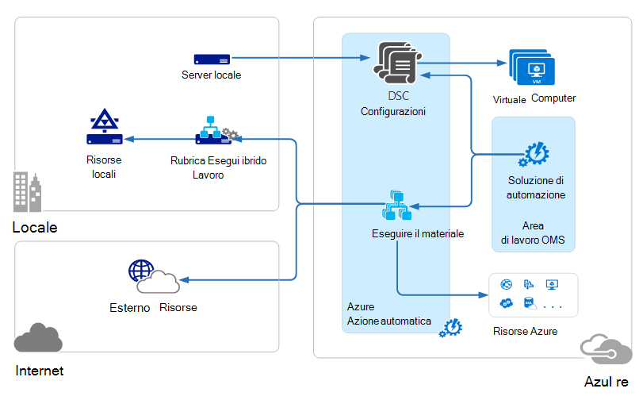
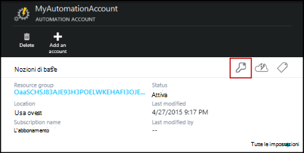
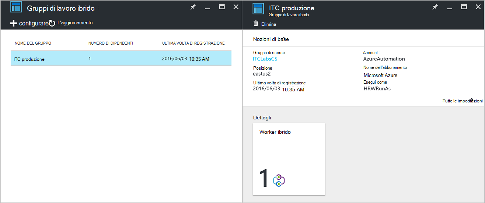
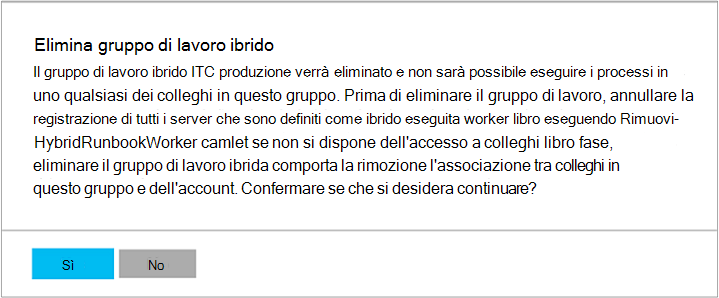

<properties
   pageTitle="Automazione Azure ibrido Runbook worker | Microsoft Azure"
   description="In questo articolo fornisce informazioni sull'installazione e utilizzo ibrido Runbook lavoro che è una funzionalità di automazione di Azure che consente di eseguire runbook computer nell'interfaccia di dati locali."
   services="automation"
   documentationCenter=""
   authors="mgoedtel"
   manager="jwhit"
   editor="tysonn" />
<tags
   ms.service="automation"
   ms.devlang="na"
   ms.topic="article"
   ms.tgt_pltfrm="na"
   ms.workload="infrastructure-services"
   ms.date="10/14/2016"
   ms.author="bwren" />

# Automazione Azure ibrido Runbook colleghi

Runbook in Azure automazione non è possibile accedere alle risorse nel centro dati locali poiché vengono eseguiti nel cloud Azure.  La caratteristica di lavoro Runbook ibrido di automazione di Azure consente di eseguire runbook nel computer che si trovano nel centro dati per gestire le risorse locali. Il runbook sono archiviati e gestiti in Azure automazione e quindi recapitati a uno o più computer locale.  

Questa funzionalità è illustrata nell'immagine seguente.   

È possibile designare uno o più computer nell'interfaccia di dati per agire come un lavoro Runbook ibrido ed eseguire runbook da Azure automazione.  Ogni lavoro richiede Microsoft Management Agent con una connessione a Microsoft le operazioni di gestione Suite e l'ambiente di runbook automazione Azure.  Operazioni Management Suite vengono usata unicamente per installare e gestire l'agente di gestione e monitorare le funzionalità del lavoro.  Il recapito di runbook e le istruzioni per eseguirle vengono eseguite da Azure automazione.

Non esistono requisiti del firewall in entrata per il supporto ibrido Runbook colleghi. L'agente del computer locale avvia tutte le comunicazioni con l'automazione di Azure nel cloud. Quando viene avviato un runbook, automazione di Azure crea un'istruzione recuperata dall'agente. L'agente recupera quindi verso il basso dal runbook e tutti i parametri prima di eseguirlo.  Anche verrà recuperato tutte le [risorse](http://msdn.microsoft.com/library/dn939988.aspx) utilizzate da runbook da Azure automazione.

>[AZURE.NOTE] Ibrido Runbook worker attualmente non supporta [Le configurazioni DSC](automation-dsc-overview.md).

## Gruppi di lavoro Runbook ibrido

Ogni lavoro Runbook ibrido fa parte di un gruppo di lavoro Runbook ibrido specificate quando si installa l'agente.  Un gruppo può includere un unico agente, ma è possibile installare più agenti in un gruppo per la disponibilità elevata.

Quando si avvia un runbook un lavoro Runbook ibrida, specificare il gruppo che verrà eseguito in.  I membri del gruppo determinerà il lavoro verrà richiesta.  Non è possibile specificare un lavoro specifico.

## Requisiti di lavoro Runbook ibrido

È necessario designare almeno un computer locale per eseguire i processi di distribuzione ibrida runbook.  In questo computer deve disporre di quanto segue:

- Windows Server 2012 o versioni successive
- Windows PowerShell 4.0 o versione successiva
- Almeno due core e 4 GB di RAM

Tenere presente quanto segue per worker ibrido: 

- Designare più colleghi ibrido in ogni gruppo di disponibilità.  
- Worker ibrido possono coesistere con automazione di gestione dei servizi o System Center Orchestrator server runbook.
- È consigliabile utilizzare un computer fisico che si trova in prossimità l'area del proprio account di automazione poiché i dati di processo viene inviati Azure automazione termine di un processo.

>[AZURE.NOTE] Lavoro Runbook ibrido versione 7.2.11136.0 supportano attualmente comunicare tramite un server proxy solo con gli script di PowerShell.  Il supporto per script di PowerShell del flusso di lavoro sarà disponibile nelle versioni future.  

### Configurare le impostazioni proxy e firewall

Per il lavoro di Runbook ibrido locale per connettersi e registrare con Microsoft operazioni gestione famiglia di prodotti () servizio Outlook Mobile, deve avere accesso per il numero di porta e gli URL descritti di seguito.  Si tratta oltre alle [porte e protocolli di URL necessari per l'agente di monitoraggio di Microsoft](../log-analytics/log-analytics-proxy-firewall.md#configure-proxy-and-firewall-settings-with-the-microsoft-monitoring-agent) a cui connettersi OMS. Se si usa un server proxy per le comunicazioni tra l'agente e il servizio Outlook Mobile, è necessario assicurarsi che le risorse appropriate siano accessibili. Se si usa un firewall per limitare l'accesso a Internet, è necessario configurare il firewall per consentire l'accesso. 

Le informazioni seguenti elencare le porte e gli URL necessari per il lavoro Runbook ibrido comunicare con l'automazione.

- Porta: Solo TCP 443 è necessario per l'accesso a Internet in uscita
- URL globale: *.azure-automation.net

Se si ha un account di automazione definito per un'area specifica e si desidera limitare la comunicazione con tale data center locale, la tabella seguente contiene il record DNS per ogni area.

|**Area geografica**|**Record DNS**|
|--------------|--------------|
|Sud centrale USA|scus-jobruntimedata-produzione-su1.azure-automation.net|
|Stati Uniti orientali 2|eus2-jobruntimedata-produzione-su1.azure-automation.net|
|Europa occidentale|Abbiamo-jobruntimedata-produzione-su1.azure-automation.net|
|Europa Nord America|ne-jobruntimedata-produzione-su1.azure-automation.net|
|Canada centrale|cc-jobruntimedata-produzione-su1.azure-automation.net|
|Asia sudorientale|mare-jobruntimedata-produzione-su1.azure-automation.net|
|India centrale|CID-jobruntimedata-produzione-su1.azure-automation.net|
|Giappone est|jpe-jobruntimedata-produzione-su1.azure-automation.net|
|Australia sud-est|ASE-jobruntimedata-produzione-su1.azure-automation.net|

## L'installazione di lavoro Runbook ibrido

La procedura seguente descrive come installare e configurare ibrido Runbook lavoro.  Eseguire una sola volta i primi due passaggi per l'ambiente di automazione e quindi ripetere i passaggi rimanenti per ogni computer di lavoro.

### 1. creare l'area di lavoro di operazioni Management Suite

Se non si dispone già di un'area di lavoro di operazioni Management Suite, quindi crearne uno seguendo le istruzioni al [configurare l'area di lavoro](https://technet.microsoft.com/library/mt484119.aspx). È possibile utilizzare un'area di lavoro esistente se si ha già uno.

### 2. aggiungere soluzione di automazione di operazioni Management Suite area di lavoro

Soluzioni aggiungono funzionalità alla famiglia di prodotti di operazioni di gestione.  La soluzione di automazione aggiunge funzionalità per l'automazione di Azure incluso il supporto per ibrido Runbook lavoro.  Quando si aggiunge la soluzione nell'area di lavoro, verrà automaticamente push verso il basso componenti di lavoro al computer dell'agente che si intende installare nel passaggio successivo.

Seguire le istruzioni [per aggiungere una soluzione usando la raccolta soluzioni](../log-analytics/log-analytics-add-solutions.md) per aggiungere la soluzione di **automazione** nell'area di lavoro di operazioni Management Suite.

### 3. installare Microsoft agente di monitoraggio

L'agente di monitoraggio di Microsoft si connette computer alla famiglia di prodotti di operazioni di gestione.  Quando si installa l'agente nel computer locale e connettersi all'area di lavoro, esso verrà scaricata automaticamente i componenti necessari per ibrido Runbook lavoro.

Seguire le istruzioni in [computer Windows connettersi per Analitica Log](../log-analytics/log-analytics-windows-agents.md) per installare l'agente del computer locale.  È possibile ripetere questa procedura per più computer per aggiungere più colleghi al proprio ambiente.

Quando l'agente connesso a operazioni Management Suite, tale sconto sarà elencato nella scheda **Origini connesse** del riquadro operazioni Management Suite **Impostazioni** .  È possibile verificare che l'agente correttamente scaricato la soluzione di automazione quando dispone di una cartella denominata **AzureAutomationFiles** in c:\Programmi\Microsoft c:\Programmi\Microsoft monitoraggio Agent\Agent.  Per verificare la versione di lavoro di Runbook ibrida, è possibile passare a c:\Programmi\Microsoft c:\Programmi\Microsoft monitoraggio Agent\Agent\AzureAutomation\ e notare il \\sottocartella *versione* .   

### 4. installare l'ambiente runbook e connettersi all'automazione di Azure

Quando si aggiunge un agente alla famiglia di prodotti di operazioni di gestione, la soluzione di automazione inserisce verso il basso del modulo PowerShell **HybridRegistration** che contiene il cmdlet **HybridRunbookWorker Aggiungi** .  Questo cmdlet consente di installare l'ambiente runbook nel computer e registrare di automazione di Azure.

Aprire una sessione di PowerShell in modalità amministratore ed eseguire i comandi seguenti per importare il modulo.

    cd "C:\Program Files\Microsoft Monitoring Agent\Agent\AzureAutomation\<version>\HybridRegistration"
    Import-Module HybridRegistration.psd1

Eseguire il cmdlet **Aggiungi HybridRunbookWorker** utilizzando la sintassi seguente:

    Add-HybridRunbookWorker –Name <String> -EndPoint <Url> -Token <String>

È possibile ottenere le informazioni necessarie per questo cmdlet da e il **Gestione delle chiavi** nel portale di Azure.  Aprire questo blade facendo clic sull'icona chiave nel riquadro di elementi per l'account di automazione.

- **Nome** è il nome del gruppo di lavoro Runbook ibrida. Se il gruppo è già presente nell'account automazione, quindi aggiungervi computer in uso.  Se non esiste già, quindi verrà aggiunto.
- **EndPoint** è nel campo **URL** e il **Gestione delle chiavi** .
- **Token** è la **Chiave primaria di accesso** e il **Gestione delle chiavi** .  

Utilizzare la **-dettagliato** con **Aggiungi HybridRunbookWorker** per ricevere informazioni dettagliate sull'installazione.

### 5. installare i moduli di PowerShell

Runbook possono usare le attività e i cmdlet definite nei moduli installati nel proprio ambiente di automazione di Azure.  Questi moduli non vengono automaticamente distribuiti nel computer locale, in modo che è necessario installarli manualmente.  L'eccezione è il modulo di Azure installato per impostazione predefinita fornire l'accesso agli cmdlet per tutti i servizi Azure e attività per l'automazione di Azure.

Poiché lo scopo principale della caratteristica ibrido Runbook lavoro per gestire le risorse locali, è probabile che è necessario installare i moduli che supportano queste risorse.  È possibile fare riferimento ai [Moduli di installazione](http://msdn.microsoft.com/library/dd878350.aspx) per informazioni sull'installazione di moduli di Windows PowerShell.

## Rimozione di lavoro Runbook ibrido

È possibile rimuovere uno o più dei collaboratori Runbook ibrido da un gruppo oppure è possibile rimuovere il gruppo, a seconda delle esigenze.  Per rimuovere un lavoro Runbook ibrido da un computer locale, aprire una sessione di PowerShell in modalità amministratore ed eseguire il comando seguente - **Rimuovi HybridRunbookWorker** cmdlet.  Utilizzare la **-dettagliato** passare per un file di log dettagliate del processo di rimozione. 

Questa operazione non rimuove l'agente di monitoraggio di Microsoft dal computer, solo le funzionalità e la configurazione di ruolo ibrido Runbook lavoro.  

Per rimuovere un gruppo, è innanzitutto necessario rimuovere il lavoro Runbook ibrido da ogni computer che è un membro del gruppo utilizzando il comando illustrato in precedenza e quindi attenersi alla procedura seguente per rimuovere il gruppo.  

1. Aprire l'account di automazione nel portale di Azure.
2. Selezionare il riquadro **Gruppi di lavoro ibrida** e in e **l'Ibrido gruppi di lavoro** , selezionare il gruppo che si desidera eliminare.  Dopo aver selezionato il gruppo specifico, viene visualizzato e proprietà il **gruppo di lavoro ibrida** .     
3. In blade proprietà per il gruppo selezionato, fare clic su **Elimina**.  Un messaggio viene visualizzato in cui viene richiesto di confermare l'azione e selezionare **Sì** se si è certi di voler procedere.    Questo processo può richiedere alcuni secondi e tenere traccia dello stato di avanzamento in **notifiche** dal menu di scelta.  

## Avviare runbook lavoro Runbook ibrido

[Avvio Runbook in Azure automazione](automation-starting-a-runbook.md) descrive i vari metodi per iniziare a creare un runbook.  Lavoro Runbook ibrido aggiunge un'opzione **RunOn** nel punto in cui è possibile specificare il nome di un gruppo di lavoro Runbook ibrida.  Se si specifica un gruppo, dal runbook è recuperato e mostrarli di collaboratori di tale gruppo.  Se questa opzione non viene specificata, viene eseguito in Azure automazione come di consueto.

Quando si inizia un runbook nel portale di Azure, verrà visualizzato con l'opzione **eseguiti** nel punto in cui è possibile selezionare **Azure** o **Ibrido lavoro**.  Se si seleziona **Ibrido lavoro**, è possibile selezionare il gruppo da un elenco a discesa.

Utilizzare il parametro **RunOn** è possibile utilizzare il comando seguente per avviare un runbook denominata Test Runbook in un gruppo di lavoro Runbook ibrido denominato MyHybridGroup usando Windows PowerShell.

    Start-AzureRmAutomationRunbook –AutomationAccountName "MyAutomationAccount" –Name "Test-Runbook" -RunOn "MyHybridGroup"

>[AZURE.NOTE] Il parametro **RunOn** è stata aggiunta al cmdlet **Start AzureAutomationRunbook** nella versione 0.9.1 di Microsoft Azure PowerShell.  Se è installata una versione precedente, è necessario [scaricare la versione più recente](https://azure.microsoft.com/downloads/) .  È sufficiente installare questa versione una workstation in cui è necessario avviare dal runbook da Windows PowerShell.  Non è necessario installare nel computer di lavoro a meno che non si desidera avviare runbook dal computer.  È attualmente non è possibile avviare un runbook Runbook Worker ibrido da un'altra runbook poiché questa richiedono l'ultima versione di Azure Powershell siano installati nel proprio account di automazione.  Verrà automaticamente aggiornata in Azure automazione e automaticamente spostata verso il basso per i collaboratori non appena la versione più recente.

## Autorizzazioni runbook

Runbook in esecuzione su un lavoro Runbook ibrido non è possibile utilizzare la stessa [che viene generalmente utilizzata per runbook metodo di autenticazione alle risorse Azure](automation-configuring.md#configuring-authentication-to-azure-resources) poiché che accedono a risorse all'esterno di Azure.  Dal runbook possibile fornire l'autenticazione alle risorse locali oppure è possibile specificare un account RunAs per fornire un contesto utente per runbook tutti.

### Autenticazione runbook

Per impostazione predefinita, runbook verranno eseguite nel contesto dell'account di sistema locale del computer locale, in modo che forniscono la propria autenticazione alle risorse che avranno accesso.  

È possibile usare risorse [credenziali](http://msdn.microsoft.com/library/dn940015.aspx) e [certificati](http://msdn.microsoft.com/library/dn940013.aspx) nel runbook i cmdlet che consentono di specificare le credenziali in modo che è possibile autenticare a diverse risorse.  Nell'esempio seguente mostra una parte di un runbook che riavvia un computer.  Recupera credenziali da una risorsa di credenziali e il nome del computer da una risorsa variabile e utilizza quindi questi valori con il cmdlet Restart-Computer.

    $Cred = Get-AzureRmAutomationCredential -ResourceGroupName "ResourceGroup01" -Name "MyCredential"
    $Computer = Get-AzureRmAutomationVariable -ResourceGroupName "ResourceGroup01" -Name  "ComputerName"

    Restart-Computer -ComputerName $Computer -Credential $Cred

È anche possibile sfruttare le [InlineScript è impostato su](automation-powershell-workflow.md#inline-script) cui è possibile eseguire blocchi di codice in un altro computer con le credenziali specificate dal [parametro comune PSCredential](http://technet.microsoft.com/library/jj129719.aspx).

### Account RunAs

Invece di avere runbook fornire la propria autenticazione alle risorse locali, è possibile specificare un account **RunAs** per un gruppo di lavoro ibrida.  Specificare una [risorsa credenziali](automation-credentials.md) che dispone dell'accesso alle risorse locali e runbook tutti verrà eseguita in queste credenziali durante l'esecuzione in un lavoro Runbook ibrido nel gruppo.  

Il nome utente per le credenziali dovrà essere in uno dei formati seguenti:

- dominio\nome utente 
- username@domain
- nome utente (per gli account locali per il computer locale)

Utilizzare la procedura seguente per specificare un account RunAs per un gruppo di lavoro ibrido:

1. Creare un [bene credenziali](automation-credentials.md) di accesso alle risorse locali.
2. Aprire l'account di automazione nel portale di Azure.
2. Selezionare il riquadro **Ibrido gruppi di lavoro** e quindi selezionare il gruppo.
3. Selezionare **tutte le impostazioni** e quindi su **Impostazioni gruppo di lavoro ibrida**.
4. Modificare **eseguire come** da **predefinito** su **personalizzata**.
5. Selezionare le credenziali e fare clic su **Salva**.

## Creazione di runbook per lavoro Runbook ibrido

Non vi è alcuna differenza nella struttura di runbook che eseguono in Azure automazione e quelli che vengono eseguiti in un lavoro Runbook ibrido. Runbook utilizzate con ognuna di esse è probabile che variano in modo significativo attraverso poiché runbook per lavoro Runbook ibrida in genere gestirà le risorse locali nel centro dati mentre runbook in Azure automazione in genere la gestione delle risorse nel cloud Azure. 

È possibile modificare un runbook per lavoro Runbook ibrido in Azure automazione, ma potrebbe essere difficoltà se si tenta di verificare dal runbook nell'editor.  I moduli di PowerShell che accedono alle risorse locali potrebbero non essere installate nel proprio ambiente di automazione di Azure nel qual caso, non il test.  Se si installa i moduli necessari, quindi verrà eseguita dal runbook, ma non sarà possibile accedere alle risorse locali per un test completo.

## Risoluzione dei problemi runbook sul lavoro Runbook ibrido

[I messaggi e Runbook output](automation-runbook-output-and-messages.md) vengono inviati all'automazione di Azure da ibrido worker come processi runbook eseguire nel cloud.  È anche possibile attivare i flussi di dettagliato e lo stato di avanzamento esattamente come si farebbe con altri runbook.  

Log vengono archiviati in locale in ogni lavoro ibrido in C:\ProgramData\Microsoft\System Center\Orchestrator\7.2\SMA\Sandboxes.

Se il runbook non sono completeing correttamente e un riepilogo viene visualizzato lo stato **sospesi**, vedere l'articolo sulla risoluzione dei problemi [lavoro Runbook ibrido: un processo runbook termina con lo stato sospesi](automation-troubleshooting-hrw-runbook-terminates-suspended.md).   

## Relazione al servizio Gestione automazione

[Servizio di Gestione automazione (SMA)](https://technet.microsoft.com/library/dn469260.aspx) consente di eseguire la stessa runbook supportate da Azure automazione nell'interfaccia di dati locali. SMA è in genere distribuito insieme a Windows Azure Pack, come Windows Azure Pack contiene un'interfaccia grafica per la gestione del SMA. A differenza di automazione di Azure, SMA richiede un'installazione locale che include il server web per ospitare l'API, un database che contenga runbook e configurazione SMA e colleghi Runbook per eseguire runbook processi. Automazione Azure fornisce questi servizi nel cloud e solo è necessario gestire i colleghi Runbook ibrida nell'ambiente locale.

Se si è un utente SMA esistente, è possibile spostare i runbook per automazione di Azure per essere usati con ibrido Runbook lavoro senza apportare modifiche, presupponendo che le proprie autenticazione alle risorse come descritto in [creazione runbook per ibrido Runbook lavoro](#creating-runbooks-for-hybrid-runbook-worker).  Runbook in SMA eseguire nel contesto dell'account del servizio nel server di lavoro che possono offrire che l'autenticazione per il runbook.

È possibile usare i criteri seguenti per determinare se automazione Azure con ibrido Runbook lavoro o di automazione di gestione dei servizi è più adatta per le proprie esigenze.

- SMA richiede un'installazione locale di componenti sottostanti sono connessi a Windows Azure Pack se è necessaria un'interfaccia di gestione grafica. Altre risorse locali saranno necessarie con maggiore dei costi di manutenzione di automazione di Azure, quale è sufficiente un agente installato worker runbook locale. Gli agenti vengono gestiti dal operazioni Management Suite, ridurre ulteriormente i costi di manutenzione.
- Automazione Azure memorizza la runbook nel cloud e inviarli a dei collaboratori Runbook ibrido locale. Se i criteri di sicurezza non consentono di questo problema, è necessario utilizzare SMA.
- SMA è incluso in System Center; e pertanto, richiede una licenza di System Center 2012 R2. Automazione Azure è basato su un modello di abbonamento a più livelli.
- Automazione Azure offre funzionalità, ad esempio runbook grafica che non sono disponibili in SMA avanzata.

## Passaggi successivi

- Per ulteriori informazioni sui diversi metodi che possono essere usati per avviare un runbook, vedere [avvio Runbook di automazione di Azure](automation-starting-a-runbook.md)
- Per comprendere le diverse procedure per l'utilizzo di PowerShell e flusso di lavoro di PowerShell runbook in Azure automazione utilizzando l'editor di testo, vedere [Modifica di un Runbook di automazione di Azure](automation-edit-textual-runbook.md)

 
