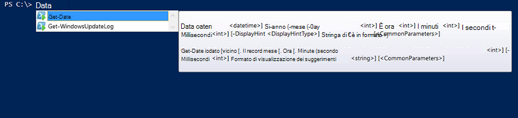

<properties
   pageTitle="Creare un modulo di integrazione di automazione Azure | Microsoft Azure"
   description="Esercitazioni che illustra l'uso di esempio, test e la creazione di moduli di integrazione di automazione di Azure."
   services="automation"
   documentationCenter=""
   authors="mgoedtel"
   manager="jwhit"
   editor="" />

<tags
   ms.service="automation"
   ms.workload="tbd"
   ms.tgt_pltfrm="na"
   ms.devlang="na"
   ms.topic="get-started-article"
   ms.date="09/12/2016"
   ms.author="magoedte" />

# <a name="azure-automation-integration-modules"></a>Automazione Azure integrazione moduli

PowerShell è la tecnologia dietro l'automazione Azure. Poiché Azure automazione si basa su PowerShell, PowerShell moduli sono fondamentali per l'estensibilità di automazione di Azure. In questo articolo è consentirà le specifiche di utilizzo dell'automazione Azure dei moduli di PowerShell, definita "Integrazione moduli" e procedure consigliate per la creazione di moduli di PowerShell per assicurarsi che funzionano come moduli integrazione all'interno di automazione di Azure. 

## <a name="what-is-a-powershell-module"></a>Che cos'è un modulo di PowerShell?

Un modulo di PowerShell è un gruppo di PowerShell i cmdlet **Get-Date** o **Copia di elemento**, che possono essere usate dalla console di PowerShell, script, flussi di lavoro, runbook e risorse di PowerShell DSC come WindowsFeature o un File, che può essere utilizzato da configurazioni DSC PowerShell. Tutte le funzionalità di PowerShell viene esposta tramite i cmdlet e risorse DSC e tutte le risorse cmdlet/DSC supportata da un modulo di PowerShell, molte delle quali forniti con PowerShell. Ad esempio, il cmdlet **Get-Date** fa parte del modulo Microsoft.PowerShell.Utility PowerShell cmdlet **Copia voce** fa parte del modulo Microsoft.PowerShell.Management PowerShell e la risorsa pacchetto DSC fa parte del modulo PSDesiredStateConfiguration PowerShell. Entrambi i moduli forniti con PowerShell. Ma molti moduli di PowerShell non vengono forniti come parte di PowerShell e invece distribuiti con i prodotti prima o di terze parti come System Center Configuration Manager 2012 o grande community di PowerShell in luoghi come PowerShell raccolta.  I moduli sono utili perché rendono più semplice tramite la funzionalità encapsulated attività complesse.  Sono disponibili ulteriori informazioni sui [moduli di PowerShell su MSDN](https://msdn.microsoft.com/library/dd878324%28v=vs.85%29.aspx). 

## <a name="what-is-an-azure-automation-integration-module"></a>Che cos'è un modulo di Azure automazione integrazione?

Un modulo di integrazione non è molto diverso da un modulo di PowerShell. Il relativo semplicemente un modulo di PowerShell che contiene facoltativamente un file aggiuntivo - un file di metadati che specifica un tipo di connessione di automazione di Azure da utilizzare con i cmdlet del modulo in runbook. Facoltativo file o meno, questi PowerShell moduli possono essere importati in Azure automazione per rendere i cmdlet disponibili per l'utilizzo all'interno di runbook e le relative risorse DSC disponibili per l'uso nelle configurazioni DSC. Dietro le quinte, automazione di Azure memorizza questi moduli e runbook processo e il tempo di esecuzione DSC compiliation processo carica in sandbox l'automazione di Azure in cui vengono eseguiti runbook e configurazioni DSC vengono compilate.  Tutte le risorse DSC nei moduli vengono inserite anche automaticamente il server di automazione DSC pull, in modo che possa essere create da computer tentando di applicare configurazioni DSC.  Una serie di moduli di Azure PowerShell forniti dalla casella di automazione di Azure per l'uso in modo che è possibile automatizzare gestione Azure immediatamente, ma è possibile importare facilmente i moduli di PowerShell per qualsiasi sistema, servizio o strumento che si desidera integrare con. 

>[AZURE.NOTE] Alcuni moduli vengono forniti come "moduli globali" nel servizio di automazione. Questi moduli globali sono disponibili all'esterno della casella quando si crea un account di automazione e viene aggiornata in alcuni casi che inserisce automaticamente loro al proprio account di automazione. Se non si desidera questi utenti siano aggiornati automaticamente, sempre è possibile importare lo stesso modulo e che avranno la precedenza rispetto alla versione modulo globale di tale modulo forniti nel servizio. 

Il formato in cui si importa un pacchetto dell'integrazione modulo è un file compresso con lo stesso nome del modulo e l'estensione zip. Contiene il modulo Windows PowerShell e i file di supporto, incluso un file manifesto (.psd1) se il modulo contiene uno.

Se il modulo deve contenere un tipo di connessione di automazione di Azure, deve contenere anche un file con il nome *<ModuleName>*-Automation.json che specifica le proprietà di tipo di connessione. Questo è un file di json inserito all'interno della cartella modulo del file zip e contiene i campi di una connessione di"" necessari per connettersi ai servizi rappresenta il modulo. Fine la creazione di un tipo di connessione in Azure automazione. Con questo file è possibile impostare i nomi dei campi, tipi, e se i campi devono essere crittografati e / o facoltativi per il tipo di connessione del modulo. Di seguito è un modello nel formato di file json:

```
{ 
   "ConnectionFields": [
   {
      "IsEncrypted":  false,
      "IsOptional":  false,
      "Name":  "ComputerName",
      "TypeName":  "System.String"
   },
   {
      "IsEncrypted":  false,
      "IsOptional":  true,
      "Name":  "Username",
      "TypeName":  "System.String"
   },
   {
      "IsEncrypted":  true,
      "IsOptional":  false,
      "Name":  "Password",
   "TypeName":  "System.String"
   }],
   "ConnectionTypeName":  "DataProtectionManager",
   "IntegrationModuleName":  "DataProtectionManager"
}
```

Se è stato distribuito automazione di gestione dei servizi e creato pacchetti di integrazione moduli per il runbook automazione, questo avrà un aspetto molto familiare all'utente. 


## <a name="authoring-best-practices"></a>Creazione di procedure consigliate

Solo perché i moduli di integrazione sono essenzialmente PowerShell moduli, che non è stato che non è un insieme di consigliate in relazione alle loro creazione. È ancora presente un numero di elementi che è consigliabile che valutare durante la creazione di un modulo PowerShell per renderlo più utilizzabile in Azure automazione. Alcuni di questi sono automazione Azure specifici e alcuni di essi sono utili in modo da rendere i moduli funzionano in modo efficiente PowerShell del flusso di lavoro, indipendentemente dal fatto che si usa l'automazione. 

1. Includere un riepilogo, descrizione e permettono di URI per ogni cmdlet nel modulo. In PowerShell, è possibile definire determinate informazioni della Guida per i cmdlet consentire all'utente di ricevere informazioni sul loro utilizzo con il cmdlet **Get-Help** . Ad esempio, ecco come è possibile definire un riepilogo e Guida di URI di un modulo di PowerShell scritto in un file .psm1.<br>  

    ```
    <#
        .SYNOPSIS
         Gets all outgoing phone numbers for this Twilio account 
    #>
    function Get-TwilioPhoneNumbers {
    [CmdletBinding(DefaultParameterSetName='SpecifyConnectionFields', `
    HelpUri='http://www.twilio.com/docs/api/rest/outgoing-caller-ids')]
    param(
       [Parameter(ParameterSetName='SpecifyConnectionFields', Mandatory=$true)]
       [ValidateNotNullOrEmpty()]
       [string]
       $AccountSid,

       [Parameter(ParameterSetName='SpecifyConnectionFields', Mandatory=$true)]
       [ValidateNotNullOrEmpty()]
       [string]
       $AuthToken,

       [Parameter(ParameterSetName='UseConnectionObject', Mandatory=$true)]
       [ValidateNotNullOrEmpty()]
       [Hashtable]
       $Connection
    )

    $cred = CreateTwilioCredential -Connection $Connection -AccountSid $AccountSid -AuthToken $AuthToken

    $uri = "$TWILIO_BASE_URL/Accounts/" + $cred.UserName + "/IncomingPhoneNumbers"
    
    $response = Invoke-RestMethod -Method Get -Uri $uri -Credential $cred

    $response.TwilioResponse.IncomingPhoneNumbers.IncomingPhoneNumber
    }
    ```
<br> 
Fornire queste informazioni non verranno mostrati solo questo informazioni su come usare il cmdlet **Get-Help** nella console di PowerShell, esso verrà esposto anche questa funzionalità Guida all'interno di automazione di Azure, ad esempio quando si inseriscono attività durante la creazione di runbook. Fare clic su "Visualizza informazioni dettagliate" aprirà la Guida URI in un'altra scheda del browser in uso per accedere all'automazione di Azure.<br>
2. Se il modulo viene eseguito in un sistema remoto, un. Deve contenere un file di metadati modulo Integration che consente di definire le informazioni necessarie per connettersi a tale sistema remoto, ovvero il tipo di connessione. b. Ogni cmdlet nel modulo dovrebbe essere possibile eseguire in un oggetto di connessione (un'istanza di quel tipo di connessione) come parametro.  
    Cmdlet nel modulo diventano più semplice da utilizzare in Azure automazione se si consentono di passare un oggetto con i campi del tipo di connessione come parametro per il cmdlet. In questo modo non abbiano il mapping dei parametri del bene connessione parametri corrispondenti del cmdlet ogni volta che si chiama un cmdlet. A seconda dell'esempio runbook precedente, utilizza una risorsa di connessione Twilio chiamata CorpTwilio per accedere Twilio e restituire tutti i numeri di telefono nella finestra account.  Si noti come sono eseguire il mapping campi della connessione per i parametri del cmdlet?<br>

    ```
    workflow Get-CorpTwilioPhones
    {
      $CorpTwilio = Get-AutomationConnection -Name 'CorpTwilio'
    
      Get-TwilioPhoneNumbers 
        -AccountSid $CorpTwilio.AccountSid  
        -AuthToken $CorptTwilio.AuthToken
    }
    ```
<br>
Un modo più facile e più efficienti per tale operazione è l'oggetto di connessione passare direttamente al cmdlet-

    ```
    workflow Get-CorpTwilioPhones
    {
      $CorpTwilio = Get-AutomationConnection -Name 'CorpTwilio'

      Get-TwilioPhoneNumbers -Connection $CorpTwilio
    }
    ```
<br>
È possibile abilitare un comportamento simile per i cmdlet e consente di accettare un oggetto di connessione direttamente come parametro, anziché solo i campi di connessione per i parametri. In genere è possibile utilizzare un parametro impostato per ogni, in modo che un utente che non usa automazione Azure può chiamare il cmdlet senza la creazione di un hashtable come oggetto di connessione. Insieme di parametri **SpecifyConnectionFields** viene utilizzata per passare la connessione di proprietà dei campi uno alla volta. **UseConnectionObject** consente di passare direttamente la connessione. Come si può notare, il cmdlet invia TwilioSMS del [modulo PowerShell per Twilio](https://gallery.technet.microsoft.com/scriptcenter/Twilio-PowerShell-Module-8a8bfef8) consente di passare in entrambi i casi: 

    ```
    function Send-TwilioSMS {
      [CmdletBinding(DefaultParameterSetName='SpecifyConnectionFields', `
      HelpUri='http://www.twilio.com/docs/api/rest/sending-sms')]
      param(
         [Parameter(ParameterSetName='SpecifyConnectionFields', Mandatory=$true)]
         [ValidateNotNullOrEmpty()]
         [string]
         $AccountSid,

         [Parameter(ParameterSetName='SpecifyConnectionFields', Mandatory=$true)]
         [ValidateNotNullOrEmpty()]
         [string]
         $AuthToken,

         [Parameter(ParameterSetName='UseConnectionObject', Mandatory=$true)]
         [ValidateNotNullOrEmpty()]
         [Hashtable]
         $Connection

       )
    }
    ```
<br>
3. Definire il tipo di output per tutti i cmdlet nel modulo. La definizione di un tipo di output per un cmdlet consente IntelliSense in fase di progettazione determinare le proprietà di output del cmdlet per l'utilizzo durante la creazione. È particolarmente utile durante l'automazione runbook grafici per la modifica, in Progettazione ora knowledge è fondamentale per un'esperienza utente di semplice utilizzo con il modulo.<br> <br> Questo è simile alla funzionalità "digitare direttamente" di output del cmdlet di PowerShell ISE senza dover eseguirlo.<br> <br>
4. Cmdlet nel modulo è possibile utilizzare i tipi di oggetto complesso per i parametri. Flusso di lavoro di PowerShell è diverso da PowerShell in archivia tipi complessi in formato deserializzato. Tipi di base rimangono come primitive, ma vengono convertiti tipi complessi alle versioni deserializzati sono essenzialmente contenitori di proprietà. Ad esempio, se è stato utilizzato il cmdlet **Get-Process** in un runbook (o un flusso di lavoro di PowerShell a tale scopo), restituisce un oggetto di tipo [Deserialized.System.Diagnostic.Process] tipo [System.Diagnostic.Process] non previsto. Questo tipo ha le stesse proprietà di tipo non deserializzato, ma nessuna delle procedure descritte. Se si tenta di passare questo valore come parametro a un cmdlet, in cui il cmdlet prevede un valore [System.Diagnostic.Process] per questo parametro, viene visualizzato l'errore seguente: *non è possibile elaborare trasformazione argomento nel parametro 'process'. Errore: "Impossibile convertire il valore di"System.Diagnostics.Process (CcmExec)"di tipo"Deserialized.System.Diagnostics.Process"digitare"System.Diagnostics.Process".*   In questo modo c'è un tipo non corrispondente tra il tipo di [System.Diagnostic.Process] previsto e il tipo di [Deserialized.System.Diagnostic.Process] specificato. Per risolvere questo problema è per rendere i cmdlet del modulo non tipi complessi per i parametri. Ecco il modo errato.

    ```
    function Get-ProcessDescription {
      param (
            [System.Diagnostic.Process] $process
      )
      $process.Description
    }
    ``` 
<br>
Ed ecco nel modo giusto eseguendo una primitiva che può essere utilizzata internamente dal cmdlet per catturare l'oggetto complesso e usarla. Poiché i cmdlet eseguire nel contesto di PowerShell, non PowerShell flusso di lavoro, il cmdlet $process diventa il tipo corretto di [System.Diagnostic.Process].  

    ```
    function Get-ProcessDescription {
      param (
            [String] $processName
      )
      $process = Get-Process -Name $processName

      $process.Description
    }
    ```
<br>
Attività di connessione in runbook sono Hashtable, ossia un tipo complesso, e ancora questi Hashtable sembra che siano in grado di essere passati nel cmdlet per loro-parametro di connessione perfettamente, con alcuna eccezione cast. Tecnicamente, alcuni tipi di PowerShell sono in grado di eseguire il cast correttamente dal loro modulo serializzato loro modulo deserializzato e pertanto in è possono passare cmdlet per accettare il tipo di deserializzato non parametri. Hashtable corrisponde a uno di questi piani. È possibile per i tipi di definito dell'autore del modulo implementata in modo corretto può deserializzare anche, ma sono disponibili alcuni svantaggi per rendere. Il tipo deve avere un costruttore predefinito, tutte le relative proprietà pubbliche e di avere un PSTypeConverter. Tuttavia, per i tipi già definiti che non dispone di autore del modulo, non sarà più risolverli "", quindi il suggerimento di evitare tipi complessi per i parametri del tutto insieme. Suggerimento per la creazione condivisa runbook: se per qualche ragione la necessità di cmdlet di accettare un parametro di tipo complesso o si utilizza un altro utente modulo che richiede un parametro di tipo complesso, la soluzione del flusso di lavoro di PowerShell runbook e flussi di lavoro PowerShel in PowerShell locale, è ritorno a capo il cmdlet che genera il tipo complesso e il cmdlet che utilizza il tipo complesso nella stessa attività InlineScript è impostato su. Poiché InlineScript è impostato su viene eseguito il relativo contenuto come PowerShell anziché PowerShell del flusso di lavoro, il cmdlet generare il tipo complesso produce tale corretto, non il tipo deserializzato complesse.
5. Rendere tutti i cmdlet nel modulo senza informazioni sullo stato. Flusso di lavoro di PowerShell viene eseguita ogni cmdlet chiamato del flusso di lavoro in un'altra sessione. Di conseguenza, non funziona con i cmdlet che dipendono da sessione creata / modificato da altri cmdlet nello stesso modulo del flusso di lavoro di PowerShell runbook.  Ecco un esempio di cosa non fare.

    ```
    $globalNum = 0
    function Set-GlobalNum {
       param(
           [int] $num
       )
      
       $globalNum = $num
    }
    function Get-GlobalNumTimesTwo {
       $output = $globalNum * 2
     
       $output
    }
    ```
<br>
6. Il modulo deve essere completamente contenuto in un pacchetto Xcopy grado. Poiché i moduli di automazione di Azure vengono distribuiti a sandbox automazione quando è necessario eseguire runbook, è necessario usare indipendente host in esecuzione nel. Il che significa che dovrebbe essere possibile Zip pacchetto del modulo di spostarlo in qualsiasi altro host con la versione di PowerShell stesso o versioni successiva e far sì che funziona come previsto quando si importano in tale PowerShell ambiente host. Affinché che si verifichi, non il modulo deve essere dipendente in tutti i file all'esterno della cartella di modulo (la cartella che viene compresso configurazione durante l'importazione in Azure automazione) o in tutte le impostazioni del Registro di sistema univoco un host, ad esempio quelli impostati per l'installazione di un prodotto. Se questa procedura consigliata non è stata eseguita, il modulo non sarà utilizzabile in Azure automazione.  

## <a name="next-steps"></a>Passaggi successivi

- Per iniziare a utilizzare runbook del flusso di lavoro di PowerShell, vedere [il primo runbook del flusso di lavoro PowerShell](automation-first-runbook-textual.md)
- Per ulteriori informazioni sulla creazione di moduli di PowerShell, vedere [scrittura di un modulo di Windows PowerShell](https://msdn.microsoft.com/library/dd878310%28v=vs.85%29.aspx)