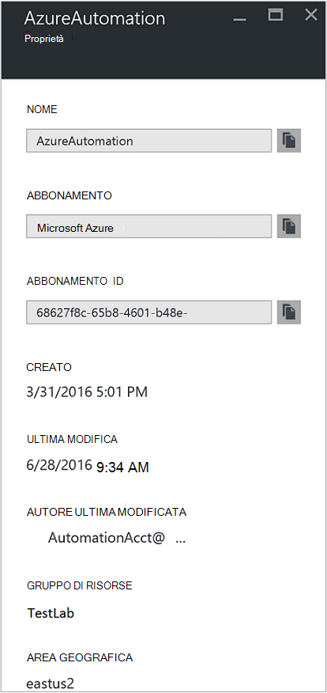
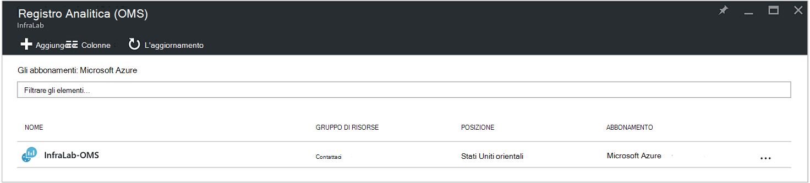
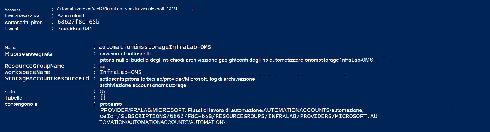
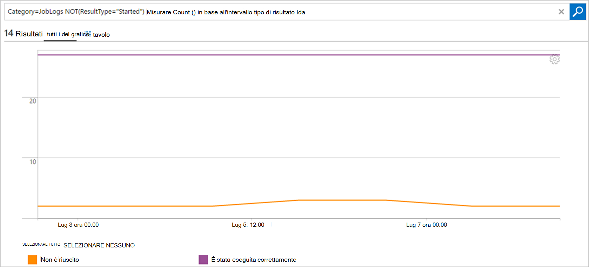

<properties
    pageTitle="Inoltrare i flussi di lavoro e lo stato dei processi di automazione a Log Analitica (OMS) | Microsoft Azure"
    description="In questo articolo viene illustrato come inviare runbook e lo stato dei processi flussi di lavoro a Microsoft le operazioni di gestione Suite Log Analitica per fornire ulteriori dettagli e gestione."
    services="automation"
    documentationCenter=""
    authors="MGoedtel"
    manager="jwhit"
    editor="tysonn" />
<tags
    ms.service="automation"
    ms.devlang="na"
    ms.topic="article"
    ms.tgt_pltfrm="na"
    ms.workload="infrastructure-services"
    ms.date="09/22/2016"
    ms.author="magoedte" />

# Inoltrare i flussi di lavoro e lo stato dei processi di automazione a Log Analitica (OMS)

Automazione inviare runbook flussi sullo stato e processo nell'area di lavoro di Microsoft operazioni gestione famiglia di prodotti (OMS) Log Analitica.  Sebbene sia possibile visualizzare queste informazioni nel portale di Azure o con PowerShell tramite lo stato dei processi singoli o tutti i processi per un determinato account di automazione, nulla avanzate per supportare i requisiti operativi è necessario creare script di PowerShell personalizzati.  Con registro Analytics è ora possibile:

- Ottenere informazioni dettagliate sui processi di automazione 
- Trigger in base a un messaggio di posta elettronica o un avviso sullo stato del processo runbook (ad esempio, non è riuscita o sospesa) 
- Scrivere query avanzate tra i flussi di lavoro 
- Creare una relazione tra gli account di automazione processi 
- Visualizzare la cronologia dei processi nel tempo     

## Prerequisiti e considerazioni sulla distribuzione

Per iniziare a inviare i registri di automazione a Log Analitica, è necessario disporre le operazioni seguenti:

1. Un abbonamento OMS. Per ulteriori informazioni, vedere [Guida introduttiva a Log Analitica](../log-analytics/log-analytics-get-started.md).  

    >[AZURE.NOTE]L'area di lavoro OMS e l'account di automazione devono essere nello stesso abbonamento Azure affinché questa configurazione per il corretto funzionamento. 
  
2. Un [account di archiviazione di Azure](../storage/storage-create-storage-account.md).  
   
    >[AZURE.NOTE]Spazio di archiviazione account *deve* essere nella stessa regione l'account di automazione. 
 
3. Azure PowerShell con versione 1.0.8 o versioni successive di cmdlet approfondimenti operativi. Per informazioni su questa versione e come installarlo, vedere [come installare e configurare Azure PowerShell](../powershell-install-configure.md).
4. Azure Diagnostics and Log Analitica PowerShell.  Per ulteriori informazioni su questa versione e come installarlo, vedere [Azure Diagnostics and Log Analitica](https://www.powershellgallery.com/packages/AzureDiagnosticsAndLogAnalytics/0.1).  
5. Scaricare lo script di PowerShell **Abilita AzureDiagnostics.ps1** dalla [Raccolta di PowerShell](https://www.powershellgallery.com/packages/Enable-AzureDiagnostics/1.0/DisplayScript). Questo script configurerà le operazioni seguenti:
 - Un account di archiviazione per contenere i runbook processo sullo stato e flusso di dati per un account di automazione specificate.
 - Abilitare la raccolta di dati dall'account automazione archiviarlo in un account di archiviazione Blob Azure nel formato JSON.
 - Configurare la raccolta di dati dall'account di archiviazione Blob a OMS Log Analitica.
 - Attivare la soluzione di automazione Log Analitica l'area di lavoro OMS.   

Lo script **Abilita AzureDiagnostics.ps1** richiede i parametri seguenti durante l'esecuzione:

- *AutomationAccountName* - il nome del proprio account di automazione
- *LogAnalyticsWorkspaceName* - il nome dell'area di lavoro OMS

Per individuare i valori *AutomationAccountName*, nel portale di Azure selezionare l'account di automazione e il **conto di automazione** e selezionare **tutte le impostazioni**.  In **Impostazioni Account** e il **tutte le impostazioni** , selezionare **proprietà**.  In e il **proprietà** , è possibile notare questi valori.  .

## Integrazione di configurazione con registro Analitica

1. Nel computer, avviare **Windows PowerShell** dalla schermata **Start** .  
2. Dalla shell della riga di comando di PowerShell, passare alla cartella che contiene lo script scaricato ed eseguito la modifica dei valori dei parametri *- AutomationAccountName* e *- LogAnalyticsWorkspaceName*.

    >[AZURE.NOTE] Verrà richiesto di eseguire l'autenticazione con Azure dopo l'esecuzione di script.  È **necessario** accedere con un account che sia un membro del ruolo Admins di abbonamento e CO-amministratore della sottoscrizione.   
    
        .\Enable-AzureDiagnostics -AutomationAccountName <NameofAutomationAccount> `
        -LogAnalyticsWorkspaceName <NameofOMSWorkspace> `

3. Dopo l'esecuzione di script verranno visualizzati i record in Log Analitica circa 30 minuti dopo i dati di diagnostici vengono inseriti in un archivio.  Se i record non sono disponibili dopo questa volta fare riferimento alla sezione sulla risoluzione dei problemi dei file [JSON archiviazione blob](../log-analytics/log-analytics-azure-storage-json.md#troubleshooting-configuration-for-azure-diagnostics-written-to-blob-in-json).

### Verificare la configurazione

Per verificare che lo script configurato l'account di automazione e OMS wokspace correttamente, è possibile eseguire la procedura seguente in PowerShell.  Prima di effettuare questa operazione, per trovare che i valori per il nome dell'area di lavoro OMS e nome gruppo di risorse, dal portale di Azure, passare a Log Analitica (OMS) e in e il Log Analitica (OMS), annotare il valore di **nome** e **Gruppo di risorse**.   questi due valori verrà usata quando si verifica la configurazione nell'area di lavoro OMS utilizzando il cmdlet di PowerShell [Get-AzureRmOperationalInsightsStorageInsight](https://msdn.microsoft.com/library/mt603567.aspx).

1.  Dal portale di Azure, passare all'account di archiviazione e cercare l'account di archiviazione seguenti, che utilizza la convenzione di denominazione - *AutomationAccountNameomsstorage*.  Dopo avere un runbook completato processo, subito dopo dovrebbero essere visualizzati due contenitori Blob creati - **joblogs di registri approfondimenti** e **informazioni dettagliate sui registri-jobstreams**.  

2.  Da PowerShell, eseguire il codice di PowerShell seguente, la modifica dei valori per i parametri **ResourceGroupName** e **WorkspaceName** che è stata copiata o indicato in precedenza.  

    Accesso AzureRmAccount Get-AzureRmSubscription - SubscriptionName 'SubscriptionName' | Set AzureRmContext Get-AzureRmOperationalInsightsStorageInsight - ResourceGroupName "OMSResourceGroupName" '-area di lavoro "OMSWorkspaceName" 

    Verrà restituito comprensione dello spazio di archiviazione per l'area di lavoro OMS specificato.  Si desidera verificare le informazioni dello spazio di archiviazione per l'account di automazione che è specificati in precedenza esista e oggetto di **stato** viene visualizzato un valore di **OK**.  .

## Registro Analitica record

Automazione crea due tipi di record nell'archivio OMS.

### Log di processo

Proprietà | Descrizione|
----------|----------|
Ora | Data e ora durante il processo di runbook eseguito.|
resourceId | Specifica il tipo di risorsa in Azure.  Per l'automazione, il valore è l'account di automazione associato dal runbook.|
Invece | Specifica il tipo di operazione eseguita in Azure.  Per l'automazione, il valore sarà processo.|
dell'enumeratore | Lo stato del processo di runbook.  Valori possibili sono: -Avviato -Arrestato -Sospesa -Non è riuscito -Ha avuto esito positivo|
resultDescription | Descrive lo stato di risultato runbook processo.  Valori possibili sono: -Avvio processo -Processo non è riuscito -Processo completato|
CorrelationId | GUID che rappresenta l'Id di correlazione del processo di runbook.|
Categoria | Classificazione del tipo di dati.  Per l'automazione, il valore è JobLogs.|
RunbookName | Il nome dal runbook.|
ID processo | GUID che corrisponde all'Id del processo di runbook.|
Chiamante |  Chi ha iniziato l'operazione.  Valori possibili sono un indirizzo di posta elettronica o sistema per i processi pianificati.|

### Flussi di lavoro
Proprietà | Descrizione|
----------|----------|
Ora | Data e ora durante il processo di runbook eseguito.|
resourceId | Specifica il tipo di risorsa in Azure.  Per l'automazione, il valore è l'account di automazione associato dal runbook.|
Invece | Specifica il tipo di operazione eseguita in Azure.  Per l'automazione, il valore sarà processo.|
dell'enumeratore | Lo stato del processo di runbook.  Valori possibili sono: -In corso|
resultDescription | Include il flusso di output dal runbook.|
CorrelationId | GUID che rappresenta l'Id di correlazione del processo di runbook.|
Categoria | Classificazione del tipo di dati.  Per l'automazione, il valore è JobStreams.|
RunbookName | Il nome dal runbook.|
ID processo | GUID che corrisponde all'Id del processo di runbook.|
Chiamante | Chi ha iniziato l'operazione.  Valori possibili sono un indirizzo di posta elettronica o sistema per i processi pianificati.| 
StreamType | Il tipo di flusso del processo. Valori possibili sono: -Lo stato di avanzamento -Output -Avviso -Errore -Debug -Dettagliato|

## Visualizzazione di automazione registri nella Analitica Log 

Ora che è stato avviato invio dei registri di processo di automazione a Log Analitica, vediamo cosa può fare con i registri all'interno di OMS.   

### Inviare un messaggio di posta elettronica in caso di un processo runbook o sospende 

Uno dei clienti principali chiede riguarda la possibilità di inviare un messaggio di posta elettronica o un testo in caso di problemi con un processo runbook.   

Per creare una regola di avviso, è innanzitutto necessario creare una ricerca dei registri per i record di processo runbook che deve richiamare l'avviso.  Pulsante **avviso** quindi saranno disponibile in modo che è possibile creare e configurare la regola di avviso.

1.  Nella pagina Panoramica OMS, fare clic su **Ricerca dei registri**.
2.  Creare una query di ricerca log per l'avviso digitando il seguente nel campo della query: `Category=JobLogs (ResultType=Failed || ResultType=Suspended)`.  È inoltre possibile raggruppare tramite la RunbookName utilizzando: `Category=JobLogs (ResultType=Failed || ResultType=Suspended) | measure Count() by RunbookName_s`.   
  
    Se è stata configurata registri da più account di automazione o l'abbonamento nell'area di lavoro, potrebbero anche interessare gli avvisi per l'abbonamento o di un account di automazione di raggruppamento.  Nome dell'account di automazione può essere derivato dal campo delle risorse nella ricerca di JobLogs.  

3.  Fare clic su **avviso** nella parte superiore della pagina per aprire la schermata **Aggiungi regola di avviso** .  Per ulteriori informazioni sulle opzioni per configurare l'avviso, vedere [gli avvisi di Log Analitica](../log-analytics/log-analytics-alerts.md#creating-an-alert-rule).

### Trovare tutti i processi che hanno completato con errori 

Oltre a avviso in base di fuori dell'errori, probabilmente desideri sapere quando un processo runbook ha un errore non definitive (PowerShell produce un flusso di errore, ma non definitive errori non causano il processo di sospendere o negativo).    

1. Nel portale OMS, fare clic su **Ricerca dei registri**.
2. Nel campo query digitare `Category=JobStreams StreamType_s=Error | measure count() by JobId_g` e quindi fare clic su **Cerca**.

### Visualizzazione flussi di lavoro per un processo  

Quando si esegue il debug di un processo, potrebbe essere anche di esaminare i flussi di lavoro.  La query riportata di seguito mostra tutti i flussi per un singolo processo con GUID 2ebd22ea-e05e-4eb9 - 9d 76-d73cbd4356e0:   

`Category=JobStreams JobId_g="2ebd22ea-e05e-4eb9-9d76-d73cbd4356e0" | sort TimeGenerated | select ResultDescription` 

### Visualizzare lo stato di processo cronologico 

Infine, si desidera visualizzare la cronologia dei processi nel tempo.  È possibile utilizzare questa query per cercare lo stato dei processi nel tempo. 

`Category=JobLogs NOT(ResultType="started") | measure Count() by ResultType interval 1day`  
   

## Riepilogo

Per inviare i dati sullo stato e flusso del processo automazione a Log Analitica, è possibile ottenere più approfondito lo stato dei processi automazione installando e configurando gli avvisi per ricevere una notifica quando esiste un problema e dashboard personalizzati utilizzando query avanzate per visualizzare i risultati runbook, lo stato dei processi runbook e altri indicatori chiavi correlati o metriche.  In questo modo fornire maggiore visibilità operativa e interventi di indirizzo più rapidi.  

## Passaggi successivi

- Per ulteriori informazioni su come creare query di ricerca diversi e rivedere i registri di processo di automazione con registro Analitica, vedere [Log ricerche nel registro Analitica](../log-analytics/log-analytics-log-searches.md)
- Per informazioni su come creare e recuperare messaggi di errore e di output dal runbook, vedere [i messaggi e Runbook output](automation-runbook-output-and-messages.md) 
- Per ulteriori informazioni sull'esecuzione runbook, come per monitorare runbook processi e altri dettagli tecnici, vedere [tenere traccia di un processo runbook](automation-runbook-execution.md)
- Per ulteriori informazioni su OMS Log Analitica e origini dati insieme, vedere [la raccolta di Azure lo spazio di archiviazione dati di panoramica Analitica Log](../log-analytics/log-analytics-azure-storage.md)