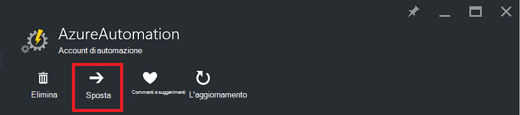
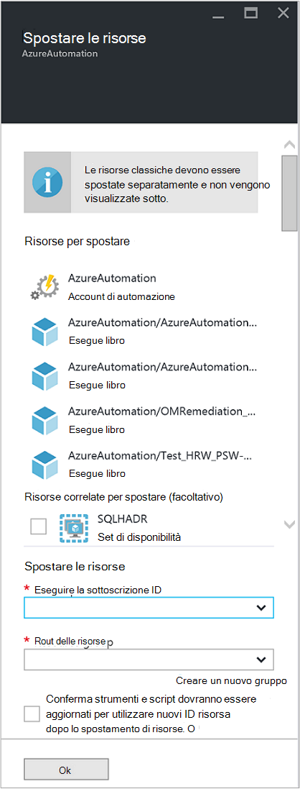

<properties
   pageTitle="Eseguire la migrazione di Account di automazione e risorse | Microsoft Azure"
   description="In questo articolo viene descritto come spostare un Account di automazione in Azure automazione e le risorse associate da una sottoscrizione a un altro."
   services="automation"
   documentationCenter=""
   authors="MGoedtel"
   manager="jwhit"
   editor="tysonn" />
<tags
   ms.service="automation"
   ms.devlang="na"
   ms.topic="article"
   ms.tgt_pltfrm="na"
   ms.workload="infrastructure-services"
   ms.date="07/07/2016"
   ms.author="magoedte" />

# <a name="migrate-automation-account-and-resources"></a>Eseguire la migrazione di Account di automazione e risorse

Per gli account di automazione e le risorse associate (ad esempio risorse, runbook, moduli, ecc.) creato nel portale di Azure che si desidera eseguire la migrazione da un gruppo di risorse a un'altra o da una sottoscrizione a un altro, è possibile eseguire questa operazione facilmente con la caratteristica [spostare le risorse](../resource-group-move-resources.md) disponibile nel portale di Azure. Prima di procedere con questa azione, tuttavia, è prima necessario esaminare il seguente [elenco di controllo prima di spostamento di risorse](../resource-group-move-resources.md#Checklist-before-moving-resources) e inoltre, nell'elenco seguente specifiche di automazione.   

1.  Il gruppo di sottoscrizione/risorsa destinazione deve trovarsi nella stessa regione come origine.  Indicare, gli account di automazione non possono essere spostati in aree geografiche.
2.  Quando si spostano le risorse (ad esempio runbook, processi, ecc.), vengono bloccati per la durata dell'operazione di gruppo di origine e il gruppo di destinazione. Scrivere e le operazioni di eliminazione vengono bloccati per i gruppi fino al completamento dello spostamento.  
3.  Qualsiasi runbook o variabili che fanno riferimento a un ID risorsa o l'abbonamento da sottoscrizione esistente saranno necessario aggiornarli dopo il completamento di migrazione.   


>[AZURE.NOTE] Questa caratteristica non supporta le risorse di automazione spostamento classica.

## <a name="to-move-the-automation-account-using-the-portal"></a>Per spostare l'Account di automazione tramite il portale

1. Dal proprio account di automazione, fare clic su **Sposta** nella parte superiore e il.<br> <br> 
2. Nella e **spostare le risorse** nota che presenta risorse correlate al proprio account di automazione e i gruppi di risorse.  Selezionare **l'abbonamento** e il **gruppo di risorse** negli elenchi a discesa, o selezionare l'opzione **Crea un nuovo gruppo di risorse** e immettere il nome di un nuovo gruppo di risorse nel campo disponibile.  
3. Esaminare e selezionare la casella di controllo riconoscendo si *comprendere strumenti e script dovranno essere aggiornati per utilizzare nuovi ID di risorsa dopo lo spostamento di risorse* e quindi fare clic su **OK**.<br> <br>   

Questa azione potrebbe richiedere alcuni minuti per completare.  In **notifiche**, verrà visualizzato con lo stato di ogni azione che entrerà in vigore - convalida, la migrazione e quindi infine quando è completata.     

## <a name="to-move-the-automation-account-using-powershell"></a>Per spostare l'Account di automazione tramite PowerShell

Per spostare risorse automazione esistenti in un altro gruppo di risorse o l'abbonamento, utilizzare il cmdlet **Get-AzureRmResource** per ottenere un account di automazione specifico e quindi **Sposta AzureRmResource** cmdlet per effettuare lo spostamento.

Nel primo esempio viene illustrato come spostare un conto di automazione in un nuovo gruppo di risorse.

   ```
    $resource = Get-AzureRmResource -ResourceName "TestAutomationAccount" -ResourceGroupName "ResourceGroup01"
    Move-AzureRmResource -ResourceId $resource.ResourceId -DestinationResourceGroupName "NewResourceGroup"
   ``` 

Dopo avere eseguito l'esempio precedente, verrà richiesto di verificare che si desidera eseguire questa operazione.  Dopo aver fare clic su **Sì** e consentire lo script continuare, non si riceveranno le notifiche durante l'esecuzione della migrazione.  

Per spostare in una nuova sottoscrizione, includere un valore per il parametro *DestinationSubscriptionId* .

   ```
    $resource = Get-AzureRmResource -ResourceName "TestAutomationAccount" -ResourceGroupName "ResourceGroup01"
    Move-AzureRmResource -ResourceId $resource.ResourceId -DestinationResourceGroupName "NewResourceGroup" -DestinationSubscriptionId "SubscriptionId"
   ``` 

Come nell'esempio precedente, verrà richiesto di confermare lo spostamento.  

## <a name="next-steps"></a>Passaggi successivi

- Per ulteriori informazioni sullo spostamento risorse nuovo gruppo di risorse o l'abbonamento, vedere [spostare le risorse nuovo gruppo di risorse o l'abbonamento](../resource-group-move-resources.md)
- Per ulteriori informazioni su controllo dell'accesso basato sui ruoli in Azure automazione, fare riferimento al [controllo dell'accesso basato sui ruoli in Azure automazione](../automation/automation-role-based-access-control.md).
- Per informazioni sui cmdlet di PowerShell per gestire l'abbonamento, vedere [Uso di PowerShell Azure con Gestione risorse](../powershell-azure-resource-manager.md)
- Per informazioni sulle funzionalità del portale di gestione dell'abbonamento, vedere [tramite il portale di Azure per gestire le risorse](../azure-portal/resource-group-portal.md). 
