<properties 
   pageTitle="Controllo dell'accesso basato sui ruoli in Azure automazione | Microsoft Azure"
   description="Controllo dell'accesso basato sui ruoli (RBAC) consente la gestione di accesso per le risorse Azure. In questo articolo viene descritto come configurare RBAC in Azure automazione."
   services="automation"
   documentationCenter=""
   authors="mgoedtel"
   manager="jwhit"
   editor="tysonn"
   keywords="automazione rbac, rbac azure, controllo dell'accesso basato sui ruoli" />
<tags 
   ms.service="automation"
   ms.devlang="na"
   ms.topic="get-started-article"
   ms.tgt_pltfrm="na"
   ms.workload="infrastructure-services"
   ms.date="09/12/2016"
   ms.author="magoedte;sngun"/>

# Controllo dell'accesso basato sui ruoli in automazione Azure

## Controllo dell'accesso basato sui ruoli

Controllo dell'accesso basato sui ruoli (RBAC) consente la gestione di accesso per le risorse Azure. Usa [RBAC](../active-directory/role-based-access-control-configure.md), è possibile separare i compiti all'interno del team e concedere solo la quantità di accesso a utenti, gruppi e applicazioni che è necessario svolgere il proprio lavoro. Accesso basato sui ruoli può concedere agli utenti tramite il portale di Azure, Azure strumenti della riga di comando e API di gestione di Azure.

## RBAC nell'account di automazione

Automazione di Azure, accedere mediante l'assegnazione di ruolo RBAC appropriata per gli utenti, gruppi e le applicazioni nell'ambito dell'account di automazione. Di seguito sono i ruoli predefiniti supportati da un account di automazione:  

|**Ruolo** | **Descrizione** |
|:--- |:---|
| Proprietario | Il ruolo di proprietario consente l'accesso a tutte le risorse e operazioni all'interno di un account di automazione inclusi fornire l'accesso agli altri utenti, gruppi e alle applicazioni di gestire l'account di automazione. |
| Per i collaboratori | Il ruolo di Collaboratore consente di gestire tutti gli elementi ad eccezione di modificare le autorizzazioni di accesso di altri utenti a un account di automazione. |
| Utilità per la lettura | Il ruolo di utilità per la lettura consente di visualizzare tutte le risorse in un account di automazione, ma non è possibile apportare le modifiche.|
| Operatore di automazione | Il ruolo di operatore di automazione consente di eseguire attività operative, ad esempio inizio, interrompere, sospendere, riprendere e pianificare processi. Questo ruolo è utile se si desidera proteggere le risorse di automazione Account come risorse credenziali e runbook venga visualizzato o modificato, ma comunque consentire ai membri dell'organizzazione eseguire queste runbook. |
| Amministratore di accesso utente | Il ruolo di amministratore di accesso utente consente di gestire l'accesso degli utenti ad account Azure automazione. |

>[AZURE.NOTE] Non è possibile concedere diritti di accesso a una specifica runbook o runbook, solo per le risorse e le azioni all'interno dell'account di automazione.  

In questo articolo è consentono all'utente come configurare RBAC in Azure automazione. Prima di seguito è illustrato in dettaglio le singole autorizzazioni concesse ai collaboratori, utilità per la lettura, automazione operatore e amministratore accesso utente in modo che si ottengono una buona conoscenza prima di concedere chiunque diritti all'account di automazione.  In caso contrario potrebbe causare conseguenze di imprevisti o non desiderato.     

## Autorizzazioni di ruolo di collaboratore

La tabella seguente vengono presentate le azioni specifiche che possono essere eseguite dal ruolo di collaboratore in automazione.

| **Tipo di risorsa** | **Lettura** | **Scrittura** | **Elimina** | **Altre azioni** |
|:--- |:---|:--- |:---|:--- |
| Account Azure automazione |  |  |  | | 
| Automazione certificato bene |  |  |  | |
| Automazione connessione bene |  |  |  | | 
| Automazione connessione tipo risorsa |  |  |  | | 
| Automazione delle credenziali bene |  |  |  | |
| Risorse di programmazione di automazione |  |  |  | |
| Automazione variabile bene |  |  |  | |
| Automazione bene accolta configurazione dello stato | | | |  |
| Tipo di risorsa lavoro Runbook ibrido |  | |  | | 
| Processo di automazione Azure |  |  | |  | 
| Flusso del processo di automazione |  | | | | 
| Pianificazione del processo di automazione |  |  |  | |
| Modulo di automazione |  |  |  | |
| Automazione Azure Runbook |  |  |  |  |
| Automazione Runbook bozza |  | | |  |
| Processo di Test di automazione Runbook bozza |  |  | |  | 
| Automazione Webhook |  |  |  |  |

## Autorizzazioni di lettura al ruolo

Nella tabella seguente vengono presentate le azioni specifiche che possono essere eseguite dal ruolo di lettore di automazione.

| **Tipo di risorsa** | **Lettura** | **Scrittura** | **Elimina** | **Altre azioni** |
|:--- |:---|:--- |:---|:--- |
| Amministratore della sottoscrizione classica |  | | | 
| Blocco di gestione |  | | | 
| Autorizzazione |  | | |
| Operazioni di provider |  | | | 
| Assegnazione di ruolo |  | | | 
| Definizione di ruolo |  | | | 

## Autorizzazioni del ruolo di operatore di automazione

La tabella seguente vengono presentate le azioni specifiche che possono essere eseguite dal ruolo operatore di automazione di automazione.

| **Tipo di risorsa** | **Lettura** | **Scrittura** | **Elimina** | **Altre azioni** |
|:--- |:---|:--- |:---|:--- |
| Account Azure automazione |  | | | 
| Automazione certificato bene | | | |
| Automazione connessione bene | | | |
| Automazione connessione tipo risorsa | | | |
| Automazione delle credenziali bene | | | |
| Risorse di programmazione di automazione |  |  | | |
| Automazione variabile bene | | | |
| Automazione bene accolta configurazione dello stato | | | | |
| Tipo di risorsa lavoro Runbook ibrido | | | | | 
| Processo di automazione Azure |  |  | |  | 
| Flusso del processo di automazione |  | | |  
| Pianificazione del processo di automazione |  |  | | |
| Modulo di automazione | | | |
| Automazione Azure Runbook |  | | | |
| Automazione Runbook bozza | | | |
| Processo di Test di automazione Runbook bozza | | | |  
| Automazione Webhook | | | |

Per ulteriori informazioni, le [azioni dell'operatore di automazione](../active-directory/role-based-access-built-in-roles.md#automation-operator) sono elencate le azioni supportate dal ruolo di operatore automazione nell'account di automazione e le relative risorse.

## Autorizzazioni del ruolo di amministratore di accesso utente

Nella tabella seguente vengono presentate le azioni specifiche che possono essere eseguite dal ruolo di amministratore di accesso utente di automazione.

| **Tipo di risorsa** | **Lettura** | **Scrittura** | **Elimina** | **Altre azioni** |
|:--- |:---|:--- |:---|:--- |
| Account Azure automazione |  | | | |
| Automazione certificato bene |  | | | |
| Automazione connessione bene |  | | | |
| Automazione connessione tipo risorsa |  | | | |
| Automazione delle credenziali bene |  | | | |
| Risorse di programmazione di automazione |  | | | |
| Automazione variabile bene |  | | | |
| Automazione bene accolta configurazione dello stato | | | | |
| Tipo di risorsa lavoro Runbook ibrido |  | | | | 
| Processo di automazione Azure |  | | | | 
| Flusso del processo di automazione |  | | | | 
| Pianificazione del processo di automazione |  | | | |
| Modulo di automazione |  | | | |
| Automazione Azure Runbook |  | | | |
| Automazione Runbook bozza |  | | | |
| Processo di Test di automazione Runbook bozza |  | | | | 
| Automazione Webhook |  | | |

## Configurare RBAC per l'Account di automazione nel portale di Azure

1.  Accedere al [Portale di Azure](https://portal.azure.com/) e aprire l'account di automazione dalla e automazione account.  

2.  Fare clic sul controllo **degli accessi** nell'angolo superiore destro. Verrà aperta e **l'utenti** nel punto in cui è possibile aggiungere nuovi utenti, gruppi e le applicazioni per gestire il proprio account di automazione e visualizzare i ruoli esistenti che possono essere configurati per l'Account di automazione.  

      

>[AZURE.NOTE] **Gli amministratori di sottoscrizione** esiste già come utente predefinito. Il gruppo di active directory gli amministratori di abbonamento include il servizio amministratori e co-administrator(s) per l'abbonamento Azure. L'amministratore del servizio è il proprietario dell'abbonamento Azure e le relative risorse e potranno hanno il ruolo di proprietario ereditate per gli account di automazione troppo. Ciò significa che l'accesso è **ereditato** per **gli amministratori dei servizi e amministratori di co** di una sottoscrizione, è **assegnato** per tutti gli altri utenti. Fare clic su **sottoscrizione amministratori** per visualizzare ulteriori dettagli sulle loro autorizzazioni.  

### Aggiungere un nuovo utente e assegnare un ruolo

1.  Da e l'utenti **Aggiungi** fare clic su **Aggiungi blade di access** in cui è possibile aggiungere un utente, gruppo o dell'applicazione e assegnare un ruolo.  

    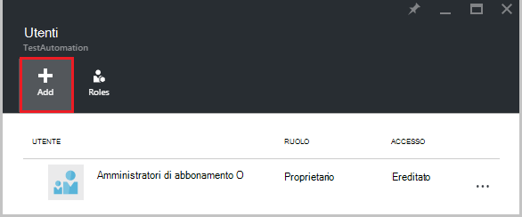  

2.  Selezionare un ruolo dall'elenco dei ruoli disponibili. Verrà scelto il ruolo di **lettore** , ma è possibile scegliere uno dei ruoli predefiniti disponibili che supporta un Account di automazione o qualsiasi ruolo personalizzato che potrebbe avere definito.  

    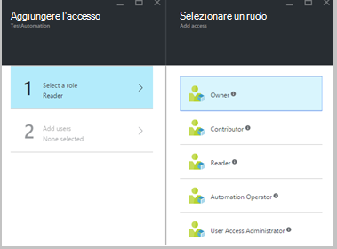  

3.  Fare clic su **Aggiungi utenti** per aprire e **l'aggiungere utenti** . Se sono stati aggiunti tutti gli utenti, gruppi o applicazioni per gestire l'abbonamento sono elencati gli utenti e sia possibile selezionarli per aggiungere l'accesso. Se non ci sono tutti gli utenti elencati o se l'utente che si desidera aggiungere non è elencato fare clic su **Invita** per aprire **Invita guest** e il, in cui è possibile invitare un utente con un indirizzo di posta elettronica Microsoft account, ad esempio Outlook.com, OneDrive o Xbox Live ID valido. Dopo aver immesso l'indirizzo di posta elettronica dell'utente, fare clic su **Seleziona** per aggiungere l'utente e quindi fare clic su **OK**. 

    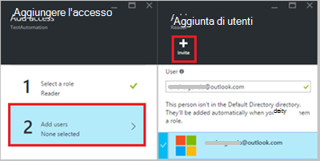  
 
    Verrà visualizzata all'utente di assegnato il ruolo di **lettore** aggiunte e **l'utenti** .  

      

    È inoltre possibile assegnare un ruolo all'utente da e il **ruoli** . 

1. Fare clic su **ruoli** e l'utenti per aprire **blade ruoli**. Da questa blade, è possibile visualizzare il nome del ruolo, il numero di utenti e gruppi assegnati a tale ruolo.

    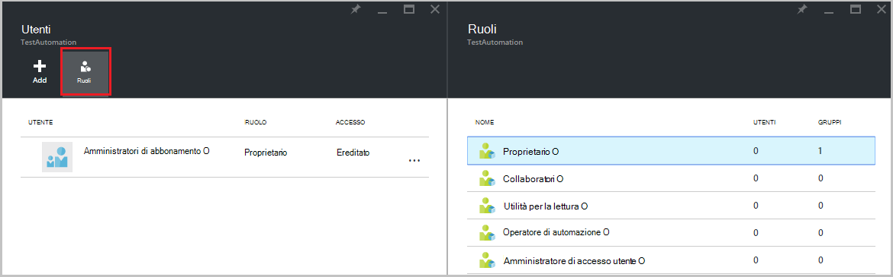  
   
    >[AZURE.NOTE] Controllo dell'accesso basato sui ruoli solo impostare il livello di Account di automazione e non a tutte le risorse sotto l'Account di automazione.

    È possibile assegnare più di un ruolo a un utente, gruppo o dell'applicazione. Ad esempio, se si aggiunge il ruolo di **Automazione operatore** insieme al **ruolo Lettore** all'utente, quindi è possibile visualizzare tutte le risorse di automazione, nonché eseguire i processi di runbook. È possibile espandere l'elenco a discesa per visualizzare un elenco di ruoli assegnati all'utente.  

    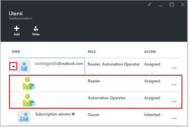  
 
### Rimuovere un utente

È possibile rimuovere l'autorizzazione di accesso per un utente che non gestisce l'Account di automazione o che non può essere utilizzato per l'organizzazione. Ecco la procedura per rimuovere un utente: 

1.  Selezionare l'assegnazione di ruolo che si desidera rimuovere e **l'utenti** .

2.  Fare clic sul pulsante **Rimuovi** e il dettagli delle assegnazioni.

3.  Fare clic su **Sì** per confermare la rimozione. 

    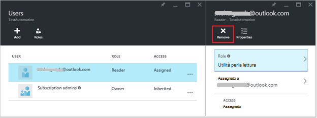  

## Ruolo utente assegnato

Quando un utente assegnato a un ruolo accede al proprio account di automazione, vedono a questo punto l'account del proprietario nell'elenco delle **Directory predefinite**. Per visualizzare l'account di automazione che sono stati aggiunti, la directory predefinita devono passare alla directory predefinite del proprietario.  

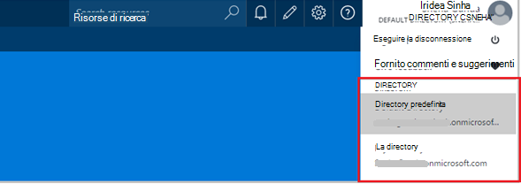  

### Esperienza utente per il ruolo di operatore di automazione

Quando un utente, che viene assegnato alle visualizzazioni ruolo operatore automazione l'account di automazione a che sono state assegnate, che può visualizzare l'elenco dei runbook, runbook processi e pianificazioni create in account automazione ma non è possibile visualizzare la definizione. Possono iniziare, interrompere, sospendere, riprendere o pianificare il processo di runbook. L'utente non avranno accesso ad altre risorse di automazione, ad esempio le configurazioni, gruppi di lavoro ibrido o nodi DSC.  

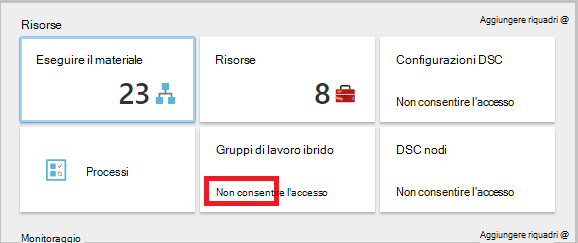  

Quando l'utente fa clic su dal runbook, i comandi per visualizzare l'origine o modificare dal runbook non sono disponibili come il ruolo di operatore di automazione non consente l'accesso agli stessi.  

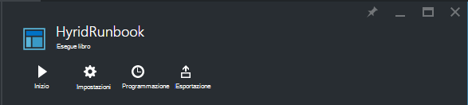  

L'utente avrà accesso consente di visualizzare e creare pianificazioni ma non avranno accesso a qualsiasi altro tipo di risorsa.  

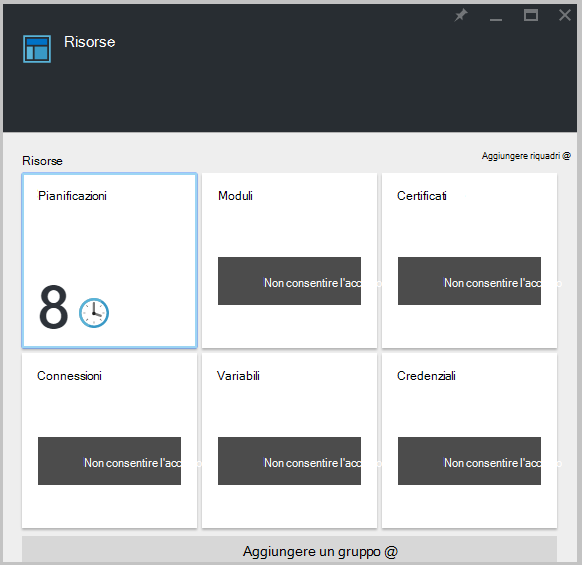  

L'utente non ha anche accesso per visualizzare webhooks associato a un runbook

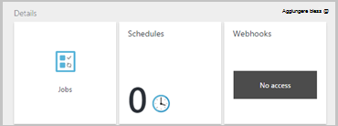  

## Configurare RBAC per l'Account di automazione tramite PowerShell Azure

Inoltre è possibile configurare l'accesso basato sui ruoli per un Account di automazione tramite i seguenti [cmdlet di PowerShell Azure](../active-directory/role-based-access-control-manage-access-powershell.md).

• [Get-AzureRmRoleDefinition](https://msdn.microsoft.com/library/mt603792.aspx) Elenca tutti i ruoli RBAC che sono disponibili in Azure Active Directory. È possibile utilizzare questo comando insieme la proprietà **Name** per visualizzare un elenco di tutte le azioni che possono essere eseguite da un ruolo specifico.  
    **Esempio:**  
    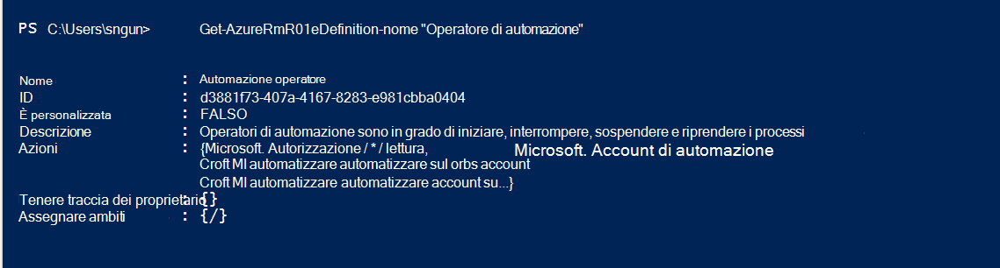  

• [Get-AzureRmRoleAssignment](https://msdn.microsoft.com/library/mt619413.aspx) Elenca le assegnazioni di ruolo Azure Active Directory RBAC nell'ambito specificato. Senza parametri, il comando restituisce tutte le assegnazioni di ruolo effettuate nell'ambito dell'abbonamento. Utilizzare il parametro **ExpandPrincipalGroups** alle assegnazioni di accesso di elenco per l'utente specificato, nonché i gruppi dell'utente è un membro di.  
    **Esempio:** Usare il comando seguente per visualizzare un elenco di tutti gli utenti e i relativi ruoli all'interno di un account di automazione.

    Get-AzureRMRoleAssignment -scope “/subscriptions/<SubscriptionID>/resourcegroups/<Resource Group Name>/Providers/Microsoft.Automation/automationAccounts/<Automation Account Name>” 

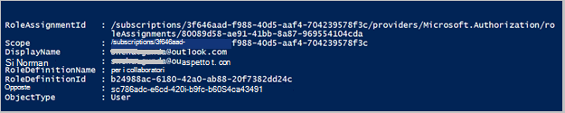

• [Nuovo AzureRmRoleAssignment](https://msdn.microsoft.com/library/mt603580.aspx) per consentire agli utenti, gruppi e alle applicazioni di un particolare ambito.  
    **Esempio:** Utilizzare il comando seguente per assegnare il ruolo "Automazione operatore" per un utente nell'ambito di automazione Account.

    New-AzureRmRoleAssignment -SignInName <sign-in Id of a user you wish to grant access> -RoleDefinitionName "Automation operator" -Scope “/subscriptions/<SubscriptionID>/resourcegroups/<Resource Group Name>/Providers/Microsoft.Automation/automationAccounts/<Automation Account Name>”  

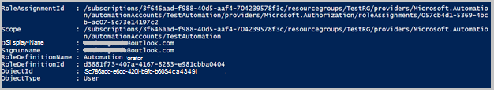

• Usare [AzureRmRoleAssignment Rimuovi](https://msdn.microsoft.com/library/mt603781.aspx) per rimuovere l'accesso di un utente specificato, gruppo o dell'applicazione di un particolare ambito.  
    **Esempio:** Utilizzare il comando seguente per rimuovere l'utente dal ruolo "Automazione operatore" nell'ambito di automazione Account.

    Remove-AzureRmRoleAssignment -SignInName <sign-in Id of a user you wish to remove> -RoleDefinitionName "Automation Operator" -Scope “/subscriptions/<SubscriptionID>/resourcegroups/<Resource Group Name>/Providers/Microsoft.Automation/automationAccounts/<Automation Account Name>”

Negli esempi precedenti, sostituire **effettuarlo Id** **abbonamento Id**, **nome gruppo di risorse** e **nome dell'account di automazione** con i dettagli dell'account. Scegliere **Sì** quando viene richiesto di confermare prima di continuare a rimuovere l'assegnazione di ruolo utente.   

## Passaggi successivi
-  Per informazioni sui diversi modi per configurare RBAC per automazione di Azure, vedere [gestire RBAC con PowerShell Azure](../active-directory/role-based-access-control-manage-access-powershell.md).
- Per informazioni dettagliate sui diversi modi per avviare un runbook, vedere [avvio un runbook](automation-starting-a-runbook.md)
- Per informazioni sui tipi di runbook diverso, fare riferimento ai [tipi di runbook automazione Azure](automation-runbook-types.md)

