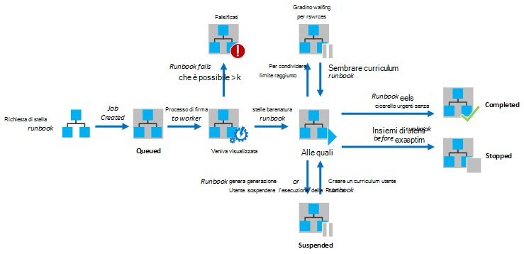
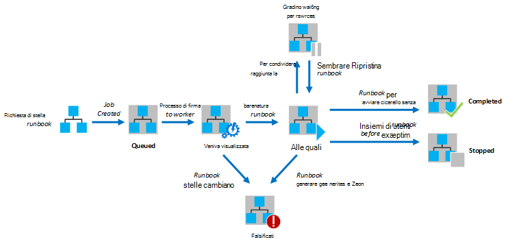

<properties
   pageTitle="Esecuzione runbook automazione Azure"
   description="Vengono illustrati i dettagli della modalità di elaborazione runbook di automazione di Azure."
   services="automation"
   documentationCenter=""
   authors="mgoedtel"
   manager="stevenka"
   editor="tysonn" />
<tags
   ms.service="automation"
   ms.devlang="na"
   ms.topic="article"
   ms.tgt_pltfrm="na"
   ms.workload="infrastructure-services"
   ms.date="03/21/2016"
   ms.author="bwren" />

# Esecuzione runbook automazione Azure

Quando si avvia un runbook in Azure automazione, viene creato un processo. Un processo è un'istanza singola esecuzione di una runbook. Un lavoro automazione Azure viene assegnata l'esecuzione di ogni processo. Mentre colleghi condivisi da più account Azure, processi da più account di automazione sono isolati da una a altra. Non è controllare il lavoro verrà richiesta per il processo di servizio.  Una singola runbook possono contenere più processi in esecuzione in una sola volta. Quando si visualizza l'elenco dei runbook nel portale di Azure, è elencato lo stato del processo di ultima che è stata avviata per ogni runbook. È possibile visualizzare l'elenco dei processi per ogni runbook per tenere traccia dello stato di ciascuno. Per una descrizione degli stati di processo diverso, vedere [Gli stati del processo](#job-statuses).

Nel diagramma seguente mostra il ciclo di vita di un processo runbook per [runbook grafica](automation-runbook-types.md#graphical-runbooks) e [runbook PowerShell del flusso di lavoro](automation-runbook-types.md#powershell-workflow-runbooks).

Nel diagramma seguente mostra il ciclo di vita di un processo runbook per [runbook PowerShell](automation-runbook-types.md#powershell-runbooks).

I processi avrà accesso alle risorse Azure effettuando una connessione al proprio abbonamento Azure. Sono solo avrà accesso alle risorse nel centro dati se le risorse sono accessibili dal cloud pubblico.

## Stati del processo

Nella tabella seguente vengono illustrati i diversi stati possibili per un processo.

| Stato| Descrizione|
|:---|:---|
|Completato|Durante il processo è stato completato correttamente.|
|Non è riuscito| Per [runbook grafiche e flusso di lavoro di PowerShell](automation-runbook-types.md)dal runbook non è riuscita.  Per [Script di PowerShell runbook](automation-runbook-types.md)dal runbook Impossibile avviare o il processo ha rilevato un'eccezione. |
|Non è riuscita, in attesa di risorse|Perché raggiunto il limite di [quota di](#fairshare) tre volte e iniziare dal punto di arresto stesso o dall'inizio dal runbook ogni volta che il processo.|
|In coda|Il processo è in attesa per le risorse in un lavoro automazione in arrivo disponibile in modo che possa essere avviato.|
|Avvio|Il processo è stato assegnato a un lavoro e il sistema è il processo di avvio.|
|Ripresa|Il sistema è in corso riprendere il processo dopo che è stato sospeso.|
|In esecuzione|Il processo è in esecuzione.|
|In esecuzione, in attesa di risorse|Il processo è stato scaricato perché ha raggiunto il limite di [quota](#fairshare) . Verrà ripresa breve dalla relativa verifica ultima.|
|Arrestato|Il processo è stata interrotta dall'utente prima del completamento.|
|Interruzione|Il sistema è in corso arrestare il processo.|
|Sospesa|Il processo è stato sospeso dall'utente, dal sistema o da un comando dal runbook. Un processo è sospesa può essere riavviato e verrà ripresa dall'ultimo punto di controllo o dall'inizio dal runbook eventuale senza punti di controllo. Dal runbook verrà sospeso solo dal sistema in caso di un'eccezione. Per impostazione predefinita, ErrorActionPreference è impostata su **Continua** che significa che il processo verrà eseguiti su un errore. Se questa variabile di preferenza è impostata per **interrompere** il processo verrà sospendere su un errore.  Si applica solo a [runbook grafiche e PowerShell del flusso di lavoro](automation-runbook-types.md) .|
|Sospensione|Il sistema sta tentando di sospendere il processo su richiesta dell'utente. Dal runbook necessario raggiungere la verifica successiva prima che può essere sospeso. Se è già trascorsa l'ultimo punto di controllo, esso verrà completata prima che può essere sospeso.  Si applica solo a [runbook grafiche e PowerShell del flusso di lavoro](automation-runbook-types.md) .|

## Visualizzare lo stato dei processi tramite il portale di gestione di Azure

### Dashboard di automazione

Dashboard di automazione contiene un riepilogo di tutti i runbook per un account di automazione specifico. Include inoltre una panoramica sull'utilizzo dell'account. Riepilogo grafico mostra il numero di processi totali per tutti i runbook immesso ogni stato di un numero specificato di giorni o ore. È possibile selezionare l'intervallo di tempo nell'angolo superiore destro del grafico. Asse del tempo del grafico verrà modificate in base al tipo di intervallo di tempo selezionato. È possibile scegliere se visualizzare la riga per un determinato stato facendo clic su di esso nella parte superiore della schermata.

È possibile utilizzare la procedura seguente per visualizzare il Dashboard di automazione.

1. Nel portale di gestione di Azure, selezionare **automazione** e quindi fare clic sul nome di un account di automazione.
1. Selezionare la scheda **Dashboard** .

### Dashboard runbook

Dashboard di Runbook Mostra un riepilogo di una singola runbook. Riepilogo grafico mostra il numero di processi totali per runbook immesso ogni stato di un numero specificato di giorni o ore. È possibile selezionare l'intervallo di tempo nell'angolo superiore destro del grafico. Asse del tempo del grafico verrà modificate in base al tipo di intervallo di tempo selezionato. È possibile scegliere se visualizzare la riga per un determinato stato facendo clic su di esso nella parte superiore della schermata.

È possibile utilizzare la procedura seguente per visualizzare il Runbook Dashboard.

1. Nel portale di gestione di Azure, selezionare **automazione** e quindi fare clic sul nome di un account di automazione.
1. Fare clic sul nome di un runbook.
1. Selezionare la scheda **Dashboard** .

### Riepilogo

È possibile visualizzare un elenco di tutti i processi che sono stati creati per una particolare runbook e il relativo stato più recente. È possibile filtrare questo elenco in base allo stato di processo e l'intervallo di date per l'ultima modifica al processo. Fare clic sul nome di una posizione per visualizzare le relative informazioni dettagliate e il relativo output. Visualizzazione dettagliata del processo include i valori per i parametri runbook che sono stati forniti al processo.

È possibile utilizzare la procedura seguente per visualizzare i processi per un runbook.

1. Nel portale di gestione di Azure, selezionare **automazione** e quindi fare clic sul nome di un account di automazione.
1. Fare clic sul nome di un runbook.
1. Selezionare la scheda **processi** .
1. Fare clic sulla colonna **Creato processo** per una posizione per visualizzare i dettagli e l'output.

## Recupero lo stato dei processi usando Windows PowerShell

È possibile utilizzare [Get-AzureAutomationJob](http://msdn.microsoft.com/library/azure/dn690263.aspx) per recuperare i processi creati per un runbook e i dettagli di un determinato processo. Se si inizia un runbook con Windows PowerShell utilizzando [AzureAutomationRunbook inizio](http://msdn.microsoft.com/library/azure/dn690259.aspx), verrà restituito il processo risultante. Utilizzare [Get-AzureAutomationJob](http://msdn.microsoft.com/library/azure/dn690263.aspx)Output per ottenere l'output del processo.

I comandi di esempio seguente recupera l'ultimo processo per un esempio di runbook e visualizza lo stato, forniscano i valori per i parametri runbook e l'output dal processo.

    $job = (Get-AzureAutomationJob –AutomationAccountName "MyAutomationAccount" –Name "Test-Runbook" | sort LastModifiedDate –desc)[0]
    $job.Status
    $job.JobParameters
    Get-AzureAutomationJobOutput –AutomationAccountName "MyAutomationAccount" -Id $job.Id –Stream Output

## Quota

Per condividere risorse tra tutti runbook nel cloud, automazione di Azure temporaneamente scaricare qualsiasi processo dopo che è stata eseguita per 3 ore.    Runbook [grafiche](automation-runbook-types.md#graphical-runbooks) e [PowerShell del flusso di lavoro](automation-runbook-types.md#powershell-workflow-runbooks) verrà ripresa dal loro ultimo [punto di controllo](http://technet.microsoft.com/library/dn469257.aspx#bk_Checkpoints). Durante questo periodo, il processo verrà visualizzato lo stato è in esecuzione, in attesa di risorse. Se il processo non ha raggiunto il primo punto di controllo prima che viene scaricato dal runbook non è punti di controllo oppure verrà riavviato dall'inizio.  [PowerShell](automation-runbook-types.md#powershell-runbooks) runbook sempre si riavvia dall'inizio dal momento che non supportano i punti di controllo.

>[AZURE.NOTE] Il limite di quota non è applicabile ai processi runbook in esecuzione su ibrida Runbook colleghi.

Se dal runbook Riavvia dal punto di arresto stesso o dall'inizio dal runbook tre volte consecutive, viene interrotta con lo stato non riuscito, in attesa di risorse. In modo da impedire runbook eseguito all'infinito senza completare, in quanto non sono apportare alla successiva verifica senza rottura nuovamente. In questo caso, si riceverà l'eccezione seguente con l'errore.

*Il processo non è possibile continuare a utilizzare poiché è stata ripetutamente rimosso dalla stessa verifica. Verificare che il Runbook non esegue operazioni di lunga durata senza mantenere il relativo stato.*

Quando si crea un runbook, è necessario assicurarsi che il tempo necessario per eseguire qualsiasi attività tra due punti di controllo non superare i 3 ore. Potrebbe essere necessario aggiungere punti di controllo per il runbook per garantire che non raggiunto questo limite massimo di 3 ore o suddividere lungo esecuzione delle operazioni. Ad esempio, il runbook potrebbero eseguire reindicizzazione in un database SQL di grandi dimensioni. Se questa operazione singola non viene completata entro il limite di quota, il processo verrà scaricato e si riavvia dall'inizio. In questo caso, si deve suddividere l'operazione di reindicizzazione in più passaggi, ad esempio la reindicizzazione di una tabella alla volta e quindi inserire un punto di controllo dopo ogni operazione in modo che il processo potrebbe riprendere dopo l'ultima operazione al completamento.

## Passaggi successivi

- [A partire da un runbook automazione Azure](automation-starting-a-runbook.md)
