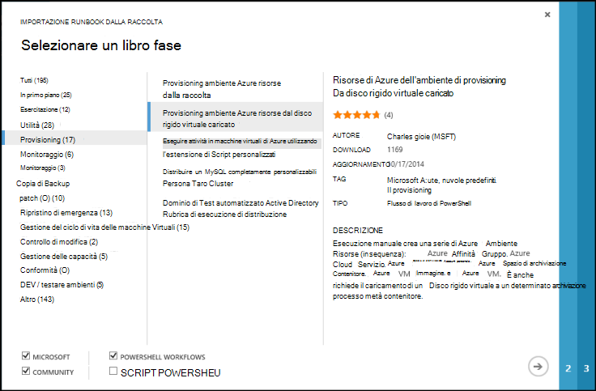
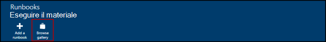
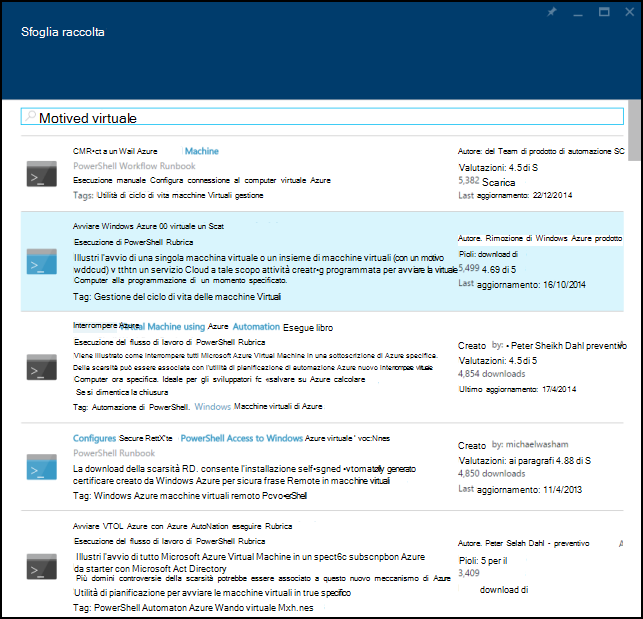
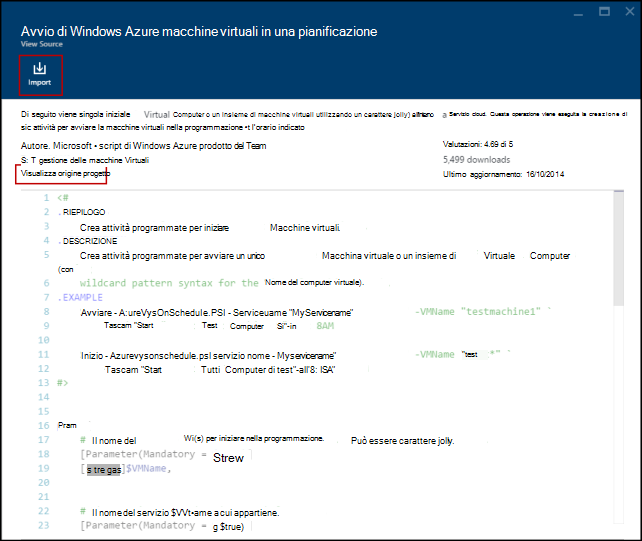
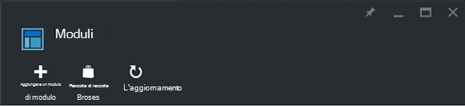
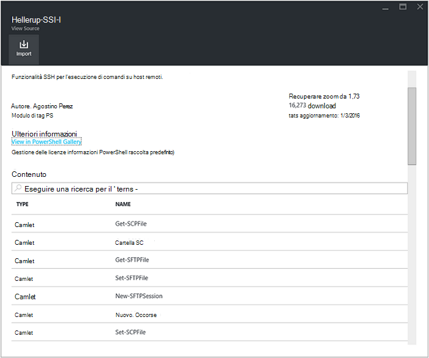
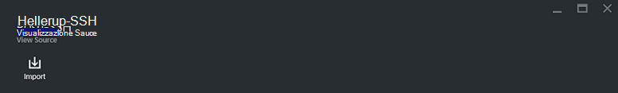
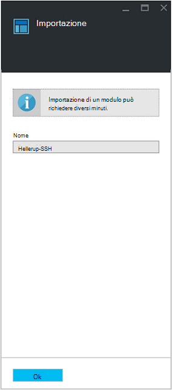

<properties
    pageTitle="Le raccolte di runbook e modulo per l'automazione di Azure | Microsoft Azure"
    description="Sono disponibili per l'installazione e utilizzo, nell'ambiente Azure automazione runbook e moduli da Microsoft e dalla community.  In questo articolo viene illustrato come accedere a queste risorse e di collaborazione i runbook nella raccolta."
    services="automation"
    documentationCenter=""
    authors="mgoedtel"
    manager="jwhit"
    editor="tysonn" />
<tags
    ms.service="automation"
    ms.devlang="na"
    ms.topic="article"
    ms.tgt_pltfrm="na"
    ms.workload="infrastructure-services"
    ms.date="09/18/2016"
    ms.author="magoedte;bwren" />

# Raccolte di runbook e modulo per l'automazione di Azure

Anziché creare runbook e moduli personalizzati in Azure automazione, è possibile accedere diversi scenari che già creati da Microsoft e alla community.  È possibile utilizzare questi scenari senza alcuna modifica oppure è possibile usarli come punto di partenza e modificarli per specifiche esigenze.

È possibile ottenere runbook dalla [Raccolta Runbook](#runbooks-in-runbook-gallery) e moduli della [Raccolta di PowerShell](#modules-in-powerShell-gallery).  Può contribuire alla community di condividendo scenari che si sviluppano.

## Runbook nella raccolta Runbook

La [Raccolta Runbook](http://gallery.technet.microsoft.com/scriptcenter/site/search?f[0].Type=RootCategory&f[0].Value=WindowsAzure&f[1].Type=SubCategory&f[1].Value=WindowsAzure_automation&f[1].Text=Automation) fornisce una varietà di runbook da Microsoft e dalla community che è possibile importare in automazione Azure. È possibile possibile scaricare un runbook dalla raccolta ospitato in [TechNet Script Center](http://gallery.technet.microsoft.com/)oppure è possibile importare runbook direttamente dalla raccolta dal portale classica Azure o portale Azure.

È possibile importare solo direttamente dalla raccolta Runbook tramite il portale di classica Azure e Azure portale. È possibile eseguire questa funzione usando Windows PowerShell.

>[AZURE.NOTE] È necessario convalidare il contenuto di qualsiasi runbook ottenere dalla raccolta Runbook e attenzione nell'installazione e la loro esecuzione in un ambiente di produzione. |

### Per importare un runbook dalla raccolta Runbook con il portale classico Azure

1. Nel portale di Azure fare clic su, **New**, **App Services**, **automazione**, **Runbook**, **Dalla raccolta**.
2. Selezionare una categoria per visualizzare runbook correlati e quindi runbook per visualizzarne i dettagli. Quando si seleziona runbook desiderato, fare clic sul pulsante freccia destra.

    

3. Esaminare il contenuto dal runbook e prendere nota requisiti nella descrizione. Al termine, fare clic sul pulsante freccia destra.
4. Immettere i dettagli runbook e quindi fare clic sul pulsante di segno di spunta. Il nome runbook già essere compilato.
5. Dal runbook verrà visualizzata la scheda **runbook** per l'Account di automazione.

### Per importare un runbook dalla raccolta Runbook con il portale di Azure

1. Nel portale di Azure, aprire l'account di automazione.
2. Fare clic sul riquadro **runbook** per aprire l'elenco di runbook.
3. Fare clic su pulsante **Sfoglia raccolta** .

    

4. Individuare l'elemento della raccolta che si desidera e selezionarlo per visualizzarne i dettagli.

    

4. Fare clic su **progetto di origine di visualizzazione** per visualizzare l'elemento in [TechNet Script Center](http://gallery.technet.microsoft.com/).
5. Per importare un elemento, fare clic su di essa per visualizzarne i dettagli e quindi fare clic sul pulsante **Importa** .

    

6. Facoltativamente, è possibile modificare il nome di dal runbook e quindi fare clic su **OK** per importare dal runbook.
5. Dal runbook verrà visualizzata la scheda **runbook** per l'Account di automazione.

### Aggiunta di un runbook nella raccolta runbook

Microsoft consiglia di aggiungere runbook nella raccolta Runbook che si ritiene possano essere utili per gli altri utenti.  È possibile aggiungere un runbook per [caricarlo all'interfaccia di Script](http://gallery.technet.microsoft.com/site/upload) prendere in considerazione quanto segue.

- È necessario specificare *Windows Azure* per la **categoria** e *automazione* della **sottocategoria** dal runbook da visualizzare nella procedura guidata.  

- Il caricamento deve essere un singolo file ps1 o .graphrunbook.  Se dal runbook richiede qualsiasi moduli, runbook figlio o risorse, è consigliabile elencare quelli nella descrizione dell'inoltro e nella sezione commenti dal runbook.  Se si dispone di uno scenario che richiedono più runbook, caricare ogni separatamente ed elencare i nomi dei runbook correlati in ognuna delle relative descrizioni. Assicurarsi che utilizzare gli stessi tag in modo che verranno visualizzati nella stessa categoria. Sarà necessario un utente di leggere la descrizione in modo che altri runbook sono necessari lo scenario per l'uso.

- Aggiungere il contrassegno "GraphicalPS" Se si pubblica un **grafico runbook** (non un flusso di lavoro con interfaccia grafica). 

- Inserire la descrizione facendo clic sull'icona **Inserisci sezione di codice** PowerShell o del flusso di lavoro di PowerShell frammento di codice.

- Verrà visualizzato il riepilogo per il caricamento nei risultati della raccolta Runbook in modo che è necessario fornire informazioni dettagliate che consenta di identificare un utente la funzionalità dal runbook.

- È necessario assegnare uno a tre tag seguenti per il caricamento.  Dal runbook verrà elencato nella creazione guidata in categorie che soddisfano i tag.  Verranno ignorati eventuali tag non incluso nell'elenco tramite la procedura guidata. Se non viene specificato alcun tag corrispondente, dal runbook sarà elencato in due categorie.

 - Copia di backup
 - Gestione delle capacità
 - Controllo di modifica
 - Conformità
 - DEV / ambienti di prova
 - Ripristino di emergenza
 - Monitoraggio
 - Patch
 - Il provisioning
 - Monitoraggio e aggiornamento
 - Gestione del ciclo di vita delle macchine Virtuali

- Una volta all'ora, automazione Aggiorna la raccolta, in modo da non è possibile vedere immediatamente i contributi.

## Moduli nella raccolta di PowerShell

Moduli di PowerShell contengano cmdlet che è possibile utilizzare il runbook moduli esistenti che è possibile installare in Azure automazione sono disponibili nella [Raccolta di PowerShell](http://www.powershellgallery.com).  È possibile avviare questa raccolta dal portale di Azure e installarli direttamente in Azure automazione oppure è possibile scaricarli e installarli manualmente.  Non è possibile installare i moduli direttamente dal portale di classica Azure, ma è possibile scaricare installarli come si farebbe con qualsiasi altro modulo.

### Per importare un modulo nella raccolta di modulo di automazione con il portale di Azure

1. Nel portale di Azure, aprire l'account di automazione.
2. Fare clic sul riquadro **attività** per aprire l'elenco delle risorse.
3. Fare clic sul riquadro **moduli** per aprire l'elenco dei moduli.
4. Fare clic sul pulsante **Sfoglia raccolta** e viene avviato e il raccolta Sfoglia.

      
5. Dopo avere avviato e il raccolta Sfoglia, è possibile eseguire ricerche i campi seguenti:

   - Nome del modulo
   - Tag
   - Autore
   - Nome risorsa cmdlet/DSC

6. Individuare un modulo che si è interessati a e selezionarlo per visualizzarne i dettagli.  
Quando si analizza un modulo specifico, è possibile visualizzare ulteriori informazioni sul modulo, incluso un collegamento alla raccolta PowerShell qualsiasi obbligatoria dipendenze e tutti i cmdlet e/o risorse DSC contenente il modulo.

      

7. Per installare il modulo direttamente in Azure automazione, fare clic sul pulsante **Importa** .

    

8. Quando si fa clic sul pulsante Importa, verrà visualizzato il nome del modulo che si desidera importare. Se sono installate tutte le dipendenze, il pulsante **OK** sarà attivo. Se manca dipendenze, è necessario essere importate prima di poter importare questo modulo.
9. Fare clic su **OK** per importare il modulo e verrà avviato e il modulo. Quando l'automazione Azure Importa un modulo al proprio account, estrae i metadati sul modulo e i cmdlet.

    

    Operazione potrebbe richiedere un paio di minuti dopo ogni attività deve essere estratto.
10. Si riceverà una notifica che viene distribuito il modulo e una notifica quando è stata completata.
11. Una volta importato il modulo, si vedrà le attività disponibili ed è possibile utilizzare le risorse nel runbook e lo si desidera configurazione dello stato.

## Richiesta di un modulo o runbook

È possibile inviare richieste a [Utenti vocali](https://feedback.azure.com/forums/246290-azure-automation/).  Se è necessario consentire la scrittura di un runbook o domande su PowerShell, pubblicare una domanda al [forum](http://social.msdn.microsoft.com/Forums/windowsazure/en-US/home?forum=azureautomation&filter=alltypes&sort=lastpostdesc).

## Passaggi successivi

- Per iniziare a utilizzare runbook, vedere [creazione o importazione runbook di automazione di Azure](automation-creating-importing-runbook.md)
- Per comprendere le differenze tra PowerShell e flusso di lavoro di PowerShell runbook, vedere [flusso di lavoro di PowerShell di risorse](automation-powershell-workflow.md)
