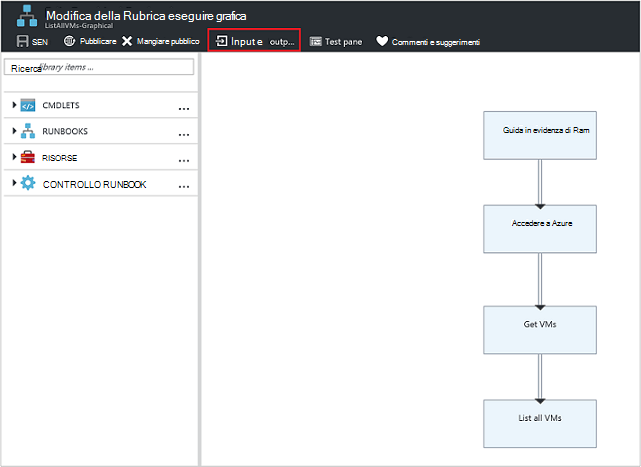

<properties
   pageTitle="Parametri di input runbook | Microsoft Azure"
   description="Parametri di input runbook aumentano la flessibilità di runbook che consente di passare dati a un runbook all'avvio. In questo articolo vengono illustrati i diversi scenari in cui vengono utilizzati i parametri di input in runbook."
   services="automation"
   documentationCenter=""
   authors="MGoedtel"
   manager="jwhit"
   editor="tysonn" />
<tags
   ms.service="automation"
   ms.devlang="na"
   ms.topic="article"
   ms.tgt_pltfrm="na"
   ms.workload="infrastructure-services"
   ms.date="10/11/2016"
   ms.author="sngun"/>

# <a name="runbook-input-parameters"></a>Parametri di input runbook

Parametri di input runbook aumentano la flessibilità di runbook consente di passare dati all'avvio. I parametri consentono azioni runbook di destinazione per gli ambienti e scenari specifici. In questo articolo è consentono all'utente diversi scenari in cui vengono utilizzati i parametri di input in runbook.

## <a name="configure-input-parameters"></a>Configurare i parametri di input

Parametri di input possono essere configurati in PowerShell, PowerShell del flusso di lavoro e runbook grafica. Un runbook possono contenere più parametri con diversi tipi di dati o nessun parametri tutto. Parametri di input possono essere obbligatori o facoltativi ed è possibile assegnare un valore predefinito per i parametri facoltativi. È possibile assegnare i valori per i parametri di input per un runbook quando si inizia a uno dei metodi disponibili. Questi metodi includono partire un runbook dal portale di o un servizio web. È anche possibile avviare una come un runbook figlio chiamato all'interno del testo in un'altra runbook.

## <a name="configure-input-parameters-in-powershell-and-powershell-workflow-runbooks"></a>Configurare i parametri di input in runbook PowerShell e flusso di lavoro di PowerShell

PowerShell e [flusso di lavoro di PowerShell runbook](automation-first-runbook-textual.md) in Azure automazione supportano parametri di input che vengono definiti tramite gli attributi seguenti.  

| **Proprietà** | **Descrizione** |
|:--- |:---|
| Tipo | Obbligatorio. Il tipo di dati previsto per il valore del parametro. Qualsiasi tipo .NET è valido. |
| Nome | Obbligatorio. Il nome del parametro. Questo deve essere univoco all'interno di dal runbook e possono contenere solo lettere, numeri o caratteri di sottolineatura. Deve iniziare con una lettera. |
| Obbligatorio | Facoltativo. Specifica se è necessario specificare un valore per il parametro. Se è impostata su **$true**, quindi specificare un valore deve quando viene avviato dal runbook. Se è impostata su **$false**, un valore è facoltativo. |
| Valore predefinito | Facoltativo.  Specifica un valore che verrà utilizzato per il parametro se un valore non sia stato passato quando viene avviato dal runbook. Un valore predefinito è possibile impostare per tutti i parametri e renderà automaticamente il parametro facoltativo indipendentemente dalle impostazione obbligatoria. |

Windows PowerShell supporta più attributi dei parametri di input rispetto a quelle elencate di seguito, ad esempio la convalida, alias, e set di parametro. Tuttavia, l'automazione Azure supporta attualmente solo i parametri di input elencati sopra.

Definizione di un parametro nel flusso di lavoro di PowerShell runbook ha il seguente formato generale, in cui più parametri sono separati da virgole.

   ```
     Param
     (
         [Parameter (Mandatory= $true/$false)]
         [Type] Name1 = <Default value>,

         [Parameter (Mandatory= $true/$false)]
         [Type] Name2 = <Default value>
     )
   ```

>[AZURE.NOTE] Quando si definisce parametri, se non viene specificato l'attributo **obbligatorio** , per impostazione predefinita, il parametro viene considerato facoltativo. Inoltre, se si imposta un valore predefinito per un parametro nel flusso di lavoro di PowerShell runbook, verrà considerato da PowerShell come un parametro facoltativo, indipendentemente dal valore dell'attributo **obbligatorio** .

Se ad esempio possibile configurare i parametri di input per runbook un flusso di lavoro di PowerShell che restituisce informazioni dettagliate su macchine virtuali, una macchina virtuale singola o tutte le macchine virtuali all'interno di un gruppo di risorse. Questo runbook con due parametri come illustrato nella schermata seguente: il nome della macchina virtuale e il nome del gruppo di risorse.


In questo parametro definizione, i parametri **$VMName** e **$resourceGroupName** sono parametri semplici di tipo stringa. Tuttavia, runbook PowerShell e flusso di lavoro di PowerShell supporta tutti i tipi semplici e i tipi complessi, ad esempio **oggetto** o **PSCredential** per parametri di input.

Se il runbook include un parametro di input di tipo di oggetto, quindi usare hashtable PowerShell con (nome, valore) coppie di parole per passare un valore. Ad esempio, se si dispone di parametro seguente in un runbook:

     [Parameter (Mandatory = $true)]
     [object] $FullName

Per il parametro è possibile passare il valore seguente:

    @{"FirstName"="Joe";"MiddleName"="Bob";"LastName"="Smith"}


## <a name="configure-input-parameters-in-graphical-runbooks"></a>Configurare i parametri di input in runbook grafica

Per [configurare un runbook grafici](automation-first-runbook-graphical.md) con parametro di input, si supponga di creare un grafico runbook che restituisce informazioni dettagliate su macchine virtuali, una macchina virtuale singola o tutte le macchine virtuali all'interno di un gruppo di risorse. Configurare un runbook è costituito da due attività principali, come descritto di seguito.

[**Eseguire l'autenticazione runbook con account Azure Esegui come**](automation-sec-configure-azure-runas-account.md) eseguire l'autenticazione con Azure.

[**Get-AzureRmVm**](https://msdn.microsoft.com/library/mt603718.aspx) per ottenere le proprietà di un macchine virtuali.

È possibile utilizzare l'attività di [**Output di scrittura**](https://technet.microsoft.com/library/hh849921.aspx) per generare l'output i nomi delle macchine virtuali. Attività **Get-AzureRmVm** accetta due parametri, il **nome del computer virtuale** e il **nome del gruppo di risorse**. Poiché questi parametri potrebbero richiedere diversi valori ogni volta che si avvia dal runbook, è possibile aggiungere parametri di input per i runbook. Ecco i passaggi per aggiungere parametri di input:

1. Selezionare dal runbook grafico e il **runbook** e quindi fare clic su [**Modifica**](automation-graphical-authoring-intro.md) in.

2. Tramite l'editor runbook, fare clic su **Input e output** per aprire e il **Input e output** .

    

3. E il **Input e output** Visualizza un elenco dei parametri di input definiti per il runbook. In questo blade, aggiungere un nuovo parametro di input o modificare la configurazione di un parametro di input esistente. Per aggiungere un nuovo parametro per dal runbook, fare clic su **Aggiungi input** per aprire e il **parametro di input Runbook** . Non esiste, è possibile configurare i parametri seguenti:

  	| **Proprietà** | **Descrizione** |
  	|:--- |:---|
  	| Nome | Obbligatorio.  Il nome del parametro. Questo deve essere univoco all'interno di dal runbook e possono contenere solo lettere, numeri o caratteri di sottolineatura. Deve iniziare con una lettera. |
  	| Descrizione | Facoltativo. Descrizione lo scopo del parametro di input. |
  	| Tipo | Facoltativo. Tipo di dati previsto per il valore del parametro. Tipi di parametro supportati sono **stringa**, **Int32**, **Int64**, **Decimal**, **Boolean**, **DateTime**e **oggetto**. Se non si seleziona un tipo di dati, l'impostazione predefinita in **stringa**. |
  	| Obbligatorio | Facoltativo. Specifica se è necessario specificare un valore per il parametro. Se si sceglie **Sì**, quindi un valore deve essere fornito quando viene avviato dal runbook. Se si sceglie di **non**, quindi un valore non è richiesto quando viene avviato dal runbook e può essere impostato un valore predefinito. |
  	| Valore predefinito | Facoltativo. Specifica un valore che verrà utilizzato per il parametro se un valore non sia stato passato quando viene avviato dal runbook. Per un parametro che non sia obbligatorio, è possibile impostare un valore predefinito. Per impostare un valore predefinito, scegliere **personalizzato**. Questo valore viene utilizzato a meno che non viene specificato un altro valore quando viene avviato dal runbook. Se non si desidera fornire qualsiasi valore predefinito, scegliere **Nessuno** . |  

    

4. Creare due parametri con le proprietà seguenti che verranno utilizzate dall'attività **Get-AzureRmVm** :

    - **Parametro1:**
      - Nome - VMName
      - Tipo - stringa
      - Obbligatorio - n

    - **Parametro2:**
      - Nome - resourceGroupName
      - Tipo - stringa
      - Obbligatorio - n
      - Valore predefinito - personalizzato
      - Immettere un valore personalizzato - \<nome del gruppo di risorse contenente le macchine virtuali >

5. Dopo aver aggiunto i parametri, fare clic su **OK**.  È ora possibile visualizzarle nel **Input e output blade**. Fare di nuovo clic su **OK** e quindi fare clic su **Salva** e **pubblica** il runbook.

## <a name="assign-values-to-input-parameters-in-runbooks"></a>Assegnare i valori per i parametri in runbook di input

È possibile passare valori ai parametri in runbook negli scenari seguenti di input.

### <a name="start-a-runbook-and-assign-parameters"></a>Avviare un runbook e assegnare parametri

È possibile avviare un runbook molti modi: tramite il portale di Azure, con un webhook, con i cmdlet di PowerShell, con l'API REST o con SDK. Di seguito vengono illustrati diversi metodi per avviare un runbook e l'assegnazione di parametri.

#### <a name="start-a-published-runbook-by-using-the-azure-portal-and-assign-parameters"></a>Avviare un runbook pubblicato tramite il portale Azure e assegnare parametri

Quando si [Avvia dal runbook](automation-starting-a-runbook.md#starting-a-runbook-with-the-azure-portal), viene aperto e il **Runbook avviare** e configurare i valori dei parametri appena creata.


Nell'etichetta sotto la casella di input, è possibile visualizzare gli attributi che sono stati impostati per il parametro. Gli attributi includono obbligatorio o facoltativo, tipo e valore predefinito. Nell'area della Guida accanto al nome del parametro, è possibile visualizzare tutte le informazioni chiave da prendere decisioni sui valori di input di parametro. Queste informazioni includono un parametro è obbligatorio o facoltativo. Include inoltre il tipo e valore predefinito (se presente) e altre note utili.


>[AZURE.NOTE] Parametri di tipo stringa supportano valori stringa **vuota** .  L'immissione di **[stringa vuota]** nella casella parametro di input passerà una stringa vuota per il parametro. Inoltre, i parametri di tipo stringa non supportano i valori **Null** passati. Se si non passa qualsiasi valore per il parametro di stringa, quindi PowerShell visualizzerà tale come null.

#### <a name="start-a-published-runbook-by-using-powershell-cmdlets-and-assign-parameters"></a>Avviare un runbook pubblicato utilizzando i cmdlet di PowerShell e assegnare parametri

  - **Cmdlet per la gestione di risorse azure:** È possibile avviare un runbook automazione che è stato creato in un gruppo di risorse utilizzando [AzureRmAutomationRunbook Start](https://msdn.microsoft.com/library/mt603661.aspx).

    **Esempio:**

   ```
    $params = @{“VMName”=”WSVMClassic”;”resourceGroupeName”=”WSVMClassicSG”}
 
    Start-AzureRmAutomationRunbook -AutomationAccountName “TestAutomation” -Name “Get-AzureVMGraphical” –ResourceGroupName $resourceGroupName -Parameters $params
   ```

  - **Cmdlet per la gestione dei servizi di azure:** È possibile avviare un runbook automazione che è stato creato in un gruppo di risorse predefinito utilizzando [AzureAutomationRunbook Start](https://msdn.microsoft.com/library/dn690259.aspx).

    **Esempio:**

   ```
    $params = @{“VMName”=”WSVMClassic”; ”ServiceName”=”WSVMClassicSG”}

    Start-AzureAutomationRunbook -AutomationAccountName “TestAutomation” -Name “Get-AzureVMGraphical” -Parameters $params
   ```

>[AZURE.NOTE] Quando si avvia un runbook utilizzando i cmdlet di PowerShell, un parametro predefinito, **MicrosoftApplicationManagementStartedBy** viene creato con il valore di **PowerShell**. È possibile visualizzare questo parametro e il **Dettagli dei processi** .  

#### <a name="start-a-runbook-by-using-an-sdk-and-assign-parameters"></a>Avviare un runbook utilizzando un SDK e assegnare parametri

  - **Manager delle risorse azure metodo:** È possibile iniziare una runbook tramite SDK di un linguaggio di programmazione. Di seguito è un frammento di codice c# per iniziare a creare un runbook nell'account di automazione. È possibile visualizzare tutto il codice al nostro [GitHub archivio](https://github.com/Azure/azure-sdk-for-net/blob/master/src/ResourceManagement/Automation/Automation.Tests/TestSupport/AutomationTestBase.cs).  

   ```
     public Job StartRunbook(string runbookName, IDictionary<string, string> parameters = null)
        {
          var response = AutomationClient.Jobs.Create(resourceGroupName, automationAccount, new JobCreateParameters
           {
              Properties = new JobCreateProperties
               {
                  Runbook = new RunbookAssociationProperty
                   {
                     Name = runbookName
                   },
                     Parameters = parameters
               }
           });
        return response.Job;
        }
   ```

  - **Metodo di gestione dei servizi di azure:** È possibile iniziare una runbook tramite SDK di un linguaggio di programmazione. Di seguito è un frammento di codice c# per iniziare a creare un runbook nell'account di automazione. È possibile visualizzare tutto il codice al nostro [GitHub archivio](https://github.com/Azure/azure-sdk-for-net/blob/master/src/ServiceManagement/Automation/Automation.Tests/TestSupport/AutomationTestBase.cs).

   ```      
    public Job StartRunbook(string runbookName, IDictionary<string, string> parameters = null)
      {
        var response = AutomationClient.Jobs.Create(automationAccount, new JobCreateParameters
      {
        Properties = new JobCreateProperties
           {
             Runbook = new RunbookAssociationProperty
           {
             Name = runbookName
                },
                  Parameters = parameters
                }
         });
        return response.Job;
      }
   ```

  Per iniziare a questo metodo, creare un dizionario per archiviare i parametri runbook, **VMName** e **resourceGroupName**e i rispettivi valori. Iniziare dal runbook. Di seguito è il frammento di codice c# per chiamare il metodo viene definito in precedenza.

   ```
    IDictionary<string, string> RunbookParameters = new Dictionary<string, string>();

    // Add parameters to the dictionary.
    RunbookParameters.Add("VMName", "WSVMClassic");
    RunbookParameters.Add("resourceGroupName", "WSSC1");

    //Call the StartRunbook method with parameters
    StartRunbook(“Get-AzureVMGraphical”, RunbookParameters);
   ```

#### <a name="start-a-runbook-by-using-the-rest-api-and-assign-parameters"></a>Avviare un runbook tramite l'API REST e assegnare parametri

Un processo runbook può essere creato e avviato con l'API REST di automazione Azure utilizzando il metodo di **inserire** con la richiesta seguente URI.

    https://management.core.windows.net/<subscription-id>/cloudServices/<cloud-service-name>/resources/automation/~/automationAccounts/<automation-account-name>/jobs/<job-id>?api-version=2014-12-08`

Nella convocazione di URI, sostituire i parametri seguenti:

  - **id abbonamento:** L'ID di abbonamento Azure.  
  - **nome di servizio cloud:** Il nome del servizio cloud a cui deve essere inviata la richiesta.  
  - **nome dell'account automazione:** Il nome del proprio account di automazione ospitato all'interno del servizio cloud specificato.  
  - **id di processo:** GUID per il processo. GUID PowerShell possono essere create usando **[GUID]::NewGuid(). ToString ()** comando.

Per passare i parametri per il processo di runbook, utilizzare il corpo della richiesta. Richiede due seguenti proprietà fornite in formato JSON:

  - **Nome Runbook:** Obbligatorio. Nome runbook per avviare il processo.  
  - **Parametri Runbook:** Facoltativo. Un dizionario dell'elenco dei parametri in (nome, valore) formattare dove nome deve essere di tipo stringa e può essere qualsiasi valore JSON valido.

Se si desidera iniziare dal runbook **Get-AzureVMTextual** creato in precedenza con **VMName** e **resourceGroupName** come parametri, usare il seguente formato JSON per il corpo della richiesta.

   ```
    {
      "properties":{
        "runbook":{
        "name":"Get-AzureVMTextual"},
      "parameters":{
         "VMName":"WSVMClassic",
         "resourceGroupName":”WSCS1”}
        }
    }
   ```

Se il processo è stato creato correttamente, viene restituito un codice di stato HTTP 201. Per ulteriori informazioni su intestazioni di risposta e il corpo della risposta, consultare l'articolo su come [creare un processo runbook tramite l'API REST.](https://msdn.microsoft.com/library/azure/mt163849.aspx)

### <a name="test-a-runbook-and-assign-parameters"></a>Provare un runbook e assegnare parametri

Quando è [il test della versione bozza i runbook](automation-testing-runbook.md) utilizzando l'opzione di test, e il **Test** verrà aperto e configurare i valori dei parametri appena creata.


### <a name="link-a-schedule-to-a-runbook-and-assign-parameters"></a>Creare una pianificazione di un collegamento a un runbook e assegnare parametri

È possibile [collegare una pianificazione](automation-schedules.md) per il runbook in modo che inizi dal runbook un'ora specifica. Assegnare i parametri di input quando si crea la pianificazione e dal runbook utilizzerà questi valori quando viene avviato per la pianificazione. Fino a quando non vengono forniti di tutti i valori di parametro obbligatorio non è possibile salvare la pianificazione.


### <a name="create-a-webhook-for-a-runbook-and-assign-parameters"></a>Creare un webhook per un runbook e assegnare parametri

È possibile creare un [webhook](automation-webhooks.md) per il runbook e configurare i parametri di input runbook. Non è possibile salvare il webhook fino a quando non vengono forniti di tutti i valori di parametro obbligatorio.


Quando si esegue un runbook tramite un webhook il parametro di input predefinito **[Webhookdata](automation-webhooks.md#details-of-a-webhook)** viene inviata, con i parametri di input definito. È possibile fare clic per espandere il parametro **WebhookData** per altri dettagli.


## <a name="next-steps"></a>Passaggi successivi

- Per ulteriori informazioni sul runbook input e di output, vedere [Azure automazione: runbook input, output e runbook annidata](https://azure.microsoft.com/blog/azure-automation-runbook-input-output-and-nested-runbooks/).
- Per informazioni dettagliate sui diversi modi per avviare un runbook, vedere [avviare un runbook](automation-starting-a-runbook.md).
- Per modificare un runbook testuale, fare riferimento alla [Modifica testuale runbook](automation-edit-textual-runbook.md).
- Per modificare un grafico runbook, fare riferimento alla [creazione condivisa grafiche in Azure automazione](automation-graphical-authoring-intro.md).
