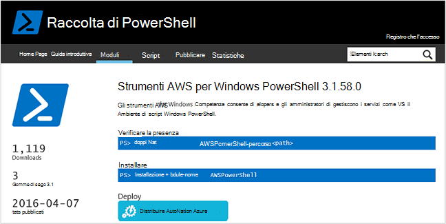
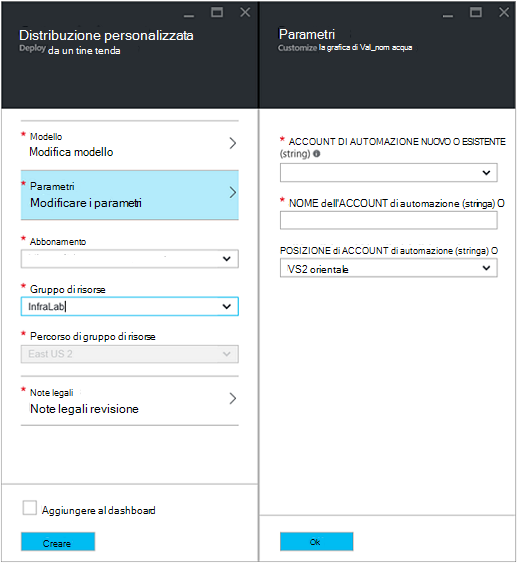
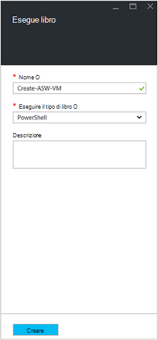
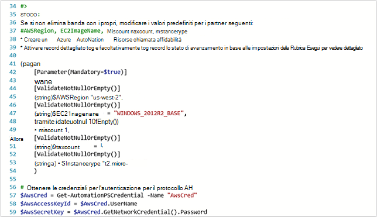
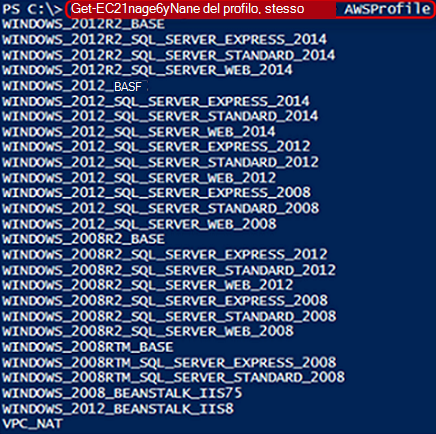
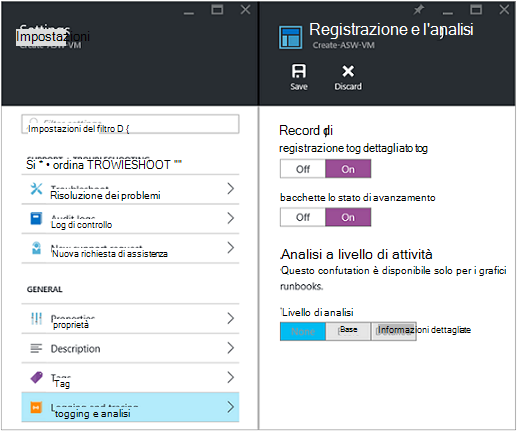
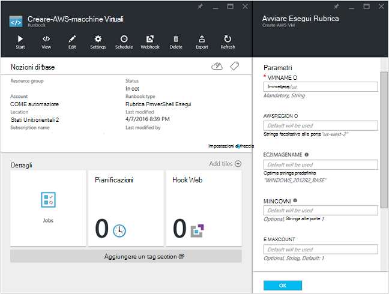
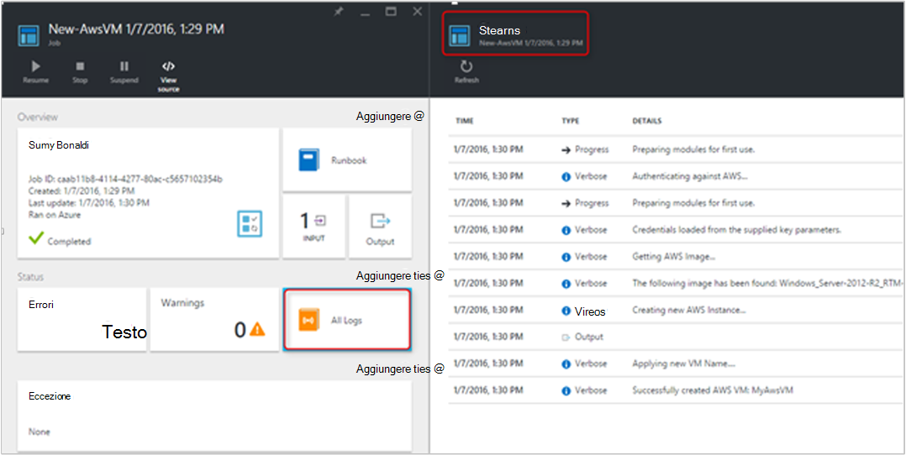
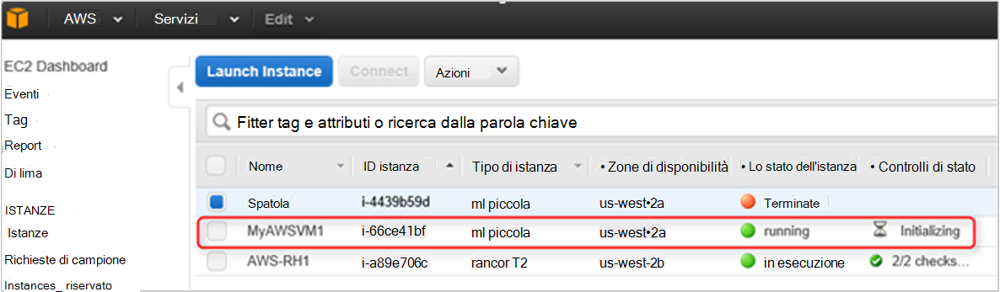

<properties
   pageTitle="Automatizzare la distribuzione di una macchina virtuale nei servizi Web di Amazon | Microsoft Azure"
   description="In questo articolo viene illustrato come utilizzare l'automazione di Azure per automatizzare la creazione di una macchina virtuale servizio Web di Amazon"
   services="automation"
   documentationCenter=""
   authors="mgoedtel"
   manager="jwhit"
   editor="" />
<tags
   ms.service="automation"
   ms.devlang="na"
   ms.topic="article"
   ms.tgt_pltfrm="na"
   ms.workload="na"
   ms.date="08/17/2016"
   ms.author="tiandert; bwren" />

# <a name="azure-automation-scenario---provision-an-aws-virtual-machine"></a>Scenario di automazione di Azure - provisioning una macchina virtuale AWS 

In questo articolo viene illustrato come è possibile sfruttare le automazione Azure per effettuare il provisioning di una macchina virtuale nell'abbonamento a servizi Web di Amazon (AWS) e specificare un nome specifico – AWS fa riferimento a come "tagging" macchina virtuale per quella macchina virtuale.

## <a name="prerequisites"></a>Prerequisiti

Ai fini di questo articolo, è necessario disporre di un account Azure automazione e un abbonamento a AWS. Per ulteriori informazioni sull'impostazione di un account Azure automazione e la configurazione con le credenziali dell'abbonamento AWS, consultare [Configurare l'autenticazione con i servizi Web di Amazon](../automation/automation-sec-configure-aws-account.md).  Questo account deve essere creato o aggiornato con le credenziali dell'abbonamento AWS prima di procedere, come si farà riferimento l'account tramite la procedura seguente.


## <a name="deploy-amazon-web-services-powershell-module"></a>Distribuire modulo PowerShell servizi Web di Amazon

Il nostro macchine Virtuali provisioning runbook verranno utilizzati del modulo PowerShell per AWS il lavoro. Eseguire la procedura seguente per aggiungere il modulo al proprio account di automazione configurati con le credenziali dell'abbonamento AWS.  

1. Aprire il web browser e passare alla [Raccolta di PowerShell](http://www.powershellgallery.com/packages/AWSPowerShell/) e fare clic su **Distribuisci al pulsante automazione Azure**.<br> 

2. Si passa alla pagina di accesso Azure e dopo l'autenticazione, verrà indirizzati al portale di Azure e presentate e il seguente.<br> 

3. Selezionare il gruppo di risorse dall'elenco a discesa **Gruppo di risorse** e su e il parametri, fornire le informazioni seguenti:
   * Dall'elenco a discesa **nuovo o esistente automazione Account (stringa)** selezionare **esistente**.  
   * Nella casella **Nome dell'Account di automazione (stringa)** , digitare il nome dell'account di automazione che include le credenziali per l'abbonamento AWS esatto.  Ad esempio, se è stato creato un account dedicato denominato **AWSAutomation**, che sarà digitare nella casella.
   * Selezionare il paese appropriato dall'elenco a discesa **Automazione Account percorso** .

4. Dopo aver completato l'immissione di informazioni richieste, fare clic su **Crea**.

    >[AZURE.NOTE]Durante l'importazione di un modulo di PowerShell in Azure automazione, è anche estrarre i cmdlet e queste attività non vengono visualizzata fino a quando non è completamente terminato il modulo importazione e l'estrazione i cmdlet. Questo processo può richiedere alcuni minuti.  
<br>
5. Nel portale di Azure, aprire l'account di automazione a cui fa riferimento al passaggio 3.
6. Fare clic sul riquadro **attività** e nella e **risorse** , selezionare il riquadro di **moduli** .
7. In e il **moduli** verrà visualizzato il modulo **AWSPowerShell** nell'elenco.

## <a name="create-aws-deploy-vm-runbook"></a>Creare AWS distribuire macchine Virtuali runbook

Dopo la distribuzione del modulo PowerShell AWS, è ora possibile creare runbook per automatizzare il provisioning di una macchina virtuale AWS utilizzando uno script di PowerShell. La procedura seguente viene illustrato come sfruttare nativo script di PowerShell in Azure automazione.  

>[AZURE.NOTE] Per ulteriori opzioni e informazioni relative a questo script, visitare la [Raccolta di PowerShell](https://www.powershellgallery.com/packages/New-AwsVM/DisplayScript).


1. Scaricare lo script di PowerShell nuovo AwsVM dalla raccolta PowerShell, aprire una sessione di PowerShell e digitare quanto segue:<br>
   ```
   Save-Script -Name New-AwsVM -Path \<path\>
   ```
<br>
2. Dal portale di Azure, aprire l'account di automazione e fare clic sul riquadro **runbook** .  
3. Scegliere **Aggiungi un runbook**e il **runbook** .
4. Scegliere **Creazione rapida** (Crea un nuovo runbook) e il **componente un runbook** .
5. Nella e proprietà **Runbook** digitare un nome nella casella nome per il runbook e dal **Runbook tipo** selezionare **PowerShell**elenco a discesa e quindi fare clic su **Crea**.<br> 
6. Quando viene visualizzata e il PowerShell Runbook modificare, copiare e incollare lo script di PowerShell runbook Creazione area di disegno.<br> <br>

    >[AZURE.NOTE] Tenere presente quanto segue quando si lavora con uno script di PowerShell di esempio:
    >
    > - Dal runbook contiene un numero di valori di parametro predefiniti. Valutare tutti i valori predefiniti e aggiornare in caso di necessità.
    > - Se le credenziali AWS sono memorizzati come risorsa credenziali un nome diverso rispetto a **AWScred**, sarà necessario aggiornare lo script nella riga 57 in modo che corrispondano a seconda dei casi.  
    > - Quando si utilizzano i comandi AWS CLI PowerShell, specialmente con runbook in questo esempio, è necessario specificare l'area geografica AWS. In caso contrario, i cmdlet avrà esito negativo.  Visualizzare l'argomento AWS [Specificare l'area geografica AWS](http://docs.aws.amazon.com/powershell/latest/userguide/pstools-installing-specifying-region.html) strumenti AWS per documento PowerShell per ulteriori informazioni.  
<br>
7. Per recuperare un elenco di nomi di immagine dalla sottoscrizione AWS, avviare PowerShell ISE e importare il modulo di PowerShell AWS.  Autenticare AWS sostituendo **Get-AutomationPSCredential** nel proprio ambiente ISE con **AWScred = Get-Credential**.  Questa operazione verrà richieste le credenziali ed è possibile specificare l' **ID chiave di accesso** per il nome utente e un **Tasto di scelta segreto** per la password.  Vedere l'esempio seguente:

        #Sample to get the AWS VM available images
        #Please provide the path where you have downloaded the AWS PowerShell module
        Import-Module AWSPowerShell
        $AwsRegion = "us-west-2"
        $AwsCred = Get-Credential
        $AwsAccessKeyId = $AwsCred.UserName
        $AwsSecretKey = $AwsCred.GetNetworkCredential().Password

        # Set up the environment to access AWS
        Set-AwsCredentials -AccessKey $AwsAccessKeyId -SecretKey $AwsSecretKey -StoreAs AWSProfile
        Set-DefaultAWSRegion -Region $AwsRegion

        Get-EC2ImageByName -ProfileName AWSProfile
   Viene restituito l'output seguente:<br>
     
8. Copiare e incollare uno dei nomi immagine in una variabile di automazione a cui fa riferimento runbook come **$InstanceType**. Poiché in questo esempio abbiamo sono utilizzando AWS gratuito a più livelli di abbonamento, si userà **t2.micro** in questo esempio runbook.
9. Salvare dal runbook, quindi fare clic su **pubblica** per pubblicare dal runbook e quindi su **Sì** quando richiesto.


### <a name="testing-the-aws-vm-runbook"></a>Test runbook AWS VM
Prima di procedere con il test dal runbook, è necessario verificare alcuni aspetti. In particolare:

   -  Un bene per l'autenticazione contro AWS è stato creato chiamato **AWScred** o lo script è stato aggiornato per fare riferimento al nome dell'attività credenziali.  
   -  Del modulo PowerShell per AWS importato in automazione Azure
   -  È stato creato un nuovo runbook e i valori dei parametri sono stati verificati e aggiornati in caso di necessità
   -  **Registro dettagliato** e, facoltativamente, **i record del Log lo stato di avanzamento** in runbook l'impostazione di **registrazione e l'analisi** sono state impostate su **On**.<br> 

1. Si desidera iniziare dal runbook, quindi fare clic su **Start** e quindi fare clic su **OK** quando viene aperto e il Runbook iniziare.
2. Nella e avviare Runbook, specificare un **VMname**.  Accettare i valori predefiniti per gli altri parametri preconfigurato dello script in precedenza.  Fare clic su **OK** per avviare il processo di runbook.<br> 
3. Viene aperto il riquadro di un processo per il processo di runbook appena creata. Chiudere il riquadro.
4. È possibile visualizzare lo stato di avanzamento del processo di **flussi** e di visualizzazione output selezionando il riquadro di **Tutti i log** e il processo runbook.<br> 
5. Per confermare che la macchina virtuale è sottoposto a provisioning, accedere alla Console di gestione AWS se si è non attualmente connessi.<br> 

## <a name="next-steps"></a>Passaggi successivi
-   Per iniziare a utilizzare runbook grafici, vedere [il primo runbook grafica](automation-first-runbook-graphical.md)
-   Per iniziare a utilizzare runbook del flusso di lavoro di PowerShell, vedere [il primo runbook del flusso di lavoro PowerShell](automation-first-runbook-textual.md)
-   Per ulteriori informazioni sulle limitazioni, i vantaggi e i tipi di runbook, vedere [tipi di runbook automazione di Azure](automation-runbook-types.md)
-   Per ulteriori informazioni sullo script di PowerShell supportano funzionalità, vedere [script di PowerShell nativi supporta l'automazione Azure](https://azure.microsoft.com/blog/announcing-powershell-script-support-azure-automation-2/)
