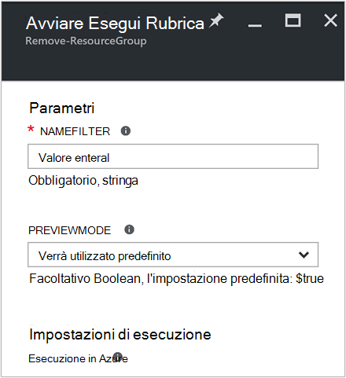
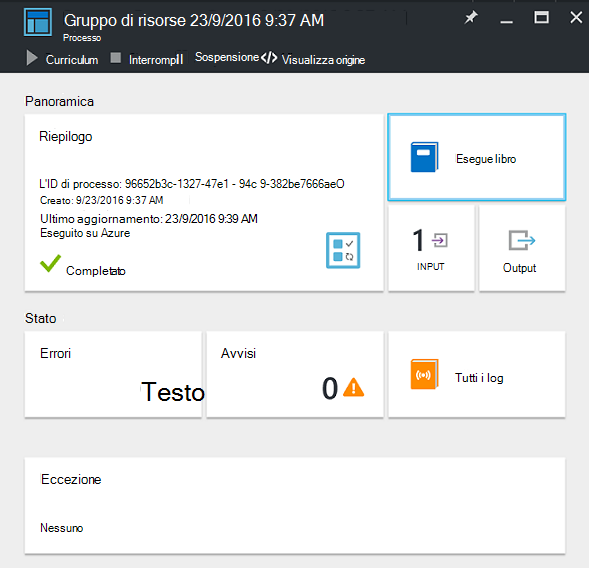
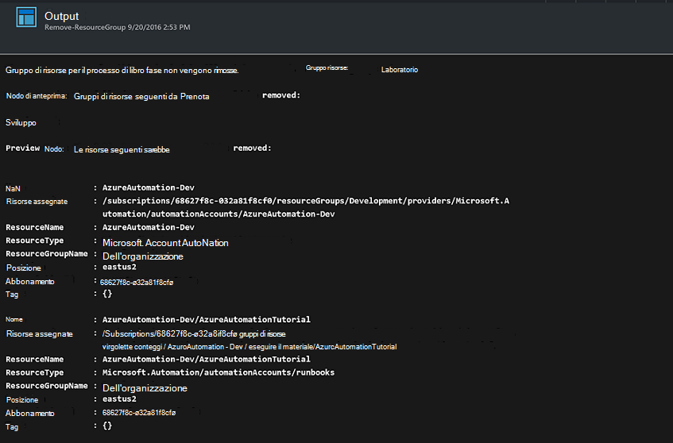

<properties
    pageTitle="Automatizzare rimozione dei gruppi di risorse | Microsoft Azure"
    description="Versione del flusso di lavoro di PowerShell di uno scenario di automazione di Azure inclusi runbook per rimuovere tutti i gruppi di risorse nell'abbonamento."
    services="automation"
    documentationCenter=""
    authors="MGoedtel"
    manager="jwhit"
    editor=""
    />
<tags
    ms.service="automation"
    ms.workload="tbd"
    ms.tgt_pltfrm="na"
    ms.devlang="na"
    ms.topic="get-started-article"
    ms.date="09/26/2016"
    ms.author="magoedte"/>

# Scenario di automazione di Azure - automatizzare rimozione dei gruppi di risorse

Molti clienti creare più di un gruppo di risorse. Alcuni possono essere utilizzati per la gestione delle applicazioni di produzione e gli altri utenti possono essere utilizzati come sviluppo, test e ambienti di gestione temporanea. Automazione della distribuzione di queste risorse è una cosa, ma la possibilità di eliminare un gruppo di risorse con un clic del pulsante è un altro. È possibile semplificare questa attività di gestione comuni utilizzando l'automazione di Azure. Questa funzionalità è utile se si lavora con un abbonamento a Azure che ha un limite di spesa tramite un'offerta di membro come MSDN o il programma Microsoft Partner Network Cloud Essentials.

Questo scenario si basa su una runbook PowerShell ed è progettato per rimuovere uno o più gruppi di risorse specificate dall'abbonamento. L'impostazione predefinita dal runbook consiste nel verificare prima di continuare. In questo modo si accidentalmente non elimina il gruppo di risorse prima che si è pronti a completare questa procedura.   

## Guida lo scenario

Questo scenario è costituito da un runbook PowerShell che può essere scaricato dalla [Raccolta di PowerShell](https://www.powershellgallery.com/packages/Remove-ResourceGroup/1.0/DisplayScript). È anche possibile importare direttamente dalla [Raccolta Runbook](automation-runbook-gallery.md) nel portale di Azure.  

Runbook | Descrizione|
----------|------------|
Rimuovi ResourceGroup | Rimuove l'abbonamento a uno o più gruppi di risorse Azure e le risorse associate.  
 
I parametri di input seguenti sono definiti per questo runbook:

Parametro | Descrizione|
----------|------------|
NameFilter (obbligatorio) | Specifica un nome di filtro per limitare i gruppi di risorse che si intende l'eliminazione. È possibile passare più valori usando un elenco separati da virgola. Il filtro non è tra maiuscole e minuscole e restituita corrisponderanno a qualsiasi gruppo di risorse contenente la stringa.|
PreviewMode (facoltativo) | Viene eseguita dal runbook per vedere quali gruppi di risorse da eliminare, ma non esegue alcuna azione. Il valore predefinito è **true** al fine di evitare l'eliminazione accidentale di uno o più gruppi di risorse passati dal runbook.  

## Installare e configurare questo scenario

### Prerequisiti

Questo runbook autentica utilizzando l' [account Azure Esegui come](automation-sec-configure-azure-runas-account.md).    

### Installare e pubblicare i runbook

Dopo avere scaricato dal runbook, è possibile importare utilizzando la procedura descritta in [importare runbook procedure](automation-creating-importing-runbook.md#importing-a-runbook-from-a-file-into-Azure-Automation). Pubblicare dal runbook dopo che sono stati importato correttamente nel proprio account di automazione.

## Uso dal runbook

La procedura seguente consentono all'utente l'esecuzione di questa runbook e Guida che è acquisire familiarità con il funzionamento. È solo controllerà dal runbook in questo esempio, non eliminare il gruppo di risorse.  

1. Dal portale di Azure, aprire l'account di automazione e fare clic su **runbook**.
2. Selezionare dal runbook **ResourceGroup rimuovere** e fare clic su **Start**.
3. Quando si avvia dal runbook, viene aperto e **l'Avviare Runbook** ed è possibile configurare i parametri. Immettere i nomi dei gruppi di risorse nell'abbonamento, è possibile utilizzare per il testing e non causerà alcun danno se eliminato accidentalmente.  

    >[AZURE.NOTE] Assicurarsi che **Previewmode** è impostato su **true** per evitare di eliminare i gruppi di risorse selezionato.  **Nota** che questo runbook non comporta la rimozione gruppo di risorse che contiene l'account di automazione che è in esecuzione questa runbook.  

4. Dopo aver configurato tutte il parametro valori, fare clic su **OK**e verrà accodato dal runbook per l'esecuzione.  

Per visualizzare i dettagli del processo di runbook **ResourceGroup Rimuovi** nel portale di Azure, selezionare **processi** dal runbook. Il processo di riepilogo vengono visualizzati i parametri di input e il flusso di output oltre a informazioni generali sulle responsabilità e le eventuali eccezioni che si è verificato.  .

**Riepilogo** include i messaggi provenienti dall'output, di avviso e flussi di errore. Selezionare **Output** per visualizzare informazioni dettagliati risultati dell'esecuzione runbook.  

## Passaggi successivi

- Per iniziare a creare il proprio runbook, vedere [creazione o importazione runbook di automazione di Azure](automation-creating-importing-runbook.md).
- Per iniziare a utilizzare runbook del flusso di lavoro di PowerShell, vedere [il primo runbook PowerShell del flusso di lavoro](automation-first-runbook-textual.md).
