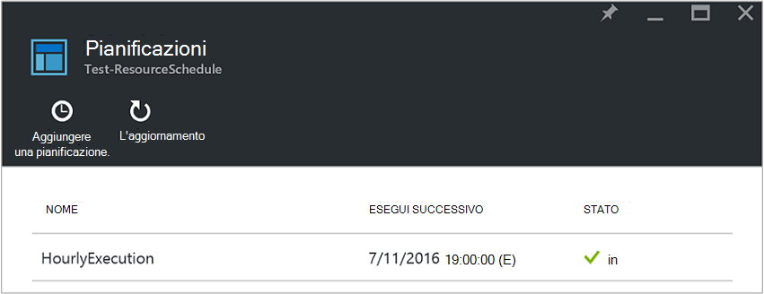
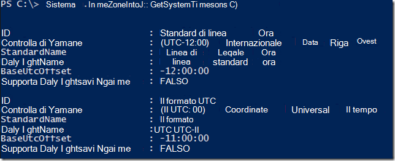
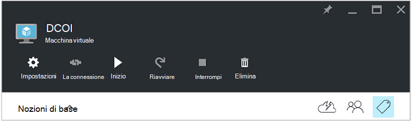
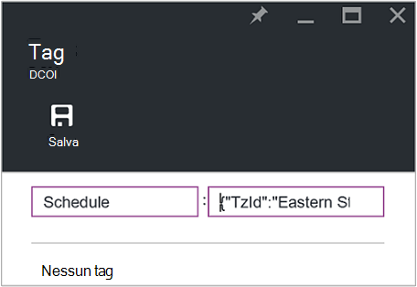
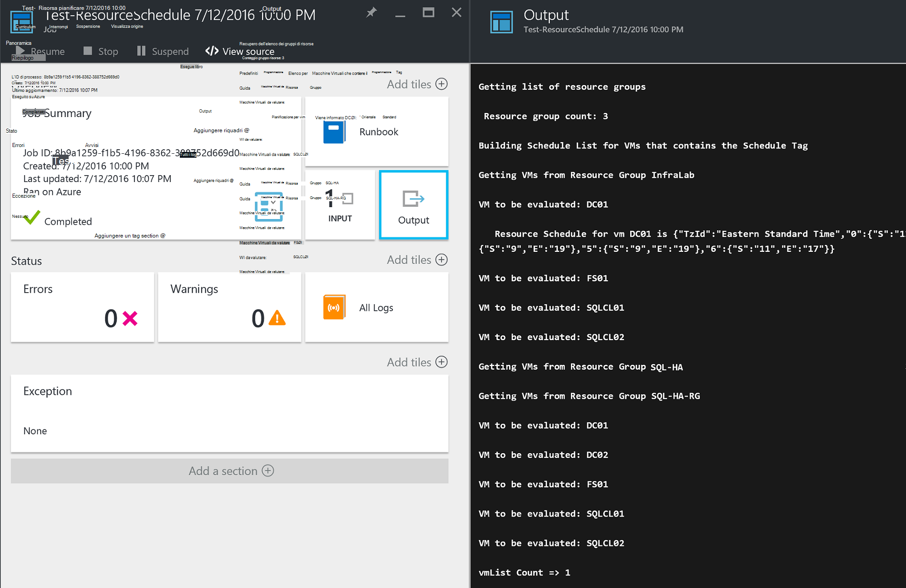

<properties
   pageTitle="Uso di tag in formato JSON per creare una pianificazione per macchine Virtuali di Azure avvio e chiusura | Microsoft Azure"
   description="In questo articolo viene illustrato come utilizzare le stringhe JSON tag per automatizzare la programmazione di chiusura e avvio macchine Virtuali."
   services="automation"
   documentationCenter=""
   authors="MGoedtel"
   manager="jwhit"
   editor="tysonn" />
<tags
   ms.service="automation"
   ms.devlang="na"
   ms.topic="article"
   ms.tgt_pltfrm="na"
   ms.workload="infrastructure-services"
   ms.date="07/18/2016"
   ms.author="magoedte;paulomarquesc" />

# Scenario di automazione di Azure: uso dei contrassegni in formato JSON per creare una pianificazione per macchine Virtuali di Azure avvio e di chiusura

I clienti, spesso è necessario pianificare l'avvio e chiusura di macchine virtuali per ridurre i costi di abbonamento o supporto tecnico requisiti tecnici e aziendali.  

Il seguente scenario consente di configurare avvio automatico e di chiusura delle proprie macchine virtuali mediante un tag denominato programmazione di un livello di gruppo di risorse o macchina virtuale in Azure. Questa pianificazione può essere configurata dal lunedì-domenica con un'ora di avvio e chiusura.  

Include alcune opzioni della casella. Sono inclusi:
-  [Imposta scala macchina virtuale](../virtual-machine-scale-sets/virtual-machine-scale-sets-overview.md) con le impostazioni di autoscale che consentono di rendere avanti o indietro.
- Servizio di [Esercitazioni DevTest](../devtest-lab/devtest-lab-overview.md) , che ha la possibilità di pianificazione operazioni di avvio e di chiusura.

Tuttavia, queste opzioni supportano solo scenari specifici e non possono essere applicate alle macchine virtuali di infrastruttura-come-a-service (IaaS).   

Quando il contrassegno di pianificazione viene applicato a un gruppo di risorse, anche applicato a tutte le macchine virtuali all'interno di tale gruppo di risorse. Se una programmazione anche direttamente è applicata a una macchina virtuale, il programma ultimo avrà la precedenza nell'ordine seguente:

1.  Pianificazione applicato a un gruppo di risorse
2.  Pianificazione applicato a un gruppo di risorse e macchina virtuale nel gruppo di risorse
3.  Pianificazione applicato a una macchina virtuale

Questo scenario essenzialmente accetta una stringa JSON con un formato specificato e lo aggiunge come valore per un tag denominato programmazione. Quindi un runbook Elenca tutti i gruppi di risorse e macchine virtuali e identifica le pianificazioni per ogni macchina virtuale basati su scenari elencati in precedenza. Quindi scorre in macchine virtuali contenenti le pianificazioni collegate e viene valutato l'azione che deve essere eseguita. Ad esempio, determina quale macchine virtuali necessario interrotto, arrestare o ignorati.

Questi runbook autenticazione utilizzando l' [account Azure Esegui come](../automation/automation-sec-configure-azure-runas-account.md).

## Scaricare runbook per lo scenario

In questo scenario è composto da quattro runbook PowerShell del flusso di lavoro che può essere scaricato dal repository [GitHub](https://github.com/paulomarquesdacosta/azure-automation-scheduled-shutdown-and-startup) per il progetto o nella [Raccolta TechNet](https://gallery.technet.microsoft.com/Azure-Automation-Runbooks-84f0efc7) .

Runbook | Descrizione
----------|----------
Test ResourceSchedule | Controlli per ogni pianificazione macchina virtuale ed esegue arresto o l'avvio in base alla pianificazione.
Aggiungere ResourceSchedule | Tag programmazione aggiunto a un gruppo di macchine Virtuali o una risorsa.
Aggiornamento ResourceSchedule | Modifica tag programmazione esistente sostituendolo con uno nuovo.
Rimuovi ResourceSchedule | Rimuove il contrassegno di pianificazione da un gruppo di macchine Virtuali o una risorsa.

## Installare e configurare questo scenario

### Installare e pubblicare i runbook

Dopo avere scaricato la runbook, è possibile importare loro utilizzando la procedura descritta in [creazione o importazione runbook di automazione di Azure](automation-creating-importing-runbook.md#importing-a-runbook-from-a-file-into-Azure-Automation).  Pubblicare ogni runbook dopo che sono stati importato correttamente nel proprio account di automazione.

### Aggiungere una pianificazione per runbook ResourceSchedule Test

Seguire questa procedura per attivare la pianificazione per runbook ResourceSchedule Test. Si tratta dal runbook che verifica quali macchine virtuali di deve essere avviato, arrestare o inalterato.

1. Dal portale di Azure, aprire l'account di automazione e quindi fare clic sul riquadro **runbook** .
2. Scegliere il riquadro **pianificazioni** e il **Test ResourceSchedule** .
3. Scegliere **Aggiungi una pianificazione**e il **pianificazioni** .
4. Scegliere **collegamento una programmazione per il runbook**e il **pianificazioni** . Quindi selezionare **Crea una nuova programmazione**.
5.  In e il **nuova programmazione** , digitare il nome programmazione, ad esempio: *HourlyExecution*.
6. Per **iniziare**la pianificazione, impostare l'ora di inizio su incremento ora.
7. Selezionare **ricorrenza**e quindi per **ogni intervallo di ricorrenza**, selezionare **1 ora**.
8. Verificare che i **Set di scadenza** è impostata su **No**e quindi fare clic su **Crea** per salvare la nuova pianificazione.
9. Scegliere **i parametri e le impostazioni di esecuzione**e l'opzioni **Runbook di programmazione** . In e il Test ResourceSchedule **parametri** , immettere il nome del proprio abbonamento nel campo **SubscriptionName** .  Questo è l'unico parametro necessario per dal runbook.  Al termine, fare clic su **OK**.  

Pianificazione runbook avrà un aspetto simile al seguente al completamento:

 

## Formattare la stringa JSON

Questa soluzione in cui sono abbia un JSON stringa con un formato specificato e lo aggiunge come valore per un tag chiamato programmazione. Quindi un runbook Elenca tutti i gruppi di risorse e macchine virtuali e identifica le pianificazioni per ogni macchina virtuale.

Dal runbook esaminati macchine virtuali contenenti le pianificazioni associate e controlli per le azioni da eseguire. Di seguito è illustrato un esempio di come devono essere formattate le soluzioni:

    {
       "TzId": "Eastern Standard Time",
        "0": {  
           "S": "11",
           "E": "17"
        },
        "1": {
           "S": "9",
           "E": "19"
        },
        "2": {
           "S": "9",
           "E": "19"
        },
    }

Ecco alcune informazioni dettagliate sulla struttura:

1. Il formato della struttura JSON è ottimizzato per risolvere il limite di 256 caratteri di un valore singolo tag in Azure.

2. *TzId* rappresenta il fuso orario della macchina virtuale. Questo ID, è possibile ottenere utilizzando la classe TimeZoneInfo .NET in una sessione di PowerShell -**[System.TimeZoneInfo]:: GetSystemTimeZones()**.

    

    - I giorni lavorativi sono rappresentati con un valore numerico pari a zero e sei. Il valore zero è uguale a domenica.
    - L'ora di inizio viene rappresentato con l'attributo **S** e il relativo valore è in formato 24 ore.
    - Ora di fine o di chiusura viene rappresentato con l'attributo **E** e il relativo valore è in formato 24 ore.

    Se gli attributi **S** ed **E** hanno un valore pari a zero (0), la macchina virtuale rimarrà nello stato attuale in fase di valutazione.   

3. Se si vuole ignorare la valutazione per un determinato giorno della settimana, non aggiungere una sezione del giorno della settimana. Nell'esempio seguente viene valutato solo lunedì e altri giorni della settimana vengono ignorati:

        {
          "TzId": "Eastern Standard Time",
           "1": {
             "S": "11",
             "E": "17"
           }
        }

## Gruppi di risorse tag o macchine virtuali

Per arrestare macchine virtuali, è necessario contrassegnare le macchine virtuali o i gruppi di risorse in cui si trovano. Non vengono valutate macchine virtuali che non dispone di un contrassegno di programmazione. Sono di conseguenza, non è avviati o arrestare.

Esistono due modi per i gruppi di risorse tag o macchine virtuali con questa soluzione. È possibile eseguire direttamente dal portale. È possibile utilizzare runbook ResourceSchedule Rimuovi, Aggiungi ResourceSchedule e ResourceSchedule di aggiornamento.

### Aggiungere tag tramite il portale

Seguire questa procedura per contrassegnare una macchina virtuale o un gruppo di risorse nel portale:

1. Unire la stringa JSON e verificare che non ci sono gli spazi.  La stringa JSON dovrebbe risultare analoga alla seguente:

        {"TzId":"Eastern Standard Time","0":{"S":"11","E":"17"},"1":{"S":"9","E":"19"},"2": {"S":"9","E":"19"},"3":{"S":"9","E":"19"},"4":{"S":"9","E":"19"},"5":{"S":"9","E":"19"},"6":{"S":"11","E":"17"}}

2. Selezionare l'icona di **Tag** per un gruppo di macchine Virtuali o delle risorse applicare la pianificazione.

    
3. Tag vengono definiti seguendo una coppia chiave/valore. Digitare **programmazione** nel campo **chiave** e quindi incollare la stringa JSON nel campo **valore** . Fare clic su **Salva**. Il nuovo tag ora dovrebbero essere visualizzate nell'elenco dei tag per la risorsa.

### Tag da PowerShell

Tutti runbook importati contengono le informazioni della Guida all'inizio dello script che viene descritto come eseguire la runbook direttamente da PowerShell. È possibile partecipare runbook ScheduleResource aggiunta e aggiornamento ScheduleResource tramite PowerShell. È passando parametri obbligatori che consentono di creare o aggiornare il contrassegno di programmazione in un gruppo di macchine Virtuali o una risorsa all'esterno del portale.  

Per creare, aggiungere ed eliminare categorie tramite PowerShell, è prima necessario [configurare l'ambiente di PowerShell per Azure](../powershell-install-configure.md). Dopo aver completato la configurazione, è possibile procedere con la procedura seguente.

### Creare un tag di programmazione con PowerShell

1. Aprire una sessione di PowerShell. Utilizzare l'esempio seguente per eseguire l'autenticazione con l'account Esegui come e specificare una sottoscrizione:   

        Conn = Get-AutomationConnection -Name AzureRunAsConnection
        Add-AzureRMAccount -ServicePrincipal -Tenant $Conn.TenantID `
        -ApplicationId $Conn.ApplicationID -CertificateThumbprint $Conn.CertificateThumbprint
        Select-AzureRmSubscription -SubscriptionName "MySubscription"

2. Definire una tabella di hash di programmazione. Ecco un esempio di come deve essere creato:

        $schedule= @{ "TzId"="Eastern Standard Time"; "0"= @{"S"="11";"E"="17"};"1"= @{"S"="9";"E"="19"};"2"= @{"S"="9";"E"="19"};"3"= @{"S"="9";"E"="19"};"4"= @{"S"="9";"E"="19"};"5"= @{"S"="9";"E"="19"};"6"= @{"S"="11";"E"="17"}}

3. Definire i parametri necessari affinché dal runbook. Nell'esempio seguente destinazione interessato una macchina virtuale:

        $params = @{"SubscriptionName"="MySubscription";"ResourceGroupName"="ResourceGroup01"; `
        "VmName"="VM01";"Schedule"=$schedule}

    Se si sta social tagging di un gruppo di risorse, rimuovere il parametro *VMName* dalla tabella hash $params come indicato di seguito:

        $params = @{"SubscriptionName"="MySubscription";"ResourceGroupName"="ResourceGroup01"; `
        "Schedule"=$schedule}

4. Eseguire runbook Aggiungi ResourceSchedule con i parametri seguenti per creare il contrassegno di pianificazione:

        Start-AzureRmAutomationRunbook -Name "Add-ResourceSchedule" -Parameters $params `
        -AutomationAccountName "AutomationAccount" -ResourceGroupName "ResourceGroup01"

5. Per aggiornare un gruppo di risorse oppure un tag macchina virtuale, eseguire runbook **Aggiornamento ResourceSchedule** con i parametri seguenti:

        Start-AzureRmAutomationRunbook -Name "Update-ResourceSchedule" -Parameters $params `
        -AutomationAccountName "AutomationAccount" -ResourceGroupName "ResourceGroup01"

### Rimuovere un contrassegno di programmazione con PowerShell

1. Aprire una sessione di PowerShell ed eseguire le operazioni seguenti per eseguire l'autenticazione con l'account Esegui come e selezionare e specificare un abbonamento:

        Conn = Get-AutomationConnection -Name AzureRunAsConnection
        Add-AzureRMAccount -ServicePrincipal -Tenant $Conn.TenantID `
        -ApplicationId $Conn.ApplicationID -CertificateThumbprint $Conn.CertificateThumbprint
        Select-AzureRmSubscription -SubscriptionName "MySubscription"

2. Definire i parametri necessari affinché dal runbook. Nell'esempio seguente destinazione interessato una macchina virtuale:

        $params = @{"SubscriptionName"="MySubscription";"ResourceGroupName"="ResourceGroup01" `
        ;"VmName"="VM01"}

    Se si elimina un contrassegno da un gruppo di risorse, rimuovere il parametro *VMName* dalla tabella hash $params come indicato di seguito:

        $params = @{"SubscriptionName"="MySubscription";"ResourceGroupName"="ResourceGroup01"}

3. Eseguire runbook ResourceSchedule Rimuovi per rimuovere il contrassegno di pianificazione:

        Start-AzureRmAutomationRunbook -Name "Remove-ResourceSchedule" -Parameters $params `
        -AutomationAccountName "AutomationAccount" -ResourceGroupName "ResourceGroup01"

4. Per aggiornare un gruppo di risorse oppure un tag macchina virtuale, eseguire runbook Rimuovi ResourceSchedule con i parametri seguenti:

        Start-AzureRmAutomationRunbook -Name "Remove-ResourceSchedule" -Parameters $params `
        -AutomationAccountName "AutomationAccount" -ResourceGroupName "ResourceGroup01"

>[AZURE.NOTE] È consigliabile monitorare tempestiva questi runbook (e gli stati macchina virtuale) per verificare che le macchine virtuali sono viene chiusa verso il basso e iniziare a seconda dei casi.  

Per visualizzare i dettagli del processo di runbook Test ResourceSchedule nel portale di Azure, selezionare il riquadro **processi** dal runbook. Il processo di riepilogo Visualizza i parametri di input e il flusso di output, oltre a informazioni generali sulle responsabilità e le eventuali eccezioni se si sono verificati.  

**Riepilogo** include i messaggi provenienti dall'output, di avviso e flussi di errore. Selezionare il riquadro di **Output** per visualizzare informazioni dettagliati risultati dell'esecuzione runbook.

  

## Passaggi successivi

-  Per iniziare a utilizzare runbook del flusso di lavoro di PowerShell, vedere [il primo runbook del flusso di lavoro PowerShell](automation-first-runbook-textual.md).
-  Per ulteriori informazioni sui tipi di runbook e vantaggi e limitazioni, vedere [tipi di runbook automazione Azure](automation-runbook-types.md).
-  Per ulteriori informazioni sull'utilizzo di script di PowerShell supporta le caratteristiche, vedere [script di PowerShell nativi supporta l'automazione Azure](https://azure.microsoft.com/blog/announcing-powershell-script-support-azure-automation-2/).
-  Per ulteriori informazioni sulla registrazione runbook e di output, vedere [Runbook output e i messaggi di automazione di Azure](automation-runbook-output-and-messages.md).
-  Per ulteriori informazioni su un account Azure Esegui come e come autenticare i runbook utilizzando il programma, vedere [runbook autentica con account Azure Esegui come](../automation/automation-sec-configure-azure-runas-account.md).
