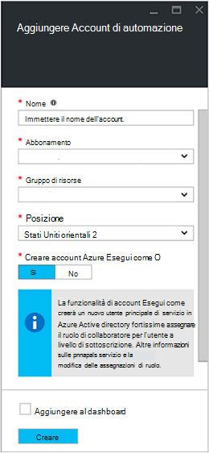
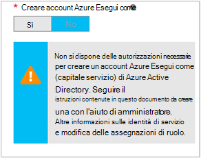

<properties
   pageTitle="Configurare Account Azure Active Directory utente | Microsoft Azure"
   description="In questo articolo viene descritto come configurare le credenziali dell'account utente di Azure Active Directory per runbook in Azure automazione per l'autenticazione ARM e ASM."
   services="automation"
   documentationCenter=""
   authors="MGoedtel"
   manager="jwhit"
   editor="tysonn"
   keywords="Azure active directory, azure servizio Gestione azure ad account utente" />
<tags
   ms.service="automation"
   ms.devlang="na"
   ms.topic="get-started-article"
   ms.tgt_pltfrm="na"
   ms.workload="infrastructure-services"
   ms.date="09/12/2016"
   ms.author="magoedte" />

# Eseguire l'autenticazione runbook con la gestione dei servizi Azure e Manager delle risorse

In questo articolo vengono illustrati i passaggi da eseguire per configurare un account utente di Azure Active Directory per automazione Azure runbook esecuzione su Azure servizio di gestione (ASM) o Manager delle risorse Azure (ARM) risorse.  Mentre si continua a essere che runbook in base a un'identità di autenticazione supportati per le ARM, il metodo consigliato è utilizzando il nuovo account Azure Esegui come.       

## Creare un nuovo utente di Azure Active Directory

1. Accedere al portale classica di Azure come un amministratore del servizio per la sottoscrizione di Azure che si desidera gestire.
2. Selezionare **Active Directory**e quindi selezionare il nome della directory dell'organizzazione.
3. Selezionare la scheda **utenti** e quindi selezionare **Aggiungi utente**nell'area comandi.
4. Nella pagina **inviare commenti e suggerimenti su questo utente** , in **tipo di utente**, selezionare **nuovo utente nell'organizzazione**.
5. Immettere un nome utente.  
6. Selezionare il nome della directory che è associato all'abbonamento Azure nella pagina Active Directory.
7. Nella pagina del **profilo utente** , specificare una prima e ultima nome, un nome descrittivo e utente dall'elenco **ruoli** .  Eseguire non **consentire l'autenticazione a più fattori**.
8. Nota nome completo dell'utente e la password temporanea.
9. Selezionare **Impostazioni > amministratori > Aggiungi**.
10. Digitare il nome completo dell'utente che è stato creato.
11. Selezionare l'abbonamento a cui si vuole che l'utente per la gestione.
12. Disconnettersi dall'Azure e quindi accedere nuovamente con l'account che appena creato. Verrà richiesto di modificare la password dell'utente.

## Creare un account di automazione nel portale classica di Azure
In questa sezione, eseguire la procedura seguente per creare un nuovo account Azure automazione nel portale di Azure che verrà utilizzata con i runbook la gestione delle risorse in modalità ASM e ARM.  

>[AZURE.NOTE] Account di automazione creati con il portale classica Azure può essere gestito da sia classica di Azure e Azure portale e una serie di cmdlet. Dopo aver creato l'account, non è rilevante come creare e gestire le risorse all'interno dell'account. Se si prevede di continuare a usare il portale classica di Azure, quindi utilizzare l'anziché il portale di Azure per creare gli account di automazione.

1. Accedere al portale classica di Azure come un amministratore del servizio per la sottoscrizione di Azure che si desidera gestire.
2. Selezionare **automazione**.
3. Nella pagina **automazione** selezionare **Crea un Account di automazione**.
4. Nella casella **Crea un Account di automazione** , digitare un nome per il nuovo account di automazione e selezionare un' **area geografica** dall'elenco a discesa.  
5. Fare clic su **OK** per accettare le impostazioni e creare l'account.
6. Dopo averlo creato verranno elencato nella pagina **automazione** .
7. Fare clic sull'account e si ripristina alla pagina del Dashboard.  
8. Nella pagina del Dashboard di automazione selezionare **risorse**.
9. Nella pagina **risorse** , selezionare **Aggiungi impostazioni** nella parte inferiore della pagina.
10. Nella pagina **Aggiungi impostazioni** selezionare **Aggiungi credenziali**.
11. Nella pagina **Delle credenziali definire** selezionare **Credenziali di Windows PowerShell** dall'elenco a discesa **Tipo di credenziali** e specificare un nome per le credenziali.
12. Nella seguenti **Definire credenziali** pagina digitare il nome utente dell'account utente Active Directory creata in precedenza nel campo **Nome utente** e la password nelle caselle **Password** e **Conferma Password** . Fare clic su **OK** per salvare le modifiche.

## Creare un account di automazione nel portale di Azure

In questa sezione, eseguire la procedura seguente per creare un nuovo account Azure automazione nel portale di Azure che verrà utilizzato quando le risorse sono gestione runbook in modalità ARM.  

1. Accedere al portale di Azure come un amministratore del servizio per la sottoscrizione di Azure che si desidera gestire.
2. Selezionare **gli account di automazione**.
3. In e l'automazione account, fare clic su **Aggiungi**. 
2. In e **l'Aggiungi Account automazione** , nella casella **nome** digitare un nome per il nuovo account di automazione.
5. Se si dispone di più di una sottoscrizione, specificare quello per il nuovo account, nonché un **gruppo di risorse** di nuovo o esistente e un Data Center Azure **posizione**.
3. Selezionare il valore **No** per l'opzione di **Azure crea esecuzione come account** e fare clic sul pulsante **Crea** .  

    >[AZURE.NOTE] Se si sceglie di non creare account Esegui come selezionando l'opzione **No**, verrà visualizzato un messaggio di avviso e **l'Aggiungi Account automazione** .  Mentre l'account creato e assegnato il ruolo di **Collaboratore** nella sottoscrizione non avrà un'identità di autenticazione corrispondente all'interno del servizio directory di abbonamenti e pertanto non accedere alle risorse nell'abbonamento.  Ciò impedirà qualsiasi runbook fare riferimento a questo account da utilizzare eseguire l'autenticazione ed eseguire attività con risorse ARM.

    

4. Mentre Azure crea l'account di automazione, è possibile tenere traccia dello stato di avanzamento in **notifiche** dal menu di scelta.

Una volta completata la creazione delle credenziali, sarà necessario creare una risorsa di credenziali per associare l'Account di automazione con l'account utente di Active Directory creata in precedenza.  Tenere presente che solo creato l'account di automazione e non è associata a un'identità di autenticazione.  Eseguire i passaggi descritti in [risorse di credenziali in Azure automazione articolo](../automation/automation-credentials.md#creating-a-new-credential) e immettere il valore per **nome utente** nel formato **dominio\utente**.

## Usare le credenziali in un runbook

È possibile recuperare le credenziali in un runbook utilizzando l'attività [Get-AutomationPSCredential](http://msdn.microsoft.com/library/dn940015.aspx) e quindi utilizzare con [Aggiungi AzureAccount](http://msdn.microsoft.com/library/azure/dn722528.aspx) per connettersi al proprio abbonamento Azure. Se le credenziali non sono un amministratore di più abbonamenti Azure, è necessario utilizzare anche [Selezionare AzureSubscription](http://msdn.microsoft.com/library/dn495203.aspx) per specificare quella corretta. Come illustrato nell'esempio di Windows PowerShell seguente che verrà visualizzato in genere nella parte superiore della maggior parte dei runbook automazione Azure.

    $cred = Get-AutomationPSCredential –Name "myuseraccount.onmicrosoft.com"
    Add-AzureAccount –Credential $cred
    Select-AzureSubscription –SubscriptionName "My Subscription"

È necessario ripetere le righe dopo eventuali [punti di controllo](http://technet.microsoft.com/library/dn469257.aspx#bk_Checkpoints) nel runbook. Se dal runbook viene sospesa e quindi curriculum in un altro lavoro, sarà necessario eseguire l'autenticazione.

## Passaggi successivi
* Rivedere i tipi di runbook diversi e procedura per creare il proprio runbook dall'articolo seguente [Azure automazione runbook tipi](../automation/automation-runbook-types.md)
