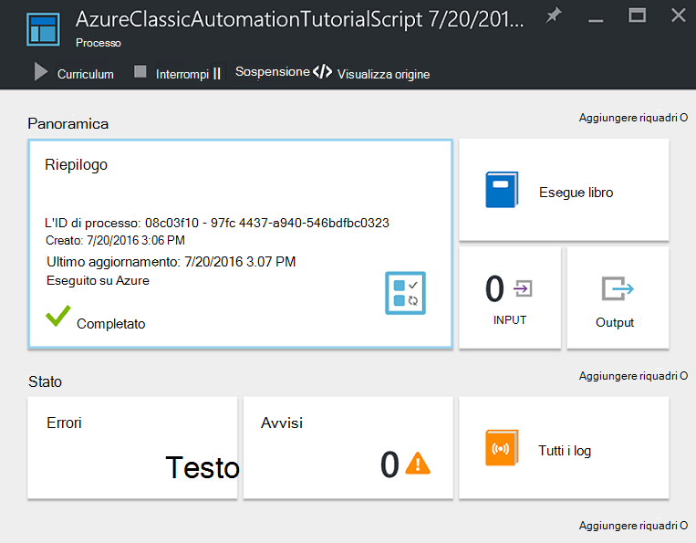

<properties
    pageTitle="Configurare Azure esecuzione come Account | Microsoft Azure"
    description="Esercitazioni che illustra l'uso di esempio, test e la creazione di autenticazione dell'entità di protezione in Azure automazione."
    services="automation"
    documentationCenter=""
    authors="mgoedtel"
    manager="jwhit"
    editor=""
    keywords="nome dell'entità servizio, setspn, l'autenticazione di azure"/>
<tags
    ms.service="automation"
    ms.workload="tbd"
    ms.tgt_pltfrm="na"
    ms.devlang="na"
    ms.topic="get-started-article"
    ms.date="08/17/2016"
    ms.author="magoedte"/>

# Eseguire l'autenticazione runbook con account Azure Esegui come

In questo argomento illustra come configurare un account di automazione dal portale di Azure utilizzando la funzionalità di account Esegui come per eseguire l'autenticazione runbook la gestione delle risorse in Gestione risorse di Azure o la gestione dei servizi Azure.

Quando si crea un nuovo account di automazione nel portale di Azure, viene creato automaticamente:

- Esegui come account che crea una nuova identità di servizio di Azure Active Directory, un certificato e viene assegnato il controllo di accesso in base al ruolo di collaboratore (RBAC), che verrà utilizzato per gestire le risorse di gestione risorse utilizzando runbook.   
- Classica Esegui come account per il caricamento di un certificato di gestione, verrà usato per gestire la gestione dei servizi Azure o risorse classiche usando runbook.  

Consente di semplificare il processo di cui e consente di iniziare rapidamente la creazione e distribuzione runbook per supportare le esigenze di automazione.      

Utilizza un account Esegui come e classica Esegui come, è possibile:

- Fornire un modo standardizzato per eseguire l'autenticazione con Azure durante la gestione di gestione risorse di Azure o Azure servizio Gestione risorse dal runbook nel portale di Azure.  
- Automatizzare l'uso di runbook globale configurati gli avvisi di Azure.

>[AZURE.NOTE] Azure [caratteristica avviso integrazione](../monitoring-and-diagnostics/insights-receive-alert-notifications.md) con runbook globale di automazione richiede un account di automazione che è configurato con Esegui come e classica Esegui come account. È possibile selezionare un account di automazione che ha già un account Esegui come e classica Esegui come definito o scegliere di crearne uno nuovo.

Verrà illustrato come creare l'account di automazione dal portale di Azure, aggiornare un account di automazione tramite PowerShell e viene illustrato come eseguire l'autenticazione nel runbook.

Prima di procedere è, esistono alcuni aspetti che devono comprendere e considerare prima di procedere.

1. Questa operazione non ha effetti gli account esistenti di automazione già stati creati in visualizzazione classica o il modello di distribuzione di Manager delle risorse.  
2. Questo funziona solo per gli account di automazione creati tramite il portale di Azure.  Se si tenta di creare un account dal portale di classica replica non verrà eseguita la configurazione dell'account Esegui come.
3. Se si dispone di runbook e risorse (ad esempio le pianificazioni, variabili, ecc.) creati in precedenza per gestire le risorse classiche e si desidera tali runbook per eseguire l'autenticazione con il nuovo account classica Esegui come, sarà necessario eseguirne la migrazione al nuovo account di automazione o aggiornare il tuo account esistente utilizzando lo script di PowerShell riportata di seguito.  
4. Per eseguire l'autenticazione mediante gli account Esegui come nuovo e classico eseguire come automazione, sarà necessario modificare il runbook esistente con il codice di esempio riportato di seguito.  **Nota** che l'account Esegui come per l'autenticazione rispetto a risorse di gestione risorse usando il servizio basato su certificato principale, mentre l'account classica Esegui come può essere eseguita risorse di gestione dei servizi con il certificato di Gestione autenticazione.     

## Creare un nuovo Account di automazione dal portale di Azure

In questa sezione, eseguire la procedura seguente per creare un nuovo account Azure automazione dal portale di Azure.  Consente di creare Esegui come sia il classico Esegui come account.  

>[AZURE.NOTE] L'utente che esegue questi passaggi *deve* essere membro del ruolo amministratori di abbonamento e CO-amministratore dell'abbonamento che concede l'accesso all'abbonamento per l'utente.  L'utente deve essere aggiunta anche come un utente a tale abbonamenti predefinito Active Directory. l'account non è necessario assegnare a un ruolo privilegiato.

1. Accedere al portale di Azure con un account è un membro del ruolo Admins di abbonamento e CO-amministratore della sottoscrizione.
2. Selezionare **gli account di automazione**.
3. In e l'automazione account, fare clic su **Aggiungi**. 

    >[AZURE.NOTE]Se viene visualizzato il seguente avviso e **l'Aggiungi Account automazione** , è perché l'account non è un membro del ruolo Admins di abbonamento e co-amministratore della sottoscrizione. 

4. In e **l'Aggiungi Account automazione** , nella casella **nome** digitare un nome per il nuovo account di automazione.
5. Se si dispone di più di una sottoscrizione, specificare una per il nuovo account, nonché un **gruppo di risorse** di nuovo o esistente e un Data Center Azure **posizione**.
6. Verificare il valore che sia selezionato **Sì** per l'opzione di **Azure crea esecuzione come account** e fare clic sul pulsante **Crea** .  

    >[AZURE.NOTE] Se si sceglie di non creare account Esegui come selezionando l'opzione **No**, verrà visualizzato un messaggio di avviso e **l'Aggiungi Account automazione** .  Mentre l'account viene creato nel portale di Azure, non avrà un'identità di autenticazione corrispondente all'interno del classica o servizio directory di gestione risorse di abbonamento e di conseguenza, senza accesso alle risorse nell'abbonamento.  Ciò impedirà qualsiasi runbook fare riferimento a questo account da poter eseguire l'autenticazione e delle attività con le risorse in questi modelli di distribuzione.

    > 
Quando il capitale servizio non è stato creato il ruolo di collaboratore non verranno assegnato.

7. Mentre Azure crea l'account di automazione, è possibile tenere traccia dello stato di avanzamento in **notifiche** dal menu di scelta.

### Risorse incluse

Quando viene creato l'account di automazione, diverse risorse vengono create automaticamente dell'utente.  Nella tabella seguente sono riepilogate le risorse per l'account Esegui come. 

Risorsa|Descrizione
--------|-----------
AzureAutomationTutorial Runbook|Un runbook PowerShell di esempio che illustra come eseguire l'autenticazione mediante l'account Esegui come e ottiene tutte le risorse di Manager delle risorse.
AzureAutomationTutorialScript Runbook|Un runbook PowerShell di esempio che illustra come eseguire l'autenticazione mediante l'account Esegui come e ottiene tutte le risorse di Manager delle risorse.
AzureRunAsCertificate|Attività di certificato automaticamente creati durante la creazione di account di automazione o utilizzando lo script di PowerShell di sotto di un account esistente.  Consente di eseguire l'autenticazione con Azure in modo da poter gestire le risorse di gestione di risorse Azure dal runbook.  Questo certificato ha un ciclo di vita di un anno.
AzureRunAsConnection|Attività di connessione automatica creati durante la creazione di account di automazione o utilizzando lo script di PowerShell seguente per un account esistente.

Nella tabella seguente sono riepilogate le risorse per l'account classica Esegui come. 

Risorsa|Descrizione
--------|-----------
AzureClassicAutomationTutorial Runbook|Un runbook di esempio che riceve le macchine virtuali classico in una sottoscrizione tramite il classica esecuzione come Account (certificato) e quindi restituisce il nome della macchina virtuale e lo stato.
Script AzureClassicAutomationTutorial Runbook|Un runbook di esempio che riceve le macchine virtuali classico in una sottoscrizione tramite il classica esecuzione come Account (certificato) e quindi restituisce il nome della macchina virtuale e lo stato.
AzureClassicRunAsCertificate|Attività di certificato creato automaticamente utilizzato per eseguire l'autenticazione con Azure in modo da poter gestire le risorse classiche Azure dal runbook.  Questo certificato ha un ciclo di vita di un anno.
AzureClassicRunAsConnection|Attività di connessione creato automaticamente utilizzato per eseguire l'autenticazione con Azure in modo da poter gestire le risorse classiche Azure dal runbook.  

## Verificare l'autenticazione di Esegui come

Successivamente si eseguirà un piccolo test per confermare di essere in grado di eseguire l'autenticazione utilizzando il nuovo account Esegui come.     

1. Nel portale di Azure, aprire l'account di automazione creata in precedenza.  
2. Fare clic sul riquadro **runbook** per aprire l'elenco di runbook.
3. Selezionare dal runbook **AzureAutomationTutorialScript** e quindi fare clic su **Avvia** per avviare dal runbook.  Si riceverà una richiesta di verificare che si desidera avviare dal runbook.
4. Viene creato un [processo runbook](automation-runbook-execution.md) , il processo blade viene visualizzata e lo stato del processo visualizzato nel riquadro **Riepilogo** .  
5. Lo stato del processo verrà avviato come *in coda* che indica che è in attesa di un lavoro runbook nel cloud diventi disponibile. Oggetto si sposterà a *partire da* quando un lavoro le del processo, quindi *in esecuzione* quando dal runbook effettivamente avviato.  
6. Al termine del processo di runbook, bisogna vediamo lo stato **completato**.   
7. Per visualizzare i risultati dettagliati dal runbook, fare clic sul riquadro **Output** .
8. Si verrà visualizzato e il **risultato** autenticato e restituito un elenco di tutte le risorse disponibili nel gruppo di risorse correttamente.
9. Chiudere e il **risultato** per tornare alla e **Riepilogo** .
13. Chiudere il **Riepilogo** ed e il runbook **AzureAutomationTutorialScript** corrispondente.

## Verificare l'autenticazione di classica Esegui come

Successivamente si eseguirà un piccolo test per confermare di essere in grado di eseguire l'autenticazione utilizzando il nuovo account classica Esegui come.     

1. Nel portale di Azure, aprire l'account di automazione creata in precedenza.  
2. Fare clic sul riquadro **runbook** per aprire l'elenco di runbook.
3. Selezionare dal runbook **AzureClassicAutomationTutorialScript** e quindi fare clic su **Avvia** per avviare dal runbook.  Si riceverà una richiesta di verificare che si desidera avviare dal runbook.
4. Viene creato un [processo runbook](automation-runbook-execution.md) , il processo blade viene visualizzata e lo stato del processo visualizzato nel riquadro **Riepilogo** .  
5. Lo stato del processo verrà avviato come *in coda* che indica che è in attesa di un lavoro runbook nel cloud diventi disponibile. Oggetto si sposterà a *partire da* quando un lavoro le del processo, quindi *in esecuzione* quando dal runbook effettivamente avviato.  
6. Al termine del processo di runbook, bisogna vediamo lo stato **completato**.   
7. Per visualizzare i risultati dettagliati dal runbook, fare clic sul riquadro **Output** .
8. Si verrà visualizzato e il **risultato** autenticato e restituito un elenco di tutte le macchine Virtuali classica 's nella sottoscrizione correttamente.
9. Chiudere e il **risultato** per tornare alla e **Riepilogo** .
13. Chiudere il **Riepilogo** ed e il runbook **AzureClassicAutomationTutorialScript** corrispondente.

## Aggiornare un Account di automazione tramite PowerShell

Di seguito viene fornito l'opzione per usare PowerShell per aggiornare l'account di automazione esistente se:

1. È stato creato un account di automazione, ma rifiutata creare l'account Esegui come
2. Si dispone già di un account di automazione per gestire le risorse di Manager delle risorse e si desidera aggiornare in modo da includere nell'account Esegui come runbook autenticazione
2. Si dispone già di un account di automazione per gestire le risorse classiche e si desidera aggiornare in modo da utilizzare il classico Esegui come anziché creare un nuovo account e migrazione runbook e risorse.   

Prima di procedere, verificare quanto segue:

1. Scaricato e installato [Windows Management Framework (WMF) 4.0](https://www.microsoft.com/download/details.aspx?id=40855) se si esegue Windows 7.   
    Se si esegue Windows Server 2012 R2, Windows Server 2012, Windows 2008 R2, Windows 8.1 e Windows 7 SP1, [Windows Management Framework 5.0](https://www.microsoft.com/download/details.aspx?id=50395) è disponibile per l'installazione.
2. Azure PowerShell 1.0. Per informazioni su questa versione e come installarlo, vedere [come installare e configurare Azure PowerShell](../powershell-install-configure.md).
3. È stato creato un account di automazione.  L'account viene fatto riferimento come valore per i parametri-AutomationAccountName e - ApplicationDisplayName in entrambi gli script di seguito.

Per ottenere i valori per *SubscriptionID* *ResourceGroup*e *AutomationAccountName*, quali sono i parametri necessari per gli script, nel portale di Azure seleziona l'account di automazione e il **conto di automazione** e seleziona **tutte le impostazioni**.  In **Impostazioni Account** e il **tutte le impostazioni** , selezionare **proprietà**.  In e il **proprietà** , è possibile notare questi valori.    

### Creare uno script di PowerShell eseguire come Account

Script di PowerShell riportato di seguito configurerà le operazioni seguenti:

- Un'applicazione di Azure Active Directory che verrà eseguita l'autenticazione con il certificato autofirmato, creare un account di servizio principale dell'applicazione in Azure Active Directory e assegnato il ruolo di collaboratore (è possibile cambiare il proprietario o qualsiasi altro ruolo) per l'account nell'abbonamento corrente.  Per ulteriori informazioni, vedere l'articolo per il [controllo dell'accesso basato sui ruoli in Azure automazione](../automation/automation-role-based-access-control.md) .
- Una risorsa di certificato di automazione nella finestra account di automazione specificato denominato **AzureRunAsCertificate**, che contiene il certificato usato dal servizio principale.
- Una risorsa di connessione di automazione nella finestra account di automazione specificato denominato **AzureRunAsConnection**, che contiene l'ID applicazione, tenantId, subscriptionId e identificazione personale del certificato.    

La procedura indicata di seguito illustrano le fasi del processo di esecuzione dello script.

1. Salvare il seguente script nel computer in uso.  In questo esempio, salvarlo con il nome del file **AzureServicePrincipal.ps1 di nuovo**.  

        #Requires -RunAsAdministrator
        Param (
        [Parameter(Mandatory=$true)]
        [String] $ResourceGroup,

        [Parameter(Mandatory=$true)]
        [String] $AutomationAccountName,

        [Parameter(Mandatory=$true)]
        [String] $ApplicationDisplayName,

        [Parameter(Mandatory=$true)]
        [String] $SubscriptionId,

        [Parameter(Mandatory=$true)]
        [String] $CertPlainPassword,

        [Parameter(Mandatory=$false)]
        [int] $NoOfMonthsUntilExpired = 12
        )

        Login-AzureRmAccount
        Import-Module AzureRM.Resources
        Select-AzureRmSubscription -SubscriptionId $SubscriptionId

        $CurrentDate = Get-Date
        $EndDate = $CurrentDate.AddMonths($NoOfMonthsUntilExpired)
        $KeyId = (New-Guid).Guid
        $CertPath = Join-Path $env:TEMP ($ApplicationDisplayName + ".pfx")

        $Cert = New-SelfSignedCertificate -DnsName $ApplicationDisplayName -CertStoreLocation cert:\LocalMachine\My -KeyExportPolicy Exportable -Provider "Microsoft Enhanced RSA and AES Cryptographic Provider"

        $CertPassword = ConvertTo-SecureString $CertPlainPassword -AsPlainText -Force
        Export-PfxCertificate -Cert ("Cert:\localmachine\my\" + $Cert.Thumbprint) -FilePath $CertPath -Password $CertPassword -Force | Write-Verbose

        $PFXCert = New-Object -TypeName System.Security.Cryptography.X509Certificates.X509Certificate -ArgumentList @($CertPath, $CertPlainPassword)
        $KeyValue = [System.Convert]::ToBase64String($PFXCert.GetRawCertData())

        $KeyCredential = New-Object  Microsoft.Azure.Commands.Resources.Models.ActiveDirectory.PSADKeyCredential
        $KeyCredential.StartDate = $CurrentDate
        $KeyCredential.EndDate= $EndDate
        $KeyCredential.KeyId = $KeyId
        $KeyCredential.Type = "AsymmetricX509Cert"
        $KeyCredential.Usage = "Verify"
        $KeyCredential.Value = $KeyValue

        # Use Key credentials
        $Application = New-AzureRmADApplication -DisplayName $ApplicationDisplayName -HomePage ("http://" + $ApplicationDisplayName) -IdentifierUris ("http://" + $KeyId) -KeyCredentials $keyCredential

        New-AzureRMADServicePrincipal -ApplicationId $Application.ApplicationId | Write-Verbose
        Get-AzureRmADServicePrincipal | Where {$_.ApplicationId -eq $Application.ApplicationId} | Write-Verbose

        $NewRole = $null
        $Retries = 0;
        While ($NewRole -eq $null -and $Retries -le 6)
        {
           # Sleep here for a few seconds to allow the service principal application to become active (should only take a couple of seconds normally)
           Sleep 5
           New-AzureRMRoleAssignment -RoleDefinitionName Contributor -ServicePrincipalName $Application.ApplicationId | Write-Verbose -ErrorAction SilentlyContinue
           Sleep 10
           $NewRole = Get-AzureRMRoleAssignment -ServicePrincipalName $Application.ApplicationId -ErrorAction SilentlyContinue
           $Retries++;
        }

        # Get the tenant id for this subscription
        $SubscriptionInfo = Get-AzureRmSubscription -SubscriptionId $SubscriptionId
        $TenantID = $SubscriptionInfo | Select TenantId -First 1

        # Create the automation resources
        New-AzureRmAutomationCertificate -ResourceGroupName $ResourceGroup -AutomationAccountName $AutomationAccountName -Path $CertPath -Name AzureRunAsCertificate -Password $CertPassword -Exportable | write-verbose

        # Create a Automation connection asset named AzureRunAsConnection in the Automation account. This connection uses the service principal.
        $ConnectionAssetName = "AzureRunAsConnection"
        Remove-AzureRmAutomationConnection -ResourceGroupName $ResourceGroup -AutomationAccountName $AutomationAccountName -Name $ConnectionAssetName -Force -ErrorAction SilentlyContinue
        $ConnectionFieldValues = @{"ApplicationId" = $Application.ApplicationId; "TenantId" = $TenantID.TenantId; "CertificateThumbprint" = $Cert.Thumbprint; "SubscriptionId" = $SubscriptionId}
        New-AzureRmAutomationConnection -ResourceGroupName $ResourceGroup -AutomationAccountName $AutomationAccountName -Name $ConnectionAssetName -ConnectionTypeName AzureServicePrincipal -ConnectionFieldValues $ConnectionFieldValues

2. Nel computer, avviare **Windows PowerShell** dalla schermata **Start** con privilegi elevati.
3. Dalla shell della riga di comando di PowerShell con privilegi elevate, passare alla cartella che contiene lo script creato nel passaggio 1 ed esegue lo script la modifica dei valori dei parametri *-ResourceGroup* *-AutomationAccountName*, *- ApplicationDisplayName*, *- SubscriptionId*e *- CertPlainPassword*. 

    >[AZURE.NOTE] Verrà richiesto di eseguire l'autenticazione con Azure dopo l'esecuzione di script. È necessario accedere con un account è un membro del ruolo Admins di abbonamento e co-amministratore della sottoscrizione.

        .\New-AzureServicePrincipal.ps1 -ResourceGroup <ResourceGroupName>
        -AutomationAccountName <NameofAutomationAccount> `
        -ApplicationDisplayName <DisplayNameofAutomationAccount> `
        -SubscriptionId <SubscriptionId> `
        -CertPlainPassword "<StrongPassword>"  
 

Dopo lo script viene completata correttamente, fare riferimento al [codice di esempio](#sample-code-to-authenticate-with-resource-manager-resources) riportato di seguito per eseguire l'autenticazione con le risorse di Manager delle risorse e convalidare la configurazione delle credenziali.

### Creare account utente classica eseguire script di PowerShell

Script di PowerShell riportato di seguito configurerà le operazioni seguenti:

- Una risorsa di certificato di automazione nella finestra account di automazione specificato denominato **AzureClassicRunAsCertificate**, che contiene il certificato usato per eseguire l'autenticazione il runbook.
- Una risorsa di connessione di automazione nella finestra account di automazione specificato denominato **AzureClassicRunAsConnection**, che contiene il nome del bene subscriptionId e certificato, il nome dell'abbonamento.

Lo script verrà creare un certificato autofirmato gestione e salvare la cartella file temporanei nel computer del profilo utente utilizzato per eseguire la sessione di PowerShell - *%USERPROFILE%\AppData\Local\Temp*.  Dopo l'esecuzione di script, sarà necessario caricare il certificato di gestione Azure nell'archivio di gestione per l'abbonamento in che è stato creato l'account di automazione.  La procedura seguente verrà descritto il processo di esecuzione di script e caricare il certificato.  

1. Salvare il seguente script nel computer in uso.  In questo esempio, salvarlo con il nome del file **AzureClassicRunAsAccount.ps1 di nuovo**.

        #Requires -RunAsAdministrator
        Param (
        [Parameter(Mandatory=$true)]
        [String] $ResourceGroup,

        [Parameter(Mandatory=$true)]
        [String] $AutomationAccountName,

        [Parameter(Mandatory=$true)]
        [String] $ApplicationDisplayName,

        [Parameter(Mandatory=$true)]
        [String] $SubscriptionId,

        [Parameter(Mandatory=$true)]
        [String] $CertPlainPassword,

        [Parameter(Mandatory=$false)]
        [int] $NoOfMonthsUntilExpired = 12
        )

        Login-AzureRmAccount
        Import-Module AzureRM.Resources
        $Subscription = Select-AzureRmSubscription -SubscriptionId $SubscriptionId
        $SubscriptionName = $subscription.Subscription.SubscriptionName

        $CurrentDate = Get-Date
        $EndDate = $CurrentDate.AddMonths($NoOfMonthsUntilExpired)
        $KeyId = (New-Guid).Guid
        $CertPath = Join-Path $env:TEMP ($ApplicationDisplayName + ".pfx")
        $CertPathCer = Join-Path $env:TEMP ($ApplicationDisplayName + ".cer")

        $Cert = New-SelfSignedCertificate -DnsName $ApplicationDisplayName -CertStoreLocation cert:\LocalMachine\My -KeyExportPolicy Exportable -Provider "Microsoft Enhanced RSA and AES Cryptographic Provider"

        $CertPassword = ConvertTo-SecureString $CertPlainPassword -AsPlainText -Force
        Export-PfxCertificate -Cert ("Cert:\localmachine\my\" + $Cert.Thumbprint) -FilePath $CertPath -Password $CertPassword -Force | Write-Verbose
        Export-Certificate -Cert ("Cert:\localmachine\my\" + $Cert.Thumbprint) -FilePath $CertPathCer -Type CERT | Write-Verbose

        # Create the automation resources
        $ClassicCertificateAssetName = "AzureClassicRunAsCertificate"
        New-AzureRmAutomationCertificate -ResourceGroupName $ResourceGroup -AutomationAccountName $AutomationAccountName -Path $CertPath -Name $ClassicCertificateAssetName  -Password $CertPassword -Exportable | write-verbose

        # Create a Automation connection asset named AzureClassicRunAsConnection in the Automation account. This connection uses the ClassicCertificateAssetName.
        $ConnectionAssetName = "AzureClassicRunAsConnection"
        Remove-AzureRmAutomationConnection -ResourceGroupName $ResourceGroup -AutomationAccountName $AutomationAccountName -Name $ConnectionAssetName -Force -ErrorAction SilentlyContinue
        $ConnectionFieldValues = @{"SubscriptionName" = $SubscriptionName; "SubscriptionId" = $SubscriptionId; "CertificateAssetName" = $ClassicCertificateAssetName}
        New-AzureRmAutomationConnection -ResourceGroupName $ResourceGroup -AutomationAccountName $AutomationAccountName -Name $ConnectionAssetName -ConnectionTypeName AzureClassicCertificate -ConnectionFieldValues $ConnectionFieldValues

        Write-Host -ForegroundColor red "Please upload the cert $CertPathCer to the Management store by following the steps below."
        Write-Host -ForegroundColor red "Log in to the Microsoft Azure Management portal (https://manage.windowsazure.com) and select Settings -> Management Certificates."
        Write-Host -ForegroundColor red "Then click Upload and upload the certificate $CertPathCer"

2. Nel computer, avviare **Windows PowerShell** dalla schermata **Start** con privilegi elevati.  
3. Dalla shell della riga di comando di PowerShell con privilegi elevate, passare alla cartella che contiene lo script creato nel passaggio 1 ed esegue lo script la modifica dei valori dei parametri *-ResourceGroup* *-AutomationAccountName*, *- ApplicationDisplayName*, *- SubscriptionId*e *- CertPlainPassword*. 

    >[AZURE.NOTE] Verrà richiesto di eseguire l'autenticazione con Azure dopo l'esecuzione di script. È necessario accedere con un account è un membro del ruolo Admins di abbonamento e co-amministratore della sottoscrizione.

        .\New-AzureClassicRunAsAccount.ps1 -ResourceGroup <ResourceGroupName>
        -AutomationAccountName <NameofAutomationAccount> `
        -ApplicationDisplayName <DisplayNameofAutomationAccount> `
        -SubscriptionId <SubscriptionId> `
        -CertPlainPassword "<StrongPassword>"

Dopo lo script viene completata correttamente, sarà necessario copiare il certificato creato nella cartella **Temp** del profilo utente.  Seguire i passaggi per il [caricamento di un certificato di API di gestione](../azure-api-management-certs.md) al portale di classica Azure e fare riferimento al [codice di esempio](#sample-code-to-authenticate-with-service-management-resources) per convalidare la configurazione delle credenziali con le risorse di gestione dei servizi.

## Codice di esempio per l'autenticazione con le risorse di Manager delle risorse

È possibile usare il codice di esempio aggiornato riportata di seguito, acquisito da runbook esempio **AzureAutomationTutorialScript** , eseguire l'autenticazione tramite l'account Esegui come per gestire le risorse con i runbook Manager delle risorse.   

    $connectionName = "AzureRunAsConnection"
    $SubId = Get-AutomationVariable -Name 'SubscriptionId'
    try
    {
       # Get the connection "AzureRunAsConnection "
       $servicePrincipalConnection=Get-AutomationConnection -Name $connectionName         

       "Logging in to Azure..."
       Add-AzureRmAccount `
         -ServicePrincipal `
         -TenantId $servicePrincipalConnection.TenantId `
         -ApplicationId $servicePrincipalConnection.ApplicationId `
         -CertificateThumbprint $servicePrincipalConnection.CertificateThumbprint
       "Setting context to a specific subscription"  
       Set-AzureRmContext -SubscriptionId $SubId             
    }
    catch {
        if (!$servicePrincipalConnection)
        {
           $ErrorMessage = "Connection $connectionName not found."
           throw $ErrorMessage
         } else{
            Write-Error -Message $_.Exception
            throw $_.Exception
         }
    }

Lo script include due righe di codice per supportare i riferimenti un contesto di sottoscrizione in modo che è possibile lavorare tra più abbonamenti. Una risorsa variabile denominata SubscriptionId contiene l'ID dell'abbonamento e dopo l'istruzione cmdlet Aggiungi AzureRmAccount, il [cmdlet Set-AzureRmContext](https://msdn.microsoft.com/library/mt619263.aspx) è indicato con il parametro impostato *- SubscriptionId*. Se il nome della variabile è troppo generico, è possibile modificare il nome della variabile per includere un prefisso o altri convenzione di denominazione per rendere più semplice identificare le proprie esigenze. In alternativa, è possibile utilizzare il parametro set - SubscriptionName anziché - SubscriptionId con una risorsa variabile corrispondente.  

Si noti il cmdlet utilizzato per l'autenticazione in runbook - **Aggiungi AzureRmAccount**utilizza il parametro *ServicePrincipalCertificate* impostato.  L'autenticazione tramite certificato principale del servizio, non di credenziali.  

## Codice di esempio per l'autenticazione con le risorse di gestione dei servizi

È possibile usare il codice di esempio aggiornato riportata di seguito, acquisito da runbook esempio **AzureClassicAutomationTutorialScript** , eseguire l'autenticazione tramite l'account classica Esegui come per gestire le risorse classiche con i runbook.

    $ConnectionAssetName = "AzureClassicRunAsConnection"
    # Get the connection
    $connection = Get-AutomationConnection -Name $connectionAssetName        

    # Authenticate to Azure with certificate
    Write-Verbose "Get connection asset: $ConnectionAssetName" -Verbose
    $Conn = Get-AutomationConnection -Name $ConnectionAssetName
    if ($Conn -eq $null)
    {
       throw "Could not retrieve connection asset: $ConnectionAssetName. Assure that this asset exists in the Automation account."
    }

    $CertificateAssetName = $Conn.CertificateAssetName
    Write-Verbose "Getting the certificate: $CertificateAssetName" -Verbose
    $AzureCert = Get-AutomationCertificate -Name $CertificateAssetName
    if ($AzureCert -eq $null)
    {
       throw "Could not retrieve certificate asset: $CertificateAssetName. Assure that this asset exists in the Automation account."
    }

    Write-Verbose "Authenticating to Azure with certificate." -Verbose
    Set-AzureSubscription -SubscriptionName $Conn.SubscriptionName -SubscriptionId $Conn.SubscriptionID -Certificate $AzureCert
    Select-AzureSubscription -SubscriptionId $Conn.SubscriptionID

## Passaggi successivi

- Per ulteriori informazioni sulle identità di servizio, fare riferimento a [oggetti dell'applicazione e principale del servizio](../active-directory/active-directory-application-objects.md).
- Per ulteriori informazioni su controllo dell'accesso basato sui ruoli in Azure automazione, fare riferimento al [controllo dell'accesso basato sui ruoli in Azure automazione](../automation/automation-role-based-access-control.md).
- Per ulteriori informazioni sui certificati e i servizi di Azure, vedere [Panoramica dei certificati per servizi Cloud Windows Azure](../cloud-services/cloud-services-certs-create.md)
