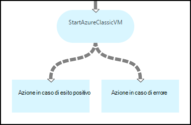
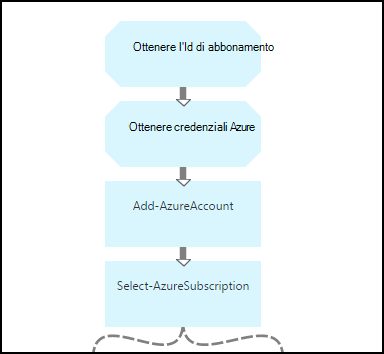
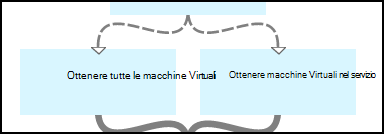
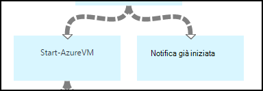
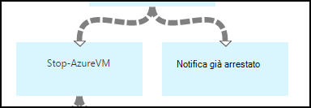
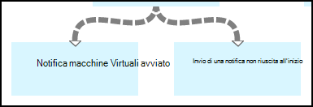
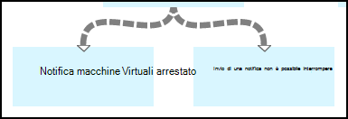

<properties 
    pageTitle="Avviare e arrestare macchine virtuali - grafico | Microsoft Azure"
    description="Versione del flusso di lavoro di PowerShell di uno scenario di automazione di Azure inclusi runbook per avviare e arrestare classiche macchine virtuali."
    services="automation"
    documentationCenter=""
    authors="mgoedtel"
    manager="jwhit"
    editor="tysonn" />
<tags 
    ms.service="automation"
    ms.devlang="na"
    ms.topic="article"
    ms.tgt_pltfrm="na"
    ms.workload="infrastructure-services"
    ms.date="07/06/2016"
    ms.author="bwren" />

# Azure scenario di automazione - avviare e arrestare macchine virtuali

Questo scenario di automazione di Azure include runbook per avviare e arrestare macchine virtuali classiche.  È possibile utilizzare questo scenario per una delle operazioni seguenti:  

- Utilizzare runbook senza alcuna modifica nel proprio ambiente. 
- Modificare runbook per eseguire le funzionalità personalizzate.  
- Chiamare il runbook da un'altra runbook come parte di una soluzione completa. 
- Utilizzare la runbook come esercitazioni per scoprire runbook authoring concetti. 

> [AZURE.SELECTOR]
- [Grafica](automation-solution-startstopvm-graphical.md)
- [Flusso di lavoro di PowerShell](automation-solution-startstopvm-psworkflow.md)

Questa è la versione runbook grafica di questo scenario. È inoltre disponibile tramite [runbook PowerShell del flusso di lavoro](automation-solution-startstopvm-psworkflow.md).

## Guida lo scenario

In questo scenario è composto da due due runbook grafici che è possibile scaricare uno dei collegamenti seguenti.  Vedere la [versione del flusso di lavoro di PowerShell](automation-solution-startstopvm-psworkflow.md) di questo scenario per i collegamenti a runbook PowerShell del flusso di lavoro.

| Runbook | Collegamento | Tipo | Descrizione |
|:---|:---|:---|:---|
| StartAzureClassicVM | [Avviare Runbook grafica Azure macchine Virtuali classica](https://gallery.technet.microsoft.com/scriptcenter/Start-Azure-Classic-VM-c6067b3d) | Grafica | Avvia tutte le macchine virtuali classiche in un abbonamento a Azure o tutte le macchine virtuali con un nome di servizio specifico. |
| StopAzureClassicVM | [Interrompere Runbook grafica Azure macchine Virtuali classica](https://gallery.technet.microsoft.com/scriptcenter/Stop-Azure-Classic-VM-397819bd) | Grafica | Si interrompe tutte le macchine virtuali in un account di automazione o tutte le macchine virtuali con un nome di servizio specifico.  |

## Installare e configurare lo scenario

### 1. installare il runbook

Dopo avere scaricato la runbook, è possibile importarle con la procedura nelle [procedure runbook grafica](automation-graphical-authoring-intro.md#graphical-runbook-procedures).

### 2. rivedere la descrizione e requisiti
I runbook includere un'attività denominata **Leggimi** che include una descrizione e risorse necessarie.  È possibile visualizzare le informazioni selezionando l'attività **Leggimi** e quindi il parametro **Dello Script di flusso di lavoro** .  È anche possibile ottenere le stesse informazioni in questo articolo. 

### 3. configurare risorse
I runbook richiedono le risorse seguenti che è necessario creare e popolare con i valori appropriati.  I nomi siano predefinito.  Se si specificano i nomi nei [parametri di input](#using-the-runbooks) quando si avvia dal runbook, è possibile utilizzare risorse con nomi diversi.

| Tipo di risorsa | Nome predefinito | Descrizione |
|:---|:---|:---|:---|
| [Credenziali](automation-credentials.md) | AzureCredential | Contiene le credenziali per un account che dispone di autorizzazioni per avviare e arrestare macchine virtuali nella sottoscrizione Azure.  |
| [Variabile](automation-variables.md) | AzureSubscriptionId | Contiene l'ID di sottoscrizione dell'abbonamento Azure. |

## Utilizzo dello scenario

### Parametri

Ogni runbook sono i seguenti [parametri di input](automation-starting-a-runbook.md#runbook-parameters).  È necessario fornire i valori per tutti i parametri obbligatori e può facoltativamente fornire i valori per gli altri parametri in base ai propri requisiti.

| Parametro | Tipo | Obbligatorio | Descrizione |
|:---|:---|:---|:---|
| Nome | stringa | No | Se viene fornito un valore, quindi tutte le macchine virtuali con lo stesso nome servizio avvio o interruzione.  Se viene specificato alcun valore, tutte le macchine virtuali classiche nella sottoscrizione Azure sono avviate o interrotto. |
| AzureSubscriptionIdAssetName | stringa | No | Contiene il nome della [variabile risorse](#installing-and-configuring-the-scenario) che contiene l'ID di sottoscrizione dell'abbonamento Azure.  Se non si specifica un valore, viene utilizzato *AzureSubscriptionId* .  |
| AzureCredentialAssetName | stringa | No | Contiene il nome del [bene credenziali](#installing-and-configuring-the-scenario) che contiene le credenziali per runbook da usare.  Se non si specifica un valore, viene utilizzato *AzureCredential* .  |

### Avviare il runbook

È possibile usare uno dei metodi in [avvio runbook in Azure automazione](automation-starting-a-runbook.md) per avviare entrambi i runbook in questo articolo.

I comandi di esempio seguente viene utilizzato Windows PowerShell per eseguire **StartAzureClassicVM** per iniziare a tutte le macchine virtuali con il nome del servizio *MyVMService*.

    $params = @{"ServiceName"="MyVMService"}
    Start-AzureAutomationRunbook –AutomationAccountName "MyAutomationAccount" –Name "StartAzureClassicVM" –Parameters $params

### Output

I runbook verranno [un messaggio di output](automation-runbook-output-and-messages.md) per ogni macchina virtuale che indica l'istruzione avviare o arrestare è stato inviato correttamente o meno.  È possibile cercare una stringa specifica nell'output per determinare il risultato di ogni runbook.  Nella tabella seguente sono elencate le stringhe di output possibili.

| Runbook | Condizione | Messaggio |
|:---|:---|:---|
| StartAzureClassicVM | Sono già in esecuzione  | MyVM è già in esecuzione |
| StartAzureClassicVM | Richiesta di avvio per la macchina virtuale inviata correttamente | È stato avviato MyVM |
| StartAzureClassicVM | Richiesta di avvio per la macchina virtuale non è riuscita  | Impossibile avviare MyVM |
| StopAzureClassicVM | Sono già in esecuzione  | MyVM è già stato interrotto |
| StopAzureClassicVM | Richiesta di avvio per la macchina virtuale inviata correttamente | È stato avviato MyVM |
| StopAzureClassicVM | Richiesta di avvio per la macchina virtuale non è riuscita  | Impossibile avviare MyVM |

Di seguito è un'immagine dell'utilizzo **StartAzureClassicVM** come un [figlio runbook](automation-child-runbooks.md) nell'esempio di runbook grafica.  Utilizza i collegamenti condizionale nella tabella seguente.

| Collegamento | Criteri |
|:---|:---|
| Collegamento di successo | $ActivityOutput ['StartAzureClassicVM']-ad esempio "\* è stato avviato"    |
| Collegamento di errore   | $ActivityOutput ['StartAzureClassicVM']-notlike "\* è stato avviato" |

## Descrizione dettagliata

Di seguito è una descrizione dettagliata di runbook in questo scenario.  È possibile utilizzare queste informazioni per personalizzare il runbook o semplicemente per imparare dai loro per la modifica dei propri scenari di automazione.
 

### Autenticazione

Dal runbook inizia con le attività per impostare le [credenziali](automation-configuring.md#configuring-authentication-to-azure-resources) e Azure abbonamento che verrà utilizzato per il resto dal runbook.

Le prime due attività, **Ottenere Id abbonamento** e **Ottenere le credenziali di Azure**, recupero i [beni](#installing-the-runbook) utilizzati da due attività.  Le attività potrebbero specificare direttamente le risorse, ma hanno bisogno i nomi delle risorse.  Poiché si consente all'utente di specificare i nomi dei [parametri di input](#using-the-runbooks), è necessario queste attività per recuperare i beni con un nome specificato da un parametro di input.

**Aggiungi AzureAccount** imposta le credenziali che verranno utilizzate per il resto dal runbook.  Asset credenziali recuperato in modo da **Ottenere credenziali Azure** deve avere accesso per avviare e arrestare macchine virtuali nella sottoscrizione Azure.  L'abbonamento a cui viene utilizzato sia selezionato come impostazione **Selezionare AzureSubscription** che utilizza l'abbonamento Id da **Ottenere Id abbonamento**.

### Ottenere macchine virtuali

Dal runbook deve determinare quali macchine virtuali verranno utilizzo e se sono già stato avviati o arrestati (a seconda dal runbook).   Uno dei due attività verrà recuperato macchine virtuali.  Se il parametro di input *nome* per il runbook contiene un valore, si eseguirà **Ottenere macchine virtuali nel servizio** .  **Ottenere tutte le macchine virtuali** verrà eseguita se il parametro di input *nome* per il runbook non contiene un valore.  Questa logica viene eseguita mediante i collegamenti condizionale che precede ciascuna attività.

Entrambe le attività usare il cmdlet **Get-AzureVM** .  **Ottenere tutte le macchine virtuali** utilizza il parametro **ListAllVMs** impostato per restituire tutte le macchine virtuali.  **Ottenere macchine virtuali nel servizio** viene utilizzato il set di parametro **GetVMByServiceAndVMName** e fornisce il parametro di input **nome** per il parametro **nome** .  

### Unire macchine virtuali

È necessario per fornire input alle **Start AzureVM** che richiede il nome e il nome del servizio di vm(s) per avviare attività **Macchine virtuali di unione** .  Tale input possono provenire da **Ottenere tutte le macchine virtuali** o **Ottenere macchine virtuali nel servizio**, ma **Inizio AzureVM** solo possibile specificare un'attività per l'input.   

Lo scenario consiste nel creare **Macchine virtuali di unione** che viene eseguito il cmdlet di **Output di scrittura** .  Il parametro **InputObject** per tale cmdlet è un'espressione di PowerShell che combina l'input di due attività precedente.  Solo uno di tali attività verrà eseguita, in modo che solo un insieme di output è previsto.  **Inizio AzureVM** possibile utilizzare l'output per parametri di input. 

### Inizio/fine macchine virtuali

 

A seconda runbook, le attività successive tentano di avviare o arrestare runbook usando **AzureVM Start** o **Stop AzureVM**.  Poiché l'attività è preceduta da un collegamento pipeline, verrà eseguito una volta per ogni oggetto restituito da **Unire macchine virtuali**.  Il collegamento è subordinato, in modo che le attività verranno eseguite solo se *RunningState* della macchina virtuale viene *interrotto* per **Inizio AzureVM** e *Introduzione* per **AzureVM Interrompi**. Se non si verifica questa condizione, **Una notifica già stata avviata** o **Una notifica già interrotto** viene eseguito per inviare un messaggio usando **Output di scrittura**.

### Inviare l'output

 

Il passaggio finale dal runbook è per inviare l'output se la richiesta di avviare o arrestare per ogni macchina virtuale è stata inviata correttamente. Esiste una diversa attività di **Output di scrittura** per ogni, e si determinare quale per l'esecuzione con collegamenti condizionale.  **Notifica avviato macchine Virtuali** o **Una notifica arrestato macchine Virtuali** viene eseguito se *OperationStatus* non è *riuscita*.  Se *OperationStatus* è un valore qualsiasi, viene eseguita **Una notifica Failed per avviare** o **Una notifica non è riuscito a Interrompi** .

## Passaggi successivi

- [Creazione condivisa in Azure automazione con interfaccia grafica](automation-graphical-authoring-intro.md)
- [Runbook figlio nel modello di automazione Azure](automation-child-runbooks.md) 
- [Output runbook e messaggi di automazione di Azure](automation-runbook-output-and-messages.md)