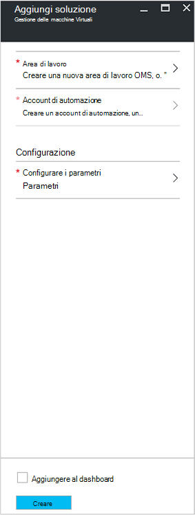
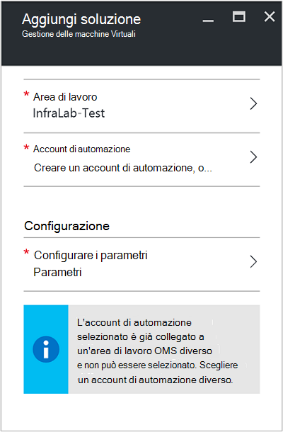
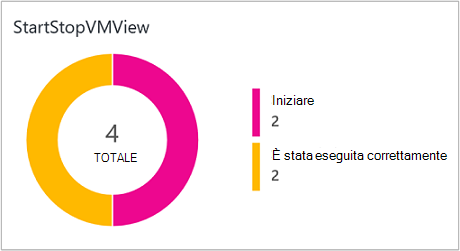
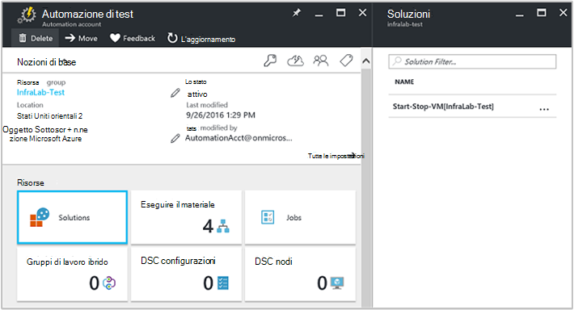
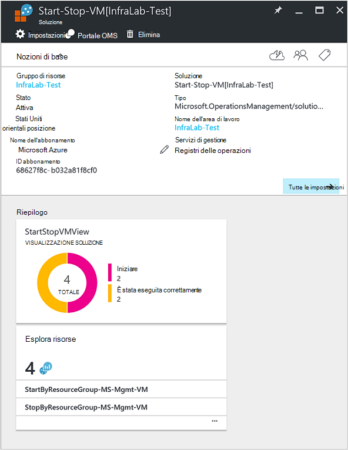

<properties
    pageTitle="Inizio/fine macchine virtuali durante l'orario di lavoro [anteprima] soluzione | Microsoft Azure"
    description="Le soluzioni di gestione delle macchine Virtuali avvia e interrompe macchine virtuali di Azure Manager delle risorse in base alla pianificazione e monitorare da Log Analitica."
    services="automation"
    documentationCenter=""
    authors="MGoedtel"
    manager="jwhit"
    editor=""
    />
<tags
    ms.service="automation"
    ms.workload="tbd"
    ms.tgt_pltfrm="na"
    ms.devlang="na"
    ms.topic="get-started-article"
    ms.date="10/07/2016"
    ms.author="magoedte"/>

# Macchine virtuali di inizio/fine durante la soluzione di orario di lavoro [anteprima] in automazione

Macchine virtuali inizio/fine durante la soluzione orario di lavoro [anteprima] avvia e interrompe macchine virtuali Manager delle risorse Azure su una pianificazione definita dall'utente e fornisce approfondimenti il successo dei processi automazione avviare e arrestare macchine virtuali con OMS Log Analitica.  

## Prerequisiti

- I runbook funziona con un [account Azure Esegui come](automation-sec-configure-azure-runas-account.md).  L'account Esegui come è il metodo di autenticazione preferito poiché utilizza l'autenticazione certificato invece di una password che può scadere o modificati di frequente.  

- Questa soluzione è possibile gestire solo macchine virtuali che si trovano nella stessa sottoscrizione e gruppo di risorse in cui si trova l'account di automazione.  

- Questa soluzione viene distribuito solo alle seguenti aree di Azure - Australia Sudest, Stati Uniti orientali, Sudest asiatico ed Europa occidentale.  Runbook che consentono di gestire la pianificazione di macchine Virtuali è possibile assegnare macchine virtuali in un'area.  

- Per inviare notifiche tramite posta elettronica runbook di macchine Virtuali start e stop completato, è necessario un abbonamento aziendale a Office 365.  

## Componenti della soluzione

Questa soluzione include le seguenti risorse che verranno importate e aggiunto al proprio account di automazione.

### Runbook

Runbook | Descrizione|
--------|------------|
CleanSolution-MS-gestione-macchine Virtuali | Questo runbook comporta la rimozione tutto il risorse e le pianificazioni quando si passa a eliminare la soluzione dall'abbonamento.|  
Gestione di MS SendMailO365 | Questo runbook invia un messaggio di posta elettronica tramite Exchange di Office 365.|
StartByResourceGroup-MS-gestione-macchine Virtuali | Questo runbook viene usata per iniziare a macchine virtuali (entrambi classica e processore basato su macchine virtuali) che si trova in un elenco di gruppi di risorse Azure specificato.
StopByResourceGroup-MS-gestione-macchine Virtuali | Questo runbook viene usata per interrompere la macchine virtuali (entrambi classica e processore basato su macchine virtuali) che si trova in un elenco di gruppi di risorse Azure specificato.|
 

### Variabili

Variabile | Descrizione|
---------|------------|
**Gestione di MS SendMailO365** Runbook ||
SendMailO365-IsSendEmail-MS-gestione | Specifica se StartByResourceGroup-MS-gestione-macchine Virtuali e runbook StopByResourceGroup-MS-gestione-macchine Virtuali possono inviare notifica tramite posta elettronica dopo il completamento.  Selezionare **True** per attivare e **Falso** per disabilitare gli avvisi di posta elettronica. Valore predefinito è **False**.| 
**StartByResourceGroup-MS-gestione-macchine Virtuali** Runbook ||
StartByResourceGroup-ExcludeList-MS-gestione-macchine Virtuali | Immettere i nomi di macchine Virtuali da escludere dall'operazione di gestione. separare i nomi utilizzando semi-colon(;). I valori sono maiuscole e minuscole e con caratteri jolly (asterisco) è supportata.|
StartByResourceGroup-SendMailO365-EmailBodyPreFix-MS-gestione | Testo che può essere aggiunto all'inizio del corpo del messaggio di posta elettronica.|
StartByResourceGroup-SendMailO365-EmailRunBookAccount-MS-gestione | Specifica il nome dell'Account di automazione contenente dal runbook di posta elettronica.  **Non modificare questa variabile.**|
StartByResourceGroup-SendMailO365-EmailRunbookName-MS-gestione | Specifica il nome dal runbook di posta elettronica.  Viene utilizzato dal runbook StopByResourceGroup-MS-gestione-macchine Virtuali StartByResourceGroup-MS-gestione-macchine Virtuali di inviare posta elettronica.  **Non modificare questa variabile.**|
StartByResourceGroup-SendMailO365-EmailRunbookResourceGroup-MS-gestione | Specifica il nome del gruppo di risorse contenente dal runbook di posta elettronica.  **Non modificare questa variabile.**|
StartByResourceGroup-SendMailO365-EmailSubject-MS-gestione | Specifica il testo per l'oggetto del messaggio di posta elettronica.|  
StartByResourceGroup-SendMailO365-EmailToAddress-MS-gestione | Specifica i destinatari del messaggio di posta elettronica.  Immettere i nomi separati utilizzando semi-colon(;).|
StartByResourceGroup-TargetResourceGroups-MS-gestione-macchine Virtuali | Immettere i nomi di macchine Virtuali da escludere dall'operazione di gestione. separare i nomi utilizzando semi-colon(;). I valori sono maiuscole e minuscole e con caratteri jolly (asterisco) è supportata.  Valore predefinito (asterisco) includerà tutti i gruppi di risorse nella sottoscrizione.|
StartByResourceGroup-TargetSubscriptionID-MS-gestione-macchine Virtuali | Specifica l'abbonamento che contiene macchine virtuali essere gestiti da questa soluzione.  Deve essere lo stesso abbonamento in cui si trova l'account di automazione di questa soluzione.|
**StopByResourceGroup-MS-gestione-macchine Virtuali** Runbook ||
StopByResourceGroup-ExcludeList-MS-gestione-macchine Virtuali | Immettere i nomi di macchine Virtuali da escludere dall'operazione di gestione. separare i nomi utilizzando semi-colon(;). I valori sono maiuscole e minuscole e con caratteri jolly (asterisco) è supportata.|
StopByResourceGroup-SendMailO365-EmailBodyPreFix-MS-gestione | Testo che può essere aggiunto all'inizio del corpo del messaggio di posta elettronica.|
StopByResourceGroup-SendMailO365-EmailRunBookAccount-MS-gestione | Specifica il nome dell'Account di automazione contenente dal runbook di posta elettronica.  **Non modificare questa variabile.**|
StopByResourceGroup-SendMailO365-EmailRunbookResourceGroup-MS-gestione | Specifica il nome del gruppo di risorse contenente dal runbook di posta elettronica.  **Non modificare questa variabile.**|
StopByResourceGroup-SendMailO365-EmailSubject-MS-gestione | Specifica il testo per l'oggetto del messaggio di posta elettronica.|  
StopByResourceGroup-SendMailO365-EmailToAddress-MS-gestione | Specifica i destinatari del messaggio di posta elettronica.  Immettere i nomi separati utilizzando semi-colon(;).|
StopByResourceGroup-TargetResourceGroups-MS-gestione-macchine Virtuali | Immettere i nomi di macchine Virtuali da escludere dall'operazione di gestione. separare i nomi utilizzando semi-colon(;). I valori sono maiuscole e minuscole e con caratteri jolly (asterisco) è supportata.  Valore predefinito (asterisco) includerà tutti i gruppi di risorse nella sottoscrizione.|
StopByResourceGroup-TargetSubscriptionID-MS-gestione-macchine Virtuali | Specifica l'abbonamento che contiene macchine virtuali essere gestiti da questa soluzione.  Deve essere lo stesso abbonamento in cui si trova l'account di automazione di questa soluzione.|  
 

### Pianificazioni

Programmazione | Descrizione|
---------|------------|
StartByResourceGroup-programmazione-MS-gestione | Pianificazione per runbook StartByResourceGroup, che consente di eseguire l'avvio di macchine virtuali gestite da questa soluzione.|
StopByResourceGroup-programmazione-MS-gestione | Pianificazione per runbook StopByResourceGroup, che consente di eseguire l'arresto di macchine virtuali gestite da questa soluzione.|

### Credenziali

Credenziali | Descrizione|
-----------|------------|
O365Credential | Specifica un account utente di Office 365 valido per l'invio di posta elettronica.  Obbligatorio solo se variabile SendMailO365-IsSendEmail-MS-gestione è impostato su **True**.

## Configurazione

Eseguire la procedura seguente per aggiungere le macchine virtuali inizio/fine durante la soluzione orario di lavoro [anteprima] al proprio account di automazione e quindi configurare le variabili per personalizzare la soluzione.

1. Nella schermata home nel portale di Azure, selezionare il riquadro **Marketplace** .  Se il riquadro non è più bloccato alla schermata di casa, dal riquadro di spostamento sinistra selezionare **Nuovo**.  
2. In e il Marketplace digitare **Avviare macchine Virtuali** nella casella di ricerca e quindi selezionare la soluzione **Macchine virtuali di avviare o arrestare l'orario [anteprima]** dai risultati della ricerca.  
3. In blade **Macchine virtuali di avviare o arrestare l'orario [anteprima]** per la soluzione selezionata, rivedere le informazioni di riepilogo e quindi fare clic su **Crea**.  
4. E **l'Aggiungi soluzione** viene visualizzato nel punto in cui viene richiesto di configurare la soluzione prima che è possibile importare in abbonamento automazione.     
5.  Nella e **Aggiungi soluzione** , selezionare **l'area di lavoro** e selezionare un'area di lavoro OMS collegata alla sottoscrizione di Azure stesso che l'account di automazione o crea una nuova area di lavoro OMS.  Se non si dispone di un'area di lavoro OMS, è possibile selezionare **Crea nuova area di lavoro** e nella e **OMS dell'area di lavoro** eseguire le operazioni seguenti: 
   - Specificare un nome per la nuova **Area di lavoro OMS**.
   - Selezionare un **abbonamento** a cui collegarsi selezionare dall'elenco a discesa se selezionata l'impostazione predefinita non è appropriato.
   - Per **Gruppo di risorse**, è possibile creare un nuovo gruppo di risorse o selezionare un gruppo di risorse esistenti.  
   - Selezionare un **percorso**.  Attualmente solo le posizioni previste selezione sono **Australia Sudest**, **Stati Uniti orientali**, **Sudest asiatico**ed **Europa occidentale**.
   - Selezionare un **livello di prezzi**.  La soluzione è disponibile in due livelli: liberare e OMS pagato livello.  Il livello gratuito ha un limite per la quantità di dati raccolti ogni giorno, periodo di conservazione e runbook processo runtime minuti.  Il livello OMS pagato non ha un limite per la quantità di dati raccolti ogni giorno.  

        > [AZURE.NOTE]
        > Mentre autonoma pagato livello viene visualizzata come opzione, non è applicabile.  Se si selezionarla e procedere con la creazione di questa soluzione l'abbonamento, non viene eseguito.  Questa operazione verrà indirizzata al rilascio ufficiale di questa soluzione. Se si utilizza questa soluzione, verrà solo utilizzare i minuti di processo di automazione e accedere acquisizione.  La soluzione non aggiungere altri nodi OMS al proprio ambiente.  

6. Dopo avere fornito le informazioni richieste nella e **lavoro OMS** , fare clic su **Crea**.  Durante la verifica le informazioni e creato l'area di lavoro, è possibile tenere traccia dello stato di avanzamento in **notifiche** dal menu di scelta.  Tornerà alla e **Aggiungi soluzione** .  
7. Scegliere **Account di automazione**e **l'Aggiungi soluzione** .  Se si sta creando una nuova area di lavoro OMS, sarà necessario anche creare un nuovo account di automazione che sarà associato con la nuova area OMS specificata in precedenza, tra cui la sottoscrizione Azure, gruppo di risorse e opzioni internazionali.  È possibile selezionare **Crea un account di automazione** e nella e **conto aggiungere automazione** , specificare le operazioni seguenti: 
  - Nel campo **nome** immettere il nome dell'account di automazione.

    Tutte le altre opzioni popolati automaticamente in base nell'area di lavoro OMS selezionata e non è possibile modificare queste opzioni.  Un account Azure Esegui come il metodo di autenticazione predefinito per runbook inclusi in questa soluzione.  Dopo aver fatto clic su **OK**, le opzioni di configurazione sono convalidate e l'account di automazione viene creato.  È possibile tenere traccia dello stato di avanzamento in **notifiche** dal menu di scelta. 

    In caso contrario, è possibile selezionare un account esistente come eseguire l'automazione.  Verranno presentate le note che l'account selezionato non è già essere collegato a un'altra area di lavoro OMS, in caso contrario un messaggio nel e per informare l'utente.  Se è già stato collegato, sarà necessario selezionare un altro account di automazione Esegui come o crearne uno nuovo.    

8. Infine scegliere **configurazione** e **l'Aggiungi soluzione** e viene visualizzata e il **parametri** .  In e il **parametri** , viene chiesto di:  
   - Specificare i **Nomi di destinazione ResourceGroup**, che è il nome di un gruppo di risorse contenente macchine virtuali essere gestiti da questa soluzione.  È possibile immettere più di un nome e separare ogni voce con un punto e virgola (valori sono maiuscole e minuscole).  Utilizzo di caratteri jolly è supportata se si desidera destinazione macchine virtuali in tutti i gruppi di risorse nella sottoscrizione.
   - Selezionare una **pianificazione** è una data e ora per avviare e arrestare la macchine Virtuali in gruppi di risorse di destinazione ricorrente.  

10. Dopo aver completato la configurazione delle impostazioni iniziali necessari per la soluzione, selezionare **Crea**.  Verranno convalidate tutte le impostazioni e quindi tenterà di distribuire la soluzione nell'abbonamento.  Questo processo può richiedere alcuni secondi e tenere traccia dello stato di avanzamento in **notifiche** dal menu di scelta. 

## Frequenza di raccolta

Automazione processi log e processo flusso i dati vengono acquisiti repository OMS 5 minuti.  

## Utilizzo della soluzione

Quando si aggiunge la soluzione di gestione delle macchine Virtuali, nell'area di lavoro OMS **StartStopVM visualizzazione** affiancata verrà aggiunti al dashboard OMS.  Questa sezione vengono visualizzati un conteggio dei rappresentazione grafica di processi runbook per la soluzione che ha avviato e completate.     

Nell'account di automazione, è possibile accedere e gestire la soluzione selezionando il riquadro di **soluzioni** e quindi da e il **soluzioni** selezionando la soluzione **Start-Interrompi macchine Virtuali [area di lavoro]** dall'elenco.     

La scelta della soluzione verrà visualizzati e il soluzione **Start-Interrompi macchine Virtuali [area di lavoro]** , in cui è possibile esaminare include dettagli importanti, ad esempio il riquadro **StartStopVM** , ad esempio nell'area di lavoro OMS, che consente di visualizzare un conteggio e rappresentazione grafica di processi runbook per la soluzione che ha avviato e completate.     

Da qui è possibile aprire l'area di lavoro OMS e analisi record posizione lavorativa.  È sufficiente fare clic su **tutte le impostazioni**e in e **l'Impostazioni** selezionare **Avvio rapido** e quindi selezionare **Portale OMS**e **l'Avvio rapido** .   Verrà aperta una nuova scheda o una nuova sessione del browser e presentare l'area di lavoro OMS associato con l'account di automazione e la sottoscrizione.  

### Configurazione delle notifiche di posta elettronica

Per attivare le notifiche di posta elettronica quando il runbook macchine Virtuali completa, che è necessario modificare **O365Credential** inizio e fine delle credenziali e almeno le seguenti variabili:

 - SendMailO365-IsSendEmail-MS-gestione
 - StartByResourceGroup-SendMailO365-EmailToAddress-MS-gestione
 - StopByResourceGroup-SendMailO365-EmailToAddress-MS-gestione

Per configurare le credenziali **O365Credential** , procedere come segue:

1. Dal proprio account di automazione, fare clic su **Tutte le impostazioni** nella parte superiore della finestra. 
2. Scegliere **attività**e **l'Impostazioni** nella sezione **Risorse di automazione**. 
3. In e il **risorse** , selezionare il riquadro **delle credenziali** e quindi scegliere **O365Credential**e il **credenziali** .  
4. Immettere un nome utente di Office 365 valido e la password e quindi fare clic su **Salva** per salvare le modifiche.  

Per configurare le variabili evidenziate in precedenza, procedere come segue:

1. Dal proprio account di automazione, fare clic su **Tutte le impostazioni** nella parte superiore della finestra. 
2. Scegliere **attività**e **l'Impostazioni** nella sezione **Risorse di automazione**. 
3. In e il **risorse** , selezionare il riquadro di **variabili** ed e il **variabili** , selezionare la variabile nell'elenco precedente e quindi modificare il relativo valore successivo la descrizione specificata nella sezione [variabile](##variables) in precedenza.  
4. Fare clic su **Salva** per salvare le modifiche alla variabile.   

### Modificare la pianificazione di avvio e di chiusura

Gestire la pianificazione di avvio e di chiusura in questa soluzione segue gli stessi passaggi come descritto nella [programmazione runbook di automazione di Azure](automation-scheduling-a-runbook.md).  Tenere presente che non è possibile modificare la configurazione della pianificazione.  È necessario disabilitare la pianificazione esistente e quindi crearne uno nuovo e quindi creare un collegamento a **StartByResourceGroup-MS-gestione-macchina virtuale** o runbook **StopByResourceGroup-MS-gestione-macchine Virtuali** che si desidera per applicare per la pianificazione.   

## Registro Analitica record

Automazione crea due tipi di record nell'archivio OMS.

### Log di processo

Proprietà | Descrizione|
----------|----------|
Chiamante |  Chi ha iniziato l'operazione.  Valori possibili sono un indirizzo di posta elettronica o sistema per i processi pianificati.|
Categoria | Classificazione del tipo di dati.  Per l'automazione, il valore è JobLogs.|
CorrelationId | GUID che rappresenta l'Id di correlazione del processo di runbook.|
ID processo | GUID che corrisponde all'Id del processo di runbook.|
Invece | Specifica il tipo di operazione eseguita in Azure.  Per l'automazione, il valore sarà processo.|
resourceId | Specifica il tipo di risorsa in Azure.  Per l'automazione, il valore è l'account di automazione associato dal runbook.|
ResourceGroup | Specifica il nome del gruppo di risorse del processo di runbook.|
ResourceProvider | Specifica il servizio di Azure che fornisce le risorse è possibile distribuire e gestire.  Per l'automazione, il valore è l'automazione Azure.|
Tipo di risorsa | Specifica il tipo di risorsa in Azure.  Per l'automazione, il valore è l'account di automazione associato dal runbook.|
dell'enumeratore | Lo stato del processo di runbook.  Valori possibili sono: -Avviato -Arrestato -Sospesa -Non è riuscito -Ha avuto esito positivo|
resultDescription | Descrive lo stato di risultato runbook processo.  Valori possibili sono: -Avvio processo -Processo non è riuscito -Processo completato|
RunbookName | Specifica il nome dal runbook.|
SourceSystem | Specifica il sistema di origine per i dati inviati.  Per l'automazione, il valore sarà: OpsManager|
StreamType | Specifica il tipo di evento. Valori possibili sono: -Dettagliato -Output -Errore -Avviso|
SubscriptionId | Specifica l'ID di sottoscrizione del processo.
Ora | Data e ora durante il processo di runbook eseguito.|

### Flussi di lavoro

Proprietà | Descrizione|
----------|----------|
Chiamante |  Chi ha iniziato l'operazione.  Valori possibili sono un indirizzo di posta elettronica o sistema per i processi pianificati.|
Categoria | Classificazione del tipo di dati.  Per l'automazione, il valore è JobStreams.|
ID processo | GUID che corrisponde all'Id del processo di runbook.|
Invece | Specifica il tipo di operazione eseguita in Azure.  Per l'automazione, il valore sarà processo.|
ResourceGroup | Specifica il nome del gruppo di risorse del processo di runbook.|
resourceId | Specifica la risorsa Id in Azure.  Per l'automazione, il valore è l'account di automazione associato dal runbook.|
ResourceProvider | Specifica il servizio di Azure che fornisce le risorse è possibile distribuire e gestire.  Per l'automazione, il valore è l'automazione Azure.|
Tipo di risorsa | Specifica il tipo di risorsa in Azure.  Per l'automazione, il valore è l'account di automazione associato dal runbook.|
dell'enumeratore | Il risultato del processo di runbook in fase di che generazione dell'evento.  Valori possibili sono: -In corso|
resultDescription | Include il flusso di output dal runbook.|
RunbookName | Il nome dal runbook.|
SourceSystem | Specifica il sistema di origine per i dati inviati.  Per l'automazione, il valore sarà OpsManager|
StreamType | Il tipo di flusso del processo. Valori possibili sono: -Lo stato di avanzamento -Output -Avviso -Errore -Debug -Dettagliato|
Ora | Data e ora durante il processo di runbook eseguito.|

Quando si esegue una ricerca di log che restituisce i record di categoria di **JobLogs** o **JobStreams**, è possibile selezionare la visualizzazione **JobLogs** o **JobStreams** che visualizza una serie di riquadri riepilogare gli aggiornamenti restituiti dalla ricerca.

## Ricerche dei registri di esempio

La tabella seguente contiene log esempio Cerca record posizione lavorativa raccolte da questa soluzione. 

Query | Descrizione|
----------|----------|
Trovare i processi di runbook StartVM che sono stati completati correttamente | Categoria = JobLogs RunbookName_s = dell'enumeratore "StartByResourceGroup-MS-gestione-macchina. virtuale" = ha avuto esito positivo & #124; misurare Count da JobId_g|
Trovare i processi di runbook StopVM che sono stati completati correttamente | Categoria = JobLogs RunbookName_s = dell'enumeratore "StartByResourceGroup-MS-gestione-macchina. virtuale" = non è riuscita & #124; misurare Count da JobId_g
Visualizzare lo stato dei processi nel tempo per runbook StartVM e StopVM | Categoria = JobLogs RunbookName_s = NOT(ResultType="started") "StartByResourceGroup-MS-gestione-macchina. virtuale" o "StopByResourceGroup-MS-gestione-macchina. virtuale" | misurare Count () in base all'intervallo dell'enumeratore 1 giorno|

## Passaggi successivi

- Per ulteriori informazioni su come creare query di ricerca diversi e rivedere i registri di processo di automazione con registro Analitica, vedere [Log ricerche nel registro Analitica](../log-analytics/log-analytics-log-searches.md)
- Per ulteriori informazioni sull'esecuzione runbook, come per monitorare runbook processi e altri dettagli tecnici, vedere [tenere traccia di un processo runbook](automation-runbook-execution.md)
- Per ulteriori informazioni su OMS Log Analitica e origini dati insieme, vedere [la raccolta di Azure lo spazio di archiviazione dati di panoramica Analitica Log](../log-analytics/log-analytics-azure-storage.md)

   

