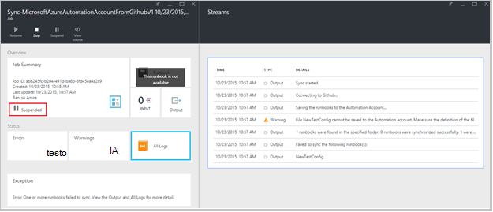

<properties 
    pageTitle=" Integrazione del controllo in Azure automazione di origine | Microsoft Azure"
    description="In questo articolo viene descritta l'integrazione di controllo di origine con GitHub in Azure automazione."
    services="automation"
    documentationCenter=""
    authors="mgoedtel"
    manager="jwhit"
    editor="tysonn" />    
<tags 
    ms.service="automation"
    ms.devlang="na"
    ms.topic="article"
    ms.tgt_pltfrm="na"
    ms.workload="infrastructure-services"
    ms.date="09/12/2016"
    ms.author="magoedte;sngun" />

# Integrazione del controllo origine di automazione di Azure

Integrazione del controllo origine consente di associare runbook nell'account automazione a un archivio di controllo origine GitHub. Controllo del codice sorgente consente di collaborare con il team, tenere traccia delle modifiche e ripristinare versioni precedenti delle runbook. Ad esempio, il codice sorgente consente di sincronizzare diversi rami nel controllo di origine per gli account di automazione sviluppo, test o produzione, rendendo più semplice alzare di livello codice che è stato verificato nel proprio ambiente di sviluppo per l'account di automazione di produzione.

Controllo del codice sorgente consente di inserire codice da Azure automazione al controllo origine o estrarre i runbook dal controllo origine per l'automazione Azure. In questo articolo descrive come impostare il controllo di origine nel proprio ambiente di automazione di Azure. Iniziamo configurando automazione Azure per accedere a repository GitHub e scorrere diverse operazioni che possono essere eseguite con integrazione del controllo origine. 

>[AZURE.NOTE]Controllo del codice sorgente supporta l'estrazione e inserendo [runbook PowerShell del flusso di lavoro](automation-runbook-types.md#powershell-workflow-runbooks) , nonché [runbook PowerShell](automation-runbook-types.md#powershell-runbooks). [Grafica runbook](automation-runbook-types.md#graphical-runbooks) non sono ancora supportate.  

Sono disponibili due semplici passaggi necessari per configurare il controllo di origine per l'account di automazione e solo se si dispone già di un account GitHub. Sono:
## Passaggio 1: creare un archivio GitHub

Se si dispone già di un account GitHub e un repository che si desidera creare un collegamento a Azure automazione e quindi accedere al proprio account esistente e si avvia dal passaggio 2 riportata di seguito. In caso contrario, spostarsi [GitHub](https://github.com/), segno di backup di un nuovo account e [creare un nuovo repository](https://help.github.com/articles/create-a-repo/).

## Passaggio 2: configurare il codice sorgente in automazione Azure

1. Da e il conto di automazione nel portale di Azure, fare clic su **Imposta controllo origine.** 
 
    

2. Verrà visualizzata e il **Controllo del codice sorgente** in cui è possibile configurare i dettagli dell'account GitHub. Di seguito è l'elenco dei parametri per configurare:  

  	|**Parametro**            |**Descrizione** |
  	|:---|:---| 
  	|Scegliere origine   | Selezionare l'origine. Attualmente è supportato solo **GitHub** . |
  	|Autorizzazione | Fare clic sul pulsante di **autorizzazione** per concedere l'accesso di Azure automazione per l'archivio GitHub. Se si è già connessi al proprio account GitHub in un'altra finestra, vengono utilizzate le credenziali dell'account. Una volta completato l'autorizzazione, e il verrà visualizzato il nome utente GitHub in **Proprietà di autorizzazione**. |
  	|Scegliere archivio | Selezionare un repository GitHub dall'elenco dei repository disponibili. |
  	|Scegliere diramazione | Selezionare un ramo dall'elenco di diramazioni disponibili. Solo il ramo **master** viene visualizzato se non sono state create le diramazioni. |
  	|Percorso della cartella runbook | Il percorso della cartella runbook specifica il percorso del repository GitHub da cui si desidera inserire o estrarre il codice. Devono essere immesse nel formato **/foldername/subfoldername**. Solo runbook nel percorso della cartella runbook verrà sincronizzato con l'account di automazione. Sincronizzare runbook nelle sottocartelle della **non** la verranno runbook percorso cartella. Usare **/** per sincronizzare tutte le runbook in repository. |

3. Ad esempio, se si dispone di un repository denominato **PowerShellScripts** che contiene una cartella denominata **RootFolder**, che contiene una cartella denominata **sottocartella**. È possibile utilizzare le stringhe seguenti per ogni livello di cartella di sincronizzazione:

    1. Per sincronizzare runbook dal **repository**, percorso della cartella runbook è*/*
    2. Per sincronizzare runbook da **RootFolder**, percorso della cartella runbook è */RootFolder*
    3. Per sincronizzare runbook dalla **sottocartella**, percorso della cartella runbook è */RootFolder/SubFolder*.
  

4. Dopo aver configurato i parametri, vengono visualizzati nel **blade Imposta controllo origine.**  
 
    

5. Quando si fa clic su OK, integrazione del controllo origine è ora configurato per l'account di automazione e deve essere aggiornato con le informazioni GitHub. È ora possibile fare clic sulla parte da visualizzare tutti gli cronologia del processo di sincronizzazione di codice sorgente.  

    

6. Dopo aver configurato il codice sorgente, le risorse di automazione seguenti verranno create nell'account di automazione:  
 Vengono create due [variabili risorse](automation-variables.md) .  
      
    * Variabile **Microsoft.Azure.Automation.SourceControl.Connection** contiene i valori della stringa di connessione, come illustrato di seguito.  

  	|**Parametro**            |**Valore** |
  	|:---|:---|
  	| Nome  | Microsoft.Azure.Automation.SourceControl.Connection |
  	| Tipo | Stringa |
  	| Valore  | {"Ramo":\<*il nome del ramo*>, "RunbookFolderPath":\<*percorso della cartella Runbook*>, "ProviderType":\<*è un valore 1 per GitHub*>, "Archivio":\<*nome il repository*>, "Username":\<*nome utente GitHub Your*>} |   

    * Variabile **Microsoft.Azure.Automation.SourceControl.OAuthToken**, contiene il valore crittografato sicuro del OAuthToken.  

  	|**Parametro**            |**Valore** |
  	|:---|:---|
  	| Nome  | Microsoft.Azure.Automation.SourceControl.OAuthToken |
  	| Tipo | Unknown(Encrypted) |
  	| Valore | <*OAuthToken crittografato*> |  

      

    * **Controllo del codice sorgente automazione** viene aggiunto come un'applicazione autorizzata al proprio account GitHub. Per visualizzare l'applicazione: dalla home page GitHub, passare al proprio **profilo** > **Impostazioni** > **applicazioni**. Questa applicazione consente l'automazione Azure sincronizzare l'archivio GitHub a un account di automazione.  

    

## Tramite il codice sorgente di automazione

### Archivia un runbook da Azure automazione al controllo origine

Archiviazione runbook consente di inserire le modifiche apportate a un runbook automazione Azure in repository del controllo del codice sorgente. Di seguito sono riportati i passaggi per un runbook di archiviazione:

1. Dall'automazione Account, [creare un nuovo runbook testuale](automation-first-runbook-textual.md)o [modificare un runbook esistente, testuale](automation-edit-textual-runbook.md). Questo runbook può essere un flusso di lavoro di PowerShell o un runbook script di PowerShell.  

2. Dopo avere modificato il runbook, salvarlo e fare clic su **Archivia** da e il **Modifica** .  

    

     >[AZURE.NOTE] Controllo aggiuntivo di automazione di Azure sovrascriverà il codice presente nel controllo origine. L'istruzione di riga di comando equivalente fra per archiviazione è **fra aggiungere + commit fra + fra push**  

3. Quando si fa clic su **Archivia**, si verrà visualizzato un messaggio di conferma, fare clic su Sì per continuare.  

    

4. Avvio dal runbook controllo origine controllo aggiuntivo: **Sincronizzazione MicrosoftAzureAutomationAccountToGitHubV1**. Questo runbook si connette a GitHub e inserisce le modifiche apportate da Azure automazione per l'archivio. Per visualizzare la cronologia dei processi di controllo, tornare alla scheda **Integrazione del controllo origine** e fare clic per aprire e il Repository sincronizzazione. Questo blade Mostra tutti i processi di controllo di origine.  Selezionare il processo desidera visualizzare e fare clic su per visualizzare i dettagli.  

    

    >[AZURE.NOTE] Origine controllo runbook sono runbook automazione speciale che non è possibile visualizzare o modificare. Mentre non si verranno visualizzati nell'elenco runbook, si vedrà processi di sincronizzazione compare nell'elenco processi.
 
5. Il nome del runbook modificato viene inviato come un parametro di input dal runbook di controllo. È possibile [visualizzare i dettagli](automation-runbook-execution.md#viewing-job-status-using-the-azure-management-portal) espansione runbook blade **Sincronizzazione archivio** .  

    

6. Aggiornare l'archivio GitHub dopo il completamento del processo per visualizzare le modifiche.  All'interno del repository con un messaggio di conferma dovrebbe essere presente un commit: *Nome Runbook *aggiornato ** in Azure Automation.* *  

### Sincronizzazione runbook dal controllo origine all'automazione di Azure 

Pulsante Sincronizza nella e Repository sincronizzazione consente in modo da estrarre tutte le runbook il percorso della cartella runbook il repository al proprio account di automazione. Stesso archivio può essere sincronizzato con più di un account di automazione. Di seguito sono riportati i passaggi per sincronizzare un runbook:

1. Un account di automazione nel punto in cui si imposta il codice sorgente, aprire **blade origine controllo integrazione/archivio sincronizzazione** e fare clic su **Sincronizza** richiesto con un messaggio di conferma, fare clic su **Sì** per continuare.  

    

2. Sincronizzazione verrà avviata dal runbook: **Sincronizzazione MicrosoftAzureAutomationAccountFromGitHubV1**. Questo runbook si connette a GitHub e recupera le modifiche dal repository all'automazione di Azure. Verrà visualizzato un nuovo processo in e il **Repository sincronizzazione** per questa azione. Per visualizzare i dettagli del processo di sincronizzazione, fare clic per aprire e dettagli il processo.  
 
    

 
    >[AZURE.NOTE] Una sincronizzazione dal controllo origine sovrascrive la versione bozza di runbook attualmente presenti nel proprio account di automazione per **tutti** i runbook che appartengono a controllo del codice sorgente. L'istruzione di riga di comando equivalente fra per sincronizzare è **fra pull**

## Risoluzione dei problemi di controllo di origine

Se sono presenti errori con un processo di archiviazione o la sincronizzazione, è possibile visualizzare altri dettagli sull'errore in e il processo deve essere sospeso lo stato del processo.  La parte di **Tutti i log** Mostra tutti i flussi di PowerShell associati al processo di. In questo modo sarà con i dettagli necessari per risolvere eventuali problemi con l'archiviazione o la sincronizzazione. Verrà anche visualizzato è la sequenza di azioni che si sono verificati durante la sincronizzazione o il controllo in un runbook.  

## Disconnettere il codice sorgente

Per disconnettersi dall'account GitHub, aprire e il Repository sincronizzazione e fare clic su **Disconnetti**. Quando ci si disconnette il codice sorgente, runbook che sono state sincronizzate in precedenza rimarrà nell'account automazione ma non sarà attivato e il Repository sincronizzazione.  

  

## Passaggi successivi

Per ulteriori informazioni sull'integrazione del controllo origine, vedere le risorse seguenti:  
- [Azure automazione: Integrazione del controllo origine automazione Azure](https://azure.microsoft.com/blog/azure-automation-source-control-13/)  
- [Votare per il controllo del codice sorgente Preferiti](https://www.surveymonkey.com/r/?sm=2dVjdcrCPFdT0dFFI8nUdQ%3d%3d)  
- [Azure automazione: Integrazione Runbook origine controllo utilizzando Visual Studio Team Services](https://azure.microsoft.com/blog/azure-automation-integrating-runbook-source-control-using-visual-studio-online/)  
