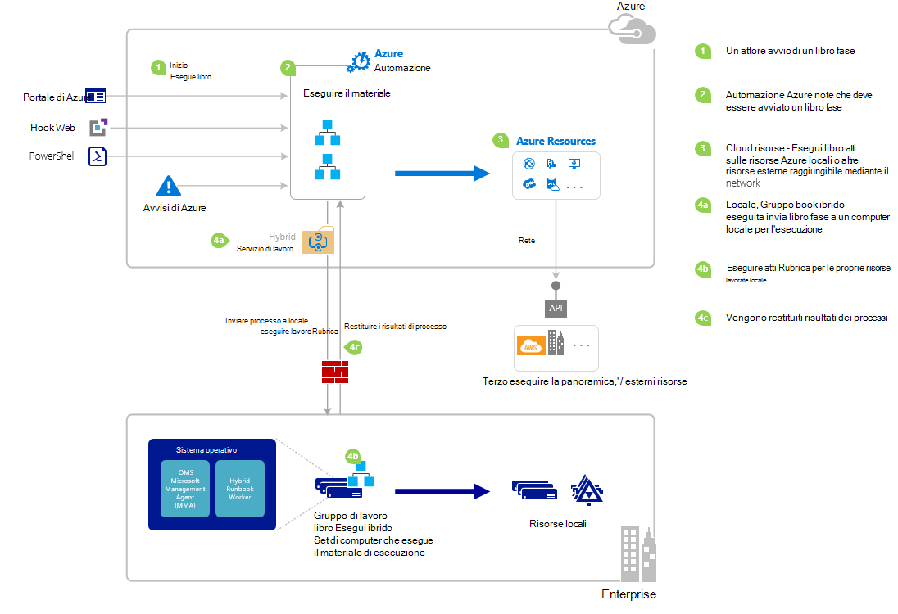

<properties
   pageTitle="Automazione di Azure a partire da un runbook | Microsoft Azure"
   description="Vengono riepilogati i vari metodi che possono essere utilizzati per avviare un runbook in Azure automazione e vengono fornite informazioni dettagliate sull'utilizzo del portale di Azure e di Windows PowerShell."
   services="automation"
   documentationCenter=""
   authors="mgoedtel"
   manager="jwhit"
   editor="tysonn" />
<tags
   ms.service="automation"
   ms.devlang="na"
   ms.topic="article"
   ms.tgt_pltfrm="na"
   ms.workload="infrastructure-services"
   ms.date="10/08/2016"
   ms.author="magoedte;bwren"/>

# <a name="starting-a-runbook-in-azure-automation"></a>A partire da un runbook automazione Azure

Nella tabella seguente consente di determinare il metodo di avviare un runbook di automazione di Azure più adatto alla propria situazione particolare. In questo articolo include informazioni dettagliate su come avviare un runbook con il portale di Azure e con Windows PowerShell. Dettagli su altri metodi sono disponibili nella documentazione che è possibile accedere dai collegamenti seguenti.

| **METODO**                                                                    | **CARATTERISTICHE**                                                                                                                                                                                                                                                                                                                                                |
|-------------------------------------------------------------------------------|--------------------------------------------------------------------------------------------------------------------------------------------------------------------------------------------------------------------------------------------------------------------------------------------------------------------------------------------------------------------|
| [Portale di Azure](#starting-a-runbook-with-the-azure-portal)                     | <li>Metodo più semplice con interfaccia utente interattiva.<br> <li>Modulo per fornire i valori dei parametri semplice.<br> <li>Tenere traccia facilmente stato processo.<br> <li>Accesso autenticato con accesso Azure.                                                                                                                                                                               |
| [Windows PowerShell](https://msdn.microsoft.com/library/dn690259.aspx)        | <li>Chiamare dalla riga di comando i cmdlet di Windows PowerShell.<br> <li>Può essere incluso in soluzione automatica con più passaggi.<br> <li>Richiesta viene autenticato con l'utente OAuth principale / service o certificato principale.<br> <li>Fornire i valori di parametro semplici e complessi.<br> <li>Tenere traccia dello stato di processo.<br> <li>Client necessari per supportare i cmdlet di PowerShell. |
| [API di automazione Azure](https://msdn.microsoft.com/library/azure/mt662285.aspx) | <li>Metodo più flessibile ma anche più complessi.<br> <li>Chiamare dal codice personalizzato che rendono le richieste HTTP.<br> <li>Richiesta di autenticazione con certificato o Oauth utente principali / service principale.<br> <li>Fornire i valori di parametro semplici e complessi.<br> <li>Tenere traccia dello stato di processo.                                                                          |
| [Webhooks](automation-webhooks.md)                                            | <li>Avviare runbook dalla singola richiesta HTTP.<br> <li>Autenticati con token di sicurezza nell'URL.<br> <li>Client non è possibile ignorare i valori dei parametri specificati quando webhook creata. Runbook possibile definire solo parametro che viene popolata con i dettagli della richiesta HTTP.<br> <li>Non è in grado tenere traccia dello stato di processo tramite webhook URL.                                      |
| [Rispondere a avviso di Azure](../log-analytics/log-analytics-alerts.md)               | <li>Avviare un runbook in risposta a avviso Azure.<br> <li>Configurare webhook per runbook e collegamento a un avviso.<br> <li>Autenticati con token di sicurezza nell'URL.<br> <li>Supporta attualmente avviso sui dati statistici relativi solo.                                                                                                                                                       |
| [Programmazione](automation-schedules.md)                                | <li>Avviare automaticamente runbook pianificazione oraria, giornaliera o settimanale.<br> <li>Modificare programmazione tramite il portale di Azure, dei cmdlet di PowerShell o API di Azure.<br> <li>Fornire i valori di parametro da utilizzare con programmazione.                                                                                                                                               |
| [Da un altro Runbook](automation-child-runbooks.md)                          | <li>Utilizzare un runbook come un'attività in un'altra runbook.<br> <li>È utile per funzionalità utilizzata da più runbook.<br> <li>Fornire i valori dei parametri runbook figlio e utilizzare output runbook padre.                                                                                                                                                               |

Nella figura seguente illustra dettagliate dettagliate nel ciclo di vita di un runbook. Include un runbook viene avviato in Azure automazione, componenti necessari per ibrido Runbook lavoro per eseguire l'automazione Azure runbook e interazioni tra i diversi componenti diversi modi. Per altre informazioni sull'esecuzione di automazione runbook nel centro dati, fare riferimento a [colleghi runbook ibrido](automation-hybrid-runbook-worker.md)



## <a name="starting-a-runbook-with-the-azure-portal"></a>Avviare un runbook con il portale di Azure

1.  Nel portale di Azure, selezionare **automazione** e quindi fare clic sul nome di un account di automazione.
2.  Selezionare la scheda **runbook** .
3.  Selezionare un runbook e quindi fare clic su **Start**.
4.  Se dal runbook include parametri, verrà richiesto di fornire i valori con una casella di testo per ogni parametro. Per ulteriori informazioni sui parametri, vedere [Parametri Runbook](#Runbook-parameters) sotto.
5.  Selezionare **Visualizza processo** accanto al messaggio runbook **iniziale** oppure selezionare la scheda **processi** per runbook visualizzare lo stato del processo runbook.

## <a name="starting-a-runbook-with-the-azure-portal"></a>Avviare un runbook con il portale di Azure

1.  Dal proprio account di automazione, fare clic sulla parte **runbook** per aprire e il **runbook** .
2.  Fare clic su un runbook per aprire il relativo blade **Runbook** .
3.  Fare clic su **Start**.
4.  Se dal runbook ha parametri, verrà richiesto di confermare se si desidera avviarlo. Se dal runbook include parametri, e **l'Avviare Runbook** verrà aperta in modo che è possibile fornire i valori dei parametri. Per ulteriori informazioni sui parametri, vedere [Parametri Runbook](#Runbook-parameters) sotto.
5.  E il **processo** viene aperto in modo che è possibile tenere traccia dello stato del processo.

## <a name="starting-a-runbook-with-windows-powershell"></a>Avviare un runbook con Windows PowerShell

È possibile utilizzare [AzureRmAutomationRunbook inizio](https://msdn.microsoft.com/library/mt603661.aspx) per avviare un runbook con Windows PowerShell. Il codice di esempio seguente viene avviato un runbook chiamato Runbook Test.

```
Start-AzureRmAutomationRunbook -AutomationAccountName "MyAutomationAccount" -Name "Test-Runbook" -ResourceGroupName "ResourceGroup01"
```

Inizio AzureRmAutomationRunbook restituisce un oggetto di processo che è possibile utilizzare per tenere traccia di stato una volta che viene avviato dal runbook. È quindi possibile utilizzare questo oggetto processo con [Get-AzureRmAutomationJob](https://msdn.microsoft.com/library/mt619440.aspx) per determinare lo stato del processo e [Get-AzureRmAutomationJobOutput](https://msdn.microsoft.com/library/mt603476.aspx) per ottenere l'output. Il codice di esempio seguente viene avviato un runbook chiamato Runbook Test, attesa finché non è stata completata e quindi l'output viene visualizzato.

```
$runbookName = "Test-Runbook"
$ResourceGroup = "ResourceGroup01"
$AutomationAcct = "MyAutomationAccount"

$job = Start-AzureRmAutomationRunbook –AutomationAccountName $AutomationAcct -Name $runbookName -ResourceGroupName $ResourceGroup

$doLoop = $true
While ($doLoop) {
   $job = Get-AzureRmAutomationJob –AutomationAccountName $AutomationAcct -Id $job.JobId -ResourceGroupName $ResourceGroup
   $status = $job.Status
   $doLoop = (($status -ne "Completed") -and ($status -ne "Failed") -and ($status -ne "Suspended") -and ($status -ne "Stopped"))
}

Get-AzureRmAutomationJobOutput –AutomationAccountName $AutomationAcct -Id $job.JobId -ResourceGroupName $ResourceGroup –Stream Output
```

Se dal runbook richiede parametri, è necessario fornire loro come [hashtable](http://technet.microsoft.com/library/hh847780.aspx) in cui la chiave di hashtable corrisponda al nome parametro e il valore è il valore del parametro. Nell'esempio seguente viene illustrato come avviare un runbook con due parametri stringa denominati nome e cognome, un numero intero denominato RepeatCount e un parametro booleano denominato Mostra. Per ulteriori informazioni sui parametri, vedere [Runbook parametri](#Runbook-parameters) .

```
$params = @{"FirstName"="Joe";"LastName"="Smith";"RepeatCount"=2;"Show"=$true}
Start-AzureRmAutomationRunbook –AutomationAccountName "MyAutomationAccount" –Name "Test-Runbook" -ResourceGroupName "ResourceGroup01" –Parameters $params
```

## <a name="runbook-parameters"></a>Parametri runbook

Quando si inizia un runbook dal portale di Azure o Windows PowerShell, l'istruzione viene inviato tramite il servizio web automazione Azure. Questo servizio non supporta i parametri con tipi di dati complessi. Se è necessario specificare un valore per il parametro complesso, quindi è necessario chiamarlo all'interno del testo da un'altra runbook come descritto in [runbook figlio in Azure automazione](automation-child-runbooks.md).

Il servizio web Azure automazione fornirà funzionalità speciali per i parametri usano determinati tipi di dati come descritto nelle sezioni seguenti.

### <a name="named-values"></a>Valori denominati

Se il parametro è il tipo di dati [oggetto], quindi è possibile usare il seguente formato JSON per l'invio di un elenco di valori denominati: *{Name1: 'Val1', nome 2: "Valore2", Nome3: "Value3"}*. Questi valori devono essere tipi semplici. Dal runbook riceverà il parametro come un [PSCustomObject](https://msdn.microsoft.com/library/system.management.automation.pscustomobject%28v=vs.85%29.aspx) con le proprietà che corrispondono a ogni valore denominato.

Valutare la possibilità di dal runbook test seguenti che accettano un parametro denominato utente.

```
Workflow Test-Parameters
{
   param (
      [Parameter(Mandatory=$true)][object]$user
   )
    $userObject = $user | ConvertFrom-JSON
    if ($userObject.Show) {
        foreach ($i in 1..$userObject.RepeatCount) {
            $userObject.FirstName
            $userObject.LastName
        }
    }
}
```

Il testo seguente potrebbe essere utilizzato per il parametro utente.

```
{FirstName:'Joe',LastName:'Smith',RepeatCount:'2',Show:'True'}
```

Il risultato seguente output.

```
Joe
Smith
Joe
Smith
```

### <a name="arrays"></a>Matrici

Se il parametro è una matrice, ad esempio [matrice] o [è quindi possibile utilizzare il seguente formato JSON per l'invio di un elenco di valori di stringa []]: *[val1, val2, Val3]*. Questi valori devono essere tipi semplici.

Valutare la possibilità di dal runbook test seguenti che accettano un parametro denominato *utente*.

```
Workflow Test-Parameters
{
   param (
      [Parameter(Mandatory=$true)][array]$user
   )
    if ($user[3]) {
        foreach ($i in 1..$user[2]) {
            $ user[0]
            $ user[1]
        }
    }
}
```

Il testo seguente potrebbe essere utilizzato per il parametro utente.

```
["Joe","Smith",2,true]
```

Il risultato seguente output.

```
Joe
Smith
Joe
Smith
```

### <a name="credentials"></a>Credenziali

Se il parametro è il tipo di dati **PSCredential**, è possibile fornire il nome di un [bene credenziali](automation-credentials.md)di automazione di Azure. Dal runbook consente di recuperare le credenziali con il nome specificato.

Valutare la possibilità di dal runbook test seguenti che accetta un parametro denominato credenziali.

```
Workflow Test-Parameters
{
   param (
      [Parameter(Mandatory=$true)][PSCredential]$credential
   )
   $credential.UserName
}
```

Il testo seguente potrebbe essere utilizzato per il parametro user presupponendo che si è verificato un bene credenziali chiamato *Credenziali personali*.

```
My Credential
```

Supponendo che il nome utente nelle credenziali stato *jsmith*, causando l'output seguente.

```
jsmith
```

## <a name="next-steps"></a>Passaggi successivi

-   Architettura runbook nell'articolo corrente viene fornita una panoramica di gestione delle risorse in Azure e ospitata con il lavoro Runbook ibrido runbook.  Per altre informazioni sull'esecuzione di automazione runbook nel centro dati, fare riferimento ai [Colleghi Runbook ibrida](automation-hybrid-runbook-worker.md).
-   Per ulteriori informazioni sulla creazione runbook modulare da usare in altri runbook per le funzioni specifiche o comuni, fare riferimento alla [Runbook figlio](automation-child-runbooks.md).
