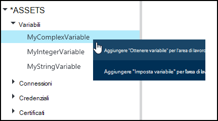
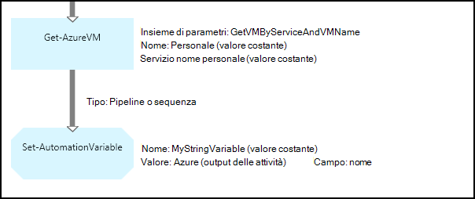
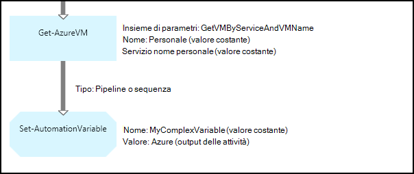
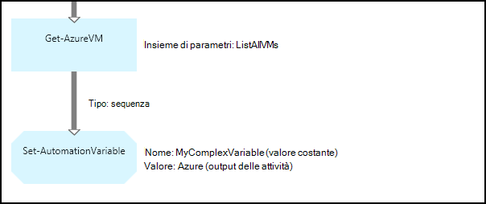
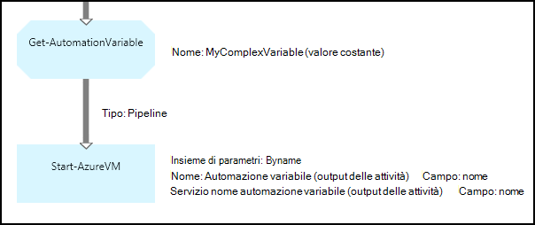
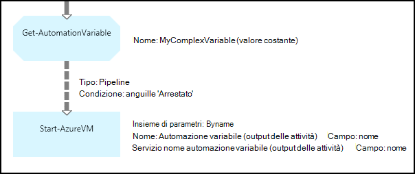

<properties 
   pageTitle="Risorse variabili in Azure automazione | Microsoft Azure"
   description="Variabile risorse sono valori che sono disponibili per tutte le configurazioni DSC in Azure automazione e runbook.  In questo articolo vengono illustrati i dettagli di variabili e come utilizzarli nella modalità di modifica di testo e grafica."
   services="automation"
   documentationCenter=""
   authors="mgoedtel"
   manager="jwhit"
   editor="tysonn" />
<tags 
   ms.service="automation"
   ms.devlang="na"
   ms.topic="article"
   ms.tgt_pltfrm="na"
   ms.workload="infrastructure-services"
   ms.date="05/24/2016"
   ms.author="magoedte;bwren" />

# Variabile beni nel modello di automazione Azure

Variabile risorse sono valori che sono disponibili per tutte le configurazioni DSC nell'account di automazione e runbook. Può essere creati, modificati e recuperati dal portale di Azure, Windows PowerShell e da una configurazione di DSC o runbook. Le variabili di automazione sono utili per gli scenari seguenti:

- Condividere un valore compreso tra più runbook o configurazioni DSC.

- Condividere un valore compreso tra più processi dal runbook stesso o configurazione DSC.

- Gestire un valore dal portale di o dalla riga di comando di Windows PowerShell utilizzato dal runbook o configurazioni DSC.

Le variabili di automazione vengono mantenute in modo che continuino a essere disponibile anche se la configurazione di DSC o runbook ha esito negativo.  In questo modo anche un valore da impostare tramite uno runbook che verrà utilizzato da un'altra o viene utilizzato dal runbook stesso o configurazione DSC la prossima volta che viene eseguito.

Quando viene creata una variabile, è possibile specificare che archiviata crittografato.  Quando una variabile è crittografata, archiviata in Azure automazione e non è possibile recuperare il relativo valore dal cmdlet [Get-AzureAutomationVariable](http://msdn.microsoft.com/library/dn913772.aspx) incluso come parte del modulo PowerShell Azure.  L'unico modo che è possibile recuperare un valore crittografato è dall'attività **Get-AutomationVariable** in una configurazione di DSC o runbook.

>[AZURE.NOTE]Risorse sicure in Azure automazione sono le credenziali, i certificati, connessioni e variabili crittografate. Queste risorse vengono crittografate e archiviate in automazione Azure utilizzando una chiave univoca generati per ogni account di automazione. Questo tasto è crittografato tramite un certificato principale e archiviato in Azure automazione. Prima di archiviare una risorsa sicura, la chiave per l'account di automazione decrittografia utilizzando il certificato master e quindi utilizzata per crittografare le risorse.

## Tipi di variabili

Quando si crea una variabile di tipo con il portale di Azure, è necessario specificare un tipo di dati nell'elenco a discesa in modo che il portale di visualizzare il controllo appropriato per l'immissione del valore della variabile. La variabile non è limitata a questo tipo di dati, ma è necessario impostare la variabile usando Windows PowerShell, se si desidera specificare un valore di tipo diverso. Se si specifica **non è definito**, impostare il valore della variabile a **$null**ed è necessario impostare il valore con il cmdlet [Set-AzureAutomationVariable](http://msdn.microsoft.com/library/dn913767.aspx) o **AutomationVariable Set di** attività.  Non è possibile creare o modificare il valore di un tipo di variabile complesso nel portale, ma è possibile specificare un valore di qualsiasi tipo di uso di Windows PowerShell. Saranno restituiti tipi complessi come un [PSCustomObject](http://msdn.microsoft.com/library/system.management.automation.pscustomobject.aspx).

È possibile memorizzare più valori in una singola variabile creando una matrice o hashtable e il salvataggio della variabile.

## Attività flusso di lavoro e i cmdlet

I cmdlet descritti nella tabella seguente vengono utilizzati per creare e gestire le variabili di automazione con Windows PowerShell. Vengono forniti come parte del [modulo PowerShell per Azure](../powershell-install-configure.md) è disponibile per l'utilizzo in runbook di automazione e configurazione di DSC.

|Cmdlet|Descrizione|
|:---|:---|
|[Get-AzureAutomationVariable](http://msdn.microsoft.com/library/dn913772.aspx)|Recupera il valore di una variabile esistente.|
|[Nuovo AzureAutomationVariable](http://msdn.microsoft.com/library/dn913771.aspx)|Crea una nuova variabile e imposta il relativo valore.|
|[Rimuovi AzureAutomationVariable](http://msdn.microsoft.com/library/dn913775.aspx)|Rimuove una variabile esistente.|
|[Set AzureAutomationVariable](http://msdn.microsoft.com/library/dn913767.aspx)|Imposta il valore di una variabile esistente.|

Le attività del flusso di lavoro nella tabella seguente vengono utilizzate per accedere alle variabili di automazione di un runbook. Sono disponibili solo per l'utilizzo in una configurazione di DSC o runbook e non vengono forniti come parte del modulo PowerShell Azure.

|Attività flusso di lavoro|Descrizione|
|:---|:---|
|Get-AutomationVariable|Recupera il valore di una variabile esistente.|
|Set AutomationVariable|Imposta il valore di una variabile esistente.|

>[AZURE.NOTE] È consigliabile evitare di utilizzare variabili nel nome parametro – di **Get-AutomationVariable** in una runbook o configurazione DSC poiché si possono rendere più complessa esecuzione individuazione dipendenze tra runbook o configurazione DSC e le variabili di automazione in fase di progettazione.

## Creare una nuova variabile di automazione

### Per creare una nuova variabile con il portale di Azure

1. Dal proprio account di automazione, fare clic su **risorse** nella parte superiore della finestra.
1. Nella parte inferiore della finestra, fare clic su **Aggiungi impostazione**.
1. Fare clic su **Aggiungi variabile**.
1. Completare la procedura guidata fare clic sulla casella di controllo per salvare la nuova variabile.

### Per creare una nuova variabile con il portale di Azure

1. Dal proprio account di automazione, fare clic sulla parte di **risorse** per aprire e il **risorse** .
1. Fare clic sulla parte di **variabili** per aprire e il **variabili** .
1. Fare clic su **Aggiungi una variabile di tipo** nella parte superiore e il.
1. Compilare il modulo e fare clic su **Crea** per salvare la nuova variabile.

### Per creare una nuova variabile con Windows PowerShell

Il cmdlet [New-AzureAutomationVariable](http://msdn.microsoft.com/library/dn913771.aspx) crea una nuova variabile e Imposta valore iniziale. È possibile recuperare il valore utilizzando [Get-AzureAutomationVariable](http://msdn.microsoft.com/library/dn913772.aspx). Se il valore è un tipo semplice, viene restituito lo stesso tipo. Se è un tipo complesso, viene restituito un **PSCustomObject** .

I comandi di esempio seguente viene illustrato come creare una variabile di tipo stringa e quindi restituire il relativo valore.

    New-AzureAutomationVariable –AutomationAccountName "MyAutomationAccount" –Name 'MyStringVariable' –Encrypted $false –Value 'My String'
    $string = (Get-AzureAutomationVariable –AutomationAccountName "MyAutomationAccount" –Name 'MyStringVariable').Value

I comandi di esempio seguente viene illustrato come creare una variabile con un tipo complesso e quindi restituire le relative proprietà. In questo caso, viene utilizzato un oggetto macchina virtuale da **Get-AzureVM** .

    $vm = Get-AzureVM –ServiceName "MyVM" –Name "MyVM"
    New-AzureAutomationVariable –AutomationAccountName "MyAutomationAccount" –Name "MyComplexVariable" –Encrypted $false –Value $vm
    
    $vmValue = (Get-AzureAutomationVariable –AutomationAccountName "MyAutomationAccount" –Name "MyComplexVariable").Value
    $vmName = $vmValue.Name
    $vmIpAddress = $vmValue.IpAddress

## Utilizzo di una variabile in una configurazione di DSC o runbook

Utilizzare l'attività **Set AutomationVariable** per impostare il valore di una variabile di automazione in un runbook o configurazione DSC e **Get-AutomationVariable** per recuperarlo.  È consigliabile utilizzare i cmdlet **Set-AzureAutomationVariable** o **Get-AzureAutomationVariable** in una configurazione di DSC o runbook poiché sono meno efficiente rispetto all'attività del flusso di lavoro.  È anche possibile recuperare il valore di variabili protette con **Get-AzureAutomationVariable**.  L'unico modo per creare una nuova variabile dall'interno di un runbook o configurazione DSC consiste nell'utilizzare il cmdlet [New-AzureAutomationVariable](http://msdn.microsoft.com/library/dn913771.aspx) .

### Esempi di runbook testuale

#### Impostare e ottenere un valore semplice da una variabile

I comandi di esempio seguente viene illustrato come impostare e recuperare una variabile in un runbook testuale. In questo esempio, si presuppone che le variabili di tipo integer denominati *NumberOfIterations* e *NumberOfRunnings* e una variabile di tipo stringa denominato *SampleMessage* sono già state create.

    $NumberOfIterations = Get-AutomationVariable -Name 'NumberOfIterations'
    $NumberOfRunnings = Get-AutomationVariable -Name 'NumberOfRunnings'
    $SampleMessage = Get-AutomationVariable -Name 'SampleMessage'
    
    Write-Output "Runbook has been run $NumberOfRunnings times."
    
    for ($i = 1; $i -le $NumberOfIterations; $i++) {
       Write-Output "$i`: $SampleMessage"
    }
    Set-AutomationVariable –Name NumberOfRunnings –Value ($NumberOfRunnings += 1)

#### Impostare e ottenere un oggetto complesso in una variabile

Il codice di esempio seguente viene illustrato come aggiornare una variabile con un valore in un testo runbook complesso. In questo esempio, una macchina virtuale Azure viene recuperata con **Get-AzureVM** e salvata in una variabile di automazione esistente.  Come illustrato in [tipi di variabili](#variable-types), questo viene archiviato come un PSCustomObject.

    $vm = Get-AzureVM -ServiceName "MyVM" -Name "MyVM"
    Set-AutomationVariable -Name "MyComplexVariable" -Value $vm

Nel codice seguente, il valore è recuperato dalla variabile e utilizzato per avviare la macchina virtuale.

    $vmObject = Get-AutomationVariable -Name "MyComplexVariable"
    if ($vmObject.PowerState -eq 'Stopped') {
       Start-AzureVM -ServiceName $vmObject.ServiceName -Name $vmObject.Name
    }

#### Impostare e ottenere un insieme in una variabile

Il codice di esempio seguente viene illustrato come utilizzare una variabile con un insieme di valori complessi in un runbook testuale. In questo esempio, più macchine virtuali Azure vengono recuperate con **Get-AzureVM** e salvate in una variabile di automazione esistente.  Come illustrato in [tipi di variabili](#variable-types), questo viene archiviato come un insieme di PSCustomObjects.

    $vms = Get-AzureVM | Where -FilterScript {$_.Name -match "my"}     
    Set-AutomationVariable -Name 'MyComplexVariable' -Value $vms

Nel codice seguente, la raccolta verrà recuperata dalla variabile e utilizzata per avviare ogni macchina virtuale.

    $vmValues = Get-AutomationVariable -Name "MyComplexVariable"
    ForEach ($vmValue in $vmValues)
    {
       if ($vmValue.PowerState -eq 'Stopped') {
          Start-AzureVM -ServiceName $vmValue.ServiceName -Name $vmValue.Name
       }
    }

### Esempi di runbook grafica

In un grafico runbook, si aggiungere le **Get-AutomationVariable** **Set AutomationVariable** destro del mouse sulla variabile nel riquadro raccolta dell'editor di grafica e selezionando l'impegno desiderato.

#### Impostazione dei valori in una variabile

Nella figura seguente mostra le attività di esempio per aggiornare una variabile con un semplice valore in un grafico runbook. In questo esempio, un singolo computer virtuale Azure recuperato con **Get-AzureVM** e il nome del computer viene salvato in una variabile di automazione esistente con un tipo di stringa.  Non è importante se il [collegamento è una pipeline o una sequenza](automation-graphical-authoring-intro.md#links-and-workflow) dal momento che si prevede solo un singolo oggetto nell'output.

Nella figura seguente mostra le attività utilizzate per aggiornare una variabile con un valore in un grafico runbook complesso. L'unica modifica dell'esempio precedente senza specificare un **percorso di campo** per l' **output attività** sull'attività **Set-AutomationVariable** in modo che l'oggetto viene archiviato anziché solo una proprietà dell'oggetto.  Come illustrato in [tipi di variabili](#variable-types), questo viene archiviato come un PSCustomObject.

Nella figura seguente mostra una funzionalità simile all'esempio precedente, con più macchine virtuali salvate per la variabile.  In modo che l'attività **Set AutomationVariable** riceve l'intero set di macchine virtuali come una raccolta, è necessario utilizzare un [collegamento sequenza](automation-graphical-authoring-intro.md#links-and-workflow) qui.  Se è stato usato un [collegamento pipeline](automation-graphical-authoring-intro.md#links-and-workflow) , quindi attività **Set AutomationVariable** eseguito separatamente per ogni oggetto con il risultato che verrebbero salvata solo l'ultima macchina virtuale nella raccolta.  Come illustrato in [tipi di variabili](#variable-types), questo viene archiviato come un insieme di PSCustomObjects.

#### Recupero di valori da una variabile

Nella figura seguente mostra le attività di esempio che recuperano e utilizzano una variabile in un grafico runbook.  La prima attività recupera macchine virtuali che sono state salvate per la variabile dell'esempio precedente.  Il collegamento deve essere una [pipeline](automation-graphical-authoring-intro.md#links-and-workflow) in modo che l'attività **AzureVM inizio** viene eseguita una volta per ogni oggetto inviato dall'attività **Get-AutomationVariable** .  Questo metodo funziona la stessa se un un singolo oggetto o più oggetti sono archiviati nella variabile.  L'attività **Start AzureVM** utilizza le proprietà di PSCustomObject che rappresenta ogni macchina virtuale. 

Nella figura seguente viene illustrato come filtrare gli oggetti archiviati a una variabile in un grafico runbook.  Il collegamento nella sezione precedente per filtrare solo le macchine virtuali che sono stati interrotti quando è stata impostata la variabile viene aggiunta una [condizione](automation-graphical-authoring-intro.md#links-and-workflow) .

## Passaggi successivi

- Per ulteriori informazioni sulla connessione attività insieme nei grafici per la modifica, vedere [collegamenti nei grafici per la modifica](automation-graphical-authoring-intro.md#links-and-workflow)
- Per iniziare a utilizzare runbook grafici, vedere [il primo runbook grafica](automation-first-runbook-graphical.md) 
