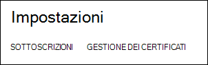
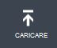
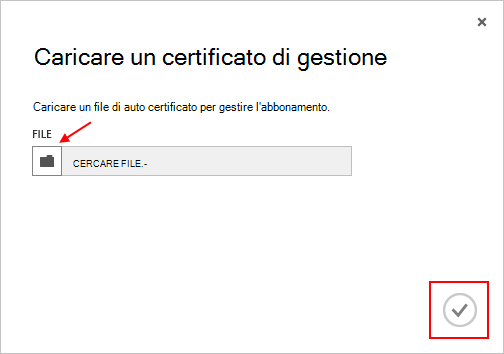

<properties 
    pageTitle="Caricare un certificato di API Gestione Azure | Microsoft Azure" 
    description="Informazioni su come caricare il convertitore API di gestione certificato per il portale classica Azure." 
    services="cloud-services" 
    documentationCenter=".net" 
    authors="Thraka" 
    manager="timlt" 
    editor=""/>

<tags 
    ms.service="na" 
    ms.workload="tbd" 
    ms.tgt_pltfrm="na" 
    ms.devlang="na" 
    ms.topic="article" 
    ms.date="04/18/2016"
    ms.author="adegeo"/>

# Caricare un certificato di gestione delle API di gestione di Azure

I certificati di gestione consentono di eseguire l'autenticazione con l'API di gestione del servizio fornito da Azure. Molti programmi e strumenti (ad esempio Visual Studio o Azure SDK) utilizzerà i certificati per automatizzare configurazione e distribuzione di diversi servizi di Azure. **Si applica solo al portale di classica Azure**. 

>[AZURE.WARNING] Stai attento! Questi tipi di attestati e certificati consentono a chiunque autentica con loro per gestire l'abbonamento che sono associate. 

Ulteriori informazioni sui certificati Azure (inclusa la creazione di un certificato autofirmato) sono [disponibile](cloud-services/cloud-services-certs-create.md#what-are-management-certificates) se è necessario.

È anche possibile utilizzare [Azure Active Directory](/services/active-directory/) per eseguire l'autenticazione codice client per scopi di automazione.

## Caricare un certificato di gestione

Dopo avere inserito una gestione certificato creato, (file CER solo con la chiave pubblica) è possibile caricare nel portale. Quando il certificato è disponibile nel portale, tutti gli utenti con un certficiate corrispondente (chiave privata) può connettersi tramite l'API di gestione e accesso alle risorse per la sottoscrizione associata.

1. Accedere al [portale classica Azure](http://manage.windowsazure.com).

2. Assicurarsi di selezionare l'abbonamento corretto che si desidera associare un certificato con. Premere il testo di **abbonamenti** nella parte superiore destra del portale.

    

3. Dopo aver ottenuto l'abbonamento corretto selezionata, premere **Impostazioni** sul lato sinistro del portale (potrebbe essere necessario scorrere verso il basso). 
    
    

4. Premere tab **I certificati di gestione** .

    
    
5. Fare clic sul pulsante **Carica** .

    
    
6. Compilare le informazioni della finestra e premere Fine **segno di spunta**.

    

## Passaggi successivi

Dopo aver creato un certificato di gestione associato a una sottoscrizione, è possibile (dopo aver installato il certificato corrispondente in locale) a livello di programmazione connettersi all' [API REST di gestione dei servizi](https://msdn.microsoft.com/library/azure/mt420159.aspx) e automatizzare varie risorse Azure anche associati a quell'abbonamento. 