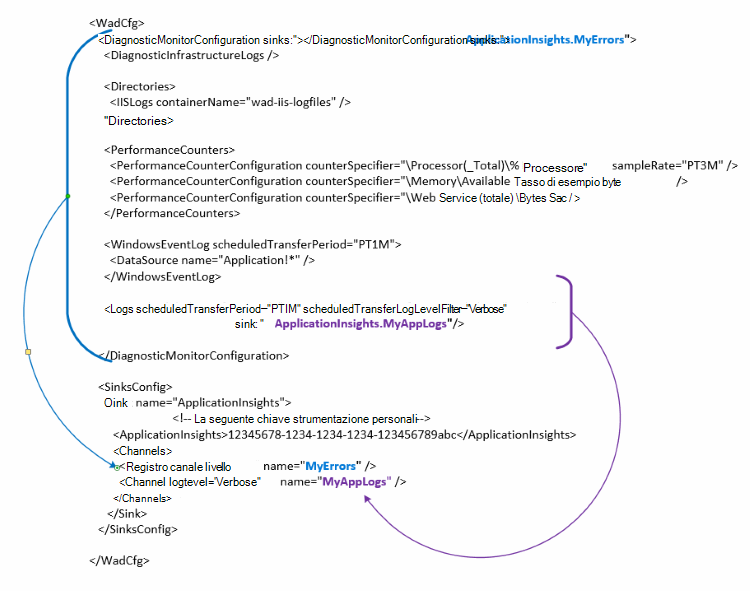

<properties
   pageTitle="Configurare la diagnostica Azure per inviare dati a informazioni dettagliate sui applicazione | Microsoft Azure"
   description="Aggiornare la configurazione di pubblico Azure diagnostica per inviare dati a informazioni dettagliate sui applicazione."
   services="multiple"
   documentationCenter=".net"
   authors="sbtron"
   manager="douge"
   editor="" />
<tags
   ms.service="application-insights"
   ms.devlang="na"
   ms.topic="article"
   ms.tgt_pltfrm="na"
   ms.workload="na"
   ms.date="12/15/2015"
   ms.author="saurabh" />

# Configurare la diagnostica Azure per inviare dati a informazioni dettagliate sui applicazione

Diagnostica Windows Azure archivia i dati di tabelle di archiviazione Azure.  Tuttavia, è anche possibile barra verticale tutti o un sottoinsieme di dati a informazioni dettagliate sui applicazione configurando "sink" e "canali" nella configurazione quando si utilizza diagnostica Azure estensione 1.5 o versioni successive.

In questo articolo viene descritto come creare la configurazione di pubblica per l'estensione di Azure diagnostica in modo che configurati per inviare dati a informazioni dettagliate sui applicazione.

## Configurazione dell'applicazione approfondimenti come Sink

L'estensione di diagnostica Windows Azure 1,5 introduce il **<SinksConfig>** elemento configurazione pubblica. Definisce l' aggiuntive *sink* nel punto in cui possono essere inviati i dati di diagnostica Windows Azure. È possibile specificare i dettagli della risorsa applicazione approfondimenti in cui si vuole inviare i dati di diagnostica Windows Azure come parte di questa **<SinksConfig>**.
Un esempio **SinksConfig** è simile alla seguente-  

    <SinksConfig>
        <Sink name="ApplicationInsights">
          <ApplicationInsights>{Insert InstrumentationKey}</ApplicationInsights>
          <Channels>
            <Channel logLevel="Error" name="MyTopDiagData"  />
            <Channel logLevel="Verbose" name="MyLogData"  />
          </Channels>
        </Sink>
      </SinksConfig>

Per l'elemento **Sink** l'attributo *name* specifica un valore stringa che verrà utilizzato per fare riferimento in modo univoco il sink.
L'elemento **ApplicationInsights** specifica chiave strumentazione della risorsa approfondimenti applicazione in cui verranno inviati i dati di diagnostica Windows Azure. Se non si dispone di una risorsa applicazione approfondimenti esistente, vedere [creare una nuova risorsa applicazione approfondimenti](./application-insights/app-insights-create-new-resource.md) per ulteriori informazioni sulla creazione di una risorsa e ottenere il tasto strumentazione.

Se si sviluppa un progetto di servizio Cloud con Azure SDK 2,8 questo tasto strumentazione vengono inserito automaticamente nella configurazione pubblica in base all'impostazione di configurazione del servizio **APPINSIGHTS_INSTRUMENTATIONKEY** quando il progetto di servizio cloud di imballaggio. Visualizzare [Informazioni dettagliate sui applicazione usare con Azure diagnostica per la risoluzione dei problemi relativi ai servizi Cloud](./cloud-services/cloud-services-dotnet-diagnostics-applicationinsights.md).

L'elemento **canali** consente di definire uno o più elementi di **canale** per i dati inviati al sink. Il canale si comporta come un filtro e consente di selezionare un livello di log specifici che si desidera inviare al sink. Ad esempio è possibile raccogliere dettagliati e inviarli allo spazio di archiviazione, ma è possibile scegliere di definire un canale con un livello di registrazione di errore e quando si invia registri tramite che i registri di errori solo canale verranno inviati a tale sink.
Per un **canale** l'attributo *nome* viene utilizzato per fare riferimento in modo univoco per il canale.
L'attributo *loglevel* consente di specificare il livello di registrazione che consenta il canale. Sono i livelli di registro disponibili in ordine di più almeno informazioni
 - Dettagliato
 - Informazioni
 - Avviso
 - Errore
 - Critici

## Inviare dati a sink approfondimenti applicazione
Dopo avere definito sink applicazione che è possibile inviare dati a tale sink aggiungendo l'attributo *sink* agli elementi del nodo **DiagnosticMonitorConfiguration** . Aggiungere l'elemento *sink* a ciascun nodo specifica che si desidera dati raccolti da tale nodo e qualsiasi sotto di esso devono essere inviati sink specificato.

Ad esempio, se si desidera inviare tutti i dati raccolti da diagnostica Windows Azure è possibile aggiungere l'attributo *sink* direttamente al nodo **DiagnosticMonitorConfiguration** . Impostare il valore di *sink* sul nome di Sink che è stato specificato in **SinkConfig**.

    <DiagnosticMonitorConfiguration overallQuotaInMB="4096" sinks="ApplicationInsights">

Se si desidera inviare solo i registri di errori a informazioni dettagliate sui applicazione elaborare è possibile impostare il valore di *sink* nel nome Sink seguito dal nome canale separato da un punto ("."). Per inviare i registri di errori solo a informazioni dettagliate sui applicazione, ad esempio sink utilizzare il canale MyTopDiagdata che è stato definito in SinksConfig sopra.  

    <DiagnosticMonitorConfiguration overallQuotaInMB="4096" sinks="ApplicationInsights.MyTopDiagdata">

Se si desidera inviare i registri di applicazione dettagliato a informazioni dettagliate sui applicazione è necessario aggiungere l'attributo *sink* per il nodo **log** .

    <Logs scheduledTransferPeriod="PT1M" scheduledTransferLogLevelFilter="Verbose" sinks="ApplicationInsights.MyLogData"/>

È anche possibile includere più sink nella configurazione a diversi livelli della gerarchia. In questo caso il sink specificato nella parte superiore della gerarchia funge un'impostazione globale e quello specificato nella funzione elemento singolo elemento un override di tale impostazione globale.    

Ecco un esempio completo del file di configurazione pubblico che invia tutti gli errori per informazioni dettagliate sui applicazione (specificato in corrispondenza del nodo **DiagnosticMonitorConfiguration** ) e livelli inoltre dettagliati per i registri applicazioni (specificato in corrispondenza del nodo **log** ).

    <WadCfg>
      <DiagnosticMonitorConfiguration overallQuotaInMB="4096"
           sinks="ApplicationInsights.MyTopDiagData"> <!-- All info below sent to this channel -->
        <DiagnosticInfrastructureLogs />
        <PerformanceCounters>
          <PerformanceCounterConfiguration counterSpecifier="\Processor(_Total)\% Processor Time" sampleRate="PT3M" sinks="ApplicationInsights.MyLogData/>
          <PerformanceCounterConfiguration counterSpecifier="\Memory\Available MBytes" sampleRate="PT3M" />
          <PerformanceCounterConfiguration counterSpecifier="\Web Service(_Total)\Bytes Total/Sec" sampleRate="PT3M" />
        </PerformanceCounters>
        <WindowsEventLog scheduledTransferPeriod="PT1M">
          <DataSource name="Application!*" />
        </WindowsEventLog>
        <Logs scheduledTransferPeriod="PT1M" scheduledTransferLogLevelFilter="Verbose"
                sinks="ApplicationInsights.MyLogData"/> <!-- This specific info sent to this channel -->
      </DiagnosticMonitorConfiguration>

    <SinksConfig>
        <Sink name="ApplicationInsights">
          <ApplicationInsights>{Insert InstrumentationKey}</ApplicationInsights>
          <Channels>
            <Channel logLevel="Error" name="MyTopDiagData"  />
            <Channel logLevel="Verbose" name="MyLogData"  />
          </Channels>
        </Sink>
      </SinksConfig>
    </WadCfg>

Esistono alcune limitazioni da tenere in considerazione questa funzionalità

- I canali sono solo semplici per lavorare con contatori non e il tipo di log. Se si specifica un canale con un elemento del contatore prestazioni verrà ignorata.
- Il livello di registrazione per un canale non può superare il livello di registrazione di informazioni raccolte da diagnostica Windows Azure. Ad esempio: non è possibile raccogliere gli errori di registro delle applicazioni nell'elemento registri e provano a inviare dettagliato dei log al sink comprendere l'applicazione. L'attributo *scheduledTransferLogLevelFilter* deve raccogliere sempre uguale o più registri rispetto ai registri che si desidera inviare a un sink.
- Per inviare i dati blob raccolti dall'estensione diagnostica Windows Azure a informazioni dettagliate sui applicazione. Ad esempio qualsiasi elemento specificato nel nodo *Directory* . Per anomalo l'arresto anomalo effettivo viene comunque inviata nell'archiviazione blob e verrà inviata solo una notifica che l'arresto anomalo generata a informazioni dettagliate sui applicazione.

## Passaggi successivi

- Usare [PowerShell](./cloud-services/cloud-services-diagnostics-powershell.md) per attivare l'estensione di diagnostica Windows Azure per l'applicazione. 
- Utilizzare [Visual Studio](vs-azure-tools-diagnostics-for-cloud-services-and-virtual-machines.md) per attivare l'estensione di diagnostica Windows Azure per un'applicazione
