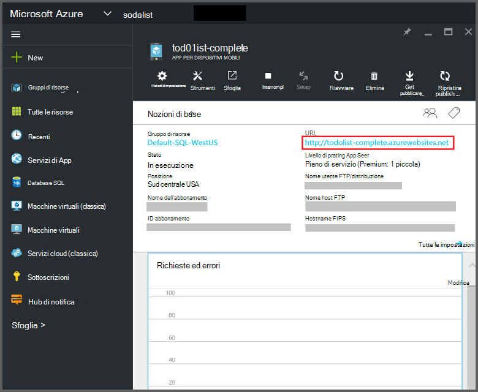
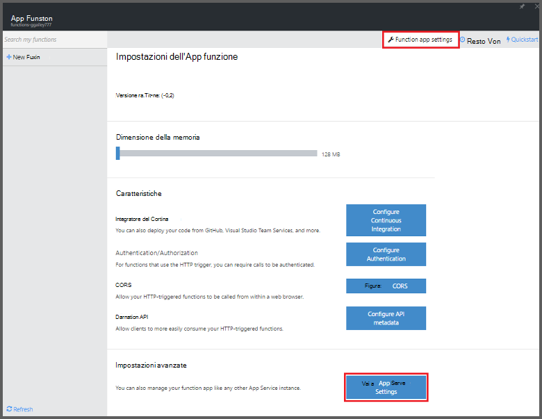
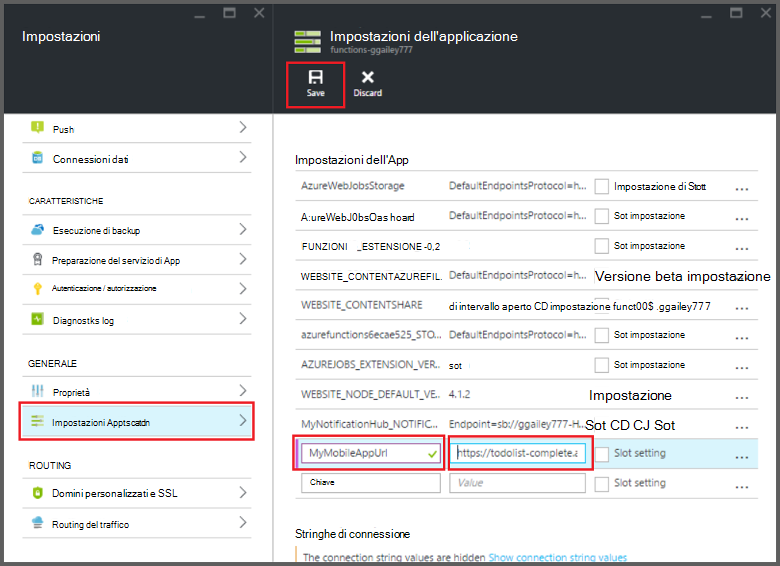

<properties
    pageTitle="Azure associazioni App Mobile funzioni | Microsoft Azure"
    description="Informazioni su come utilizzare le associazioni App Mobile Azure nelle funzioni di Azure."
    services="functions"
    documentationCenter="na"
    authors="ggailey777"
    manager="erikre"
    editor=""
    tags=""
    keywords="funzioni di Azure, funzioni, elaborazione di eventi, calcolo dinamico, architettura senza server"/>

<tags
    ms.service="functions"
    ms.devlang="multiple"
    ms.topic="reference"
    ms.tgt_pltfrm="multiple"
    ms.workload="na"
    ms.date="08/30/2016"
    ms.author="glenga"/>

# Associazioni App Mobile funzioni Azure

[AZURE.INCLUDE [functions-selector-bindings](../../includes/functions-selector-bindings.md)]

In questo articolo viene descritto come configurare e associazioni di App Mobile Azure codice nelle funzioni di Azure. 

[AZURE.INCLUDE [intro](../../includes/functions-bindings-intro.md)] 

App di Azure App servizio Mobile consente di esporre i dati di endpoint di tabella per i client mobili. Questi dati tabulari stesso possono essere utilizzati con entrambi input e output associazioni nelle funzioni di Azure. Poiché supporta dinamiche dello schema, un'app per dispositivi mobili back-end Node è ideale per esporre i dati in formato tabulare per l'uso con le funzioni. Schema dinamico è attivato per impostazione predefinita e deve essere disabilitato in un'app per dispositivi mobili di produzione. Per ulteriori informazioni sull'endpoint di tabella in un back-end Node, vedere [Panoramica: tabella operazioni](../app-service-mobile/app-service-mobile-node-backend-how-to-use-server-sdk.md#TableOperations). Nell'App Mobile, back-end Node supporta nel portale di esplorazione e la modifica di tabelle. Per ulteriori informazioni, vedere [Modifica nel portale](../app-service-mobile/app-service-mobile-node-backend-how-to-use-server-sdk.md#in-portal-editing) nell'argomento node SDK. Quando si usa un'app per dispositivi mobili back-end .NET con le funzioni di Azure, è necessario aggiornare manualmente il modello di dati in base alle esigenze dalla funzione. Per ulteriori informazioni sull'endpoint di tabella in un'app per dispositivi mobili back-end .NET, vedere [procedura: definire un controller di tabella](../app-service-mobile/app-service-mobile-dotnet-backend-how-to-use-server-sdk.md#define-table-controller) nell'argomento con SDK .NET back-end. 

## Creare una variabile di ambiente per l'URL di back-end app per dispositivi mobili

Associazioni App mobile attualmente è necessario creare una variabile di ambiente che restituisce l'URL del back-end app per dispositivi mobili stesso. Questo URL sono disponibili nel [portale di Azure](https://portal.azure.com) , individuare l'app per dispositivi mobili e aprire e il.

Per impostare questo URL come una variabile di ambiente nell'app funzione:

1. Nell'app funzione nel [portale di funzioni di Azure](https://functions.azure.com/signin), fare clic su **Impostazioni app funzione** > **passare a impostazioni dei servizi di App**. 

    

2. Nell'app funzione, fare clic su **tutte le impostazioni**, scorrere fino a **Impostazioni applicazione**, quindi in **Impostazioni App** digitare un nuovo **nome** per la variabile di ambiente, incollare l'URL in **valore**, assicurandosi di usare lo schema HTTPS, quindi fare clic su **Salva** e Chiudi e il app funzione per tornare al portale di funzioni.   

    

A questo punto, è possibile impostare questa nuova variabile di ambiente del campo di *connessione* nelle associazioni.

## Utilizzare una chiave dell'API per proteggere l'accesso per gli endpoint tabella App Mobile.

Nelle funzioni di Azure, le associazioni di tabella per dispositivi mobili consentono di specificare un tasto di API, un segreto condiviso che può essere utilizzato per impedire l'accesso non autorizzato da app ad eccezione delle funzioni. App mobile non include il supporto incorporato per l'autenticazione chiave dell'API. Tuttavia, è possibile implementare un tasto di API nell'app per dispositivi mobili Node back-end eseguendo gli esempi di [back-end Azure App servizio Mobile App implementazione di una chiave dell'API](https://github.com/Azure/azure-mobile-apps-node/tree/master/samples/api-key). Analogamente, è possibile implementare un tasto di API in un' [app per dispositivi mobili di .NET back-end](https://github.com/Azure/azure-mobile-apps-net-server/wiki/Implementing-Application-Key).

>[AZURE.IMPORTANT] Questo tasto API non deve essere distribuito con i clienti di app per dispositivi mobili, dovrebbe solo distribuito in modo sicuro ai client di lato servizio, ad esempio le funzioni di Azure. 

## Associazione di input Azure App Mobile

Associazioni di input è possono caricare un record da un endpoint di tabella per dispositivi mobili e passare direttamente all'associazione. Record che ID viene determinato in base al trigger che richiamato la funzione. In una funzione c#, le modifiche apportate al record vengono inviate automaticamente alla tabella quando viene eseguito correttamente al termine della funzione.

#### associazione di input Function.JSON per le App per dispositivi mobili

Il file *function.json* supporta le proprietà seguenti:

- `name`: Nome variabile utilizzato nel codice della funzione per il nuovo record.
- `type`: Biding tipo deve essere impostata su *mobileTable*.
- `tableName`: La tabella in cui verrà creato il nuovo record.
- `id`: L'ID del record da recuperare. Questa proprietà supporta associazioni simile a `{queueTrigger}`, che verrà utilizzato il valore di stringa del messaggio coda come record ID.
- `apiKey`: Stringa che rappresenta l'impostazione di applicazione che specifica la chiave dell'API facoltativa per l'app per dispositivi mobili. Questa operazione è necessaria quando l'app per dispositivi mobili Usa una chiave dell'API per limitare l'accesso client.
- `connection`: Stringa che rappresenta il nome della variabile di ambiente nelle impostazioni dell'applicazione che specifica l'URL del back-end app per dispositivi mobili.
- `direction`: Direzione associazione, che deve essere impostata su *in*.

File di *function.json* esempio:

    {
      "bindings": [
        {
          "name": "record",
          "type": "mobileTable",
          "tableName": "MyTable",
          "id" : "{queueTrigger}",
          "connection": "My_MobileApp_Url",
          "apiKey": "My_MobileApp_Key",
          "direction": "in"
        }
      ],
      "disabled": false
    }

#### Esempio di codice App Mobile Azure per un trigger di coda c#

In base a function.json esempio precedente, l'estratto di associazione di input del record da un'App Mobile tabella endpoint con l'ID che corrisponde alla stringa di messaggio di coda e passa al parametro di *record* . Quando il record non viene trovato, il parametro è null. Quindi aggiornare il record con il nuovo valore di *testo* al termine della funzione.

    #r "Newtonsoft.Json"    
    using Newtonsoft.Json.Linq;
    
    public static void Run(string myQueueItem, JObject record)
    {
        if (record != null)
        {
            record["Text"] = "This has changed.";
        }    
    }

#### Esempio di codice App Mobile Azure per un trigger di coda Node

In base a function.json esempio precedente, l'estratto di associazione di input del record da un'App Mobile tabella endpoint con l'ID che corrisponde alla stringa di messaggio di coda e passa al parametro di *record* . Le funzioni Node, i record aggiornati non vengono inviati alla tabella. In questo esempio scrive il record recuperato nel log.

    module.exports = function (context, input) {    
        context.log(context.bindings.record);
        context.done();
    };

## Associazione di output app Mobile Azure

La funzione è possibile scrivere un record a un endpoint di tabella App Mobile utilizzando un'associazione di output. 

#### associazione di output Function.JSON per le App per dispositivi mobili

Il file function.json supporta le proprietà seguenti:

- `name`: Nome variabile utilizzato nel codice della funzione per il nuovo record.
- `type`: Tipo associazione che deve essere impostata su *mobileTable*.
- `tableName`: La tabella in cui viene creato il nuovo record.
- `apiKey`: Stringa che rappresenta l'impostazione di applicazione che specifica la chiave dell'API facoltativa per l'app per dispositivi mobili. Questa operazione è necessaria quando l'app per dispositivi mobili Usa una chiave dell'API per limitare l'accesso client.
- `connection`: Stringa che rappresenta il nome della variabile di ambiente nelle impostazioni dell'applicazione che specifica l'URL del back-end app per dispositivi mobili.
- `direction`: Direzione associazione, che deve essere impostata su *Indietro*.

Esempio function.json:

    {
      "bindings": [
        {
          "name": "record",
          "type": "mobileTable",
          "tableName": "MyTable",
          "connection": "My_MobileApp_Url",
          "apiKey": "My_MobileApp_Key",
          "direction": "out"
        }
      ],
      "disabled": false
    }

#### Esempio di codice App Mobile Azure per un trigger di coda c#

In questo esempio di codice c# consente di inserire un nuovo record in un endpoint di tabella App Mobile con una proprietà di *testo* nella tabella specificata in associazione precedente.

    public static void Run(string myQueueItem, out object record)
    {
        record = new {
            Text = $"I'm running in a C# function! {myQueueItem}"
        };
    }

#### Esempio di codice App Mobile Azure per un trigger di coda Node

In questo esempio di codice Node inserisce un nuovo record in un endpoint di tabella App Mobile con una proprietà di *testo* nella tabella specificata in associazione precedente.

    module.exports = function (context, input) {
    
        context.bindings.record = {
            text : "I'm running in a Node function! Data: '" + input + "'"
        }   
    
        context.done();
    };

## Passaggi successivi

[AZURE.INCLUDE [next steps](../../includes/functions-bindings-next-steps.md)]
