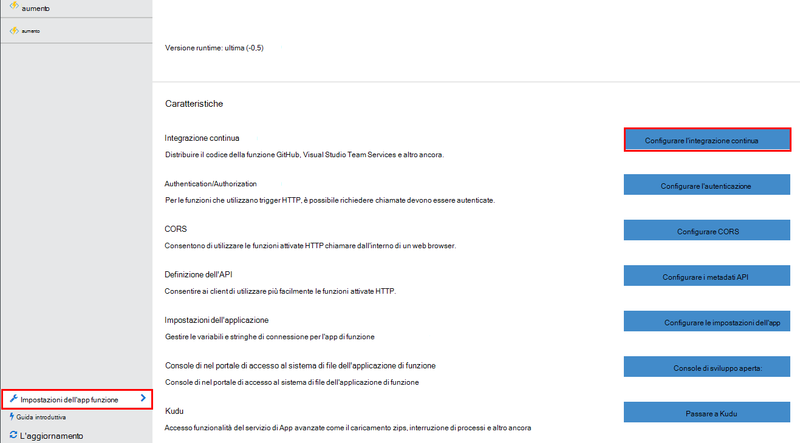
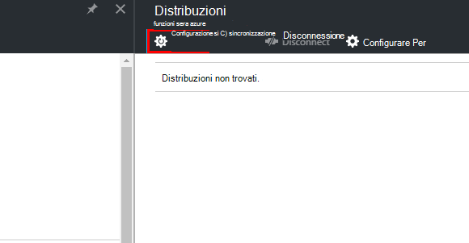
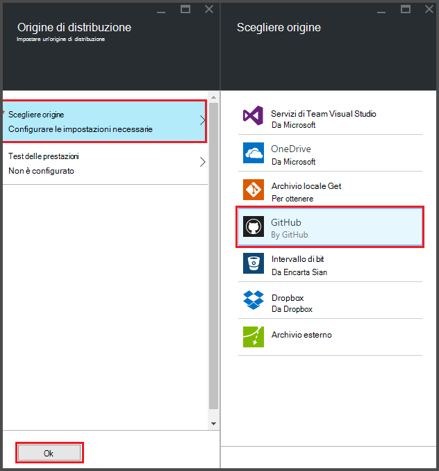
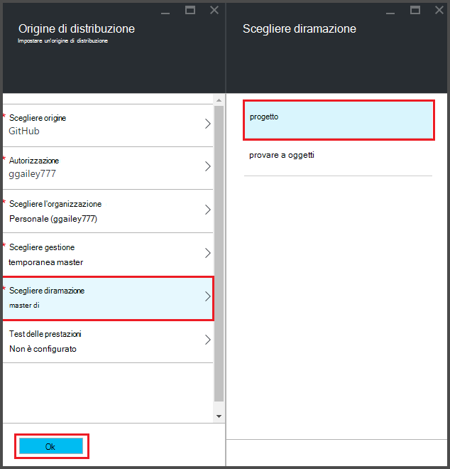
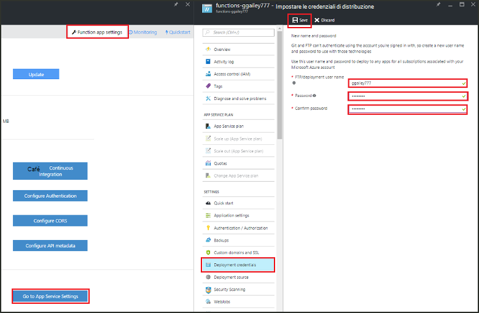
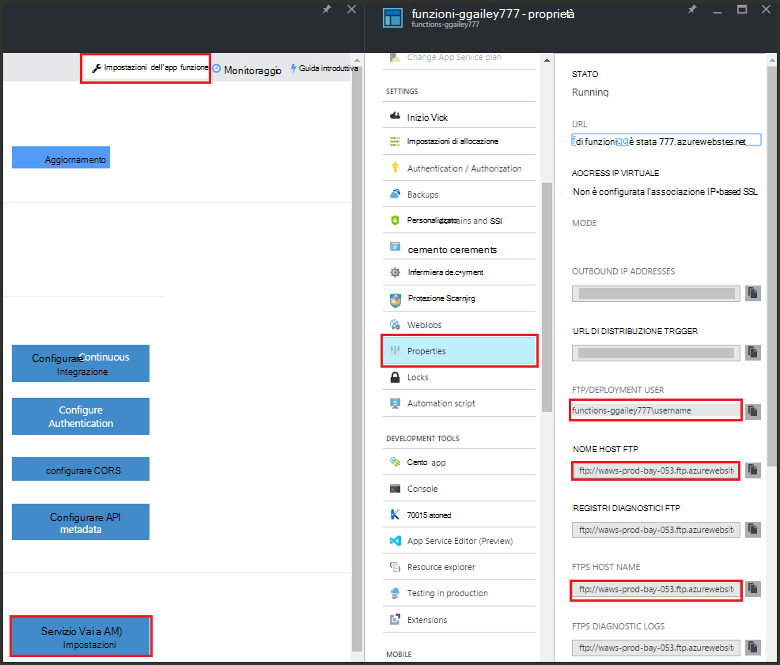
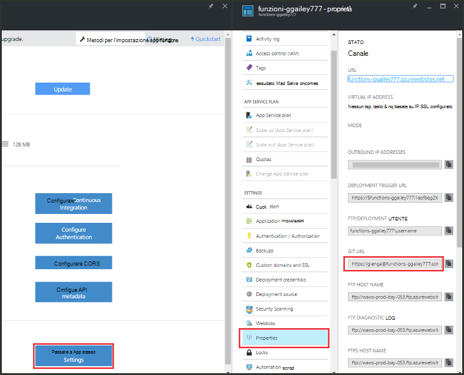

<properties
   pageTitle="Distribuzione continua per le funzioni di Azure | Microsoft Azure"
   description="Utilizzare strutture di distribuzione continua del servizio di Azure App per pubblicare le funzioni di Azure."
   services="functions"
   documentationCenter="na"
   authors="ggailey777"
   manager="erikre"
   editor=""
   tags=""
   />

<tags
   ms.service="functions"
   ms.devlang="multiple"
   ms.topic="article"
   ms.tgt_pltfrm="multiple"
   ms.workload="na"
   ms.date="09/25/2016"
   ms.author="glenga"/>

# Distribuzione continua per le funzioni di Azure 

Funzioni di Azure consente di configurare la distribuzione continua per l'app funzione facilmente. Funzioni consente di sfruttare l'integrazione di servizio App Azure con BitBucket, Dropbox, GitHub e Visual Studio Team Services (VSTS) per consentire un flusso di lavoro di distribuzione continua in Azure Recupera aggiornamenti al codice funzioni quando la pubblicazione in uno di questi servizi. Se ha familiarità con le funzioni di Azure, iniziare con [Azure funzioni Panoramica](functions-overview.md).

Distribuzione continua è un'ottima soluzione per i progetti in più e contributi frequenti vengono integrati. Consente inoltre di mantenere il controllo di origine sul codice funzioni. Le origini di distribuzione seguenti sono attualmente supportate:

+ [Bitbucket](https://bitbucket.org/)
+ [Dropbox](https://bitbucket.org/)
+ [Operazioni repo locale](../app-service-web/app-service-deploy-local-git.md)
+ Operazioni repo esterno
+ [GitHub]
+ Mercurial repo esterno
+ [OneDrive](https://onedrive.live.com/)
+ Servizi di Team Visual Studio

Distribuzioni vengono configurate per app di funzione. Dopo l'attivazione di distribuzione continua, accedere al codice di funzione nel portale è impostato su *sola lettura*.

## Requisiti di distribuzione continua

È necessario disporre dell'origine di distribuzione configurato e il codice funzioni dell'origine di distribuzione prima di configurazione continua distribuzione. In una distribuzione app funzione specificata, ogni funzione si trova in una sottodirectory denominata, quindi il nome della directory è il nome della funzione. La struttura delle cartelle è essenzialmente il codice del sito. 

[AZURE.INCLUDE [functions-folder-structure](../../includes/functions-folder-structure.md)]

## Configurazione di distribuzione continua

Utilizzare la procedura seguente per configurare la distribuzione continua per un'app di funzione esistente:

1. Nell'app funzione nel [portale di funzioni di Azure](https://functions.azure.com/signin), fare clic su **Impostazioni app funzione** > **integrazione continua Configura** > **il programma di installazione**.

    
    
    
    
    È possibile anche accedere e il distribuzioni dalla Guida rapida di funzioni facendo clic sul pulsante **Start dal controllo origine**.

2. In e il distribuzioni, fare clic su **Scegli origine**, quindi digitare le informazioni per l'origine di distribuzione scelta e fare clic su **OK**.

    

Dopo avere configurata la distribuzione continua, tutte le modifiche dell'origine di distribuzione vengono copiati nelle app funzione e viene attivata una distribuzione sito completo. Il sito viene ridistribuito quando vengono aggiornati i file nell'origine.

##Opzioni di distribuzione

Di seguito sono alcuni scenari di distribuzione più comuni:

+ 

###Creare una distribuzione di gestione temporanea

Funzione App non supporta ancora bande orarie di distribuzione. Tuttavia, è possibile gestire ancora distribuzioni di prova e di produzione distinte tramite l'integrazione continua.

La procedura per configurare e lavorare con una distribuzione di gestione temporanea è in genere simile alla seguente:

1. Creare due funzione App in abbonamento, uno per il codice di produzione e uno per la gestione temporanea. 

2. Creare un'origine di distribuzione, se non si dispone già uno. Verrà usata [GitHub].
 
3. Per l'app di funzione di produzione, completare i passaggi indicati nella **configurazione di distribuzione continua** e impostare ramo distribuzione ramo master del repo GitHub.

    

4. Ripetere questo passaggio per l'app di funzione di gestione temporanea, ma questa volta scegliere diramazione di gestione temporanea nel repo GitHub. Se l'origine di distribuzione non supporta la diramazione, usare una cartella diversa.
 
5. Verificare gli aggiornamenti al codice nella filiale o cartella di gestione temporanea, quindi verificare che le modifiche vengono apportate nella distribuzione di gestione temporanea.

6. Dopo aver provato, unire le modifiche diramazione di gestione temporanea nel ramo master. Questo attiverà distribuzione all'app di funzione di produzione. Se l'origine di distribuzione non supporta diramazioni, sovrascrivere i file nella cartella di produzione con i file dalla cartella di gestione temporanea.

###Spostare le funzioni esistente alla distribuzione continua

Quando si dispone di funzioni esistenti creati e gestiti nel portale, è necessario scaricare i file di codice funzione esistenti tramite FTP o archivio locale fra prima di possibile distribuzione continua configurazione come descritto in precedenza. È possibile eseguire nelle impostazioni del servizio di App per l'app di funzione. Dopo il download, è possibile caricare per l'origine di distribuzione continuo scelta.

>[AZURE.NOTE]Dopo aver configurato l'integrazione continua, non sarà possibile modificare i file di origine nel portale di funzioni.

####Procedura: configurare le credenziali di distribuzione
È possibile scaricare i file dell'app di funzione, è necessario configurare le credenziali per accedere al sito, è possibile eseguire dal portale. Le credenziali sono impostate a livello di app funzione.

1. Nell'app funzione nel [portale di funzioni di Azure](https://functions.azure.com/signin), fare clic su **Impostazioni app funzione** > **passare a impostazioni servizio App** > **le credenziali di distribuzione**.

    

2. Digitare un nome utente e password, quindi fare clic su **Salva**. È ora possibile usare le credenziali per accedere alla funzione app da FTP o la repo fra incorporato.

####Procedura: scaricare i file tramite FTP

1. Nell'app funzione nel [portale di funzioni di Azure](https://functions.azure.com/signin), fare clic su **Impostazioni app funzione** > **passare a impostazioni servizio App** > **proprietà** e copiare i valori per **Utente FTP/distribuzione**, **Nome Host FTP**e **Invia nome Host**.  
**Utente FTP/distribuzione** devono essere immesse come visualizzato nel portale, inclusi il nome dell'app per fornire conosca il contesto per il server FTP.

    
    
2. Usare le informazioni di connessione dal client FTP, raccolte per connettersi all'applicazione in uso e scaricare i file di origine per le funzioni.

####Procedura: scaricare i file usando archivio fra locale

1. Nell'app funzione nel [portale di funzioni di Azure](https://functions.azure.com/signin), fare clic su **Impostazioni app funzione** > **integrazione continua Configura** > **il programma di installazione**.

2. In e il distribuzioni, fare clic su **Scegli origine** **repository fra locale**, quindi fare clic su **OK**.
 
3. Fare clic su **Vai a impostazioni servizio App** > **proprietà** e notare il valore dell'URL fra. 
    
    

4. Duplicare repo sul computer locale utilizzando una riga di comando presente fra o lo strumento fra. Il comando duplicato fra è simile alla seguente:

        git clone https://username@my-function-app.scm.azurewebsites.net:443/my-function-app.git

5. Recuperare file dell'App funzione per la copia nel computer locale, come illustrato nell'esempio seguente:

        git pull origin master

    Se richiesto, fornire il nome utente e la password per la distribuzione di app funzione.  

[GitHub]: https://github.com/
