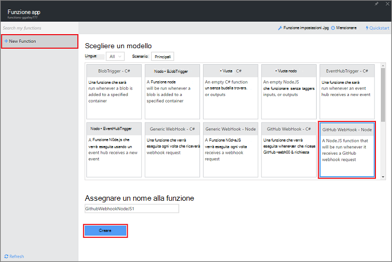
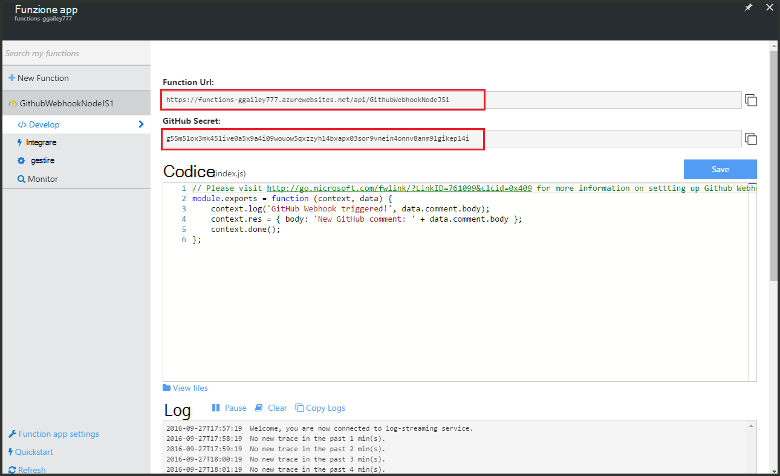
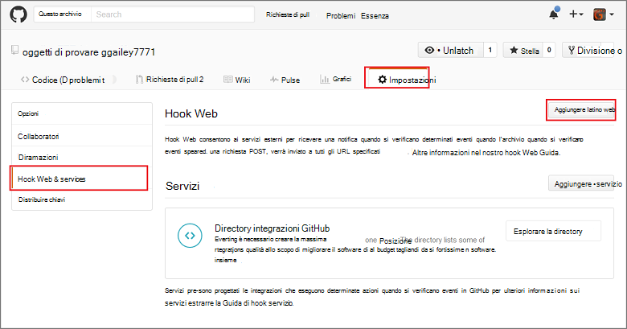
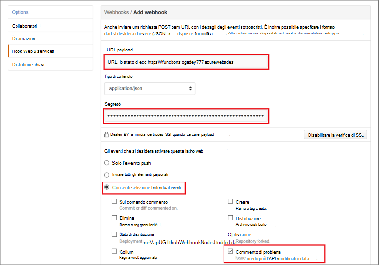

<properties
   pageTitle="Creare un latino web o una funzione di Azure API | Microsoft Azure"
   description="Utilizzare le funzioni di Azure per creare una funzione che viene effettuata una WebHook o API chiamare."
   services="azure-functions"
   documentationCenter="na"
   authors="ggailey777"
   manager="erikre"
   editor=""
   tags=""
   />

<tags
   ms.service="functions"
   ms.devlang="multiple"
   ms.topic="get-started-article"
   ms.tgt_pltfrm="multiple"
   ms.workload="na"
   ms.date="08/30/2016"
   ms.author="glenga"/>
   
# Creare un webhook o una funzione di Azure API

Funzioni di Azure offre un'esperienza basate su eventi, elaborazione su richiesta che consente di creare programmata o attivate le unità di codice implementate in diverse lingue programmazione. Per ulteriori informazioni sulle funzioni di Azure, vedere [Panoramica di funzioni di Azure](functions-overview.md).

In questo argomento viene illustrato come creare una nuova funzione node richiamato da un webhook GitHub. Nuova funzione viene creata in base a un modello predefinito nel portale di funzioni di Azure. È anche possibile guardare un breve video viene illustrato come vengono eseguite le operazioni seguenti nel portale.

## Guardare il video

Il video seguente viene illustrato come eseguire la procedura di base in questa esercitazione 

[AZURE.VIDEO create-a-web-hook-or-api-azure-function]

##Creare una funzione attivate webhook dal modello

Un'app di funzione ospita l'esecuzione delle funzioni in Azure. È possibile creare una funzione, è necessario disporre di un account Azure active. Se si dispone già di un account Azure [account gratuiti sono disponibili](https://azure.microsoft.com/free/). 

1. Accedere al [portale di funzioni di Azure](https://functions.azure.com/signin) ed effettuare l'accesso con l'account Azure.

2. Se si dispone di un'app di funzione esistente da utilizzare, selezionare dalle **applicazioni funzione** fare clic su **Apri**. Per creare una nuova app funzione, digitare un **nome** univoco per la nuova app funzione o accettare quello generato, selezionare il preferito **area geografica**, quindi fare clic su **Crea + iniziare**. 

3. Nell'app funzione, fare clic su **+ nuova funzione** > **GitHub Webhook - nodo** > **Crea**. Viene creata una funzione con il nome predefinito basato sul modello specificato. 

     

4. In **sviluppare**, osservare la funzione express.js di esempio nella finestra del **codice** . Questa funzione riceve una richiesta di GitHub da webhook di commento un problema, registra il testo problema e invia una risposta al webhook come `New GitHub comment: <Your issue comment text>`.

     

5. Copiare i valori di **Funzione URL** e **GitHub segreto** . Sarà necessario questi quando si crea la webhook in GitHub. 

6. Scorrere fino a **eseguire**, annotare il corpo JSON predefinito di un commento problema nel corpo della richiesta, quindi fare clic su **Esegui**. 
 
    È sempre possibile verificare una nuova funzione basato sul modello direttamente nella scheda **sviluppo** fornendo qualsiasi previsto corpo dati JSON e fare clic sul pulsante **Esegui** . In questo caso, il modello include il corpo predefinito per un commento di problema. 
 
Successivamente, è necessario creare webhook effettivo del repository GitHub.

##Configurare il webhook

1. In GitHub, passare a un archivio di cui si è proprietari; sono inclusi eventuali archivi che hanno duplicata.
 
2. Fare clic su **Impostazioni** > **Webhooks e servizi** > **webhook Aggiungi**.

       

3. Incollare la funzione URL e segreto **Payload URL** e **segreto**, quindi fare clic su **Consenti selezionare singoli eventi**, selezionare **problema commento** e fare clic su **Aggiungi webhook**.

     

A questo punto, webhook GitHub è configurato per la funzione di attivazione quando viene aggiunto un nuovo commento problema.  
A questo punto, è possibile testarlo.

##Verificare la funzione

1. Nel repo GitHub, aprire la scheda **problemi** in una nuova finestra del browser, fare clic su **Nuovo problema**, digitare un titolo quindi fare clic su **Invia nuovo problema**. È anche possibile aprire un problema esistente.

2. Nel problema, digitare un commento e fare clic su **commento**. A questo punto, è possibile tornare per il nuovo webhook in GitHub in **Recenti recapiti** vedono che è stata inviata una richiesta di webhook e che il corpo della risposta `New GitHub comment: <Your issue comment text>`.

3. Nel portale di funzioni, scorrere fino ai log e vedere che la funzione se è stata attivata e il valore `New GitHub comment: <Your issue comment text>` scrittura dei registri del flussi.

##Passaggi successivi

Vedere questi argomenti per ulteriori informazioni sulle funzioni di Azure.

+ [Riferimenti per sviluppatori di funzioni Azure](functions-reference.md)  
Guida di riferimento per la codifica funzioni programmatore.
+ [Funzioni di Azure test](functions-test-a-function.md)  
Descrive diverse tecniche per testare le funzioni e gli strumenti.
+ [Come ridimensionare le funzioni di Azure](functions-scale.md)  
Vengono descritti i piani di servizio disponibili con le funzioni di Azure, inclusi il piano di servizio dinamico e su come scegliere il piano a destro.  

[AZURE.INCLUDE [Getting Started Note](../../includes/functions-get-help.md)]
