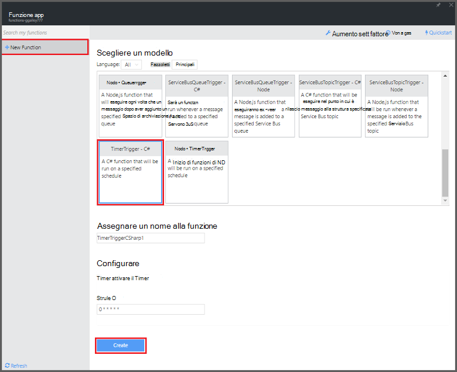

<properties
   pageTitle="Creazione di un evento funzione di elaborazione | Microsoft Azure"
   description="Utilizzare le funzioni di Azure creare una funzione c# che viene eseguita in base di un timer evento."
   services="functions"
   documentationCenter="na"
   authors="ggailey777"
   manager="erikre"
   editor=""
   tags=""
   />

<tags
   ms.service="functions"
   ms.devlang="multiple"
   ms.topic="get-started-article"
   ms.tgt_pltfrm="multiple"
   ms.workload="na"
   ms.date="09/25/2016"
   ms.author="glenga"/>
   
# Creazione di un evento Azure funzione di elaborazione

Funzioni di Azure offre un'esperienza basate su eventi, elaborazione su richiesta che consente di creare programmata o attivate le unità di codice implementate in diverse lingue programmazione. Per ulteriori informazioni sulle funzioni di Azure, vedere [Panoramica di funzioni di Azure](functions-overview.md).

In questo argomento viene illustrato come creare una nuova funzione in c# che viene eseguito in base a un timer evento per aggiungere messaggi a una coda di spazio di archiviazione. 

## Prerequisiti 

È possibile creare una funzione, è necessario disporre di un account Azure active. Se si dispone già di un account Azure [account gratuiti sono disponibili](https://azure.microsoft.com/free/).

## Creare una funzione timer generato dal modello

Un'app di funzione ospita l'esecuzione delle funzioni in Azure. È possibile creare una funzione, è necessario disporre di un account Azure active. Se si dispone già di un account Azure [account gratuiti sono disponibili](https://azure.microsoft.com/free/). 

1. Accedere al [portale di funzioni di Azure](https://functions.azure.com/signin) ed effettuare l'accesso con l'account Azure.

2. Se si dispone di un'app di funzione esistente da utilizzare, selezionare dalle **applicazioni funzione** fare clic su **Apri**. Per creare una nuova app funzione, digitare un **nome** univoco per la nuova app funzione o accettare quello generato, selezionare il preferito **area geografica**, quindi fare clic su **Crea + iniziare**. 

3. Nell'app funzione, fare clic su **+ nuova funzione** > **TimerTrigger - c#** > **Crea**. Viene creata una funzione con il nome predefinito che esecuzione la pianificazione predefinita di una volta al minuto. 

    

4. Nella nuova funzione, fare clic sulla scheda **integrazione** > **Nuovo Output** > **Coda di spazio di archiviazione di Azure** > **Selezionare**.

    

5. Nella **coda di spazio di archiviazione di Azure output**, selezionare una **connessione di spazio di archiviazione account**esistente, o crearne uno nuovo, quindi fare clic su **Salva**. 

    

6. Tornare nella scheda **sviluppo** , sostituire lo script c# esistente nella finestra del **codice** con il codice seguente:

        using System;
        
        public static void Run(TimerInfo myTimer, out string outputQueueItem, TraceWriter log)
        {
            // Add a new scheduled message to the queue.
            outputQueueItem = $"Ping message added to the queue at: {DateTime.Now}.";
            
            // Also write the message to the logs.
            log.Info(outputQueueItem);
        }

    Questo codice aggiunge un nuovo messaggio nella coda con la data e ora correnti quando viene eseguita la funzione.

7. Fare clic su **Salva** e video windows **registri** per l'esecuzione di funzione successiva.

8. (Facoltativo) Passare all'account di archiviazione e verificare che i messaggi vengono aggiunti alla coda.

9. Tornare alla scheda **integrazione** e modificare il campo di programmazione per `0 0 * * * *`. La funzione viene ora eseguito ogni ora. 

Si tratta di un molto semplificata associazione di output di esempio di un trigger timer e una coda di spazio di archiviazione. Per ulteriori informazioni, vedere [funzioni di Azure timer trigger](functions-bindings-timer.md) e gli argomenti di [funzioni di Azure trigger e le associazioni per lo spazio di archiviazione di Azure](functions-bindings-storage.md) .

##Passaggi successivi

Vedere questi argomenti per ulteriori informazioni sulle funzioni di Azure.

+ [Riferimenti per sviluppatori di funzioni Azure](functions-reference.md)  
Guida di riferimento per la codifica di funzioni e la definizione di trigger e le associazioni programmatore.
+ [Funzioni di Azure test](functions-test-a-function.md)  
Descrive diverse tecniche per testare le funzioni e gli strumenti.
+ [Come ridimensionare le funzioni di Azure](functions-scale.md)  
Vengono descritti i piani di servizio disponibili con le funzioni di Azure, inclusi il piano di servizio dinamico e su come scegliere il piano a destro.  

[AZURE.INCLUDE [Getting Started Note](../../includes/functions-get-help.md)]
