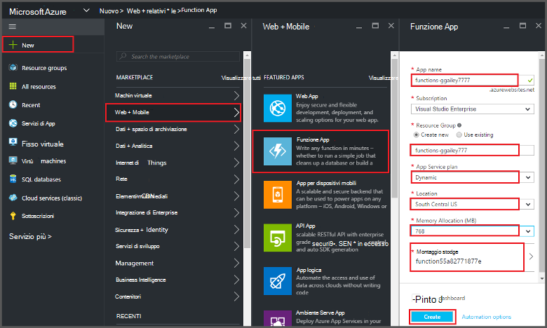
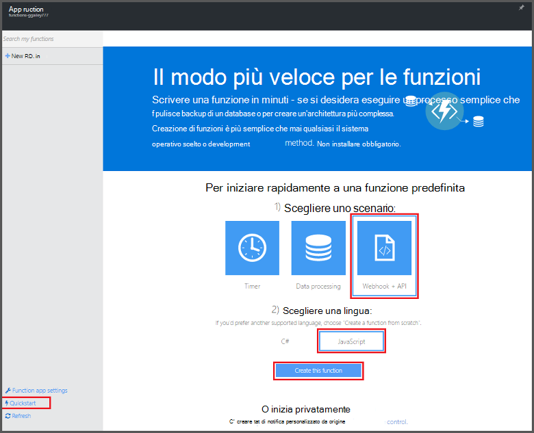
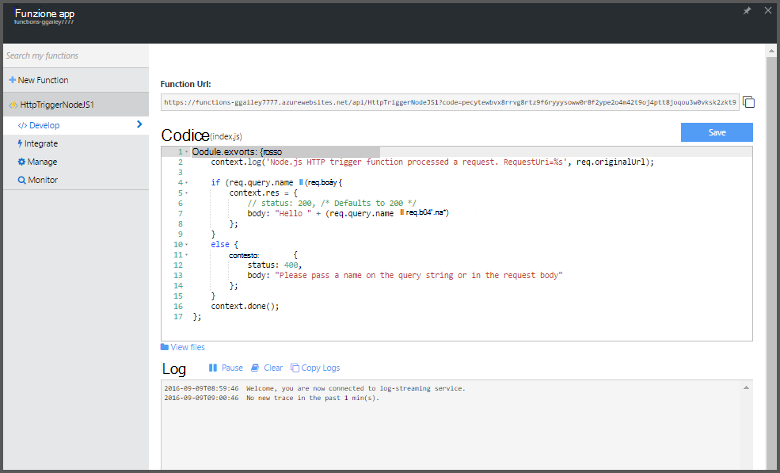

<properties
   pageTitle="Creare una funzione dal portale di Azure | Microsoft Azure"
   description="Creare la prima funzione Azure, un'applicazione senza server, in meno di due minuti."
   services="functions"
   documentationCenter="na"
   authors="ggailey777"
   manager="erikre"
   editor=""
   tags=""
/>

<tags
   ms.service="functions"
   ms.devlang="multiple"
   ms.topic="article"
   ms.tgt_pltfrm="multiple"
   ms.workload="na"
   ms.date="09/08/2016"
   ms.author="glenga"/>

#Creare una funzione dal portale di Azure

##Panoramica
Funzioni di Azure offre un'esperienza di elaborazione su richiesta, basate su eventi che si estende la piattaforma applicazione Azure esistente con funzionalità per implementare codice attivate tramite eventi che si verificano in altri servizi di Azure, SaaS prodotti e sistemi locali. Con le funzioni di Azure, le applicazioni scalare in base alla richiesta e si paga solo per le risorse che si utilizzano. Azure consente di funzioni è possibile creare programmata o attivate le unità di codice implementata in vari linguaggi di programmazione. Per ulteriori informazioni sulle funzioni di Azure, vedere [Panoramica di funzioni di Azure](functions-overview.md).

In questo argomento viene illustrato come utilizzare il portale di Azure per creare un semplice "hello world" Node Azure funzione richiamato dal trigger HTTP. Prima di creare una funzione nel portale di Azure, è necessario creare un'app di funzione in modo esplicito nel servizio App Azure. Per salvare l'app di funzione creato automaticamente, vedere [le altre funzioni di Azure conosca](functions-create-first-azure-function.md)un'esperienza di Guida introduttiva più semplice che include un video.

##Creare un'app di funzione

Un'app di funzione ospita l'esecuzione delle funzioni in Azure. Seguire questa procedura per creare un'app di funzione nel portale di Azure.

È possibile creare la prima funzione, è necessario disporre di un account Azure active. Se si dispone già di un account Azure [account gratuiti sono disponibili](https://azure.microsoft.com/free/).

1. Accedere al [portale di Azure](https://portal.azure.com) ed effettuare l'accesso con l'account Azure.

2. Fare clic su **+ Nuovo** > **Web + Mobile** > **Funzione App**, selezionare l' **abbonamento**, digitare un **nome applicazione** univoco che identifica l'app di funzione, quindi specificare le impostazioni seguenti:

    + **[Gruppo risorse](../azure-portal/resource-group-portal.md/)**: selezionare **Crea nuovo** e immettere un nome per il nuovo gruppo di risorse. È anche possibile scegliere un gruppo di risorse esistente, ma potrebbe non essere possibile creare un piano di servizio App dinamico per un'app di funzione.
    + **[Piano di servizio App](../app-service/azure-web-sites-web-hosting-plans-in-depth-overview.md)**: scegliere *dinamico* o *classica*. 
        + **Dinamico**: il tipo di piano predefinito per le funzioni di Azure. Quando si sceglie un piano dinamico, è necessario scegliere la **posizione** e impostare l' **Allocazione di memoria** (in MB). Per informazioni sull'influenza l'allocazione della memoria costi, vedere [funzioni di Azure prezzi](https://azure.microsoft.com/pricing/details/functions/). 
        + **Classica**: un piano di servizio App classico è necessario creare un **piano di servizio App/percorso** o selezionarne uno esistente. Queste impostazioni determinano la [posizione, caratteristiche, costi e calcolare risorse](https://azure.microsoft.com/pricing/details/app-service/) associato all'app.  
    + **Account di archiviazione**: app ogni funzione richiede un account di archiviazione. È possibile scegliere un account di archiviazione esistente o crearne uno. 

    

3. Fare clic su **Crea** effettuare il provisioning e distribuire la nuova app di funzione.  

Ora che viene completato il provisioning app funzione, è possibile creare la prima funzione.

## Creare una funzione

Questa procedura il nome di una funzione la Guida introduttiva di Azure funzioni.

1. Nella scheda della **Guida introduttiva** , fare clic su **WebHook + API** e **JavaScript**, quindi fare clic su **Crea una funzione**. Viene creata una nuova funzione node predefinita. 

    

2. (Facoltativo) A questo punto nella Guida introduttiva, è possibile eseguire una presentazione rapida delle caratteristiche di Azure funzioni nel portale.   Dopo aver completato o ignorare la presentazione, è possibile testare la nuova funzione utilizzando i trigger di HTTP.

##Verificare la funzione

Poiché le guide rapide funzioni Azure contengano codice funzionale, è possibile verificare immediatamente la nuova funzione.

1. Nella scheda **sviluppo** , esaminare la finestra del **codice** e si noti che questo codice Node prevede una richiesta HTTP con un valore di *nome* passato nel corpo del messaggio o in una stringa di query. Quando viene eseguita la funzione, viene restituito il valore nel messaggio di risposta.

    

2. Scorrere fino a casella di testo **corpo richiesta** , modificare il valore della proprietà *name* sul proprio nome e fare clic su **Esegui**. Viene visualizzato che viene attivata da una richiesta HTTP test, le informazioni vengono scritte ai registri di flusso e la risposta "Salve" viene visualizzata nell' **Output**. 

3. Per avviare l'esecuzione della stessa funzione da un'altra finestra del browser o tab, copiare il valore di **Funzione URL** della scheda **sviluppo** e incollarla in una barra degli indirizzi del browser, quindi il valore di stringa di query di Accodamento `&name=yourname` e premere INVIO. Le stesse informazioni scritti i log e il browser visualizza la risposta "Salve" come prima.

##Passaggi successivi

Questa Guida introduttiva di seguito viene illustrato una semplice esecuzione di una funzione di attivazione HTTP base. Vedere questi argomenti per ulteriori informazioni sull'utilizzo la potenza di Azure funzioni nelle applicazioni.

+ [Riferimenti per sviluppatori di funzioni Azure](functions-reference.md)  
Guida di riferimento per la codifica di funzioni e la definizione di trigger e le associazioni programmatore.
+ [Funzioni di Azure test](functions-test-a-function.md)  
Descrive diverse tecniche per testare le funzioni e gli strumenti.
+ [Come ridimensionare le funzioni di Azure](functions-scale.md)  
Vengono descritti i piani di servizio disponibili con le funzioni di Azure, inclusi il piano di servizio dinamico e su come scegliere il piano a destro. 
+ [Che cos'è il servizio di App Azure?](../app-service/app-service-value-prop-what-is.md)  
Funzioni Azure utilizza la piattaforma Azure App servizi per le funzionalità di base quali distribuzioni variabili e diagnostica. 

[AZURE.INCLUDE [Getting Started Note](../../includes/functions-get-help.md)]
