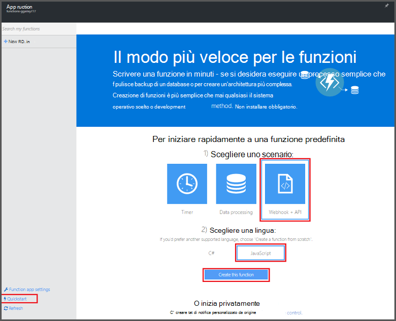
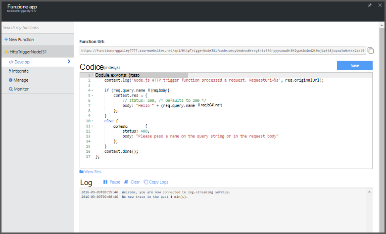

<properties
   pageTitle="Creare la prima funzione Azure | Microsoft Azure"
   description="Creare la prima funzione Azure, un'applicazione senza server, in meno di due minuti."
   services="functions"
   documentationCenter="na"
   authors="ggailey777"
   manager="erikre"
   editor=""
   tags=""
/>

<tags
   ms.service="functions"
   ms.devlang="multiple"
   ms.topic="hero-article"
   ms.tgt_pltfrm="multiple"
   ms.workload="na"
   ms.date="09/08/2016"
   ms.author="glenga"/>

#Creare la prima funzione Azure

##Panoramica
Funzioni di Azure offre un'esperienza di elaborazione su richiesta, basate su eventi che si estende la piattaforma applicazione Azure esistente con funzionalità per implementare codice attivate tramite eventi che si verificano in altri servizi di Azure, SaaS prodotti e sistemi locali. Con le funzioni di Azure, le applicazioni scalare in base alla richiesta e si paga solo per le risorse che si utilizzano. Azure consente di funzioni è possibile creare programmata o attivate le unità di codice implementata in diverse lingue programmazione. Per ulteriori informazioni sulle funzioni di Azure, vedere [Panoramica di funzioni di Azure](functions-overview.md).

In questo argomento viene illustrato come usare la Guida introduttiva di Azure funzioni nel portale per creare una semplice "hello world" Node funzione richiamata da un trigger di HTTP. È anche possibile guardare un breve video viene illustrato come vengono eseguite le operazioni seguenti nel portale.

## Guardare il video

Il video seguente viene illustrato come eseguire la procedura di base in questa esercitazione. 

[AZURE.VIDEO create-your-first-azure-function-simple]

##Il nome di una funzione la Guida introduttiva

Un'app di funzione ospita l'esecuzione delle funzioni in Azure. Seguire questa procedura per creare una nuova app di funzione, nonché la nuova funzione. La nuova app funzione viene creata con una configurazione predefinita. Per informazioni su come creare in modo esplicito l'app di funzione, vedere [le altre funzioni di Azure conosca](functions-create-first-azure-function-azure-portal.md).

È possibile creare la prima funzione, è necessario disporre di un account Azure active. Se si dispone già di un account Azure [account gratuiti sono disponibili](https://azure.microsoft.com/free/).

1. Accedere al [portale di funzioni di Azure](https://functions.azure.com/signin) ed effettuare l'accesso con l'account Azure.

2. Digitare un **nome** univoco per la nuova app di funzione o accettare quello generato, selezionare il preferito **regione**e quindi fare clic su **Crea + iniziare**. 

3. Nella scheda della **Guida introduttiva** , fare clic su **WebHook + API** e **JavaScript**, quindi fare clic su **Crea una funzione**. Viene creata una nuova funzione node predefinita. 

    

4. (Facoltativo) A questo punto nella Guida introduttiva, è possibile eseguire una presentazione rapida delle caratteristiche di Azure funzioni nel portale.   Dopo aver completato o ignorare la presentazione, è possibile testare la nuova funzione utilizzando i trigger di HTTP.

##Verificare la funzione

Poiché le guide rapide funzioni Azure contengano codice funzionale, è possibile verificare immediatamente la nuova funzione.

1. Nella scheda **sviluppo** , esaminare la finestra del **codice** e si noti che questo codice Node prevede una richiesta HTTP con un valore di *nome* passato nel corpo del messaggio o in una stringa di query. Quando viene eseguita la funzione, viene restituito il valore nel messaggio di risposta.

    

2. Scorrere fino a casella di testo **corpo richiesta** , modificare il valore della proprietà *name* sul proprio nome e fare clic su **Esegui**. Si vedrà che viene attivata da una richiesta HTTP test, le informazioni vengono scritte ai registri di flusso e la risposta "Salve" viene visualizzata nell' **Output**. 

3. Per avviare l'esecuzione della stessa funzione da un'altra finestra del browser o tab, copiare il valore di **Funzione URL** della scheda **sviluppo** e incollarla in una barra degli indirizzi del browser, quindi il valore di stringa di query di Accodamento `&name=yourname` e premere INVIO. Le stesse informazioni scritti i log e il browser visualizza la risposta "Salve" come prima.

##Passaggi successivi

Questa Guida introduttiva di seguito viene illustrato una semplice esecuzione di una funzione di attivazione HTTP base. Vedere questi argomenti per ulteriori informazioni su sfruttare l'efficienza delle funzioni di Azure nelle applicazioni.

+ [Riferimenti per sviluppatori di funzioni Azure](functions-reference.md)  
Guida di riferimento per la codifica di funzioni e la definizione di trigger e le associazioni programmatore.
+ [Funzioni di Azure test](functions-test-a-function.md)  
Descrive diverse tecniche per testare le funzioni e gli strumenti.
+ [Come ridimensionare le funzioni di Azure](functions-scale.md)  
Vengono descritti i piani di servizio disponibili con le funzioni di Azure, inclusi il piano di servizio dinamico e su come scegliere il piano a destro. 
+ [Che cos'è il servizio di App Azure?](../app-service/app-service-value-prop-what-is.md)  
Funzioni di Azure consente di sfruttare la piattaforma Azure App servizio per le funzionalità principali quali distribuzioni variabili e diagnostica. 

[AZURE.INCLUDE [Getting Started Note](../../includes/functions-get-help.md)]
