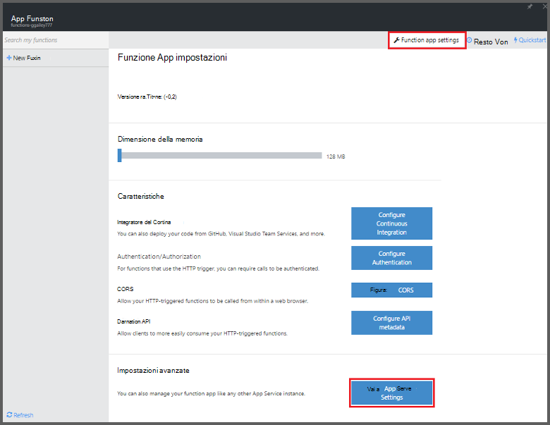
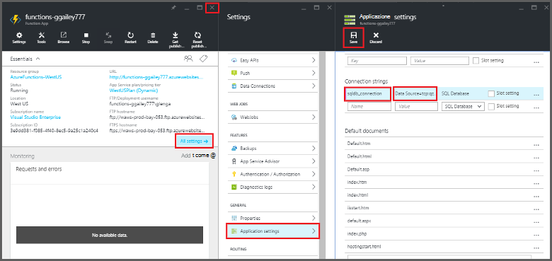
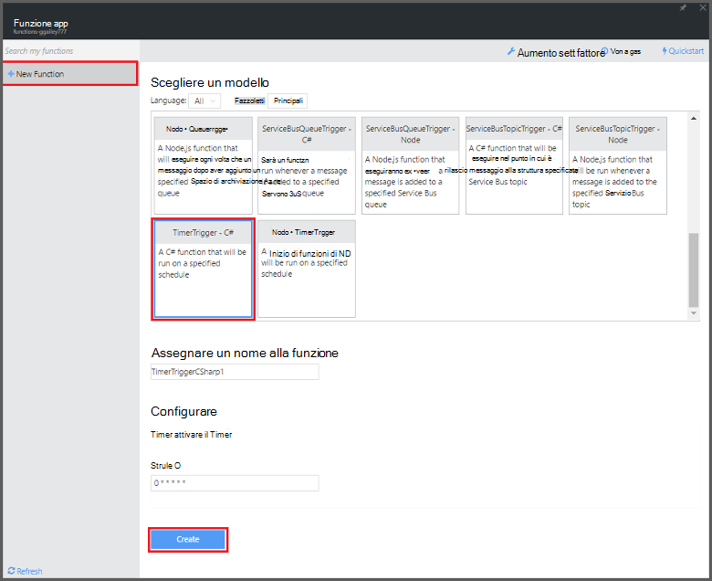

<properties
   pageTitle="Utilizzare funzioni di Azure per eseguire un'operazione di pulizia pianificata | Microsoft Azure"
   description="Utilizzare le funzioni di Azure creare una funzione c# che viene eseguita in base di un timer evento."
   services="functions"
   documentationCenter="na"
   authors="ggailey777"
   manager="erikre"
   editor=""
   tags=""
   />

<tags
   ms.service="functions"
   ms.devlang="multiple"
   ms.topic="article"
   ms.tgt_pltfrm="multiple"
   ms.workload="na"
   ms.date="09/26/2016"
   ms.author="glenga"/>
   
# Utilizzare funzioni di Azure per eseguire un'operazione di pulizia pianificata

In questo argomento viene illustrato come utilizzare le funzioni di Azure per creare una nuova funzione in c# che viene eseguita in base di un timer evento alla pulizie righe in una tabella di database. Nuova funzione viene creata in base a un modello predefinito nel portale di funzioni di Azure. Per supportare questo scenario, è necessario impostare una stringa di connessione di database come servizio App impostazione nell'applicazione di funzione. 

## Prerequisiti 

È possibile creare una funzione, è necessario disporre di un account Azure active. Se si dispone già di un account Azure [account gratuiti sono disponibili](https://azure.microsoft.com/free/).

In questo argomento viene illustrato un comando Transact-SQL che esegue un'operazione di pulizia di massa nella tabella denominata *TodoItems* in un Database SQL. In questa stessa tabella TodoItems viene creata una volta completata l' [esercitazione rapida Azure App servizio Mobile App](../app-service-mobile/app-service-mobile-ios-get-started.md). È anche possibile usare un database di esempio, se si sceglie di utilizzare una tabella diversa, è necessario modificare il comando.

È possibile ottenere la stringa di connessione utilizzata da un back-end App Mobile nel portale di **tutte**le impostazioni > **le impostazioni dell'applicazione** > **stringhe di connessione** > **Mostra valori stringa di connessione** > **MS_TableConnectionString**. È inoltre possibile ottenere la stringa di connessione diretta da un Database di SQL in **tutte le impostazioni**del portale > **proprietà** > **Mostra le stringhe di connessione di database** > **ADO.NET (autenticazione di SQL Server)**.

Questo scenario utilizza un'operazione di massa nel database. Per le operazioni CRUD singoli del processo funzione in una tabella di App Mobile, è necessario utilizzare invece associazione tabella Mobile.

## Impostare una stringa di connessione di Database SQL nell'applicazione di funzione

Un'app di funzione ospita l'esecuzione delle funzioni in Azure. È consigliabile archiviare le stringhe di connessione e altre informazioni riservate nelle impostazioni dell'app funzione. In questo modo la diffusione accidentale quando il codice della funzione estremità-up in una repo in un punto. 

1. Accedere al [portale di funzioni di Azure](https://functions.azure.com/signin) ed effettuare l'accesso con l'account Azure.

2. Se si dispone di un'app di funzione esistente da utilizzare, selezionare dalle **applicazioni funzione** fare clic su **Apri**. Per creare una nuova app funzione, digitare un **nome** univoco per la nuova app funzione o accettare quello generato, selezionare il preferito **area geografica**, quindi fare clic su **Crea + iniziare**. 

3. Nell'app funzione, fare clic su **Impostazioni app funzione** > **passare a impostazioni dei servizi di App**. 

    

4. Nell'app funzione, fare clic su **tutte le impostazioni**, scorrere fino a **Impostazioni applicazione**, quindi in tipo di **stringhe di connessione** `sqldb_connection` per **nome**, incollare la stringa di connessione in **valore**, fare clic su **Salva**, quindi chiudere e il app funzione per tornare al portale di funzioni.

    

A questo punto, è possibile aggiungere il codice della funzione c# che si connette al Database SQL.

## Creare una funzione timer generato dal modello

1. Nell'app funzione, fare clic su **+ nuova funzione** > **TimerTrigger - c#** > **Crea**. Viene creata una funzione con il nome predefinito che esecuzione la pianificazione predefinita di una volta al minuto. 

    

2. Nel riquadro **codice** nella scheda **sviluppo** , aggiungere i riferimenti di assembly seguente nella parte superiore del codice della funzione esistente:

        #r "System.Configuration"
        #r "System.Data"

3. Aggiungere quanto segue `using` istruzioni per la funzione:

        using System.Configuration;
        using System.Data.SqlClient;
        using System.Threading.Tasks; 

4. Sostituire la funzione di **esecuzione** esistente con il codice seguente:

        public static async Task Run(TimerInfo myTimer, TraceWriter log)
        {
            var str = ConfigurationManager.ConnectionStrings["sqldb_connection"].ConnectionString;
            using (SqlConnection conn = new SqlConnection(str))
            {
                conn.Open();
                var text = "DELETE from dbo.TodoItems WHERE Complete='True'";
                using (SqlCommand cmd = new SqlCommand(text, conn))
                {
                    // Execute the command and log the # rows deleted.
                    var rows = await cmd.ExecuteNonQueryAsync();
                    log.Info($"{rows} rows were deleted");
                }
            }
        }

5. Fare clic su **Salva**, guardare le finestre **dei registri** per l'esecuzione di funzione successiva, quindi prendere nota del numero di righe eliminate dalla tabella TodoItems.

6. (Facoltativo) Utilizzo dell' [App Mobile Guida introduttiva app](../app-service-mobile/app-service-mobile-ios-get-started.md), contrassegnare altri elementi come "completato" quindi tornare alla finestra **registri** e controllo lo stesso numero di righe eliminato dalla funzione durante l'esecuzione successiva. 

##Passaggi successivi

Vedere questi argomenti per ulteriori informazioni sulle funzioni di Azure.

+ [Riferimenti per sviluppatori di funzioni Azure](functions-reference.md)  
Guida di riferimento per la codifica di funzioni e la definizione di trigger e le associazioni programmatore.
+ [Funzioni di Azure test](functions-test-a-function.md)  
Descrive diverse tecniche per testare le funzioni e gli strumenti.
+ [Come ridimensionare le funzioni di Azure](functions-scale.md)  
Vengono descritti i piani di servizio disponibili con le funzioni di Azure, inclusi il piano di servizio dinamico e su come scegliere il piano a destro.  

[AZURE.INCLUDE [Getting Started Note](../../includes/functions-get-help.md)]