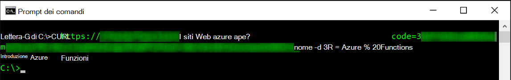
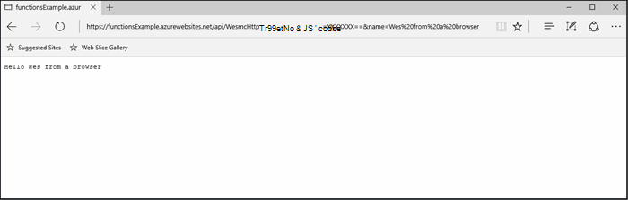
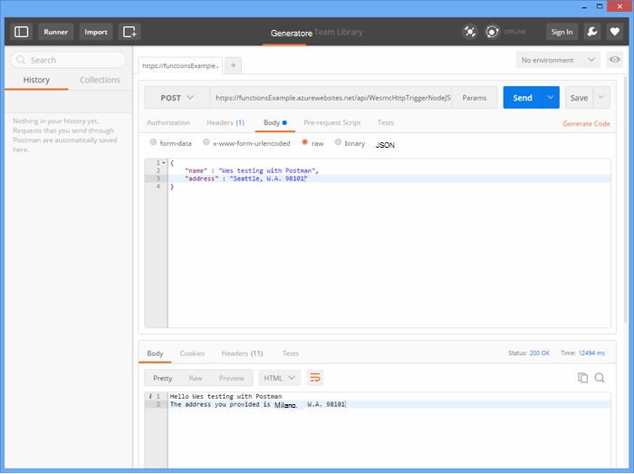
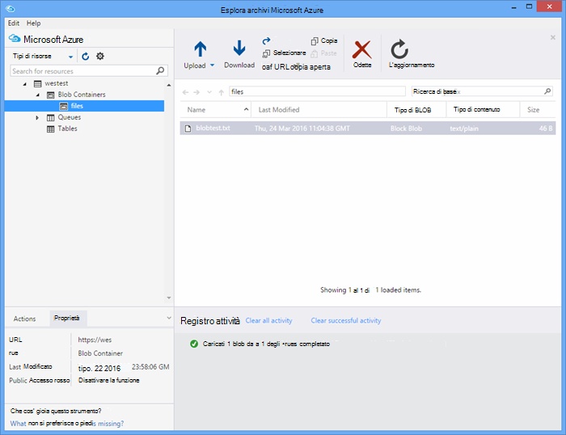

<properties
   pageTitle="Test funzioni Azure | Microsoft Azure"
   description="Verificare le funzioni di Azure mediante Postman, curvatura e Node."
   services="functions"
   documentationCenter="na"
   authors="wesmc7777"
   manager="erikre"
   editor=""
   tags=""
   keywords="Azure funzioni, funzioni, elaborazione dell'evento, webhooks, calcolo dinamico, senza server architettura, test"/>

<tags
   ms.service="functions"
   ms.devlang="multiple"
   ms.topic="article"
   ms.tgt_pltfrm="multiple"
   ms.workload="na"
   ms.date="08/19/2016"
   ms.author="wesmc"/>

# Funzioni di Azure test

## Panoramica

In questa esercitazione, esamineremo approcci diversi per le funzioni di test. Si definisce una funzione di trigger http che accetta input mediante un parametro stringa query o nel corpo della richiesta. Il codice di modello predefinito **HttpTrigger Node funzione** supporta un `name` parametro stringa di query. È inoltre verrà aggiunto codice per supportare tale parametro insieme ad `address` informazioni per l'utente nel corpo della richiesta.

## Creare una funzione per il testing

Per la maggior parte di questa esercitazione, verrà usata una versione del modello di **HttpTrigger Nodejs funzione** è disponibile quando si crea una nuova funzione leggermente cambiata.  È possibile esaminare [creare la prima esercitazione di Azure funzione](functions-create-first-azure-function.md) se occorre assistenza per creare una nuova funzione.  Scegliere il modello di **HttpTrigger Nodejs funzione** solo quando si crea la funzione di test nel [Portale di Azure].

Il modello di funzione predefinito è una funzione del mondo hello che indica il nome del parametro di stringa corpo o la query richiesta, `name=<your name>`.  Microsoft aggiornerà il codice per consentono di specificare il nome e un indirizzo come contenuto JSON nel corpo della richiesta. La funzione ripeterà quindi nuovamente al client quando disponibili.   

Aggiornare la funzione con il codice seguente che verrà utilizzato per il testing:

    module.exports = function(context, req) {
        context.log("Node.js HTTP trigger function processed a request. RequestUri=%s", req.originalUrl);
        context.log("Request Headers = " + JSON.stringify(req.headers));    
    
        if (req.query.name || (req.body && req.body.name)) {
            if (typeof req.query.name != "undefined") {
                context.log("Name was provided as a query string param..."); 
                ProcessNewUserInformation(context, req.query.name);
            }
            else {
                context.log("Processing user info from request body..."); 
                ProcessNewUserInformation(context, req.body.name, req.body.address);
            }
        }
        else {
            context.res = {
                status: 400,
                body: "Please pass a name on the query string or in the request body"
            };
        }
        context.done();
    };
    
    function ProcessNewUserInformation(context, name, address)
    {    
        context.log("Processing User Information...");            
        context.log("name = " + name);            
        echoString = "Hello " + name;
        
        if (typeof address != "undefined")
        {
            echoString += "\n" + "The address you provided is " + address;
            context.log("address = " + address);            
        }
        
        context.res = {
                // status: 200, /* Defaults to 200 */
                body: echoString
            };
    }

## Verificare una funzione con gli strumenti

### Test latino

Spesso durante la verifica del software, non è necessario eseguire una ricerca qualsiasi oltre la riga di comando per eseguire il debug l'applicazione, questo vi è alcuna differenza con le funzioni.

Per verificare la funzione precedente, copiare l' **Url di funzione** dal portale. Avrà il formato seguente: 

    https://<Your Function App>.azurewebsites.net/api/<Your Function Name>?code=<your access code>
    
Questo è l'Url per l'attivazione la funzione, è possibile verificare questa mediante il comando curvatura sulla riga di comando per eseguire Get (`-G` o `--get`) richiesta con la funzione:

    curl -G https://<Your Function App>.azurewebsites.net/api/<Your Function Name>?code=<your access code>
    
In questo esempio particolare sopra richiede un parametro stringa query che può essere passato come dati (`-d`) nel comando curvatura:

    curl -G https://<Your Function App>.azurewebsites.net/api/<Your Function Name>?code=<your access code> -d name=<Enter a name here>
    
Tasto INVIO e verrà visualizzato l'output della funzione sulla riga di comando.

Nella finestra **registri** portale durante l'esecuzione della funzione viene registrato output simile al seguente:

    2016-04-05T21:55:09  Welcome, you are now connected to log-streaming service.
    2016-04-05T21:55:30.738 Function started (Id=ae6955da-29db-401a-b706-482fcd1b8f7a)
    2016-04-05T21:55:30.738 Node.js HTTP trigger function processed a request. RequestUri=https://functionsExample.azurewebsites.net/api/HttpTriggerNodeJS1?code=XXXXXXX&name=Azure Functions
    2016-04-05T21:55:30.738 Function completed (Success, Id=ae6955da-29db-401a-b706-482fcd1b8f7a)

### Test con un browser

Funzioni che non richiedono parametri o sufficiente parametri stringa di query, possono essere verificate con un browser.

Per provare la funzione che è definite in precedenza, copiare l' **Url di funzione** dal portale. Avrà il formato seguente:

    https://<Your Function App>.azurewebsites.net/api/<Your Function Name>?code=<your access code>

Aggiungere il `name` query parametro stringa come indicato di seguito, quando si digita un nome effettivo per il `<Enter a name here>` segnaposto.

    https://<Your Function App>.azurewebsites.net/api/<Your Function Name>?code=<your access code>&name=<Enter a name here>

Incollare l'URL nel browser e si dovrebbe ottenere una risposta simile al seguente.

Nella finestra **registri** portale durante l'esecuzione della funzione viene registrato output simile al seguente:

    2016-03-23T07:34:59  Welcome, you are now connected to log-streaming service.
    2016-03-23T07:35:09.195 Function started (Id=61a8c5a9-5e44-4da0-909d-91d293f20445)
    2016-03-23T07:35:10.338 Node.js HTTP trigger function processed a request. RequestUri=https://functionsExample.azurewebsites.net/api/WesmcHttpTriggerNodeJS1?code=XXXXXXXXXX==&name=Wes from a browser
    2016-03-23T07:35:10.338 Request Headers = {"cache-control":"max-age=0","connection":"Keep-Alive","accept":"text/html","accept-encoding":"gzip","accept-language":"en-US"}
    2016-03-23T07:35:10.338 Name was provided as a query string param.
    2016-03-23T07:35:10.338 Processing User Information...
    2016-03-23T07:35:10.369 Function completed (Success, Id=61a8c5a9-5e44-4da0-909d-91d293f20445)

### Test con Postman

Lo strumento consigliato per verificare la maggior parte delle funzioni è Postman. Per installare Postman, vedere [Ottenere Postman](https://www.getpostman.com/). Postman consente di controllare molti altri attributi di una richiesta HTTP.

> [AZURE.TIP] Utilizzare il Client resto in cui si ha familiarità. Ecco alcune alternative ai Postman:  
> 
> * [Fiddler](http://www.telerik.com/fiddler)  
> * [Impronte](https://luckymarmot.com/paw)  

Per provare la funzione con un corpo della richiesta in Postman: 

1. Avviare Postman dal pulsante **App** nell'angolo superiore sinistro dell'angolo di una finestra del browser Chrome.
2. Copiare l' **Url di funzione** e incollarlo in Postman. Include il parametro stringa query di codice di accesso.
3. Modificare il metodo HTTP **post**.
4. Fare clic **nel corpo** > **non elaborati** e aggiungere il corpo della richiesta JSON simile al seguente:

        {
            "name" : "Wes testing with Postman",
            "address" : "Seattle, W.A. 98101"
        }

5. Fare clic su **Invia**.

L'immagine seguente illustra il test di esempio di funzione eco semplice in questa esercitazione. 

Nella finestra **registri** portale durante l'esecuzione della funzione viene registrato output simile al seguente:

    2016-03-23T08:04:51  Welcome, you are now connected to log-streaming service.
    2016-03-23T08:04:57.107 Function started (Id=dc5db8b1-6f1c-4117-b5c4-f6b602d538f7)
    2016-03-23T08:04:57.763 Node.js HTTP trigger function processed a request. RequestUri=https://functions841def78.azurewebsites.net/api/WesmcHttpTriggerNodeJS1?code=XXXXXXXXXX==
    2016-03-23T08:04:57.763 Request Headers = {"cache-control":"no-cache","connection":"Keep-Alive","accept":"*/*","accept-encoding":"gzip","accept-language":"en-US"}
    2016-03-23T08:04:57.763 Processing user info from request body...
    2016-03-23T08:04:57.763 Processing User Information...
    2016-03-23T08:04:57.763 name = Wes testing with Postman
    2016-03-23T08:04:57.763 address = Seattle, W.A. 98101
    2016-03-23T08:04:57.795 Function completed (Success, Id=dc5db8b1-6f1c-4117-b5c4-f6b602d538f7)
    
### Verificare un trigger di blob tramite Esplora archivi

È possibile verificare una funzione di trigger blob tramite [Esplora archivi di Microsoft Azure](http://storageexplorer.com/).

1. Nel [Portale di Azure] per l'app di funzioni, creare una nuova c#, F # o nodo blob trigger funzione. Impostare il percorso per controllare il nome del contenitore di blob. Per esempio:

        files

2. Fare clic sul **+** pulsante per selezionare o creare l'account di archiviazione che si desidera utilizzare. Fare clic su **Crea**.

3. Creare un file di testo con il testo seguente e salvarlo:

        A text file for blob trigger function testing.

4. Eseguire [Microsoft Azure archiviazione Explorer](http://storageexplorer.com/) e connettersi al contenitore di blob in account di archiviazione che si sta controllando.

5. Fare clic sul pulsante **Carica** e caricare il file di testo.

    

    Il codice della funzione trigger blob predefinito restituirà l'elaborazione di blob nei log:

        2016-03-24T11:30:10  Welcome, you are now connected to log-streaming service.
        2016-03-24T11:30:34.472 Function started (Id=739ebc07-ff9e-4ec4-a444-e479cec2e460)
        2016-03-24T11:30:34.472 C# Blob trigger function processed: A text file for blob trigger function testing.
        2016-03-24T11:30:34.472 Function completed (Success, Id=739ebc07-ff9e-4ec4-a444-e479cec2e460)

## Verificare una funzione all'interno delle funzioni

### Verificare con il portale di funzioni pulsante eseguito

Il portale rappresenta un pulsante **Esegui** che consentirà di eseguire alcuni test limitato. È possibile fornire un corpo della richiesta con il pulsante Esegui ma, non è possibile fornire parametri stringa di query o aggiornare le intestazioni di richiesta.

Verificare la funzione di trigger HTTP creato in precedenza mediante l'aggiunta di una stringa JSON simile al seguente nel campo **richiesta corpo** , quindi fare clic sul pulsante **Esegui** .

    {
        "name" : "Wes testing Run button",
        "address" : "USA"
    } 

Nella finestra **registri** portale durante l'esecuzione della funzione viene registrato output simile al seguente:

    2016-03-23T08:03:12  Welcome, you are now connected to log-streaming service.
    2016-03-23T08:03:17.357 Function started (Id=753a01b0-45a8-4125-a030-3ad543a89409)
    2016-03-23T08:03:18.697 Node.js HTTP trigger function processed a request. RequestUri=https://functions841def78.azurewebsites.net/api/wesmchttptriggernodejs1
    2016-03-23T08:03:18.697 Request Headers = {"connection":"Keep-Alive","accept":"*/*","accept-encoding":"gzip","accept-language":"en-US"}
    2016-03-23T08:03:18.697 Processing user info from request body...
    2016-03-23T08:03:18.697 Processing User Information...
    2016-03-23T08:03:18.697 name = Wes testing Run button
    2016-03-23T08:03:18.697 address = USA
    2016-03-23T08:03:18.744 Function completed (Success, Id=753a01b0-45a8-4125-a030-3ad543a89409)

### Test con un trigger timer

Alcune funzioni non può essere effettivamente verificato con gli strumenti menzionati in precedenza. Ad esempio una coda trigger funzione che viene eseguita quando un messaggio eliminato in [Archiviazione coda Azure](../storage/storage-dotnet-how-to-use-queues.md). È sempre possibile scrivere codice per eliminare un messaggio nella coda di lavoro e di seguito viene fornito un esempio in un progetto console. C'è però un altro approccio che è possibile utilizzare per testare direttamente con le funzioni.  

È possibile utilizzare un trigger timer configurato con una coda di associazione di output. Il codice di trigger timer quindi scrivere i messaggi di prova alla coda. In questa sezione verrà esaminato un esempio. 

Per informazioni più dettagliate sull'uso di associazioni con le funzioni di Azure, vedere [riferimenti per sviluppatori di funzioni di Azure](functions-reference.md). 

#### Creare coda trigger per il testing

Per dimostrare questo approccio, è prima di tutto creare una funzione di trigger coda che si desidera verificare una coda denominata `queue-newusers`. Questa funzione elaborerà nome e indirizzo informazioni per un nuovo utente in archiviazione coda Azure. 

> [AZURE.NOTE] Se si usa un nome diverso, assicurarsi che il nome usato è conforme alle regole [per la denominazione code e i metadati](https://msdn.microsoft.com/library/dd179349.aspx) .  In caso contrario, verrà visualizzato un codice di stato HTTP 400: richiesta non valida. 

1. Nel [Portale di Azure] per l'app di funzioni, fare clic su **Nuova funzione** > **QueueTrigger - c#**.
2. Immettere il nome di coda monitorare dalla funzione coda 

        queue-newusers 

3. Fare clic sul **+** pulsante (Aggiungi) per selezionare o creare l'account di archiviazione che si desidera utilizzare. Fare clic su **Crea**.
4. Lasciare la finestra del browser portale aperta in modo che è possibile monitorare le voci di log per il codice di modello funzione coda predefinito.

#### Creare un trigger timer per eliminare un messaggio nella coda

1. Aprire il [Portale di Azure] in una nuova finestra del browser e passare all'app funzione.
2. Fare clic su **nuova funzione** > **TimerTrigger - c#**. Immettere un'espressione cron per impostare la frequenza codice timer eseguirà la funzione di coda. Fare clic su **Crea**. Se si desidera che il test per l'esecuzione ogni 30 secondi è possibile utilizzare la seguente [espressione CRON](https://wikipedia.org/wiki/Cron#CRON_expression):

        */30 * * * * *

2. Fare clic sulla scheda **integrazione** del nuovo trigger timer.
3. In **Output**, fare clic sul pulsante **+ Nuovo Output** . Fare clic su **coda** e il pulsante **selezione** .
4. Nota il nome usato per l' **oggetto messaggio coda** si verrà utilizzata nel codice della funzione timer.

        myQueue

4. Immettere il nome della coda nel punto in cui il messaggio verrà inviato: 

        queue-newusers 

3. Fare clic sul **+** pulsante (Aggiungi) per selezionare l'account di archiviazione è stato utilizzato in precedenza con trigger coda. Fare clic su **Salva**.
4. Fare clic sulla scheda **sviluppo** per i trigger timer.
5. È possibile utilizzare il codice seguente per la funzione timer c# come è stato utilizzato lo stesso nome oggetto messaggio coda illustrato sopra. Quindi fare clic su **Salva**

        using System;
        
        public static void Run(TimerInfo myTimer, out String myQueue, TraceWriter log)
        {
            String newUser = 
            "{\"name\":\"User testing from C# timer function\",\"address\":\"XYZ\"}";
        
            log.Verbose($"C# Timer trigger function executed at: {DateTime.Now}");   
            log.Verbose($"{newUser}");   
            
            myQueue = newUser;
        }

A questo punto funzione timer c# verrà eseguita ogni 30 secondi se è stata utilizzata l'espressione cron di esempio. I registri per la funzione timer segnalerà ogni esecuzione:

    2016-03-24T10:27:02  Welcome, you are now connected to log-streaming service.
    2016-03-24T10:27:30.004 Function started (Id=04061790-974f-4043-b851-48bd4ac424d1)
    2016-03-24T10:27:30.004 C# Timer trigger function executed at: 3/24/2016 10:27:30 AM
    2016-03-24T10:27:30.004 {"name":"User testing from C# timer function","address":"XYZ"}
    2016-03-24T10:27:30.004 Function completed (Success, Id=04061790-974f-4043-b851-48bd4ac424d1)

Nella finestra del browser per la funzione di coda, si verrà visualizzato ogni messaggio in fase di elaborazione:

    2016-03-24T10:27:06  Welcome, you are now connected to log-streaming service.
    2016-03-24T10:27:30.607 Function started (Id=e304450c-ff48-44dc-ba2e-1df7209a9d22)
    2016-03-24T10:27:30.607 C# Queue trigger function processed: {"name":"User testing from C# timer function","address":"XYZ"}
    2016-03-24T10:27:30.607 Function completed (Success, Id=e304450c-ff48-44dc-ba2e-1df7209a9d22)
    
## Verificare una funzione con codice

### Verificare una funzione di trigger HTTP con codice: node

È possibile utilizzare Node codice per eseguire una richiesta http per provare la funzione di Azure. 

Assicurarsi di configurare:

- Il `host` nelle opzioni per la richiesta per l'host app funzione
- Il nome di funzione nel `path`.
- Il codice di accesso (`<your code>`) nel `path`.

Esempio:

    var http = require("http");
    
    var nameQueryString = "name=Wes%20Query%20String%20Test%20From%20Node.js";
    
    var nameBodyJSON = {
        name : "Wes testing with Node.JS code",
        address : "Dallas, T.X. 75201"
    };
    
    var bodyString = JSON.stringify(nameBodyJSON);
    
    var options = {
      host: "functions841def78.azurewebsites.net",
      //path: "/api/HttpTriggerNodeJS2?code=sc1wt62opn7k9buhrm8jpds4ikxvvj42m5ojdt0p91lz5jnhfr2c74ipoujyq26wab3wk5gkfbt9&" + nameQueryString,
      path: "/api/HttpTriggerNodeJS2?code=sc1wt62opn7k9buhrm8jpds4ikxvvj42m5ojdt0p91lz5jnhfr2c74ipoujyq26wab3wk5gkfbt9",
      method: "POST",
      headers : {
          "Content-Type":"application/json",
          "Content-Length": Buffer.byteLength(bodyString)
        }    
    };
    
    callback = function(response) {
      var str = ""
      response.on("data", function (chunk) {
        str += chunk;
      });
    
      response.on("end", function () {
        console.log(str);
      });
    }
    
    var req = http.request(options, callback);
    console.log("*** Sending name and address in body ***");
    console.log(bodyString);
    req.end(bodyString);

Output:

    C:\Users\Wesley\testing\Node.js>node testHttpTriggerExample.js
    *** Sending name and address in body ***
    {"name" : "Wes testing with Node.JS code","address" : "Dallas, T.X. 75201"}
    Hello Wes testing with Node.JS code
    The address you provided is Dallas, T.X. 75201
        
Nella finestra **registri** portale durante l'esecuzione della funzione viene registrato output simile al seguente:

    2016-03-23T08:08:55  Welcome, you are now connected to log-streaming service.
    2016-03-23T08:08:59.736 Function started (Id=607b891c-08a1-427f-910c-af64ae4f7f9c)
    2016-03-23T08:09:01.153 Node.js HTTP trigger function processed a request. RequestUri=http://functionsExample.azurewebsites.net/api/WesmcHttpTriggerNodeJS1/?code=XXXXXXXXXX==
    2016-03-23T08:09:01.153 Request Headers = {"connection":"Keep-Alive","host":"functionsExample.azurewebsites.net"}
    2016-03-23T08:09:01.153 Name not provided as query string param. Checking body...
    2016-03-23T08:09:01.153 Request Body Type = object
    2016-03-23T08:09:01.153 Request Body = [object Object]
    2016-03-23T08:09:01.153 Processing User Information...
    2016-03-23T08:09:01.215 Function completed (Success, Id=607b891c-08a1-427f-910c-af64ae4f7f9c)
    

### Verificare una funzione di trigger coda con codice: C# #

Indicato in precedenza che è possibile testare un trigger di coda tramite il codice per eliminare un messaggio nella coda di lavoro. Nell'esempio seguente è basato il codice c# presentato nell'esercitazione [Guida introduttiva a coda di Azure lo spazio di archiviazione](../storage/storage-dotnet-how-to-use-queues.md) . Codice per altre lingue è disponibile anche da tale collegamento.

Per provare questo codice in un'app console che è necessario:

- [Configurare la stringa di connessione di spazio di archiviazione nel file app](../storage/storage-dotnet-how-to-use-queues.md#setup-a-storage-connection-string).
- Questo codice accetta il nome e l'indirizzo per un nuovo utente come argomenti della riga di comando in fase di esecuzione. Passare un `name` e `address` come parametri per l'app. Per esempio`C:\myQueueConsoleApp\test.exe "Wes testing queues" "in a console app"`

Codice di esempio c#:

    static void Main(string[] args)
    {
        string name = null;
        string address = null;
        string queueName = "queue-newusers";
        string JSON = null;

        if (args.Length > 0)
        {
            name = args[0];
        }
        if (args.Length > 1)
        {
            address = args[1];
        }

        // Retrieve storage account from connection string
        CloudStorageAccount storageAccount = CloudStorageAccount.Parse(ConfigurationManager.AppSettings["StorageConnectionString"]);

        // Create the queue client
        CloudQueueClient queueClient = storageAccount.CreateCloudQueueClient();

        // Retrieve a reference to a queue
        CloudQueue queue = queueClient.GetQueueReference(queueName);

        // Create the queue if it doesn't already exist
        queue.CreateIfNotExists();

        // Create a message and add it to the queue.
        if (name != null)
        {
            if (address != null)
                JSON = String.Format("{{\"name\":\"{0}\",\"address\":\"{1}\"}}", name, address);
            else
                JSON = String.Format("{{\"name\":\"{0}\"}}", name);
        }

        Console.WriteLine("Adding message to " + queueName + "...");
        Console.WriteLine(JSON);

        CloudQueueMessage message = new CloudQueueMessage(JSON);
        queue.AddMessage(message);
    }

Nella finestra del browser per la funzione di coda, si verrà visualizzato ogni messaggio in fase di elaborazione:

    2016-03-24T10:27:06  Welcome, you are now connected to log-streaming service.
    2016-03-24T10:27:30.607 Function started (Id=e304450c-ff48-44dc-ba2e-1df7209a9d22)
    2016-03-24T10:27:30.607 C# Queue trigger function processed: {"name":"Wes testing queues","address":"in a console app"}
    2016-03-24T10:27:30.607 Function completed (Success, Id=e304450c-ff48-44dc-ba2e-1df7209a9d22)

<!-- URLs. -->

[Portale di Azure]: https://portal.azure.com
