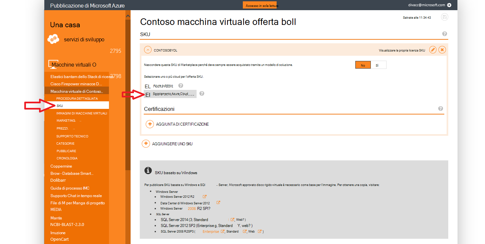
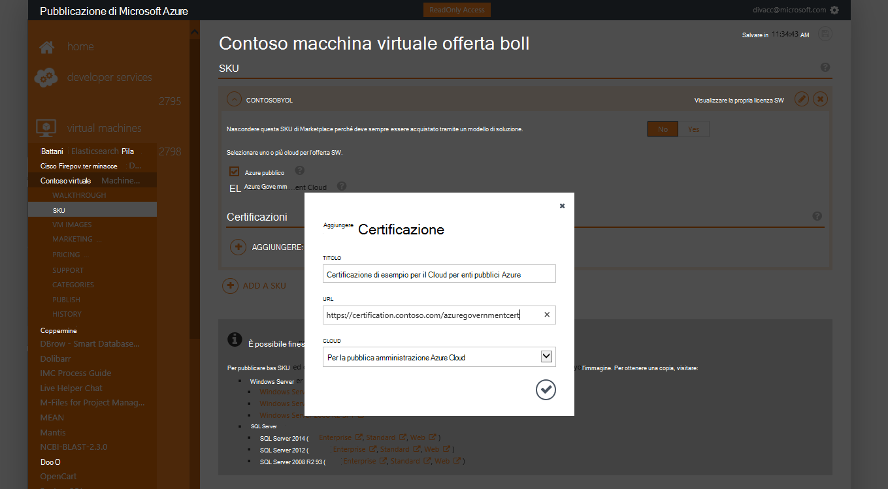
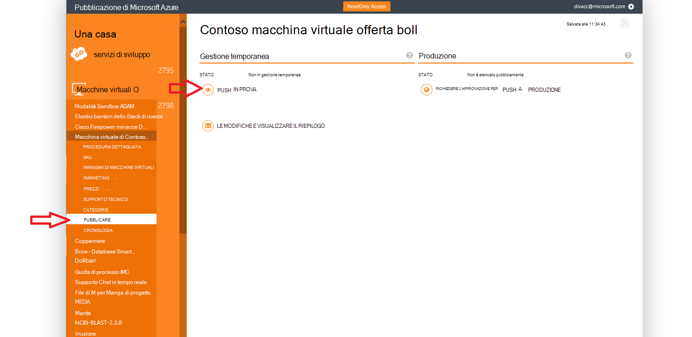
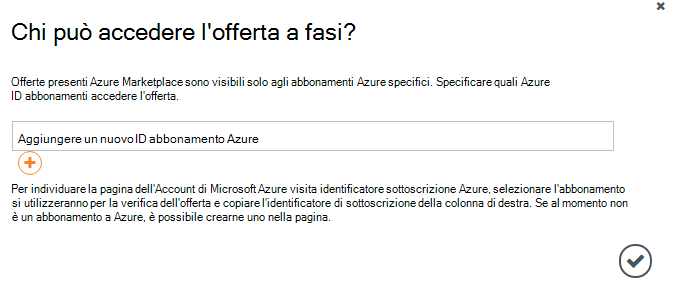
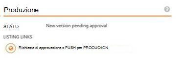

<properties
            pageTitle="Documentazione per la pubblica amministrazione Azure | Microsoft Azure"
            description="In questo modo un confronto delle caratteristiche e le indicazioni sullo sviluppo di applicazioni per la pubblica amministrazione Azure."
            services="Azure-Government"
            cloud="gov"
            documentationCenter=""
            authors="tsingh"
            manager="asimm"
            editor=""/>
 
<tags    ms.service="multiple"
            ms.devlang="na"
            ms.topic="article"
            ms.tgt_pltfrm="na"
            ms.workload="azure-government"
            ms.date="10/20/2016"
            ms.author="zakramer;tsingh;divacc"/> 

# Per la pubblica amministrazione Azure Marketplace
Per i partner interessati a pubblicare le offerte di Azure Marketplace per la pubblica amministrazione informazioni dettagliate riportata di seguito.

## Pubblicazione
>[AZURE.NOTE] Se non si dispone di un partner di Azure Marketplace Certified esistente, eseguire la procedura descritta [di seguito](../marketplace-publishing/marketplace-publishing-getting-started.md) prima di continuare.

### Passaggio 1  
Accedere a [https://publish.windowsazure.com](https://publish.windowsazure.com)

### Passaggio 2
Fare clic sull'offerta che si desidera pubblicare

### Passaggio 3
Fare clic su **SKU** e fare clic sulla casella Azure Government Cloud

>[AZURE.NOTE] Sono supportati solo gli SKU di visualizzare il proprio licenza (BYOL).  Questa opzione non è disponibile per gli SKU di uso prepagato (PayG).

### Passaggio 4
Fare clic sul collegamento Aggiungi certificazione per aggiungere collegamenti a qualsiasi certificazione per l'offerta +.

### Passaggio 5
Richiesta di un account di valutazione in cloud di Microsoft Azure per la pubblica amministrazione che consentono di verificare l'immagine nel portale di pubblicazione: [https://azuregov.microsoft.com/trial/azuregovtrial](https://azuregov.microsoft.com/trial/azuregovtrial)

L'idoneità come un partner che serve US entità federal, stata, locale o tribale vengono verificate e verrà fornito conferma tramite posta elettronica.  L'account di prova sarà disponibile interno è 3-5 giorni lavorativi.

### Passaggio 6
Fare clic su pubblica e fare clic su Push di gestione temporanea. 

Verrà richiesto di immettere un abbonamento whitelisted che ha accesso alle fasi di offerta. Immettere l'ID di abbonamento dal proprio account di prova per enti pubblici Azure acquisita.

### Passaggio 7
Dopo l'offerta viene gestita correttamente, è possibile verificare l'immagine accedendo a [https://portal.azure.us](https://portal.azure.us) con il proprio account alla versione di valutazione di Azure per enti pubblici.

### Passaggio 8
Dopo avere convalidato immagine utilizzando la sottoscrizione di valutazione, è possibile rendere disponibili live facendo clic su pubblica e richiedere l'approvazione per passare alla produzione l'offerta. 

## Passaggi successivi

Per informazioni aggiuntive e aggiornamenti, sottoscrivere il [Blog di Microsoft Azure per enti pubblici](https://blogs.msdn.microsoft.com/azuregov/).
